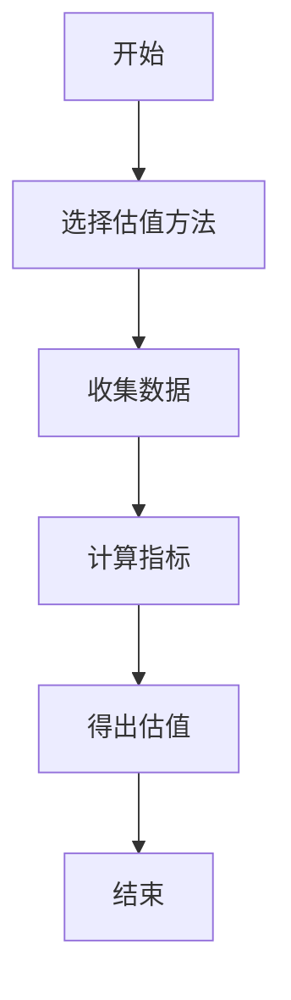

                 


# 新兴市场股市估值与智能电网储能技术的互动

> 关键词：新兴市场、股市估值、智能电网、储能技术、互动关系

> 摘要：本文探讨新兴市场中股市估值与智能电网储能技术之间的互动关系。通过分析股市估值的核心要素、智能电网储能技术的原理，以及两者如何相互影响，结合实际案例，深入剖析它们的互动机制。文章结合理论与实践，提供算法原理、系统架构设计和项目实战，为相关领域的研究和应用提供参考。

---

## 第一部分: 背景介绍与核心概念

### 第1章: 新兴市场股市估值与智能电网储能技术的互动概述

#### 1.1 问题背景与问题描述

- **新兴市场的股市特点**  
  新兴市场通常具有高增长潜力，但同时也伴随着高波动性和不确定性。股市估值在这些市场中尤为重要，因为它反映了市场的健康状况和企业的盈利能力。

- **智能电网与储能技术的兴起**  
  智能电网通过数字化技术实现电力的高效管理和分配，而储能技术（如电池储能、超级电容等）则是智能电网的重要组成部分，能够解决可再生能源波动性问题，提高电网的稳定性。

- **问题解决的必要性**  
  随着可再生能源的快速发展，储能技术在智能电网中的作用日益重要。然而，储能技术的投资和运营成本较高，如何通过股市估值来优化投资决策，成为亟待解决的问题。

#### 1.2 核心概念与边界

- **股市估值的核心要素**  
  包括市盈率（P/E）、市净率（P/B）、股息率、现金流等。

- **智能电网储能技术的定义**  
  储能技术是指通过技术手段将电能存储起来，并在需要时释放的技术。其核心在于提高能源利用效率和电网稳定性。

- **互动关系的边界与外延**  
  股市估值影响储能技术的投资决策，而储能技术的普及又反过来影响电网的稳定性，进而影响股市估值。

#### 1.3 概念结构与核心要素

- **股市估值**：通过股票价格、市盈率、市净率等指标反映市场的价值。
- **智能电网储能技术**：包括电池储能、飞轮储能、超级电容等技术。
- **互动关系**：储能技术的市场需求影响股市估值，而股市估值又影响储能技术的投资和研发。

### 第2章: 核心概念与联系

#### 2.1 核心概念原理

- **股市估值的原理**  
  股市估值是基于对企业未来现金流的折现，通过分析企业的财务状况、行业地位和市场前景来确定其股票的合理价格。

- **智能电网储能技术的原理**  
  储能技术通过将电能转化为化学能或其他形式的能量存储，当电力需求超过供应时，再将存储的能量释放回电网。

#### 2.2 对比分析与ER实体关系图

- **核心概念属性对比表格**

| 属性       | 股市估值               | 智能电网储能技术       |
|------------|-----------------------|------------------------|
| 核心指标     | 市盈率、市净率、股息率 | 储能容量、充放电效率 |
| 影响因素     | 经济指标、政策、行业 | 技术水平、成本、政策 |

- **实体关系图（ER图）**

```mermaid
er
    actor 投资者
    actor 电力公司
    actor 政府监管机构
    entity 股票
    entity 储能系统
    entity 电力需求
    entity 电力供应
    entity 市场价格
    relation 股票-投资者：拥有
    relation 储能系统-电力公司：运营
    relation 电力需求-市场价格：影响
    relation 电力供应-市场价格：影响
    relation 投资者-储能系统：投资
    relation 政府监管机构-市场价格：监管
```

---

## 第二部分: 算法原理与数学模型

### 第3章: 股市估值算法原理

#### 3.1 股市估值模型

- **常用估值方法对比**

| 方法         | 描述                     | 适用场景               |
|--------------|--------------------------|------------------------|
| 市盈率模型     | 通过市盈率和每股收益计算股票价值 | 适用于稳定增长的企业 |
| 现金流折现模型 | 通过未来现金流的现值计算股票价值 | 适用于高成长企业     |

- **市盈率（P/E）模型**

公式：$$ P = \frac{E}{P/E} $$

其中，P为股票的理论价值，E为每股收益，P/E为市盈率。

- **现金流折现模型（DCF）**

公式：$$ V = \sum_{t=1}^{n} \frac{CF_t}{(1+r)^t} + \frac{TV}{(1+r)^n} $$

其中，V为公司价值，CF_t为第t年的现金流，r为折现率，TV为终值。

#### 3.2 算法流程图



### 第4章: 智能电网储能技术优化算法

#### 4.1 储能系统优化模型

- **储能容量优化**

目标：最大化储能系统的经济效益。

公式：$$ C = \min \left( \sum_{t=1}^{T} c_t \cdot x_t, \text{满足约束条件} \right) $$

其中，C为储能容量，c_t为第t小时的储能成本，x_t为储能状态（0或1）。

- **充放电策略优化**

目标：最小化储能系统的运行成本。

公式：$$ \min \sum_{t=1}^{T} (c_{charge} \cdot x_{charge,t} + c_{discharge} \cdot x_{discharge,t}) $$

其中，c_{charge}和c_{discharge}分别为充电和放电成本，x_{charge,t}和x_{discharge,t}分别为充电和放电状态变量。

#### 4.2 算法流程图

```mermaid
graph TD
    A[开始] --> B[确定储能目标]
    B --> C[选择优化算法]
    C --> D[计算最
```

