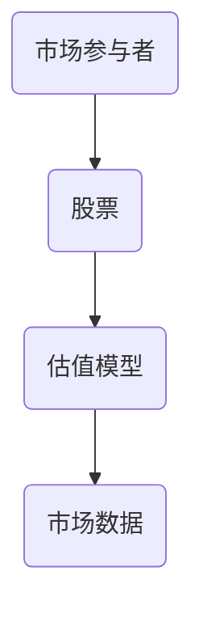
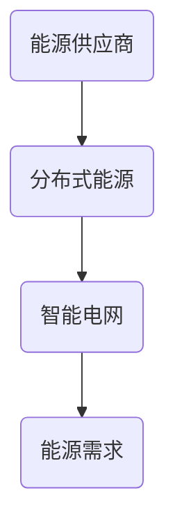
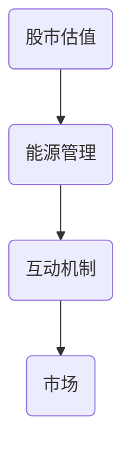
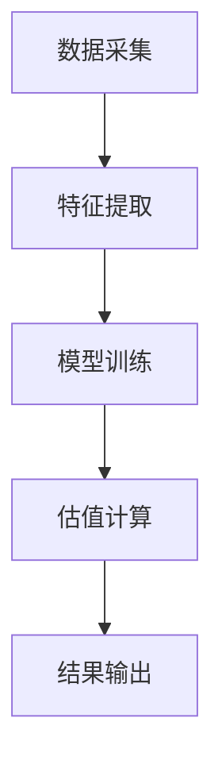
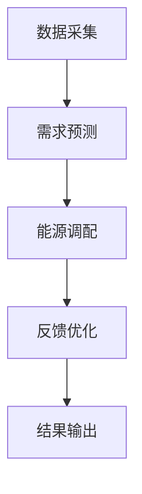
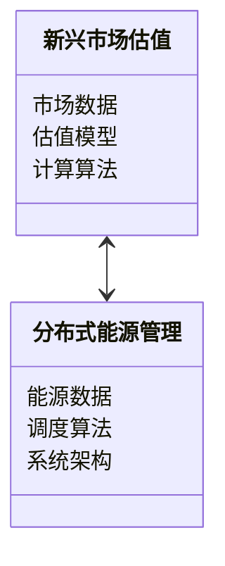
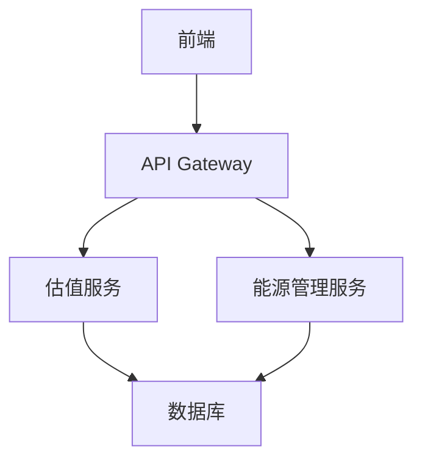
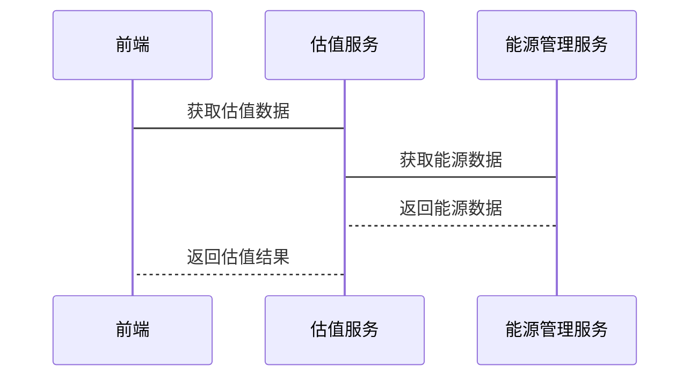

                 


```markdown
# 新兴市场股市估值与智能电网分布式能源管理的互动

> 关键词：新兴市场，股市估值，智能电网，分布式能源管理，互动关系

> 摘要：本文探讨新兴市场股市估值与智能电网分布式能源管理的互动关系，分析两者的核心概念、算法原理、系统架构，并通过实际案例展示互动机制的实现与应用。

---

## 第1章: 背景介绍

### 1.1 问题背景
#### 1.1.1 新兴市场股市估值的现状与挑战
新兴市场股市估值受多种因素影响，包括经济波动、政策变化和市场结构差异。与发达市场相比，新兴市场的数据不完整、波动性大，估值模型需更具适应性。

#### 1.1.2 智能电网分布式能源管理的背景与发展趋势
智能电网通过分布式能源系统实现高效管理，推动可再生能源的利用，减少对传统电网的依赖，提高能源系统的可靠性和可持续性。

#### 1.1.3 两者互动关系的提出与意义
新兴市场股市估值的动态变化与能源管理的优化存在潜在联系，通过互动机制，可实现资源优化配置，提升整体系统的效率与稳定性。

### 1.2 问题描述
#### 1.2.1 新兴市场股市估值的核心问题
如何在数据有限的情况下，构建准确的估值模型，捕捉市场波动，优化投资决策。

#### 1.2.2 智能电网分布式能源管理的关键问题
如何通过分布式能源管理，实现能源的高效调配，降低能源浪费，提高系统响应速度。

#### 1.2.3 互动关系的定义与边界
定义：新兴市场股市估值与智能电网分布式能源管理的互动指两者通过数据共享与反馈机制，优化彼此的决策过程。

边界：限定于能源价格波动、股市数据对能源管理的影响，以及能源管理对股市估值的反向影响。

### 1.3 问题解决
#### 1.3.1 新兴市场股市估值的解决方案
构建动态调整的估值模型，结合机器学习算法，实时更新估值结果。

#### 1.3.2 智能电网分布式能源管理的优化策略
采用分布式计算和实时反馈机制，优化能源调配策略。

#### 1.3.3 互动关系的实现路径
建立数据共享平台，设计反馈机制，实现两者间的实时互动。

### 1.4 边界与外延
#### 1.4.1 新兴市场股市估值的边界条件
数据采集范围、模型适用范围、计算精度。

#### 1.4.2 智能电网分布式能源管理的边界条件
能源类型、系统规模、地理位置。

#### 1.4.3 互动关系的外延与应用范围
扩展到能源金融、绿色投资等领域，推动多领域的协同发展。

### 1.5 核心要素组成
#### 1.5.1 新兴市场股市估值的核心要素
市场数据、估值模型、计算算法。

#### 1.5.2 智能电网分布式能源管理的核心要素
能源数据、管理算法、系统架构。

#### 1.5.3 互动关系的关键组成
数据共享、反馈机制、优化策略。

---

## 第2章: 核心概念与联系

### 2.1 新兴市场股市估值的原理
#### 2.1.1 市场估值的基本原理
通过分析市场数据，使用统计和机器学习方法，估算资产的内在价值。

#### 2.1.2 新兴市场的特殊性与挑战
数据不完整、市场波动大、政策风险高等因素影响估值准确性。

#### 2.1.3 估值模型的构建与应用
动态调整模型参数，适应新兴市场的复杂环境。

### 2.2 智能电网分布式能源管理的原理
#### 2.2.1 智能电网的基本原理
通过智能传感器和实时数据传输，实现电网的智能监控和管理。

#### 2.2.2 分布式能源管理的核心机制
通过分布式计算和实时反馈，优化能源调配策略，提高能源利用效率。

#### 2.2.3 能源互联网的构建与运行
构建能源互联网，实现能源的高效调配和共享，推动能源结构优化。

### 2.3 对比分析
| 特性                | 新兴市场股市估值                 | 智能电网分布式能源管理             |
|---------------------|--------------------------------|--------------------------------|
| 核心目标            | 优化资产定价                    | 优化能源调配                    |
| 数据来源            | 市场数据、经济指标              | 电力数据、能源消耗数据          |
| 挑战                | 数据不完整、波动性大            | 系统复杂性、数据实时性          |
| 解决方案            | 动态估值模型                    | 分布式计算与反馈机制          |

### 2.4 实体关系图
#### 新兴市场股市估值的实体关系图


#### 智能电网分布式能源管理的实体关系图


#### 互动关系的实体关系图


---

## 第3章: 算法原理

### 3.1 新兴市场股市估值算法
#### 3.1.1 算法流程图


#### 3.1.2 Python代码实现
```python
import pandas as pd
from sklearn.linear_model import LinearRegression

# 数据预处理
data = pd.read_csv('market_data.csv')
features = data[['GDP', '通货膨胀率', '市场波动率']]
target = data['股价']

# 模型训练
model = LinearRegression()
model.fit(features, target)

# 估值计算
new_data = pd.DataFrame({'GDP': [5.0], '通货膨胀率': [2.5], '市场波动率': [1.2]})
predicted_price = model.predict(new_data)
print(f'预测股价: {predicted_price[0]:.2f}')
```

#### 3.1.3 数学模型
$$
\text{股价} = \beta_0 + \beta_1 \times \text{GDP} + \beta_2 \times \text{通货膨胀率} + \beta_3 \times \text{市场波动率} + \epsilon
$$

### 3.2 智能电网分布式能源管理算法
#### 3.2.1 算法流程图


#### 3.2.2 Python代码实现
```python
import numpy as np
from sklearn.decomposition import PCA

# 数据预处理
energy_data = np.array([[50, 30], [45, 25], [60, 35]])
pca = PCA(n_components=2)
principal_components = pca.fit_transform(energy_data)

# 分配策略
def energy_distribution(components):
    return components[:, 0] * 0.6 + components[:, 1] * 0.4

optimized_distribution = energy_distribution(principal_components)
print(f'优化分配结果: {optimized_distribution}')
```

#### 3.2.3 数学模型
$$
\text{最优分配} = \argmin_{x} \sum_{i=1}^{n} (x_i - \text{需求}_i)^2
$$

---

## 第4章: 系统分析与架构设计

### 4.1 系统功能设计
#### 4.1.1 领域模型类图


#### 4.1.2 系统架构设计


#### 4.1.3 接口设计
```json
{
    "接口名称": "获取估值数据",
    "请求方式": "GET",
    "请求路径": "/api/valuation",
    "参数": {
        "market_id": "string"
    },
    "返回值": {
        "status": "int",
        "data": "object"
    }
}
```

#### 4.1.4 交互序列图


---

## 第5章: 项目实战

### 5.1 环境安装
- 安装Python和必要的库：`pip install pandas sklearn numpy`

### 5.2 核心代码实现
#### 新兴市场估值代码
```python
import pandas as pd
from sklearn.ensemble import RandomForestRegressor

data = pd.read_csv('market_data.csv')
features = data[['GDP', '通货膨胀率', '市场波动率']]
target = data['股价']

model = RandomForestRegressor(n_estimators=100)
model.fit(features, target)

test_data = pd.DataFrame({'GDP': [5.2], '通货膨胀率': [2.8], '市场波动率': [1.5]})
predicted_price = model.predict(test_data)
print(f'预测股价: {predicted_price[0]:.2f}')
```

#### 分布式能源管理代码
```python
import numpy as np
from sklearn.cluster import KMeans

energy_consumption = np.array([[200, 150], [180, 120], [220, 170]])
model = KMeans(n_clusters=2)
model.fit(energy_consumption)
cluster_centers = model.cluster_centers_
print(f'聚类中心: {cluster_centers}')
```

### 5.3 案例分析
以巴西为例，分析股市估值与能源管理的互动机制，展示如何通过数据共享和反馈优化实现两者的协同优化。

### 5.4 小结
总结项目实施的关键步骤和成功经验，强调互动机制在实际应用中的价值。

---

## 第6章: 最佳实践与小结

### 6.1 最佳实践 Tips
- 数据质量管理是关键
- 模型迭代优化必不可少
- 反馈机制设计要简洁高效

### 6.2 小结
总结全文内容，强调互动机制的重要性，展望未来的研究方向。

### 6.3 注意事项
- 数据隐私与安全需严格保护
- 模型鲁棒性需充分考虑
- 系统实时性与稳定性要确保

### 6.4 拓展阅读
推荐相关领域的书籍和论文，鼓励读者深入研究。

---

## 作者

作者：AI天才研究院 & 禅与计算机程序设计艺术

```

