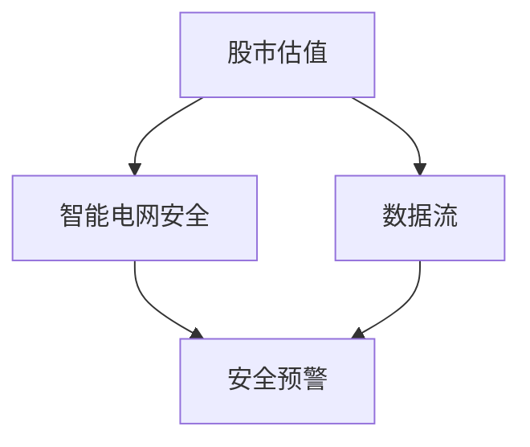
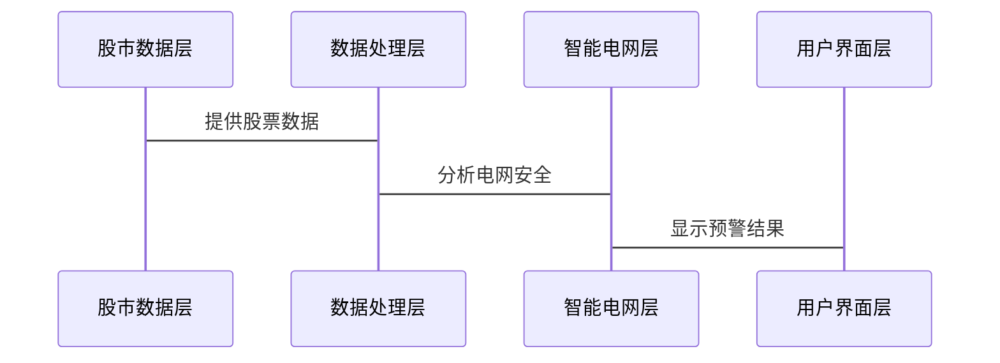

                 


# 新兴市场股市估值与智能电网安全的互动

> 关键词：新兴市场，股市估值，智能电网，安全互动，算法模型

> 摘要：本文探讨新兴市场中股市估值与智能电网安全之间的互动关系，分析其核心概念、算法原理、数学模型、系统架构，并通过项目实战和最佳实践提供深入见解。

---

## 第1章: 背景与问题描述

### 1.1 新兴市场股市估值的基本概念
#### 1.1.1 股市估值的定义与核心要素
股市估值是对公司价值的评估，主要通过基本面分析、技术分析和市场情绪分析进行。核心要素包括市盈率、市净率、股息率等。

#### 1.1.2 新兴市场的特点与挑战
新兴市场通常具有高增长潜力，但也面临高波动性和信息不对称等问题，这增加了股市估值的复杂性。

#### 1.1.3 股市估值在新兴市场中的重要性
准确的股市估值有助于投资者做出明智决策，促进市场稳定和经济发展。

### 1.2 智能电网安全的基本概念
#### 1.2.1 智能电网的定义与组成部分
智能电网是集成先进信息技术的电力系统，包括发电、输电、配电和用户端。

#### 1.2.2 智能电网安全的核心要素
数据安全、网络安全和物理安全是智能电网的关键组成部分。

#### 1.2.3 智能电网在新兴市场中的应用
新兴市场正在加速智能电网的部署，以应对能源需求增长和电网效率提升的挑战。

### 1.3 股市估值与智能电网安全的互动关系
#### 1.3.1 互动机制的定义与特征
股市估值为智能电网投资提供参考，而智能电网的安全性则影响股市表现。

#### 1.3.2 互动关系的边界与外延
两者互动涉及数据共享、投资决策和风险管理。

#### 1.3.3 互动关系的核心要素组成
包括数据流、算法模型和反馈机制。

---

## 第2章: 核心概念与联系

### 2.1 股市估值与智能电网安全的核心概念对比
#### 2.1.1 核心概念的属性特征对比表格

| 属性 | 股市估值 | 智能电网安全 |
|------|----------|---------------|
| 数据源 | 财务数据、市场数据 | 电网数据、安全数据 |
| 目标 | 评估价值 | 保障安全 |
| 方法 | 统计分析、机器学习 | 网络安全技术、实时监控 |

#### 2.1.2 概念结构与核心要素的对比分析
股市估值注重历史数据和市场趋势，而智能电网安全关注实时数据和防御机制。

### 2.2 实体关系图
使用Mermaid绘制实体关系图，展示股市估值与智能电网安全的互动。



---

## 第3章: 算法原理与数学模型

### 3.1 股市估值算法原理
#### 3.1.1 时间序列分析模型（ARIMA）
用于预测股票价格趋势，公式如下：
$$ ARIMA(p, d, q) = \phi(B)^p (1-B)^d (1-\theta(B))^q $$
其中，p为自回归阶数，d为差分阶数，q为移动平均阶数。

#### 3.1.2 机器学习模型（随机森林、神经网络）
随机森林通过集成学习提高预测准确性，神经网络则利用深度学习捕捉复杂模式。

#### 3.1.3 深度学习模型（LSTM）
LSTM通过长短期记忆单元处理时间序列数据，公式如下：
$$ f_t = \sigma(W_f \cdot [h_{t-1}, x_t] + b_f) $$

### 3.2 智能电网安全算法原理
#### 3.2.1 基于图论的网络安全分析
构建网络拓扑图，识别关键节点和潜在攻击路径。

#### 3.2.2 基于机器学习的异常检测
使用支持向量机（SVM）或聚类算法检测网络异常。

#### 3.2.3 基于强化学习的自适应安全策略
通过Q-learning算法优化安全策略，公式如下：
$$ Q(s, a) = r + \gamma \max Q(s', a') $$

### 3.3 算法互动模型
展示股市估值与智能电网安全算法的互动流程。

---

## 第4章: 系统分析与架构设计方案

### 4.1 问题场景介绍
新兴市场中，股市波动和电网安全问题相互影响，需构建综合系统进行实时监控和预警。

### 4.2 项目介绍
开发一个智能电网安全预警系统，结合股市数据进行综合分析。

### 4.3 系统功能设计
#### 4.3.1 领域模型（Mermaid类图）

```mermaid
classDiagram
    class 股市数据 {
        +股票价格
        +财务指标
        -预测模型
    }
    class 电网数据 {
        +实时数据
        +设备状态
        -安全算法
    }
    class 安全预警系统 {
        +预警模块
        +数据接口
        -用户界面
    }
    < 股市数据 >-->< 安全预警系统 >
    < 电网数据 >-->< 安全预警系统 >
```

### 4.4 系统架构设计（Mermaid架构图）


### 4.5 系统接口设计
定义API接口，实现数据共享和结果反馈。

### 4.6 系统交互（Mermaid序列图）



---

## 第5章: 项目实战

### 5.1 环境搭建
安装Python、TensorFlow、Keras等工具，配置开发环境。

### 5.2 系统核心实现源代码
#### 5.2.1 股市估值模型代码

```python
import pandas as pd
from sklearn.ensemble import RandomForestRegressor

def stock_valuation(data):
    model = RandomForestRegressor()
    model.fit(data[['PE', 'PB', 'PS'], data['Price'])
    return model.predict(data[['PE', 'PB', 'PS']])
```

#### 5.2.2 智能电网安全算法代码

```python
from sklearn.svm import OneClassSVM

def grid_security(data):
    model = OneClassSVM()
    model.fit(data)
    return model.predict(data)
```

### 5.3 代码应用解读与分析
解释代码功能，展示如何通过模型进行预测和预警。

### 5.4 实际案例分析
以某新兴市场为例，展示系统如何实时监控股市和电网安全。

### 5.5 项目小结
总结项目成果和实际应用效果。

---

## 第6章: 总结与展望

### 6.1 全文总结
概述全文内容，强调股市估值与智能电网安全互动的重要性。

### 6.2 未来研究方向
探讨更复杂的算法、更广泛的数据源和更高效的系统架构。

### 6.3 最佳实践 tips
提供实际操作中的建议和注意事项。

### 6.4 小结
强调互动机制在新兴市场中的潜在价值。

### 6.5 注意事项
提醒读者注意数据隐私和模型泛化能力。

### 6.6 拓展阅读
推荐相关领域的书籍和论文。

---

## 附录

### A. 术语表
解释文中使用的专业术语。

### B. 工具安装指南
指导读者如何安装和配置开发工具。

### C. 参考文献
列出引用的文献和资料。

---

作者：AI天才研究院 & 禅与计算机程序设计艺术

