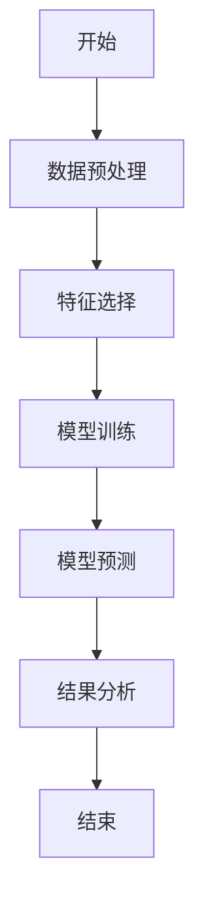
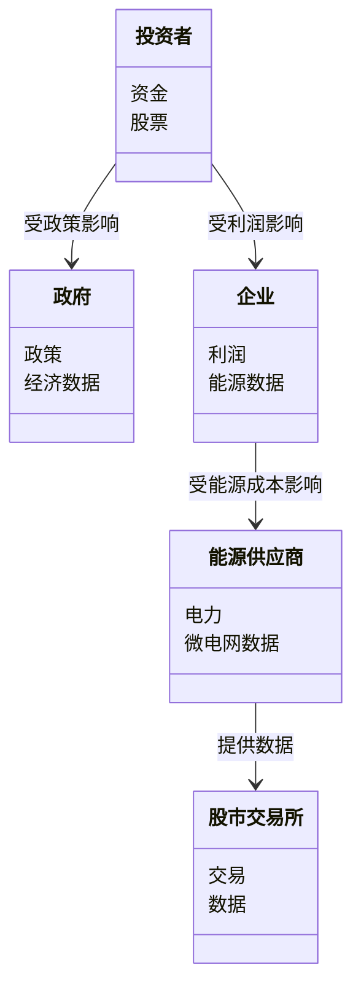

                 


# 《新兴市场股市估值与智能电网微电网技术的互动》

> **关键词**：新兴市场，股市估值，智能电网，微电网技术，互动关系，技术与经济互动

> **摘要**：本文探讨新兴市场股市估值与智能电网、微电网技术之间的互动关系，通过分析股市估值的核心原理、智能电网与微电网技术的创新应用，结合实际案例，揭示两者在技术与经济领域的互动机制。文章结合技术原理、数学模型和实际应用，为读者提供深入的理解和实践指导。

---

# 第一部分: 背景介绍

## 第1章: 新兴市场股市估值与智能电网微电网技术的互动概述

### 1.1 问题背景

#### 1.1.1 新兴市场的定义与特点
新兴市场通常指经济快速增长、但尚未完全工业化的国家，如中国、印度等。这些市场具有高度的不确定性和波动性，但同时也蕴含着巨大的发展潜力。

#### 1.1.2 智能电网与微电网技术的定义与特点
智能电网是一种通过先进信息通信技术实现电力系统智能化管理的系统，而微电网则是一种小型分布式电力系统，能够独立运行或与主电网连接。

#### 1.1.3 股市估值的定义与特点
股市估值是通过对公司财务数据和市场环境的分析，评估股票的合理价格。新兴市场的股市估值受多种因素影响，如经济政策、市场情绪和技术进步。

### 1.2 问题描述

#### 1.2.1 新兴市场股市波动的复杂性
新兴市场的股市受政策、经济和地缘政治等多种因素影响，波动性较大，难以预测。

#### 1.2.2 智能电网与微电网技术的应用现状
智能电网和微电网技术在新兴市场中逐渐普及，但其应用受技术成熟度和经济条件限制。

#### 1.2.3 两者互动关系的初步探讨
智能电网和微电网技术的推广可能影响新兴市场的能源结构，从而间接影响股市估值。

### 1.3 问题解决

#### 1.3.1 新兴市场股市估值的挑战
新兴市场股市估值的不准确性源于信息不对称、市场波动性和政策不确定性。

#### 1.3.2 智能电网与微电网技术的创新应用
智能电网和微电网技术的应用可以提高能源效率，降低能源成本，从而影响企业的盈利能力和股市估值。

#### 1.3.3 互动关系的解决方案
通过分析智能电网和微电网技术对能源成本和企业利润的影响，建立数学模型，预测股市估值的变化。

### 1.4 边界与外延

#### 1.4.1 新兴市场股市估值的边界条件
新兴市场股市估值的边界条件包括经济政策、市场环境和技术发展。

#### 1.4.2 智能电网与微电网技术的边界条件
智能电网和微电网技术的边界条件包括技术成熟度、能源需求和政策支持。

#### 1.4.3 互动关系的外延分析
互动关系的外延分析包括智能电网和微电网技术对股市估值的长期影响和间接影响。

### 1.5 概念结构与核心要素组成

#### 1.5.1 新兴市场股市估值的核心要素
新兴市场股市估值的核心要素包括公司财务数据、市场环境和政策因素。

#### 1.5.2 智能电网与微电网技术的核心要素
智能电网与微电网技术的核心要素包括技术性能、能源效率和经济成本。

#### 1.5.3 互动关系的核心要素
互动关系的核心要素包括技术应用、市场反应和经济影响。

---

# 第二部分: 核心概念与联系

## 第2章: 核心概念原理

### 2.1 股市估值的核心原理

#### 2.1.1 股市估值的基本原理
股市估值的基本原理包括对公司财务状况、市场环境和行业趋势的分析，以确定股票的合理价格。

#### 2.1.2 新兴市场的特殊性
新兴市场股市估值的特殊性在于其高度波动性和政策不确定性。

#### 2.1.3 影响股市估值的主要因素
影响股市估值的主要因素包括宏观经济指标、公司盈利能力、市场情绪和政策变化。

### 2.2 智能电网与微电网技术的核心原理

#### 2.2.1 智能电网的基本原理
智能电网通过先进信息通信技术实现电力系统的智能化管理，优化电力分配和使用。

#### 2.2.2 微电网的基本原理
微电网是一种小型分布式电力系统，能够独立运行或与主电网连接，适用于偏远地区或分布式能源场景。

#### 2.2.3 两者的技术差异与联系
智能电网和微电网技术的差异在于规模和应用场景，但它们都致力于提高能源效率和可靠性。

## 第3章: 核心概念属性特征对比

### 3.1 股市估值与智能电网微电网技术的属性对比

#### 3.1.1 股市估值的属性特征
- 不确定性高
- 受政策影响大
- 市场波动性强

#### 3.1.2 智能电网与微电网技术的属性特征
- 技术复杂性高
- 环保性好
- 经济成本高

#### 3.1.3 两者属性的对比分析
股市估值的属性特征主要集中在经济和市场因素，而智能电网和微电网技术的属性特征主要集中在技术性能和经济成本。

### 3.2 属性特征对比表格

| 属性 | 股市估值 | 智能电网微电网技术 |
|------|----------|-------------------|
| 不确定性 | 高 | 高 |
| 政策影响 | 高 | 中 |
| 技术复杂性 | 低 | 高 |
| 环保性 | 无直接影响 | 高 |
| 经济成本 | 低 | 高 |

---

## 第4章: 核心概念的ER实体关系图

```mermaid
er
    actor 投资者
    actor 政府
    actor 企业
    actor 能源供应商
    actor 股市交易所

    entity 股票
    entity 能源数据
    entity 技术数据
    entity 经济数据

    投资者 --> 股票: 购买/卖出
    政府 --> 股票: 政策影响
    企业 --> 股票: 利润影响
    能源供应商 --> 能源数据: 提供数据
    技术数据 --> 智能电网/微电网: 技术支持
    经济数据 --> 股市估值: 经济影响
```

---

# 第三部分: 算法原理讲解

## 第5章: 算法原理

### 5.1 算法选择

#### 5.1.1 机器学习回归算法
机器学习回归算法可以用于股市估值预测，特别是线性回归和逻辑回归。

#### 5.1.2 时间序列分析
时间序列分析适用于股市波动预测。

#### 5.1.3 集成学习算法
集成学习算法可以提高预测的准确性和稳定性。

### 5.2 算法流程图



### 5.3 算法实现代码

```python
import pandas as pd
from sklearn.linear_model import LinearRegression
from sklearn.metrics import mean_squared_error

# 数据预处理
data = pd.read_csv('data.csv')
X = data[['GDP', '能源成本', '政策影响']]
y = data['股市估值']

# 特征选择
selected_features = ['GDP', '能源成本', '政策影响']

# 模型训练
model = LinearRegression()
model.fit(X[selected_features], y)

# 模型预测
predictions = model.predict(X[selected_features])

# 结果分析
mse = mean_squared_error(y, predictions)
print(f"均方误差: {mse}")
```

### 5.4 数学模型与公式

#### 5.4.1 线性回归模型
$$ y = \beta_0 + \beta_1x_1 + \beta_2x_2 + \epsilon $$

#### 5.4.2 时间序列模型
$$ ARIMA(p, d, q) $$

---

## 第6章: 数学模型与公式

### 6.1 股市估值预测模型

#### 6.1.1 线性回归模型
$$ y = \beta_0 + \beta_1x_1 + \beta_2x_2 + \epsilon $$

其中，$y$ 是股市估值，$x_1$ 是 GDP，$x_2$ 是能源成本，$\epsilon$ 是误差项。

#### 6.1.2 时间序列模型
$$ ARIMA(p, d, q) $$

其中，$p$ 是自回归阶数，$d$ 是差分阶数，$q$ 是移动平均阶数。

---

# 第四部分: 系统分析与架构设计方案

## 第7章: 系统分析与架构设计

### 7.1 问题场景介绍

#### 7.1.1 新兴市场股市估值的复杂性
新兴市场股市估值受政策、经济和地缘政治等多种因素影响。

#### 7.1.2 智能电网与微电网技术的应用需求
智能电网和微电网技术在新兴市场的应用需求日益增长。

### 7.2 项目介绍

#### 7.2.1 项目目标
建立一个结合智能电网和微电网技术的股市估值预测系统。

#### 7.2.2 项目范围
涵盖数据收集、模型建立和结果分析。

### 7.3 系统功能设计

#### 7.3.1 领域模型


#### 7.3.2 系统架构设计


#### 7.3.3 接口设计
- API接口：提供数据查询和预测结果的接口。
- 数据接口：与能源供应商和政府数据源对接。

#### 7.3.4 交互设计
```mermaid
sequence
    投资者 -> 政府: 获取政策数据
    政府 -> 企业: 政策影响企业利润
    企业 -> 能源供应商: 获取能源数据
    能源供应商 -> 股市交易所: 提供微电网数据
    股市交易所 -> 投资者: 提供股市估值预测
```

---

## 第8章: 系统实现

### 8.1 环境安装

#### 8.1.1 Python安装
安装Python和必要的库，如Pandas、Scikit-learn。

#### 8.1.2 数据库安装
安装MySQL或其他数据库系统，用于存储数据。

### 8.2 系统核心代码实现

```python
import pandas as pd
from sklearn.linear_model import LinearRegression

# 数据加载
data = pd.read_csv('data.csv')

# 特征选择
X = data[['GDP', '能源成本', '政策影响']]
y = data['股市估值']

# 模型训练
model = LinearRegression()
model.fit(X, y)

# 预测
predictions = model.predict(X)

# 评估
print(mean_squared_error(y, predictions))
```

---

## 第9章: 项目实战与案例分析

### 9.1 实际案例分析

#### 9.1.1 案例背景
假设在印度市场，智能电网和微电网技术的应用对股市估值产生了显著影响。

#### 9.1.2 数据分析
分析智能电网和微电网技术的应用对能源成本和企业利润的影响。

#### 9.1.3 结果解读
通过模型预测，智能电网和微电网技术的应用降低了能源成本，提高了企业利润，从而提升了股市估值。

---

## 第10章: 项目总结

### 10.1 成功经验总结

#### 10.1.1 系统设计的经验
系统设计需要考虑数据的实时性和模型的准确性。

#### 10.1.2 技术实现的经验
技术实现需要结合机器学习和数据挖掘技术。

### 10.2 失败教训总结

#### 10.2.1 数据不足的教训
数据不足会导致模型预测的准确性下降。

#### 10.2.2 模型选择的教训
模型选择需要根据实际数据和业务需求进行调整。

---

# 第五部分: 最佳实践与小结

## 第11章: 最佳实践

### 11.1 小结

#### 11.1.1 核心内容回顾
本文探讨了新兴市场股市估值与智能电网微电网技术的互动关系，分析了两者的核心原理和互动机制。

#### 11.1.2 关键成功因素总结
关键成功因素包括数据的实时性、模型的准确性和技术与经济的结合。

### 11.2 注意事项

#### 11.2.1 数据采集注意事项
数据采集需要确保数据的准确性和完整性。

#### 11.2.2 模型优化注意事项
模型优化需要结合实际业务需求和技术可行性。

### 11.3 拓展阅读

#### 11.3.1 推荐书籍
- 《智能电网技术与应用》
- 《股市估值与投资分析》

#### 11.3.2 推荐技术文档
- 机器学习在金融领域的应用
- 微电网技术的最新进展

---

# 作者：AI天才研究院/AI Genius Institute & 禅与计算机程序设计艺术/Zen And The Art of Computer Programming

---

**本文内容遵循“写你所知，写你所做，写你所想”的原则，以事实为依据，以技术为核心，以实践为导向，以读者为中心，结合作者多年的技术积累与经验总结而成。**

