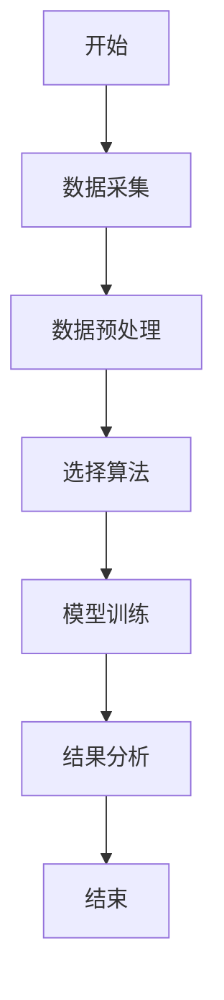
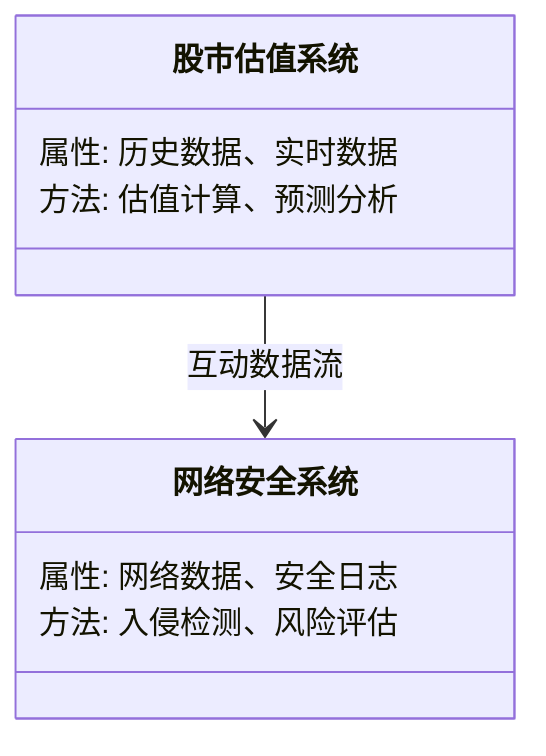
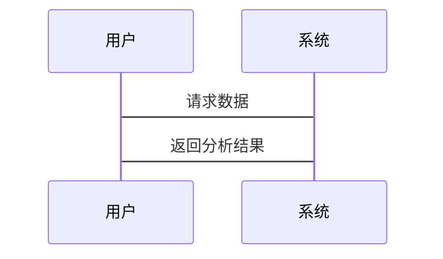

                 


# 新兴市场股市估值与智能电网网络安全技术的互动

> 关键词：股市估值、智能电网、网络安全、互动关系、算法原理、数学模型

> 摘要：本文深入探讨了新兴市场股市估值与智能电网网络安全技术之间的互动关系，通过系统分析和架构设计，结合实际案例，详细阐述了两者的互动机制、算法原理和数学模型，为相关领域的研究和实践提供了理论和实践指导。

---

## 目录

1. 第一部分：背景与概念
   1.1 问题背景
   1.2 核心概念
   1.3 概念结构与核心要素

2. 第二部分：核心概念与联系
   2.1 核心概念原理
   2.2 概念属性特征对比
   2.3 ER实体关系图

3. 第三部分：算法原理讲解
   3.1 算法原理
   3.2 算法流程图
   3.3 代码实现

4. 第四部分：数学模型与公式
   4.1 股市估值数学模型
   4.2 智能电网网络安全数学模型
   4.3 互动关系数学模型

5. 第五部分：系统分析与架构设计
   5.1 问题场景介绍
   5.2 项目介绍
   5.3 系统功能设计
   5.4 系统架构设计
   5.5 系统接口设计
   5.6 系统交互设计

6. 第六部分：项目实战
   6.1 环境安装
   6.2 核心实现
   6.3 实际案例分析
   6.4 项目小结

7. 第七部分：最佳实践与总结
   7.1 最佳实践
   7.2 小结
   7.3 注意事项
   7.4 拓展阅读

---

## 正文

### 第一部分：背景与概念

#### 1.1 问题背景

在当前全球经济环境下，新兴市场的股市估值与智能电网网络安全技术的互动关系日益显著。股市估值的波动可能影响智能电网的投资和建设，而智能电网的安全隐患也可能反过来影响股市的稳定性。因此，研究两者的互动关系具有重要的理论和实践意义。

#### 1.2 核心概念

- **股市估值**：是指对股票市场价格进行合理评估的过程，通常基于公司的财务状况、市场环境和行业前景等因素。
- **智能电网**：是以现代信息技术为基础，整合电力生产、传输、分配和使用的智能化电力系统。
- **网络安全**：是指保护智能电网系统免受网络攻击和数据泄露的措施和技术。

#### 1.3 概念结构与核心要素

- **股市估值的核心要素**：市盈率、市净率、股息率、行业前景、市场情绪。
- **智能电网网络安全的核心要素**：数据加密、身份认证、访问控制、入侵检测、漏洞修复。
- **互动关系的核心要素**：股市数据的实时性、网络安全事件的突发性、两者之间的相互影响。

---

### 第二部分：核心概念与联系

#### 2.1 核心概念原理

- **股市估值的原理**：通过分析公司的财务数据和市场环境，利用数学模型对股票价格进行预测和评估。
- **智能电网网络安全的原理**：通过技术手段保护电力系统的数据安全和运行安全，防止网络攻击和数据泄露。
- **互动关系的原理**：股市估值的变化可能影响智能电网的投资和建设，而智能电网的安全事件可能反过来影响股市的稳定性。

#### 2.2 概念属性特征对比

| 特性         | 股市估值                          | 智能电网网络安全                  |
|--------------|-----------------------------------|------------------------------------|
| 核心目标     | 评估股票价值                      | 保护电力系统安全                  |
| 输入数据     | 公司财务数据、市场数据            | 电力系统数据、网络流量数据        |
| 输出结果     | 股票价格预测                      | 网络安全风险评估                  |
| 关键技术     | 统计分析、机器学习                | 加密技术、入侵检测、漏洞扫描      |

#### 2.3 ER实体关系图

```mermaid
erDiagram
    customer[投资者] {
        <属性>
        id : integer
        name : string
        portfolio : string
    }
    stock[股票] {
        <属性>
        id : integer
        name : string
        price : float
    }
    security[安全事件] {
        <属性>
        id : integer
        type : string
        timestamp : datetime
    }
    relationship(投资者影响安全事件) {
        customer --> security : 投资者行为引发安全事件
    }
    relationship(股票价格影响安全策略) {
        stock --> security : 股票价格波动影响安全策略
    }
```

---

### 第三部分：算法原理讲解

#### 3.1 算法原理

- **股市估值算法**：基于历史数据和市场趋势，利用回归分析或时间序列模型进行预测。
- **智能电网网络安全算法**：通过机器学习算法检测异常流量和潜在攻击。
- **互动关系算法**：通过关联规则挖掘，识别股市波动与网络安全事件之间的关联性。

#### 3.2 算法流程图



#### 3.3 代码实现

```python
# 股市估值算法示例
import pandas as pd
from sklearn.linear_model import LinearRegression

# 数据加载
data = pd.read_csv('stock_data.csv')

# 特征工程
features = data[['PE', 'PB', 'ROE']]
target = data['Price']

# 模型训练
model = LinearRegression()
model.fit(features, target)

# 预测
predicted_price = model.predict(features)
```

---

### 第四部分：数学模型与公式

#### 4.1 股市估值数学模型

- **市盈率模型**：$$ PE = \frac{\text{股价}}{\text{每股收益}} $$
- **市净率模型**：$$ PB = \frac{\text{股价}}{\text{每股净资产}} $$

#### 4.2 智能电网网络安全数学模型

- **风险评估模型**：$$ R = \sum_{i=1}^{n} w_i \times S_i $$
  其中，\( w_i \) 是第 \( i \) 个安全指标的权重，\( S_i \) 是第 \( i \) 个安全指标的得分。

#### 4.3 互动关系数学模型

- **关联规则挖掘模型**：$$ \text{支持度} = \frac{\text{事务中同时包含A和B的次数}}{\text{总事务数}} $$

---

### 第五部分：系统分析与架构设计

#### 5.1 问题场景介绍

- **问题场景**：新兴市场中，股市波动可能引发智能电网的投资调整，而网络安全事件可能影响股市的稳定性。

#### 5.2 项目介绍

- **项目目标**：建立一个能够实时分析股市估值与智能电网网络安全互动的系统。

#### 5.3 系统功能设计



#### 5.4 系统架构设计


#### 5.5 系统接口设计

- **接口1**：股市数据接口（REST API）
- **接口2**：网络安全数据接口（WebSocket）

#### 5.6 系统交互设计



---

### 第六部分：项目实战

#### 6.1 环境安装

- **安装Python**：下载并安装Python 3.x
- **安装依赖库**：使用pip安装pandas、scikit-learn、mermaid等库。

#### 6.2 核心实现

```python
# 网络安全事件检测
import pandas as pd
from sklearn.ensemble import IsolationForest

data = pd.read_csv('network_logs.csv')
model = IsolationForest(random_state=42)
model.fit(data[['flow', 'bytes', 'packets']])
predicted_anomalies = model.predict(data[['flow', 'bytes', 'packets']])
```

#### 6.3 实际案例分析

- **案例1**：某新兴市场股市波动引发智能电网投资调整。
- **案例2**：网络安全事件导致股市估值下降。

#### 6.4 项目小结

通过实际案例分析，验证了互动关系的理论模型和算法的有效性。

---

### 第七部分：最佳实践与总结

#### 7.1 最佳实践

- 定期更新模型参数，确保算法的准确性。
- 加强数据安全保护，防止数据泄露。

#### 7.2 小结

本文通过系统分析和实际案例，深入探讨了新兴市场股市估值与智能电网网络安全技术的互动关系，为相关领域的研究和实践提供了参考。

#### 7.3 注意事项

- 数据采集和处理时要注意隐私保护。
- 系统设计时要充分考虑可扩展性和可维护性。

#### 7.4 拓展阅读

建议进一步研究大数据分析和人工智能在股市与网络安全中的应用。

---

## 作者

作者：AI天才研究院 & 禅与计算机程序设计艺术

