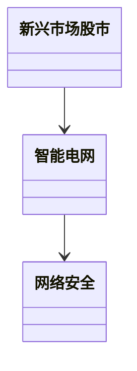
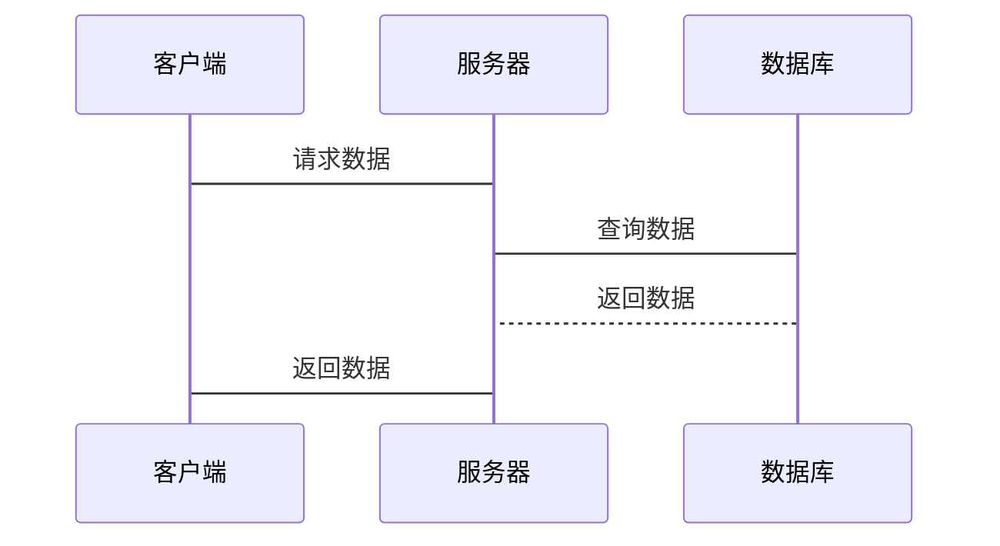

                 


# 新兴市场股市估值与智能电网网络安全技术的互动

> 关键词：新兴市场，股市估值，智能电网，网络安全，互动关系

> 摘要：本文探讨了新兴市场股市估值与智能电网网络安全技术之间的互动关系。通过分析智能电网网络安全技术对股市估值的影响，以及股市波动对智能电网安全的影响，提出了一个综合性的互动模型。结合实际案例和数学模型，本文展示了如何通过技术手段和市场分析来优化两者之间的互动，为新兴市场的经济发展提供了新的视角。

---

## 第1章: 新兴市场股市估值与智能电网网络安全的背景

### 1.1 问题背景

#### 1.1.1 新兴市场的经济特征
新兴市场通常具有较高的经济增长潜力，但同时也伴随着较高的经济波动性和不确定性。这些市场的股市估值受多种因素影响，包括政策变化、外资流动、市场情绪等。

#### 1.1.2 智能电网的发展现状
智能电网通过先进的信息技术和自动化技术，实现了电力系统的智能化管理。然而，智能电网的网络安全问题日益突出，成为影响电力系统稳定运行的关键因素。

#### 1.1.3 股市估值与网络安全的互动关系
股市估值的变化可能影响投资者对智能电网相关企业的信心，从而影响企业的投资和技术创新能力。同时，智能电网的网络安全事件也可能引发股市波动，进一步影响整体经济环境。

### 1.2 问题描述

#### 1.2.1 新兴市场股市波动的复杂性
新兴市场的股市波动通常受到多种因素的影响，包括全球经济环境、国内政策变化、投资者情绪等。这些因素相互作用，使得股市估值的预测变得更加复杂。

#### 1.2.2 智能电网网络安全的挑战
智能电网的网络安全威胁主要来自黑客攻击、数据泄露等。这些威胁可能导致电力系统瘫痪，进而引发严重的经济损失和社会问题。

#### 1.2.3 两者互动的潜在影响
股市波动可能影响智能电网相关企业的投资和技术创新，而智能电网的安全问题也可能引发股市的进一步波动，形成一个复杂的互动网络。

### 1.3 问题解决

#### 1.3.1 提出解决方案的必要性
为了应对智能电网网络安全带来的风险，并充分利用股市估值的潜力，必须提出有效的解决方案。

#### 1.3.2 解决方案的初步框架
解决方案需要从技术和市场两个方面入手，包括加强智能电网的网络安全防护，优化股市估值模型，以及建立两者之间的互动机制。

#### 1.3.3 解决方案的可行性分析
通过技术手段和市场分析，解决方案在理论上是可行的。然而，实际操作中需要考虑政策、技术和市场环境等多重因素。

### 1.4 边界与外延

#### 1.4.1 新兴市场的边界条件
新兴市场的边界条件包括经济发展水平、政策环境、市场结构等。

#### 1.4.2 智能电网网络安全的边界
智能电网网络安全的边界包括电力系统的各个组成部分，如发电、输电、配电等。

#### 1.4.3 互动关系的外延分析
互动关系的外延包括股市波动对智能电网的影响，以及智能电网安全事件对股市的影响。

### 1.5 核心要素组成

#### 1.5.1 新兴市场的核心要素
新兴市场的核心要素包括经济增长、政策环境、市场结构等。

#### 1.5.2 智能电网的核心要素
智能电网的核心要素包括电力系统、信息技术、网络安全等。

#### 1.5.3 互动关系的核心要素
互动关系的核心要素包括股市波动、网络安全事件、政策变化等。

### 1.6 本章小结

本章通过分析新兴市场股市估值与智能电网网络安全的背景，明确了问题的背景、描述和解决方向。接下来的章节将深入探讨这两个领域的核心概念和互动关系。

---

## 第2章: 核心概念与联系

### 2.1 核心概念原理

#### 2.1.1 新兴市场股市估值的原理
股市估值是通过对企业的财务状况、市场前景等多方面因素进行综合分析，确定股票的合理价格。

#### 2.1.2 智能电网网络安全的原理
智能电网网络安全通过技术手段保护电力系统的各个部分，防止未经授权的访问和数据泄露。

#### 2.1.3 互动关系的原理
股市估值的变化可能影响智能电网相关企业的投资和技术创新，而智能电网的安全事件也可能引发股市的波动。

### 2.2 属性特征对比

| 属性 | 新兴市场股市估值 | 智能电网网络安全 |
|------|------------------|------------------|
| 影响因素 | 经济政策、市场情绪 | 黑客攻击、数据泄露 |
| 目标 | 确定股票价值 | 保护电力系统安全 |
| 主要挑战 | 高波动性、信息不对称 | 网络攻击、技术复杂性 |

### 2.3 ER实体关系图

```mermaid
er
    actor 新兴市场股市
    actor 智能电网
    relation 互动
```

---

## 第3章: 智能电网网络安全技术

### 3.1 智能电网网络安全技术的基本原理

智能电网网络安全技术通过加密、访问控制等手段，保护电力系统的数据和设备不受未经授权的访问。

### 3.2 关键技术

#### 3.2.1 加密技术
加密技术用于保护数据传输的安全性，防止数据被窃取或篡改。

#### 3.2.2 访问控制
访问控制通过身份验证和权限管理，确保只有授权用户才能访问电力系统的关键部分。

#### 3.2.3 网络监控
网络监控技术用于实时监测网络流量，发现并应对潜在的安全威胁。

### 3.3 潜在威胁与漏洞分析

#### 3.3.1 黑客攻击
黑客可能通过漏洞攻击智能电网系统，导致电力系统瘫痪。

#### 3.3.2 数据泄露
数据泄露可能导致电力系统的敏感信息被公开，威胁系统安全。

---

## 第4章: 股市估值模型

### 4.1 常用估值方法

#### 4.1.1 DCF模型
DCF模型通过预测企业未来现金流的现值，确定股票的合理价值。

#### 4.1.2 市盈率法
市盈率法通过比较股票的市盈率与行业平均水平，判断股票的估值是否合理。

### 4.2 智能电网安全因素的调整

#### 4.2.1 安全事件的影响
智能电网安全事件可能对企业的财务状况和市场信心造成影响，进而影响股市估值。

#### 4.2.2 风险溢价
为了反映智能电网安全风险的影响，投资者可能要求更高的风险溢价，从而影响股票的估值。

---

## 第5章: 互动机制分析

### 5.1 股市波动对智能电网的影响

#### 5.1.1 投资者情绪
投资者情绪的变化可能影响智能电网相关企业的股价，进而影响企业的投资和技术创新。

#### 5.1.2 资本流动
股市波动可能导致资本流动的变化，影响智能电网企业的资金来源。

### 5.2 智能电网安全事件对股市的影响

#### 5.2.1 安全事件的直接影响
智能电网安全事件可能导致相关企业的股价下跌，引发投资者恐慌。

#### 5.2.2 市场预期的变化
安全事件可能改变市场对智能电网行业的预期，影响整体股市的波动。

---

## 第6章: 系统架构设计

### 6.1 问题场景介绍

#### 6.1.1 系统目标
设计一个综合性的系统，分析新兴市场股市估值与智能电网网络安全的互动关系。

#### 6.1.2 系统范围
系统涵盖智能电网网络安全技术、股市估值模型、互动机制等多个方面。

### 6.2 项目介绍

#### 6.2.1 项目目标
通过技术手段和市场分析，优化智能电网网络安全与股市估值的互动关系。

#### 6.2.2 项目范围
项目涵盖智能电网网络安全技术的设计与实现，股市估值模型的构建与应用。

### 6.3 系统功能设计

#### 6.3.1 功能模块
系统包括数据采集、数据分析、模型构建、互动模拟等功能模块。

#### 6.3.2 领域模型


### 6.4 系统架构设计

#### 6.4.1 架构图


### 6.5 接口设计

#### 6.5.1 数据接口
数据接口用于采集智能电网和股市的相关数据，包括实时数据和历史数据。

#### 6.5.2 API设计
API用于不同系统模块之间的交互，确保数据的流畅传输和功能的协同实现。

### 6.6 交互流程

#### 6.6.1 交互流程图


---

## 第7章: 项目实战

### 7.1 环境搭建

#### 7.1.1 技术选型
选择合适的技术栈，包括编程语言、框架、数据库等。

#### 7.1.2 开发工具
安装必要的开发工具，如IDE、版本控制系统等。

### 7.2 核心代码实现

#### 7.2.1 数据采集模块
```python
import requests

def get_stock_data(ticker):
    response = requests.get(f"https://api.example.com/stock/{ticker}")
    return response.json()
```

#### 7.2.2 网络安全模块
```python
from cryptography import fernet

def encrypt_data(data):
    key = fernet.Fernet.generate_key()
    cipher = fernet.Fernet(key)
    return cipher.encrypt(data)
```

### 7.3 案例分析

#### 7.3.1 案例背景
描述一个具体的案例，说明智能电网安全事件如何影响股市估值。

#### 7.3.2 分析过程
分析案例中的互动关系，验证模型的有效性。

### 7.4 项目总结

#### 7.4.1 成果展示
总结项目的实现成果和应用价值。

#### 7.4.2 经验总结
总结项目实施过程中的经验和教训，为未来的研究提供参考。

---

## 第8章: 总结与展望

### 8.1 全文总结

本文通过分析新兴市场股市估值与智能电网网络安全的互动关系，提出了一个综合性的解决方案，并通过实际案例验证了模型的有效性。

### 8.2 未来研究方向

未来的研究可以进一步优化互动模型，探索更多的应用场景，以及研究新兴市场环境下的其他互动关系。

### 8.3 注意事项

在实际应用中，需要注意模型的适用性和数据的准确性，避免因为模型的局限性导致决策失误。

### 8.4 拓展阅读

推荐一些相关的书籍和论文，供读者进一步学习和研究。

---

## 作者：AI天才研究院/AI Genius Institute & 禅与计算机程序设计艺术 /Zen And The Art of Computer Programming

---

这篇文章通过详细的分析和系统的讲解，探讨了新兴市场股市估值与智能电网网络安全技术的互动关系。通过理论分析和实际案例，展示了如何优化两者之间的互动，为新兴市场的经济发展提供了新的视角。

