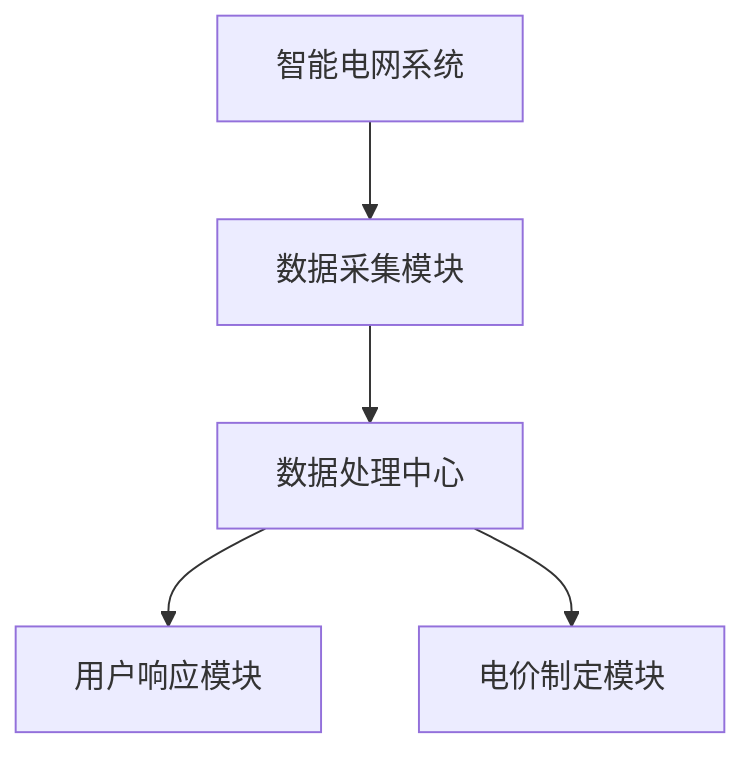
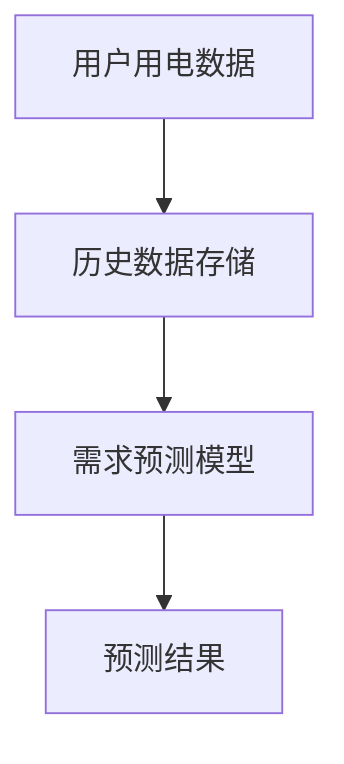

                 


# 新兴市场股市估值与智能电网需求侧响应技术的互动

## 关键词：
- 新兴市场股市估值
- 智能电网
- 需求侧响应技术
- 股市波动
- 技术创新

## 摘要：
本文探讨新兴市场股市估值与智能电网需求侧响应技术之间的互动关系，分析股市波动对智能电网投资的影响，以及智能电网技术进步对股市估值的作用。通过构建协同机制和数学模型，展示两者如何相互促进，推动智能电网技术和股市的健康发展。

## 第一部分: 新兴市场股市估值与智能电网需求侧响应技术的互动概述

### #1 章: 新兴市场股市估值的基本概念与特点

#### 1.1 股市估值的基本概念
股票估值是确定股票内在价值的过程，常用指标包括市盈率（P/E）、市净率（P/B）和股息率等。在新兴市场，这些指标的使用需考虑高波动性和信息不对称问题。

#### 1.2 新兴市场股市估值的特点
- **高波动性**：新兴市场股市受宏观经济影响大，波动剧烈。
- **信息不对称**：企业信息透明度低，投资者决策难度增加。
- **宏观经济因素**：GDP增长率、利率和通货膨胀率对股市估值影响显著。

### #2 章: 智能电网需求侧响应技术的核心原理

#### 2.1 智能电网的基本概念
智能电网是集成现代信息技术的电力系统，具备实时监控和管理能力，提高电力系统效率和稳定性。

#### 2.2 需求侧响应技术的原理
需求侧响应通过电价激励用户调整用电行为，减少高峰负荷，优化电力资源分配。

### #3 章: 股市估值与智能电网需求侧响应技术的互动关系

#### 3.1 股市估值对智能电网投资的影响
- **投资驱动**：股市资金支持智能电网项目，推动技术创新。
- **股价波动**：股市波动影响投资者信心，进而影响智能电网企业的投资。

#### 3.2 智能电网技术进步对股市估值的影响
- **技术创新**：提升企业竞争力，增加企业价值。
- **数据驱动**：智能电网数据优化股市预测模型，提升估值准确性。

### #4 章: 股市估值与智能电网需求侧响应技术的协同机制

#### 4.1 协同机制的理论框架
协同机制通过整合股市资金和智能电网技术，促进双方共同发展。

#### 4.2 协同机制的具体实现
- **融资推动**：股市融资支持智能电网项目，加速技术应用。
- **数据优化**：智能电网数据提升股市估值模型的准确性。

### #5 章: 股市估值与智能电网需求侧响应技术互动的数学模型

#### 5.1 数学模型的构建
模型框架：S = f(G, E)
- S：综合估值
- G：股市因素
- E：智能电网技术因素

### 第二部分: 智能电网需求侧响应技术的系统架构与实现

### #6 章: 智能电网需求侧响应技术的系统架构设计

#### 6.1 系统功能设计
- 实时数据采集
- 用户行为分析
- 电价策略制定

#### 6.2 系统架构图


### #7 章: 智能电网需求侧响应技术的算法原理

#### 7.1 需求预测算法


### #8 章: 智能电网需求侧响应技术的项目实战

#### 8.1 项目环境安装
- 安装必要的软件和工具，如Python、TensorFlow等。

#### 8.2 系统核心实现
```python
def predict_demand(data):
    model = load_model('demand_model.h5')
    prediction = model.predict(data)
    return prediction
```

#### 8.3 实际案例分析
通过案例分析智能电网技术对股市估值的具体影响。

### #9 章: 背景介绍与问题分析

#### 9.1 核心概念术语说明
- 股市估值：确定股票价值的过程。
- 智能电网：集成现代信息技术的电力系统。

### #10 章: 系统分析与架构设计方案

#### 10.1 系统功能设计
- 数据采集与处理
- 用户行为分析
- 电价制定与优化

#### 10.2 系统架构图


### #11 章: 最佳实践、小结、注意事项与拓展阅读

#### 11.1 最佳实践
- 定期更新模型参数，确保准确性。
- 加强数据安全措施，保护用户隐私。

#### 11.2 小结
本文分析了股市估值与智能电网技术的互动关系，展示了协同机制的重要性。

#### 11.3 注意事项
- 数据来源可靠性
- 技术更新速度

#### 11.4 拓展阅读
推荐相关领域的书籍和论文，供深入学习。

## 作者：
AI天才研究院/AI Genius Institute  
禅与计算机程序设计艺术/Zen And The Art of Computer Programming

