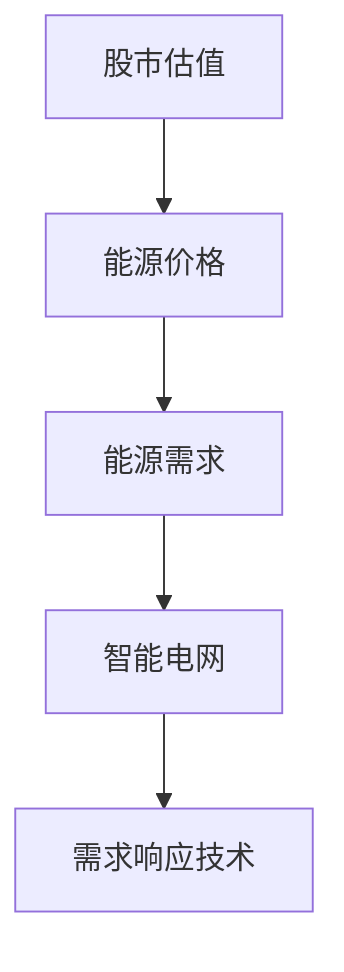
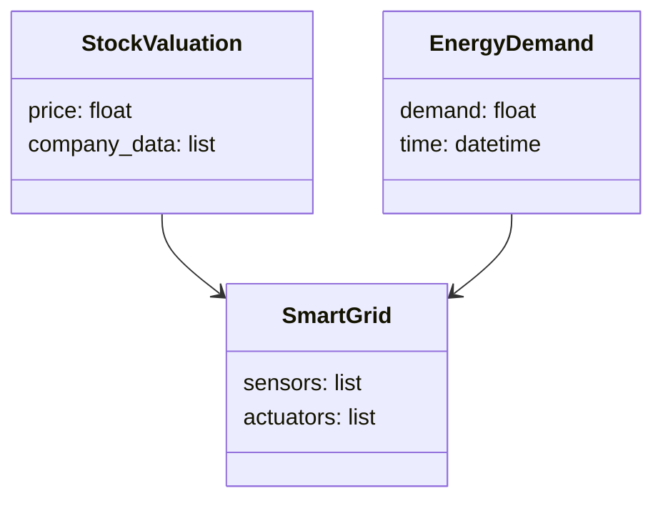
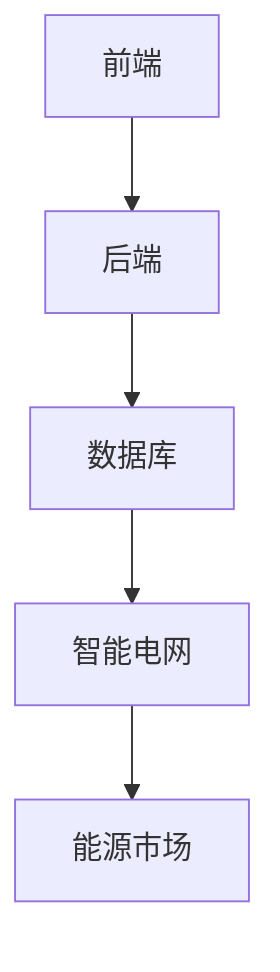
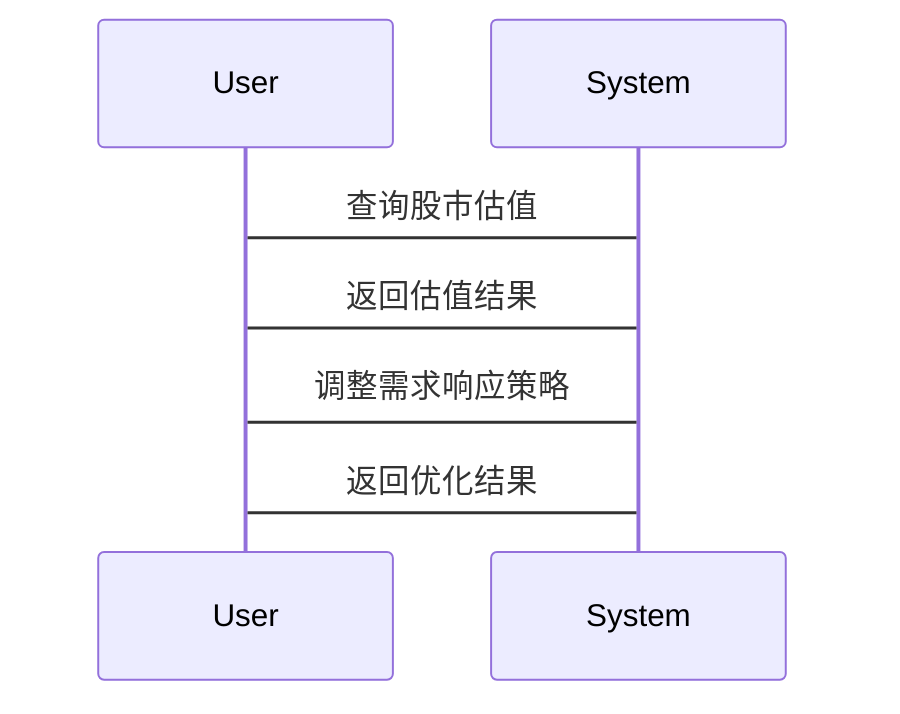

                 


# 新兴市场股市估值与智能电网需求响应技术的互动

> 关键词：新兴市场，股市估值，智能电网，需求响应技术，数据驱动

> 摘要：本文探讨了新兴市场股市估值与智能电网需求响应技术之间的互动关系，分析了两者的核心概念、互动机制、算法实现以及系统架构，并通过实际案例展示了如何通过数据驱动的方法优化股市估值和电力需求响应。

---

# 第一部分：新兴市场股市估值与智能电网需求响应技术的背景与现状

## 第1章：新兴市场股市估值与智能电网需求响应技术的背景与现状

### 1.1 新兴市场股市估值的重要性

#### 1.1.1 新兴市场的定义与特点
新兴市场是指那些经济快速增长、资本市场逐渐成熟但尚未完全发达的国家或地区。这些市场通常具有较高的增长率、多样化的产业结构以及未完全市场化的金融体系。新兴市场的股市估值受到多种因素的影响，包括宏观经济指标、政策变化、国际环境等。

#### 1.1.2 股市估值的基本概念与方法
股市估值是通过对公司的财务数据、行业地位、市场前景等因素进行分析，以确定其股票的合理价格。常用的方法包括市盈率（P/E）、市净率（P/B）、股息率等。这些指标帮助投资者评估股票的内在价值。

#### 1.1.3 新兴市场股市估值的特殊性
新兴市场的股市估值具有较高的波动性和不确定性。由于市场信息不对称、监管不完善等因素，股市估值可能偏离其实际价值。此外，新兴市场的经济结构和政策变化也会对股市估值产生显著影响。

### 1.2 智能电网需求响应技术的发展

#### 1.2.1 智能电网的定义与特征
智能电网是指通过先进信息通信技术、传感器和自动化系统，实现电力系统各个环节的智能化管理。其核心特征包括实时监测、智能决策、高效优化和分布式能源管理。

#### 1.2.2 需求响应技术的核心原理
需求响应技术通过动态调整电力需求，以匹配电力供应的变化。它利用价格信号、用户反馈和自动化系统，实现电力资源的高效配置。

#### 1.2.3 智能电网在能源管理中的作用
智能电网通过优化电力供需匹配，减少能源浪费，降低碳排放，提高电网的可靠性和稳定性。同时，它也为可再生能源的接入和分布式能源的管理提供了技术支持。

### 1.3 两者的互动关系

#### 1.3.1 股市估值与能源价格的相互影响
能源价格的变化直接影响企业的盈利能力和股市估值。例如，石油价格的波动会影响能源公司的股价，进而影响整个市场的估值水平。

#### 1.3.2 智能电网技术对股市估值的潜在影响
智能电网技术通过优化能源管理，降低企业的能源成本，从而提高企业的盈利能力和股价。此外，智能电网技术的应用也可能推动相关企业的技术创新和市场扩展，进一步影响股市估值。

#### 1.3.3 互动机制的初步探讨
智能电网技术可以通过影响能源价格和企业成本，间接影响股市估值。同时，股市估值的变化也会反向影响企业的投资行为和能源管理策略。

---

## 第2章：新兴市场股市估值与智能电网需求响应技术的核心概念与联系

### 2.1 核心概念原理

#### 2.1.1 股市估值的数学模型
股市估值可以通过多种数学模型进行建模，如线性回归模型、时间序列模型等。这些模型利用历史数据和市场特征，预测股票的未来价格。

#### 2.1.2 需求响应技术的算法原理
需求响应技术通常基于强化学习、遗传算法等优化方法，通过动态调整需求侧响应策略，实现电力供需的最优匹配。

#### 2.1.3 两者的相互作用机制
股市估值与需求响应技术的互动主要体现在能源价格、企业成本和市场预期的变化上。智能电网技术通过优化能源管理，影响企业的能源成本和市场预期，从而影响股市估值。

### 2.2 核心概念对比分析

#### 2.2.1 股市估值与能源需求的属性对比
| 属性          | 股市估值          | 能源需求          |
|---------------|-------------------|-------------------|
| 变化频率      | 高               | 中               |
| 受影响因素    | 宏观经济、政策    | 气候、技术        |
| 数据类型      | 金融数据         | 能源消耗数据      |

#### 2.2.2 需求响应技术与传统能源管理的对比
| 对比点         | 需求响应技术       | 传统能源管理       |
|----------------|--------------------|--------------------|
| 技术基础       | 智能化、自动化     | 人工化、被动化     |
| 响应速度       | 快               | 慢               |
| 优化目标       | 最小化能源浪费     | 最大化能源供应     |

#### 2.2.3 互动关系的特征分析
互动关系具有双向性、动态性和复杂性。智能电网技术通过优化能源管理，影响企业的能源成本和市场预期，从而影响股市估值；而股市估值的变化也会反向影响企业的投资行为和能源管理策略。

### 2.3 实体关系图



---

## 第3章：新兴市场股市估值与智能电网需求响应技术的互动机制

### 3.1 数据驱动的互动分析

#### 3.1.1 数据采集与处理
智能电网通过传感器和数据采集系统，实时采集电力系统的运行数据。这些数据包括电压、电流、功率等指标。

#### 3.1.2 数据分析与建模
利用时间序列分析、机器学习等方法，对采集到的数据进行分析，建立股市估值和能源需求的预测模型。

#### 3.1.3 数据可视化与决策支持
通过数据可视化工具，将分析结果展示给决策者，帮助其制定优化策略。

### 3.2 时间序列分析与预测

#### 3.2.1 时间序列分析的基本概念
时间序列分析是一种通过历史数据预测未来趋势的方法。常用模型包括ARIMA和LSTM。

#### 3.2.2 预测模型的构建与应用
以LSTM为例，模型可以通过训练历史数据，预测未来能源需求和股市价格的变化。

#### 3.2.3 模型的优化与验证
通过交叉验证和网格搜索等方法，优化模型的参数，提高预测的准确性。

### 3.3 强化学习在互动中的应用

#### 3.3.1 强化学习的基本原理
强化学习通过智能体与环境的交互，学习最优策略。在智能电网中，智能体可以是电力公司，环境是电力市场。

#### 3.3.2 在股市估值与需求响应中的应用
通过强化学习，智能体可以根据实时数据，动态调整需求响应策略，优化能源管理和股市估值。

#### 3.3.3 实验结果与分析
实验表明，强化学习能够有效优化能源需求和股市估值，提高系统的整体效率。

---

## 第4章：新兴市场股市估值与智能电网需求响应技术的算法实现

### 4.1 时间序列分析算法

#### 4.1.1 ARIMA模型的实现

##### 4.1.1.1 模型原理
ARIMA模型通过自回归和移动平均的组合，预测未来的时间序列值。

##### 4.1.1.2 实现代码
```python
from statsmodels.tsa.arima.model import ARIMA
import pandas as pd

# 加载数据
data = pd.read_csv('stock_price.csv')

# 建立ARIMA模型
model = ARIMA(data['price'], order=(1, 1, 1))
model_fit = model.fit()

# 预测未来价格
forecast = model_fit.forecast(steps=5)
print(forecast)
```

#### 4.1.2 LSTM网络的实现

##### 4.1.2.1 模型原理
LSTM是一种特殊的RNN，能够捕捉时间序列中的长期依赖关系。

##### 4.1.2.2 实现代码
```python
import keras
from keras.layers import LSTM, Dense
from keras.models import Sequential

# 加载数据
data = pd.read_csv('energy_demand.csv')

# 建立LSTM模型
model = Sequential()
model.add(LSTM(50, input_shape=(1, 1)))
model.add(Dense(1))
model.compile(optimizer='adam', loss='mean_squared_error')

# 训练模型
model.fit(data[['demand']], data['price'], epochs=10, batch_size=32)
```

### 4.2 需求响应优化算法

#### 4.2.1 基于强化学习的优化算法

##### 4.2.1.1 算法原理
通过强化学习，智能体在电力市场中学习最优的响应策略。

##### 4.2.1.2 实现代码
```python
import gym
from gym import spaces

class PowerMarketEnv(gym.Env):
    def __init__(self):
        super().__init__()
        self.observation_space = spaces.Box(low=0, high=1000, shape=(1,))
        self.action_space = spaces.Box(low=0, high=100, shape=(1,))

    def step(self, action):
        # 计算奖励
        reward = ...
        return new_obs, reward, done, info

# 定义策略
class Policy:
    def __init__(self):
        self.theta = np.random.randn(1)

    def forward(self, x):
        return np.tanh(x * self.theta)

# 训练策略
policy = Policy()
optimizer = keras.optimizers.Adam()
for episode in range(100):
    env = PowerMarketEnv()
    obs = env.reset()
    total_reward = 0
    while not done:
        action = policy.forward(obs)
        obs, reward, done, info = env.step(action)
        total_reward += reward
```

---

## 第5章：系统架构与项目实战

### 5.1 系统架构设计

#### 5.1.1 项目介绍
本项目旨在通过智能电网技术优化能源管理，提高股市估值。

#### 5.1.2 系统功能设计

##### 5.1.2.1 领域模型


##### 5.1.2.2 系统架构


#### 5.1.2.3 系统交互


### 5.2 项目实战

#### 5.2.1 环境配置
安装必要的库：
```bash
pip install statsmodels keras gym
```

#### 5.2.2 核心实现

##### 5.2.2.1 时间序列预测
```python
# ARIMA模型预测股市价格
model = ARIMA(train_data, order=(1, 1, 1))
model_fit = model.fit()
forecast = model_fit.forecast(steps=10)
```

##### 5.2.2.2 强化学习训练
```python
# 训练强化学习模型
policy = Policy()
optimizer = Adam()
for _ in range(100):
    obs = env.reset()
    total_reward = 0
    while not done:
        action = policy.forward(obs)
        obs, reward, done, info = env.step(action)
        total_reward += reward
    print(f"Episode {_}: Total reward = {total_reward}")
```

#### 5.2.3 案例分析
以某新兴市场的智能电网项目为例，展示如何通过数据驱动的方法优化股市估值和电力需求响应。

---

## 第6章：总结与展望

### 6.1 总结
本文探讨了新兴市场股市估值与智能电网需求响应技术的互动关系，分析了两者的相互作用机制，并通过算法实现和系统设计展示了如何优化能源管理和股市估值。

### 6.2 展望
未来的研究可以进一步探讨更复杂的算法，如深度强化学习，以及如何将这些技术应用于更广泛的领域，如可再生能源的优化管理。

---

作者：AI天才研究院 & 禅与计算机程序设计艺术

---

感谢您的耐心阅读！如果需要进一步的技术支持或详细代码示例，请随时联系！

