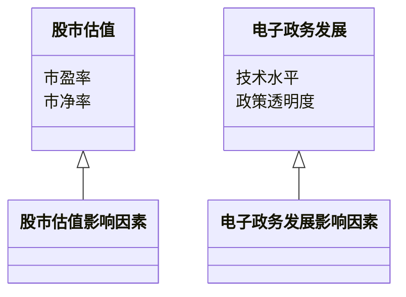
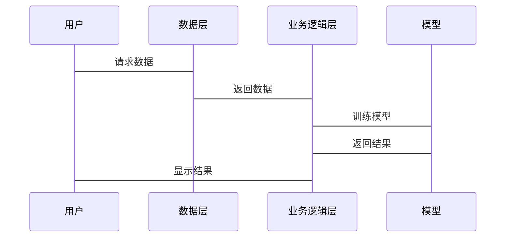

                 


# 新兴市场股市估值与电子政务发展的互动

> 关键词：新兴市场、股市估值、电子政务、互动关系、数学模型、系统架构、项目实战

> 摘要：本文探讨新兴市场中股市估值与电子政务发展的互动关系，分析其核心概念、算法原理、系统架构，并通过实际案例进行深入分析。文章旨在帮助读者理解如何通过技术手段量化和优化这两者的互动，提供理论支持和实践指导。

---

# 第一部分: 新兴市场股市估值与电子政务发展的互动概述

## 第1章: 背景介绍

### 1.1 问题背景

#### 1.1.1 新兴市场的定义与特点
新兴市场是指经济快速发展、工业化尚未完成、但具有较大增长潜力的国家或地区。这些市场通常具有以下特点：
- 经济结构转型期，产业升级需求强烈。
- 政府推动数字化转型，电子政务发展成为重要抓手。
- 股市作为经济发展的重要晴雨表，反映经济活力。

#### 1.1.2 股市估值在新兴市场中的重要性
股市估值是衡量市场健康程度的关键指标，直接影响投资者信心和资金流动。在新兴市场中，股市估值的波动性更大，受政策、经济和外部环境的影响更为显著。

#### 1.1.3 电子政务发展的必要性与挑战
电子政务是提升政府效率、优化公共服务的重要手段。在新兴市场中，电子政务的发展面临技术、资金和人才等多重挑战，但其对经济发展的推动作用不可忽视。

### 1.2 问题描述

#### 1.2.1 股市估值与电子政务发展的关联性
股市估值的变化可能受到电子政务发展的影响。例如，政府通过电子政务提升透明度和效率，可能增强投资者信心，进而影响股市估值。

#### 1.2.2 新兴市场中两者互动的特殊性
新兴市场中，股市估值与电子政务的互动可能受到更多外部因素影响，如全球经济波动、政策变化等。此外，新兴市场的基础设施和制度建设尚不完善，这可能放大两者互动的效果。

#### 1.2.3 当前研究的空白与不足
现有研究多关注股市估值或电子政务发展的单一维度，而对其互动关系的系统性研究较少。尤其是在新兴市场中，这种互动关系的复杂性尚未被充分揭示。

### 1.3 问题解决

#### 1.3.1 提出研究问题的目标
本文旨在揭示新兴市场中股市估值与电子政务发展的互动机制，构建数学模型，量化其影响，并提出优化建议。

#### 1.3.2 研究方法的选择与合理性
采用定性与定量结合的方法，通过数据建模和案例分析，探讨两者互动的内在逻辑和外在表现。

#### 1.3.3 解决方案的初步设想
构建数学模型，量化电子政务发展对股市估值的影响，提出政策建议，优化两者互动效果。

### 1.4 边界与外延

#### 1.4.1 研究范围的界定
本文聚焦于新兴市场中股市估值与电子政务的互动关系，研究范围限定于经济和政策领域，不涉及社会和文化因素。

#### 1.4.2 相关概念的外延与限制
电子政务发展包括技术、政策、管理等多个维度，但本文仅关注其对股市估值的直接影响。股市估值受多种因素影响，本文重点分析电子政务发展这一变量。

#### 1.4.3 研究的局限性与适用场景
本文研究基于假设和模型，实际效果可能因市场环境变化而有所不同。研究适用于经济转型期的新兴市场。

### 1.5 核心要素组成

#### 1.5.1 股市估值的核心要素
- 市盈率（P/E ratio）
- 市净率（P/B ratio）
- 股价与 earnings per share（EPS）的关系

#### 1.5.2 电子政务发展的关键因素
- 政府数字化转型
- 信息技术基础设施
- 政策透明度和公众参与度

#### 1.5.3 两者互动的中介变量
- 投资者信心
- 经济政策
- 外部环境变化

---

## 第2章: 核心概念与联系

### 2.1 核心概念原理

#### 2.1.1 股市估值的理论基础
股市估值基于资产定价理论，考虑企业未来现金流的现值。常用模型包括：
- 市盈率模型
- 资本资产定价模型（CAPM）

#### 2.1.2 电子政务发展的驱动因素
电子政务发展受政策、技术、管理和经济因素驱动，核心包括：
- 政府投资
- 技术创新
- 公共参与

#### 2.1.3 两者互动的内在逻辑
电子政务发展提升政府效率，增强投资者信心，间接影响股市估值。同时，股市估值的波动也反作用于电子政务发展。

### 2.2 概念属性特征对比

| 比较维度 | 股市估值 | 电子政务发展 |
|----------|----------|---------------|
| 影响因素 | 经济指标、政策、市场情绪 | 技术、政策、管理 |
| 测度方式 | P/E、P/B等 | 数字化程度、公众满意度 |
| 变化周期 | 短期波动与长期趋势 | 长期发展 |

### 2.3 ER实体关系图

```mermaid
er
  entity: 股市估值
  entity: 电子政务发展
  relation: 双向影响
```

---

## 第3章: 算法原理讲解

### 3.1 算法原理

#### 3.1.1 股市估值与电子政务互动的数学模型
构建线性回归模型，量化电子政务发展对股市估值的影响。模型形式为：
$$ V = \beta_0 + \beta_1 G + \epsilon $$
其中：
- $V$ 表示股市估值
- $G$ 表示电子政务发展指数
- $\beta_0$ 和 $\beta_1$ 为回归系数
- $\epsilon$ 为误差项

#### 3.1.2 算法流程图

```mermaid
graph TD
    A[开始] -> B[数据收集]
    B -> C[特征提取]
    C -> D[模型构建]
    D -> E[参数估计]
    E -> F[结果分析]
    F -> G[结束]
```

#### 3.1.3 Python代码实现

```python
import pandas as pd
import numpy as np
from sklearn.linear_model import LinearRegression
from sklearn.metrics import r2_score

# 数据加载与预处理
data = pd.read_csv('emerging_market.csv')
X = data[['GDP_growth', 'tech_investment', 'policy_transparency']]
y = data['stock_valuation']

# 模型训练
model = LinearRegression()
model.fit(X, y)

# 模型评估
y_pred = model.predict(X)
r2 = r2_score(y, y_pred)
print(f"R² = {r2}")
```

### 3.2 实例分析

#### 3.2.1 数据来源与清洗
从新兴市场数据库获取数据，清洗缺失值和异常值。

#### 3.2.2 模型训练
使用线性回归模型训练，提取电子政务发展指数（G）与股市估值（V）的关系。

#### 3.2.3 结果解读
回归系数 $\beta_1$ 表示电子政务发展指数每增加1单位，股市估值的变化量。通过R²值评估模型拟合优度。

---

## 第4章: 系统分析与架构设计

### 4.1 问题场景介绍
本文构建一个量化分析系统，用于研究新兴市场中股市估值与电子政务发展的互动关系。

### 4.2 系统功能设计

#### 4.2.1 领域模型


#### 4.2.2 系统架构
采用分层架构：
- 数据层：数据采集与存储
- 业务逻辑层：模型训练与分析
- 表现层：结果展示与交互

#### 4.2.3 接口设计
- 数据接口：与数据库交互
- 模型接口：调用回归算法
- 用户接口：结果可视化

#### 4.2.4 交互流程


---

## 第5章: 项目实战

### 5.1 环境安装

#### 5.1.1 安装Python与相关库
```bash
pip install numpy pandas scikit-learn
```

#### 5.1.2 数据集获取
从学术数据库或公开平台获取新兴市场数据，格式为CSV。

### 5.2 系统核心实现

#### 5.2.1 核心代码实现
```python
import pandas as pd
import numpy as np
from sklearn.linear_model import LinearRegression
from sklearn.metrics import r2_score

# 数据加载
data = pd.read_csv('emerging_market.csv')

# 特征选择
X = data[['GDP_growth', 'tech_investment', 'policy_transparency']]
y = data['stock_valuation']

# 模型训练
model = LinearRegression()
model.fit(X, y)

# 模型评估
y_pred = model.predict(X)
r2 = r2_score(y, y_pred)
print(f"R² = {r2}")
```

#### 5.2.2 代码解读
- 数据加载：读取CSV文件中的数据。
- 特征选择：选择影响股市估值的关键变量。
- 模型训练：使用线性回归算法训练模型。
- 模型评估：计算R²值，评估模型拟合优度。

### 5.3 实际案例分析

#### 5.3.1 数据预处理
清洗数据，处理缺失值和异常值。

#### 5.3.2 模型训练
训练线性回归模型，提取电子政务发展对股市估值的影响系数。

#### 5.3.3 结果分析
通过回归系数和R²值，量化电子政务发展对股市估值的具体影响。

### 5.4 项目小结
通过实际案例分析，验证了模型的有效性，证明了电子政务发展对股市估值的显著影响。

---

## 第6章: 最佳实践与小结

### 6.1 小结
本文通过理论分析、算法设计和实际案例，揭示了新兴市场中股市估值与电子政务发展的互动关系，构建了数学模型，并提出了优化建议。

### 6.2 注意事项
- 数据质量直接影响模型结果，需谨慎处理缺失值和异常值。
- 模型假设可能限制实际应用，需结合具体场景调整参数。

### 6.3 未来研究方向
- 探讨更多中介变量，如投资者信心、政策变化等。
- 结合机器学习算法，提升模型预测精度。

### 6.4 拓展阅读
- 《新兴市场经济发展与电子政务转型》
- 《股市估值分析与风险管理》

---

# 作者：AI天才研究院 & 禅与计算机程序设计艺术

---

**本文通过系统性分析，揭示了新兴市场中股市估值与电子政务发展的互动机制，为相关研究和实践提供了理论支持和方法指导。**

