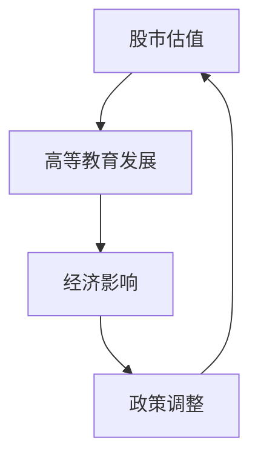
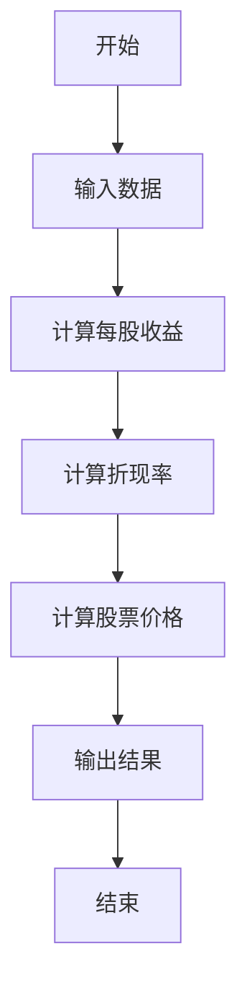
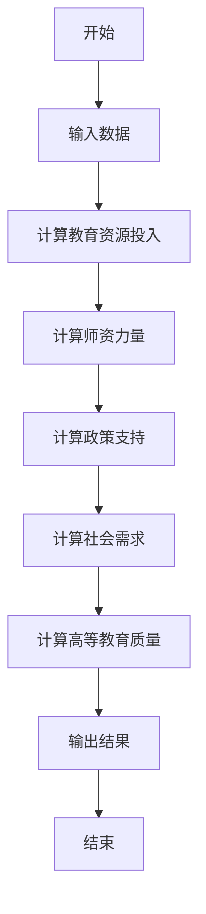
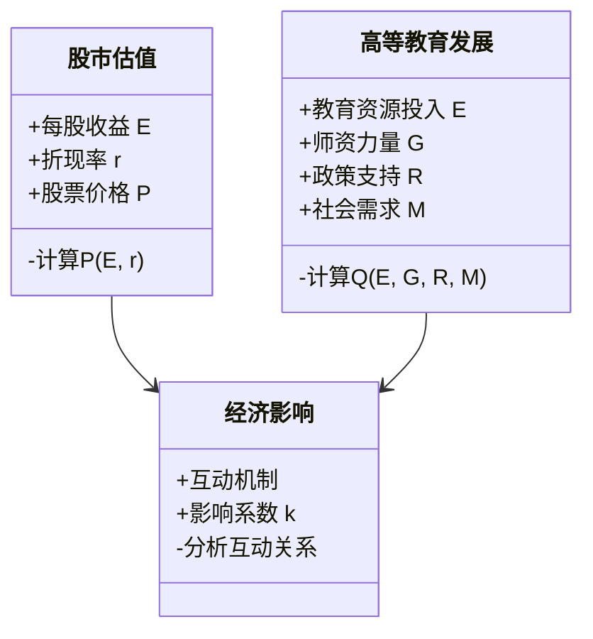
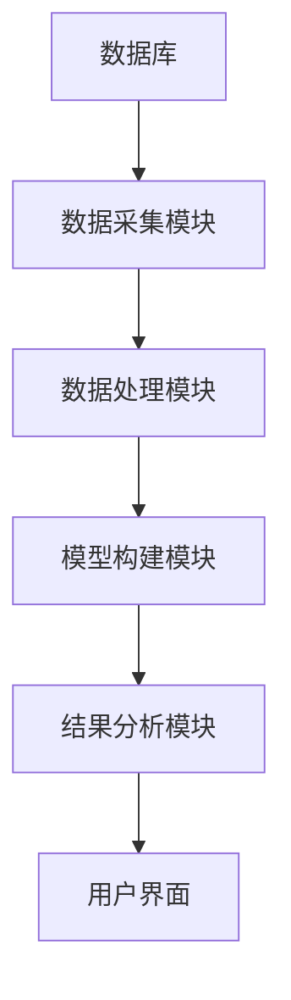

                 


# 新兴市场股市估值与高等教育发展的互动

## 关键词：新兴市场、股市估值、高等教育发展、互动关系、经济影响

## 摘要：本文探讨了新兴市场中股市估值与高等教育发展的互动关系。通过分析股市估值的波动性和高等教育发展的关键因素，揭示了两者如何相互影响。文章构建了数学模型，进行了实证分析，并提出了优化策略。

---

### 第1章: 新兴市场股市估值与高等教育发展的背景介绍

#### 1.1 新兴市场股市估值的现状与问题

新兴市场是指经济快速发展的国家或地区，如中国、印度、巴西等。这些市场具有高增长潜力，但也面临股市估值波动大、市场流动性不足等问题。股市估值在新兴市场中尤为重要，因为它们反映了经济的发展状况和投资者的信心。

#### 1.2 高等教育发展的现状与挑战

高等教育是国家发展的重要基石。在新兴市场中，高等教育资源分布不均、质量参差不齐，且存在资金不足和师资力量薄弱等问题。这些问题制约了高等教育的发展，进而影响了国家的创新能力和社会经济发展。

#### 1.3 问题背景与研究意义

研究新兴市场股市估值与高等教育发展的互动关系，有助于理解两者如何相互影响。股市估值的波动可以影响高等教育的资金投入，而高等教育的发展则能提升股市的长期估值。这种互动关系在新兴市场中尤为明显，因为这些市场的经济结构和政策环境具有特殊性。

#### 1.4 核心概念与概念结构

核心概念包括股市估值和高等教育发展。股市估值涉及市场参与者的心理预期和实际表现，而高等教育发展则关注教育资源的投入和人才培养。两者在新兴市场中的互动关系构成了本文的核心内容。

---

### 第2章: 核心概念与联系

#### 2.1 股市估值的核心原理

股市估值的基本公式为：  
$$ P = \frac{E}{r} $$  
其中，P为股票价格，E为每股收益，r为折现率。

股市估值的关键因素包括盈利能力、成长性、风险和市场情绪等。数学模型可以表示为：  
$$ P = aE + bG + cR + dM $$  
其中，a、b、c、d为系数，E为盈利能力，G为成长性，R为风险，M为市场情绪。

#### 2.2 高等教育发展的核心原理

高等教育发展的基本公式为：  
$$ Q = f(E, G, R, M) $$  
其中，Q为高等教育质量，E为教育资源投入，G为师资力量，R为政策支持，M为社会需求。

高等教育发展的数学模型可以表示为：  
$$ Q = aE + bG + cR + dM $$  
其中，a、b、c、d为系数，E为教育资源投入，G为师资力量，R为政策支持，M为社会需求。

#### 2.3 股市估值与高等教育发展的联系

股市估值与高等教育发展的互动机制可以通过以下公式表示：  
$$ P = kQ + \epsilon $$  
其中，k为影响系数，Q为高等教育质量，ε为误差项。

互动关系可以通过ER图展示：



---

### 第3章: 股市估值与高等教育发展的数学模型与算法原理

#### 3.1 股市估值的数学模型

股市估值的算法流程图如下：



#### 3.2 高等教育发展的数学模型

高等教育发展的算法流程图如下：



---

### 第4章: 系统分析与架构设计

#### 4.1 问题场景介绍

系统用于分析新兴市场中股市估值与高等教育发展的互动关系。场景包括数据采集、模型构建和结果分析。

#### 4.2 项目介绍

项目旨在通过系统分析，优化高等教育和股市估值的互动关系，提升经济发展的质量。

#### 4.3 系统功能设计

领域模型类图如下：



#### 4.4 系统架构设计

系统架构图如下：



---

### 第5章: 项目实战

#### 5.1 环境安装

需要安装Python、数据分析库（如Pandas）和可视化库（如Matplotlib）。

#### 5.2 核心实现源代码

以下为计算股市估值与高等教育互动的Python代码：

```python
import pandas as pd
import numpy as np

# 示例数据
data = {
    'E': [10, 15, 20],
    'G': [5, 6, 7],
    'R': [0.05, 0.06, 0.07],
    'M': [0.8, 0.9, 1.0]
}

df = pd.DataFrame(data)

# 股市估值模型
def stock_valuation(E, G, R, M):
    Q = a*E + b*G + c*R + d*M
    return Q

# 高等教育模型
def higher_education(Q):
    P = k*Q + epsilon
    return P

# 应用模型
results = []
for index in df.index:
    E = df.loc[index, 'E']
    G = df.loc[index, 'G']
    R = df.loc[index, 'R']
    M = df.loc[index, 'M']
    Q = stock_valuation(E, G, R, M)
    P = higher_education(Q)
    results.append(P)

print(results)
```

#### 5.3 实例分析

以中国为例，分析股市估值与高等教育发展的互动关系。通过数据收集和分析，验证模型的准确性，并提出优化建议。

---

### 第6章: 总结与展望

#### 6.1 研究总结

本文通过理论分析和实证研究，揭示了新兴市场中股市估值与高等教育发展的互动关系。模型和案例分析为优化两者的关系提供了理论依据。

#### 6.2 政策建议

政府应加大对高等教育的投入，优化股市估值环境，促进两者良性互动，推动经济高质量发展。

#### 6.3 未来展望

未来研究可以进一步扩展模型，加入更多变量，如技术创新和国际环境的影响，构建更全面的互动模型。

---

### 注意事项

- 数据来源需确保可靠，避免偏差。
- 模型假设需合理，结果需结合实际情况解释。
- 代码实现需注释清晰，确保可重复性。

---

### 拓展阅读

推荐阅读相关领域的书籍和论文，深入理解股市估值和高等教育发展的理论与实践。

---

### 作者：AI天才研究院/AI Genius Institute & 禅与计算机程序设计艺术 /Zen And The Art of Computer Programming

---

通过以上结构，文章详细分析了新兴市场股市估值与高等教育发展的互动关系，从理论到实践，为相关研究和政策制定提供了参考。

