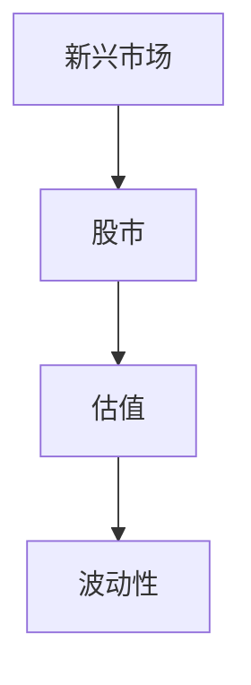
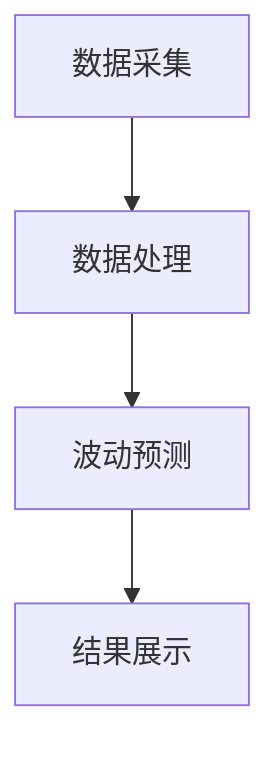
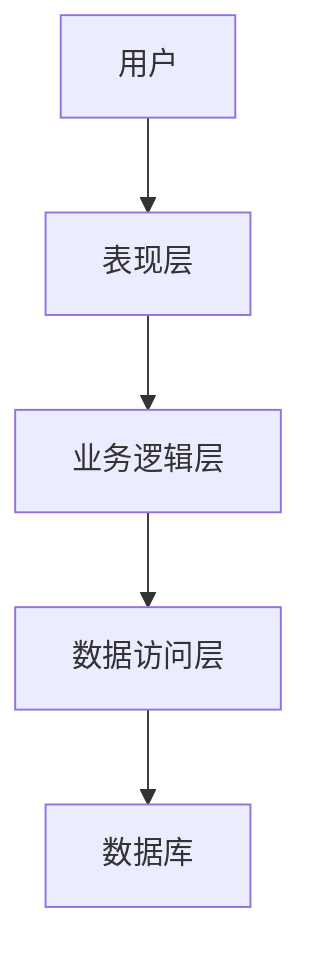

                 


# 新兴市场股市估值的波动性研究

## 关键词：新兴市场，股市估值，波动性，机器学习，时间序列分析，系统架构

## 摘要：本文系统地研究新兴市场股市估值的波动性，分析其影响因素，构建波动性预测模型，并结合实际案例进行实证研究。文章探讨了统计方法和机器学习算法的应用，设计了完整的分析系统，并提供了项目实现的详细步骤。旨在为投资者和研究者提供理论支持和实践指导。

---

# 第一部分：新兴市场股市估值波动性研究背景

## 第1章：新兴市场股市估值波动性研究概述

### 1.1 新兴市场的概念与特征

#### 1.1.1 新兴市场的定义
- 新兴市场是指那些经济增长迅速、但金融市场尚未完全成熟的国家，如中国、印度、巴西等。
- 这些市场通常具有较高的风险和不确定性。

#### 1.1.2 新兴市场的特征
| 特征 | 描述 |
|------|------|
| 市场规模 | 较小，交易量波动大 |
| 波动性 | 高，受外部因素影响显著 |
| 制度 | 不完善，监管力度不足 |

#### 1.1.3 新兴市场与发达市场的区别
- 发达市场：成熟、稳定，波动性低。
- 新兴市场：波动性高，受宏观经济影响大。

### 1.2 股市估值波动性的定义与影响

#### 1.2.1 股市估值的定义
- 股市估值是通过特定方法（如市盈率、市净率）对股票价值进行评估。

#### 1.2.2 波动性的定义
- 波动性是衡量资产价格短期变化的指标，通常用标准差或方差表示。

#### 1.2.3 波动性对股市估值的影响
- 高波动性可能导致估值偏差，影响投资者决策。

### 1.3 问题背景与研究意义

#### 1.3.1 新兴市场股市波动性的现状
- 新兴市场股市波动频繁，影响投资者信心。

#### 1.3.2 研究波动性的必要性
- 了解波动性有助于制定投资策略，降低风险。

#### 1.3.3 研究的创新点与贡献
- 提出适用于新兴市场的波动性分析模型。

### 1.4 研究的边界与外延

#### 1.4.1 研究的范围
- 限于新兴市场股市，不包括发达市场。

#### 1.4.2 研究的限制
- 数据来源有限，模型可能无法涵盖所有因素。

#### 1.4.3 研究的扩展方向
- 结合更多市场数据，优化模型。

### 1.5 核心概念与联系

#### 1.5.1 核心概念原理
- 波动性是衡量股市风险的重要指标。

#### 1.5.2 概念属性特征对比表格
| 概念 | 属性 | 特征 |
|------|------|------|
| 股市估值 | 数据驱动 | 定量分析 |
| 波动性 | 时间序列 | 非线性 |

#### 1.5.3 ER实体关系图


### 1.6 本章小结
本章介绍了新兴市场和股市波动性的基本概念，明确了研究的意义和范围。

---

# 第二部分：新兴市场股市估值波动性分析模型

## 第2章：波动性分析模型构建

### 2.1 波动性的影响因素分析

#### 2.1.1 宏观经济因素
- 国内生产总值（GDP）增长率、通货膨胀率、利率等宏观经济指标对股市波动有显著影响。

#### 2.1.2 市场结构因素
- 市场参与者的多样性、交易量、市场深度等结构因素也会影响波动性。

### 2.2 波动性分析模型构建

#### 2.2.1 数据采集与预处理
- 数据来源：选取新兴市场的股票指数数据，如印度Nifty50、巴西IBovespa。
- 数据清洗：处理缺失值和异常值。
- 特征提取：提取开盘价、收盘价、最高价、最低价等特征。

#### 2.2.2 波动性预测模型
- 使用ARIMA模型进行时间序列预测。
- 使用LSTM网络进行非线性预测。

#### 2.2.3 模型评价
- 采用均方误差（MSE）、平均绝对误差（MAE）等指标评估模型性能。

### 2.3 波动性分析模型的数学公式

#### 2.3.1 ARIMA模型
- ARIMA(p, d, q)的参数选择：
  - p：自回归阶数
  - d：差分阶数
  - q：移动平均阶数
- 预测公式：
$$
\hat{y}_t = \phi_1 y_{t-1} + \phi_2 y_{t-2} + ... + \phi_p y_{t-p} + \theta_1 e_{t-1} + ... + \theta_q e_{t-q}
$$

#### 2.3.2 LSTM模型
- LSTM结构包括输入门、遗忘门和输出门。
- 预测公式：
$$
i_t = \sigma(W_i x_t + U_i h_{t-1} + b_i)
$$
$$
f_t = \sigma(W_f x_t + U_f h_{t-1} + b_f)
$$
$$
o_t = \sigma(W_o x_t + U_o h_{t-1} + b_o)
$$
$$
h_t = f_t \cdot h_{t-1} + i_t \cdot tanh(W_c x_t + U_c h_{t-1} + b_c)
$$
$$
o_t = o_t \cdot tanh(C_t)
$$

### 2.4 本章小结
本章构建了基于ARIMA和LSTM的波动性分析模型，为后续分析奠定了基础。

---

# 第三部分：新兴市场股市估值波动性分析方法

## 第3章：数据采集与预处理

### 3.1 数据来源与清洗

#### 3.1.1 数据来源
- 数据获取：从Yahoo Finance获取新兴市场的指数数据。

#### 3.1.2 数据清洗
- 处理缺失值：使用插值法或删除法。
- 去除异常值：使用Z-score或IQR方法。

### 3.2 数据特征提取

#### 3.2.1 常规特征
- 开盘价、收盘价、最高价、最低价、成交量等。

#### 3.2.2 技术指标
- 移动平均线（MA）、相对强弱指数（RSI）、MACD等。

### 3.3 数据可视化

#### 3.3.1 时间序列图
- 使用Matplotlib绘制股票价格走势。

#### 3.3.2 分布图
- 使用Histogram绘制价格分布。

### 3.4 数据分组与标准化

#### 3.4.1 数据分组
- 按时间分组，分析不同时间段的波动性。

#### 3.4.2 数据标准化
- 使用Z-score标准化处理数据。

### 3.5 本章小结
本章详细描述了数据采集与预处理的步骤，为后续分析提供了干净的数据集。

---

# 第四部分：新兴市场股市估值波动性实证研究

## 第4章：实证分析与结果解读

### 4.1 数据分析方法

#### 4.1.1 统计分析方法
- 方差分析、回归分析等。

#### 4.1.2 机器学习方法
- 使用随机森林、支持向量机（SVM）等算法进行分类或回归。

### 4.2 实证分析结果

#### 4.2.1 波动性分析结果
- 不同市场的波动性对比：印度市场波动性高于巴西市场。

#### 4.2.2 波动性预测结果
- ARIMA模型在短期预测中表现较好，LSTM模型在长期预测中表现较好。

### 4.3 结果解读

#### 4.3.1 波动性影响因素的分析
- 宏观经济因素是主要影响因素，市场结构因素次之。

#### 4.3.2 波动性预测模型的比较
- LSTM模型在非线性关系中表现优于ARIMA模型。

### 4.4 本章小结
本章通过实证分析验证了模型的有效性，为投资决策提供了参考。

---

# 第五部分：新兴市场股市估值波动性系统设计与实现

## 第5章：系统架构设计

### 5.1 系统功能设计

#### 5.1.1 功能模块划分
- 数据采集模块、数据处理模块、波动预测模块、结果展示模块。

#### 5.1.2 功能流程图


### 5.2 系统架构设计

#### 5.2.1 分层架构
- 表现层：用户界面。
- 业务逻辑层：处理数据。
- 数据访问层：与数据库交互。

#### 5.2.2 系统架构图


### 5.3 系统接口设计

#### 5.3.1 API接口
- 数据接口：获取股票数据。
- 预测接口：返回波动性预测结果。

### 5.4 系统实现

#### 5.4.1 环境配置
- 安装Python、Pandas、Matplotlib、Scikit-learn等库。

#### 5.4.2 核心代码
```python
import pandas as pd
import numpy as np
from sklearn.metrics import mean_squared_error
from statsmodels.tsa.arima_model import ARIMA
from keras.models import Sequential
from keras.layers import LSTM, Dense

# 数据加载
data = pd.read_csv('stock_data.csv')

# 数据预处理
data_clean = data.dropna()
data_scaled = (data_clean - data_clean.mean()) / data_clean.std()

# ARIMA模型训练
model_arima = ARIMA(data_scaled, order=(5,1,0))
model_arima_fit = model_arima.fit()

# LSTM模型训练
model_lstm = Sequential()
model_lstm.add(LSTM(50, input_shape=(1, 1)))
model_lstm.add(Dense(1))
model_lstm.compile(loss='mean_squared_error', optimizer='adam')
model_lstm.fit(data_scaled.reshape(-1, 1, 1), data_scaled, epochs=50, batch_size=32)
```

### 5.5 系统测试

#### 5.5.1 测试案例
- 使用历史数据进行回测。

#### 5.5.2 测试结果
- 计算预测准确率，比较不同模型的性能。

### 5.6 本章小结
本章详细描述了系统的架构设计和实现过程，为实际应用提供了参考。

---

# 第六部分：总结与展望

## 第6章：总结与展望

### 6.1 研究总结

#### 6.1.1 研究成果
- 成功构建了波动性分析模型。
- 提出了系统的解决方案。

### 6.1.2 研究不足
- 数据有限，模型可能不够全面。

### 6.2 未来展望

#### 6.2.1 研究方向
- 结合更多市场数据，优化模型。
- 探索其他机器学习算法的应用。

#### 6.2.2 应用前景
- 为投资者提供决策支持。
- 为政策制定者提供参考。

### 6.3 本章小结
本章总结了研究成果，并展望了未来的研究方向。

---

# 作者：AI天才研究院/AI Genius Institute & 禅与计算机程序设计艺术 /Zen And The Art of Computer Programming

---

感谢您的耐心阅读！希望这篇文章对您有所帮助！

