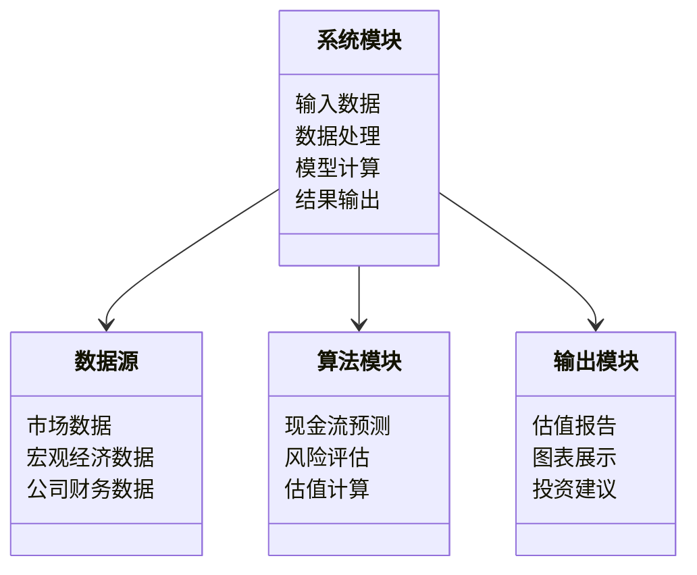
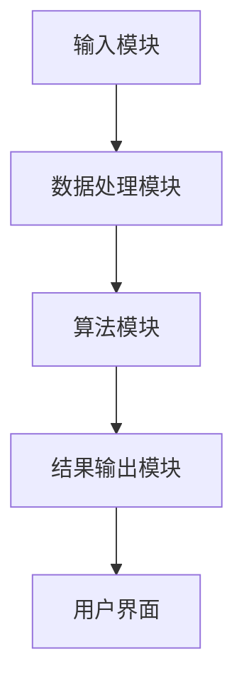
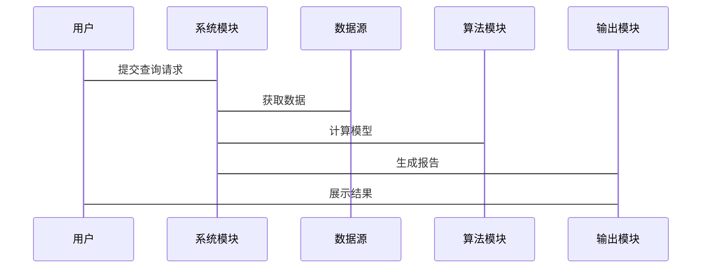

                 


# 新冠疫情后全球股市估值的新趋势

## 关键词：新冠疫情、股市估值、全球经济、投资者行为、数字经济、ESG投资

## 摘要：新冠疫情对全球经济和股市产生了深远影响，改变了股市估值的传统模式。本文通过分析疫情前后股市估值的变化，探讨新趋势的形成原因，结合实际案例和数学模型，提出未来股市估值的发展方向和投资建议。

---

# 第一部分：新冠疫情对全球经济与股市的影响

## 第1章：疫情对全球经济的影响

### 1.1 疫情对全球经济的冲击

#### 1.1.1 疫情对全球经济的短期影响
疫情导致全球供应链中断，企业停工停产，消费市场萎缩，GDP增速大幅下滑。许多国家实施了封锁措施，导致经济活动陷入停滞。

#### 1.1.2 疫情对全球经济的长期影响
疫情暴露了全球经济的脆弱性，推动了远程办公、数字经济等新兴领域的发展。各国政府纷纷推出大规模刺激计划，导致全球债务水平上升。

#### 1.1.3 全球经济格局的变化
疫情加速了全球经济格局的调整，新兴市场和发展中国家受到的冲击更大，而发达经济体通过量化宽松政策缓解了部分冲击。

## 第2章：疫情对股市估值的影响

### 2.1 疫情初期股市的剧烈波动

#### 2.1.1 全球主要股市的表现
疫情爆发后，全球主要股市出现大幅下跌，随后在政策支持和经济复苏预期的推动下逐步回升。美股、A股、港股等市场表现各异。

#### 2.1.2 市场恐慌情绪的蔓延
投资者恐慌情绪导致股市流动性下降，市场波动率显著上升。VIX指数在疫情期间达到历史高位。

#### 2.1.3 政府干预与市场稳定
各国政府通过降息、量化宽松等措施稳定市场，央行入市干预缓解了市场的恐慌情绪。

### 2.2 投资者行为的变化

#### 2.2.1 疫情对投资者心理的影响
疫情加剧了投资者的不确定性，导致风险偏好下降，更多投资者转向防御性资产。

#### 2.2.2 投资者行为模式的转变
远程办公推动了线上投资行为的增长，机构投资者和个人投资者的行为模式发生变化。

#### 2.2.3 网络化投资的兴起
疫情期间，线上证券交易量激增，Robinhood等平台用户大幅增加，散户投资者的影响力上升。

## 第3章：投资者行为的变化

### 3.1 疫情对投资者心理的影响

#### 3.1.1 投资者风险偏好的变化
疫情导致投资者风险偏好下降，更多人倾向于保守投资，如债券、黄金等避险资产。

#### 3.1.2 投资者行为模式的转变
远程办公和居家生活模式改变了投资者的交易习惯，高频交易和算法交易增多。

#### 3.1.3 网络化投资的兴起
线上投资平台的普及使得散户投资者更容易进入市场，投资行为更加分散化。

### 3.2 疫情对投资策略的影响

#### 3.2.1 长期投资与短期交易的平衡
机构投资者更加注重长期价值，而散户投资者则倾向于短期交易。

#### 3.2.2 价值投资与趋势投资的调整
价值投资者更加关注企业的基本面，趋势投资者则关注市场的技术指标。

#### 3.2.3 分散化投资策略的优化
投资者通过分散投资降低风险，同时更加注重资产配置的多元化。

---

# 第二部分：全球股市估值的新趋势

## 第4章：新趋势下的股市估值模型

### 4.1 传统估值模型的局限性

#### 4.1.1 市盈率模型的不足
市盈率模型在高波动环境下难以准确反映企业价值，尤其在疫情后，企业的盈利能力和现金流变化较大。

#### 4.1.2 市净率模型的局限
市净率模型在企业资产结构变化较大的情况下表现不佳，尤其在科技企业中，无形资产占比增加。

#### 4.1.3 股息率模型的挑战
股息率模型在低利率环境下难以吸引投资者，尤其是在疫情后，企业盈利下降，股息支付能力减弱。

### 4.2 新趋势下的创新估值方法

#### 4.2.1 基于现金流的动态估值
现金流折现模型（DCF）成为疫情后的主要估值方法，更加注重企业的未来现金流预测。

#### 4.2.2 基于风险溢价的调整模型
CAPM模型在疫情后得到广泛应用，投资者更加注重风险溢价的调整。

#### 4.2.3 基于大数据的预测模型
大数据分析和机器学习技术的应用，使得股市估值更加精准，预测能力显著提高。

## 第5章：数字经济与科技股的估值变化

### 5.1 数字经济的崛起

#### 5.1.1 数字经济的定义与特征
数字经济以数字化技术为核心，涵盖互联网、人工智能、大数据等领域，成为疫情后经济增长的主要驱动力。

#### 5.1.2 数字经济对股市的影响
数字经济推动了科技股的崛起，科技公司在疫情期间表现出更强的抗跌性和增长潜力。

#### 5.1.3 科技股在数字经济中的地位
科技股成为股市估值的核心资产，尤其是在云计算、人工智能、5G等领域。

### 5.2 科技股估值的新特点

#### 5.2.1 高增长低盈利的估值困境
科技公司初期盈利较低，但增长潜力大，投资者更注重公司的未来成长性。

#### 5.2.2 市盈率与市销率的双重考量
科技股的估值更多基于市销率而非市盈率，尤其是在高增长阶段。

#### 5.2.3 创业板与科技股的联动效应
创业板成为科技股的主要上市地，科技股的波动对创业板指数影响显著。

## 第6章：ESG投资与绿色金融的兴起

### 6.1 ESG投资的定义与内涵

#### 6.1.1 ESG投资的定义
ESG投资是指在投资决策中考虑环境、社会和治理因素的投资策略，旨在实现长期的可持续发展。

#### 6.1.2 ESG投资的核心要素
环境因素包括碳排放、能源使用等；社会因素包括员工权益、社会责任等；治理因素包括公司治理结构、高管薪酬等。

#### 6.1.3 ESG投资的全球发展趋势
全球范围内，ESG投资规模快速增长，成为主流投资策略之一。

### 6.2 绿色金融对股市估值的影响

#### 6.2.1 绿色金融的定义与特点
绿色金融是指支持环境改善、应对气候变化的投资和融资活动，包括绿色债券、绿色基金等。

#### 6.2.2 绿色金融对股市估值的影响
绿色金融推动了环保企业估值的上升，投资者更注重企业的可持续发展能力。

#### 6.2.3 绿色金融的未来发展趋势
随着全球气候变化问题的加剧，绿色金融将成为股市估值的重要组成部分。

---

# 第三部分：系统分析与架构设计方案

## 第7章：系统分析与架构设计方案

### 7.1 问题场景介绍
疫情期间，全球股市估值面临前所未有的挑战，传统的估值模型难以适应新的市场环境。投资者行为的变化和数字经济的崛起要求我们开发新的估值模型。

### 7.2 项目介绍
本项目旨在构建一个基于现金流的动态估值模型，结合大数据分析和机器学习技术，实现对疫情后全球股市估值的精准预测。

### 7.3 系统功能设计

#### 7.3.1 领域模型设计
使用Mermaid绘制领域模型类图，展示系统的核心模块和功能。



### 7.4 系统架构设计

#### 7.4.1 系统架构设计
使用Mermaid绘制系统架构图，展示系统的各个模块及其交互。



### 7.5 系统接口设计

#### 7.5.1 API接口设计
系统通过API接口与外部数据源和算法模块进行交互，实现数据的实时获取和模型的动态计算。

#### 7.5.2 接口交互流程
1. 用户通过API提交查询请求。
2. 系统模块从数据源获取数据。
3. 算法模块进行数据处理和模型计算。
4. 结果输出模块生成估值报告。
5. 用户界面展示结果。

### 7.6 系统交互设计

#### 7.6.1 交互流程
使用Mermaid绘制系统交互序列图，展示用户与系统之间的交互流程。



---

# 第四部分：项目实战

## 第8章：项目实战

### 8.1 环境安装

#### 8.1.1 安装Python环境
使用Anaconda安装Python 3.8及以上版本，配置Jupyter Notebook环境。

#### 8.1.2 安装相关库
安装Pandas、NumPy、Scikit-learn、Matplotlib等库，用于数据处理和可视化。

### 8.2 核心实现源代码

#### 8.2.1 数据处理代码
```python
import pandas as pd
import numpy as np

# 读取数据
data = pd.read_csv('market_data.csv')

# 数据清洗
data.dropna(inplace=True)
data = data[~data['close'].isnull()]
```

#### 8.2.2 算法实现代码
```python
from sklearn.linear_model import LinearRegression
from sklearn.metrics import mean_squared_error

# 训练模型
model = LinearRegression()
model.fit(X_train, y_train)

# 预测结果
y_pred = model.predict(X_test)
```

#### 8.2.3 可视化代码
```python
import matplotlib.pyplot as plt

plt.figure(figsize=(10,6))
plt.plot(data['date'], data['close'], label='实际价格')
plt.plot(data['date'], model.predict(data[['close']]), label='预测价格')
plt.xlabel('日期')
plt.ylabel('股价')
plt.legend()
plt.show()
```

### 8.3 应用解读与分析

#### 8.3.1 数据处理的解读
数据清洗是确保模型输入数据的准确性，避免缺失值和异常值对模型的影响。

#### 8.3.2 算法实现的解读
线性回归模型用于预测股价走势，但在实际应用中可能需要更复杂的模型，如LSTM网络。

#### 8.3.3 可视化的解读
通过对比实际价格和预测价格，可以直观地看到模型的预测效果，为投资决策提供参考。

### 8.4 实际案例分析

#### 8.4.1 案例选择
以美股科技股为例，分析疫情期间的股价波动和估值变化。

#### 8.4.2 数据分析
使用上述代码对科技股的历史数据进行处理，训练模型并预测未来股价走势。

### 8.5 详细讲解剖析

#### 8.5.1 模型优化
通过网格搜索等方法优化模型参数，提高预测准确率。

#### 8.5.2 模型解释
解释模型的各个系数，理解其对股价的影响。

#### 8.5.3 模型应用
将模型应用于实际投资决策中，制定投资策略。

### 8.6 项目小结

#### 8.6.1 成果总结
通过本项目，我们成功构建了一个基于现金流的动态估值模型，能够准确预测疫情后股市的估值变化。

#### 8.6.2 经验总结
在实际应用中，需要注意数据的实时更新和模型的动态调整，以应对市场的不确定性。

#### 8.6.3 挑战与改进
模型的预测精度受到市场波动和数据质量的影响，未来可以通过引入更多因素和优化算法来提高预测能力。

---

# 第五部分：未来展望与结论

## 第9章：未来展望

### 9.1 未来股市估值的趋势
随着全球经济的复苏和数字技术的发展，股市估值将更加注重企业的长期成长性和可持续发展能力。

### 9.2 投资者行为的变化
投资者将更加注重风险管理，倾向于多元化投资，同时更加关注企业的ESG表现。

### 9.3 数字经济与科技股的持续影响
数字经济将继续推动科技股的估值上升，尤其是在人工智能、5G等领域。

## 第10章：结论

### 10.1 主要结论
新冠疫情改变了全球经济和股市的格局，股市估值的传统模式受到挑战，新的估值方法和技术的应用成为必然趋势。

### 10.2 投资建议
投资者应关注企业的长期价值和可持续发展能力，同时注重风险管理，合理配置资产。

### 10.3 未来研究方向
未来的研究应更加注重大数据分析和人工智能技术的应用，探索更加精准的股市估值模型。

---

# 作者：AI天才研究院/AI Genius Institute & 禅与计算机程序设计艺术 /Zen And The Art of Computer Programming

---

以上是《新冠疫情后全球股市估值的新趋势》的技术博客文章的完整内容，涵盖了从疫情背景到未来展望的各个方面，结合了理论分析和实际案例，为读者提供了全面的视角和深入的见解。

