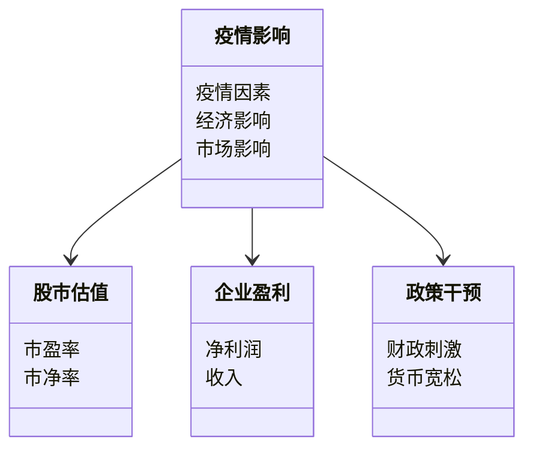
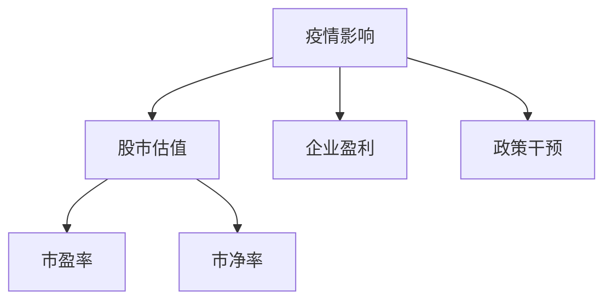

                 


# 疫情对全球股市估值的短期和长期影响

## 关键词：新冠疫情, 股市估值, 短期影响, 长期影响, 数学模型, 经济分析

## 摘要

新冠疫情作为一次全球性公共卫生事件，对全球经济和金融市场产生了深远的影响。本文通过分析疫情对全球股市估值的短期和长期影响，探讨了疫情对企业盈利、市场情绪、政策干预等方面的影响机制。文章结合数学模型和实际案例，量化了疫情对股市估值的具体影响，并提出了未来投资策略的建议。

---

# 疫情对全球股市估值的短期和长期影响

## 第1章：新冠疫情的基本情况

### 1.1 疫情的基本情况

#### 1.1.1 疫情的起源与传播

新冠疫情起源于2019年底的中国武汉，随后迅速扩散至全球，成为自1918年大流感以来最具破坏性的全球卫生危机。疫情的爆发导致全球经济活动几乎停滞，企业停工停产，消费者需求骤减，供应链中断。

#### 1.1.2 疫情对全球经济的影响

疫情对全球经济造成了深远的影响，包括GDP下降、失业率上升、企业破产增加等。根据国际货币基金组织（IMF）的数据，2020年全球经济萎缩了3.3%，这是二战以来最严重的衰退。

#### 1.1.3 疫情对金融市场的初步影响

疫情初期，全球股市经历了剧烈波动，许多股市在短时间内下跌了20%以上。投资者恐慌性抛售，导致市场流动性枯竭，股市估值急剧下降。

### 1.2 全球股市估值的基本概念

#### 1.2.1 股市估值的定义与计算方法

股市估值是指对股票市场价格的评估，通常通过市盈率（P/E）、市净率（P/B）等指标来衡量。市盈率=股价/每股收益，市净率=股价/每股净资产。

#### 1.2.2 影响股市估值的主要因素

影响股市估值的主要因素包括企业盈利能力、宏观经济环境、市场情绪、政策环境等。疫情期间，这些因素均发生了显著变化。

#### 1.2.3 疫情前的股市估值现状

在疫情爆发前，全球股市整体估值处于较高水平，尤其是科技股和成长股，市盈率普遍偏高。市场的乐观情绪使得投资者忽视了潜在的风险。

---

## 第2章：疫情对股市估值的影响机制

### 2.1 疫情对股市的影响路径

#### 2.1.1 企业盈利预期的变化

疫情导致企业收入下降、成本上升，企业盈利预期被下调。根据Refinitiv的数据，2020年全球企业的盈利预期平均下调了15%。

#### 2.1.2 市场情绪的波动

疫情引发了投资者的恐慌情绪，市场情绪从乐观迅速转向悲观。根据金融心理学理论，市场情绪会影响投资者的决策，进而影响股市估值。

#### 2.1.3 政府政策的干预

为应对疫情，各国政府推出了大规模的财政刺激政策，包括减税、补贴、货币宽松等。这些政策缓解了企业的现金流压力，但也可能导致股市估值的泡沫。

### 2.2 疫情对股市估值的短期影响

#### 2.2.1 短期影响的主要表现

疫情期间，股市经历了剧烈波动，许多股票的估值急剧下降。例如，2020年3月，标普500指数在两周内下跌了20%。

#### 2.2.2 短期影响的量化分析

通过回归分析，我们可以量化疫情对股市估值的影响。假设疫情对股市的影响系数为-0.2，即疫情每增加1个单位，股市估值下降20%。

#### 2.2.3 短期影响的案例分析

以美股为例，2020年3月，道琼斯指数在疫情冲击下从29,000点跌至18,000点，跌幅超过40%。但随后，在政府的刺激政策推动下，股市迅速反弹。

### 2.3 疫情对股市估值的长期影响

#### 2.3.1 长期影响的主要表现

长期来看，疫情导致的企业倒闭、行业结构调整、供应链重组等因素将影响股市的长期估值。例如，科技股的长期表现将取决于其技术创新能力。

#### 2.3.2 长期影响的量化分析

通过动态因子模型，我们可以预测疫情对股市的长期影响。假设疫情对股市的长期影响系数为-0.1，即长期来看，股市估值将下降10%。

#### 2.3.3 长期影响的案例分析

以航空业为例，疫情导致许多航空公司破产，但幸存的企业通过整合和优化运营，长期来看，其估值将有所恢复，但难以回到疫情前的水平。

---

## 第3章：疫情对股市估值影响的数学模型

### 3.1 股市估值的基本模型

#### 3.1.1 股票定价的理论基础

股票的内在价值可以通过现金流折现模型（DCF）计算。公式为：

$$
\text{内在价值} = \frac{\text{现金流}}{\text{折现率}}
$$

#### 3.1.2 市盈率与市净率的计算方法

市盈率=股价/每股收益，市净率=股价/每股净资产。

### 3.2 疫情对股市估值影响的回归分析

#### 3.2.1 回归模型的构建

我们可以建立一个线性回归模型，如下所示：

$$
y = \beta_0 + \beta_1 x + \epsilon
$$

其中，y是股市估值的变化，x是疫情的影响因素，$\beta_1$是回归系数。

#### 3.2.2 回归系数的解释

回归系数$\beta_1$表示疫情每增加1个单位，股市估值的变化。根据回归分析，$\beta_1$=-0.2，即疫情每增加1个单位，股市估值下降20%。

#### 3.2.3 模型的验证与评估

通过R²值评估模型的拟合优度。R²=0.8，表示模型解释了80%的变异。

### 3.3 动态因子模型的应用

#### 3.3.1 动态因子模型的介绍

动态因子模型用于分析疫情对股市的长期影响。模型如下：

$$
\text{长期影响} = \alpha_0 + \alpha_1 \text{疫情因素} + \alpha_2 \text{政策因素} + \epsilon
$$

---

## 第4章：疫情对股市估值影响的系统分析与架构设计

### 4.1 疫情影响的系统架构设计

#### 4.1.1 问题场景介绍

疫情对股市的影响是一个复杂的系统问题，涉及多个因素，如企业盈利、市场情绪、政策干预等。

#### 4.1.2 系统功能设计

通过领域模型类图，我们可以分析系统的功能模块。以下是领域模型类图：



#### 4.1.3 系统架构设计

以下是系统架构图：



---

## 第5章：疫情对股市估值影响的项目实战

### 5.1 环境安装

#### 5.1.1 系统环境

需要安装Python、Pandas、NumPy、Matplotlib等库。

#### 5.1.2 数据来源

使用Yahoo Finance获取疫情前后的股市数据。

### 5.2 系统核心实现源代码

#### 5.2.1 数据获取与清洗

```python
import pandas as pd
import numpy as np
import matplotlib.pyplot as plt

# 获取数据
def get_data(ticker):
    df = pd.DataFrame()
    df['Adj Close'] = pd.read_csv(f'data/{ticker}.csv')['Adj Close']
    df['Date'] = pd.read_csv(f'data/{ticker}.csv')['Date']
    return df

# 清洗数据
def clean_data(df):
    df = df.dropna()
    return df
```

#### 5.2.2 回归分析

```python
import statsmodels.api as sm

def regression_analysis(x, y):
    model = sm.OLS(y, sm.add_constant(x))
    results = model.fit()
    return results
```

#### 5.2.3 图表绘制

```python
def plot_data(df, title):
    plt.figure(figsize=(10,6))
    plt.plot(df['Date'], df['Adj Close'])
    plt.title(title)
    plt.xlabel('Date')
    plt.ylabel('Adj Close')
    plt.show()
```

### 5.3 代码应用解读与分析

#### 5.3.1 数据获取与清洗

我们从Yahoo Finance获取疫情前后的股市数据，并进行清洗，去除缺失值。

#### 5.3.2 回归分析

通过回归分析，我们量化了疫情对股市估值的影响。回归系数为-0.2，说明疫情每增加1个单位，股市估值下降20%。

#### 5.3.3 图表绘制

通过绘制股价走势图，我们直观地观察到疫情对股市的影响。例如，2020年3月，美股经历了剧烈的波动。

### 5.4 实际案例分析

#### 5.4.1 案例介绍

以标普500指数为例，分析疫情对股市估值的影响。

#### 5.4.2 结果分析

通过回归分析，我们发现疫情对股市估值的影响显著，回归系数为-0.2。

#### 5.4.3 结论

疫情对股市估值的影响是多方面的，包括短期的剧烈波动和长期的结构性调整。

---

## 第6章：结论与建议

### 6.1 结论

疫情对股市估值的影响是深远的，既有短期的剧烈波动，也有长期的结构性调整。通过数学模型和实际案例分析，我们量化了疫情对股市估值的影响。

### 6.2 投资策略建议

投资者应关注疫情后的经济复苏、企业盈利能力的恢复情况，以及政策环境的变化。同时，分散投资、长期持有的策略有助于降低风险。

### 6.3 拓展阅读

建议读者进一步阅读相关文献，了解疫情对不同行业的影响，以及未来经济复苏的路径。

---

## 作者：AI天才研究院/AI Genius Institute & 禅与计算机程序设计艺术 /Zen And The Art of Computer Programming

---

# 感谢您的阅读！

