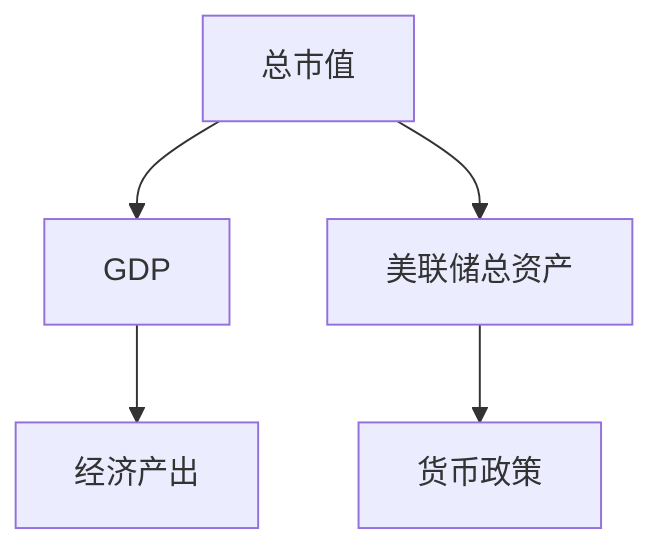
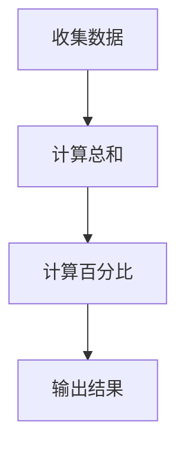
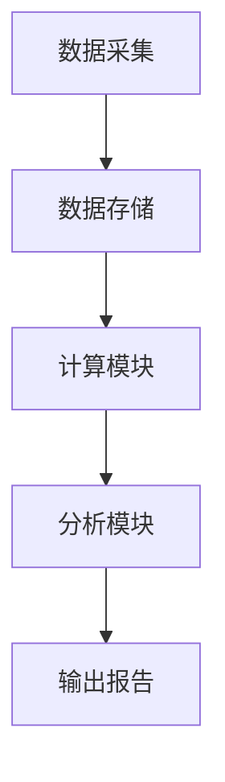

                 


# 新指标:总市值占GDP与美联储总资产之和的百分比

> 关键词：总市值、GDP、美联储总资产、经济指标、百分比、算法、系统设计

> 摘要：本文介绍了一个新经济指标——总市值占GDP与美联储总资产之和的百分比，分析其背景、概念、算法原理、系统设计、项目实战和最佳实践，提供深入的技术分析和见解。

---

## 第一部分: 新指标的背景与概念

### 第1章: 新指标的背景与问题背景

#### 1.1 经济指标的重要性
经济指标是分析和理解经济运行状况的关键工具。它们帮助政策制定者、投资者和研究机构评估经济表现、预测趋势并做出决策。然而，现有的经济指标在某些情况下可能不够全面，无法捕捉复杂的经济动态。

#### 1.2 新指标的定义与问题描述
新指标定义为总市值占GDP与美联储总资产之和的百分比。该指标旨在综合反映市场价值、经济产出和货币政策之间的关系。通过整合这三个关键因素，新指标能够提供更全面的经济视角。

#### 1.3 新指标的边界与外延
新指标适用于分析宏观经济状况，特别是在货币政策和市场价值对经济的影响方面。它不仅适用于美国，还可推广到其他国家的类似分析。

---

## 第二部分: 核心概念与联系

### 第2章: 核心概念的原理与特征

#### 2.1 总市值、GDP与美联储总资产的属性特征对比

| 指标       | 定义与特征                                                                 |
|------------|--------------------------------------------------------------------------|
| 总市值      | 所有上市公司市场价值的总和，反映市场信心和经济活力。                   |
| GDP         | 国民生产总值，衡量一个国家或地区的经济产出。                         |
| 美联储总资产 | 美联储持有的资产总和，包括债券、黄金储备等，反映货币政策力度。       |

#### 2.2 概念结构与关系
以下是三者关系的Mermaid图：



---

## 第三部分: 算法原理讲解

### 第3章: 算法原理与数学模型

#### 3.1 计算公式
新指标的计算公式如下：

$$
\text{新指标} = \frac{\text{总市值}}{\text{GDP} + \text{美联储总资产}} \times 100\%
$$

#### 3.2 算法流程
计算步骤如下：

1. 收集总市值、GDP和美联储总资产的数据。
2. 计算GDP与美联储总资产的总和。
3. 计算总市值占该总和的百分比。

以下为计算过程的Mermaid图：



#### 3.3 代码实现
以下是Python代码实现：

```python
def calculate_new_indicator(market_cap, gdp, fed_assets):
    total = gdp + fed_assets
    new_indicator = (market_cap / total) * 100
    return new_indicator

# 示例数据
market_cap = 1000  # 总市值
gdp = 500  # GDP
fed_assets = 300  # 美联储总资产

result = calculate_new_indicator(market_cap, gdp, fed_assets)
print(f"新指标百分比: {result}%")
```

---

## 第四部分: 系统分析与架构设计

### 第4章: 系统架构设计

#### 4.1 问题场景介绍
系统需实时计算新指标，数据来源包括股票市场、政府统计和美联储报告。

#### 4.2 系统功能设计
- 数据采集模块：收集总市值、GDP和美联储总资产。
- 计算模块：执行新指标计算。
- 分析模块：生成报告和可视化。

#### 4.3 系统架构图



---

## 第五部分: 项目实战与案例分析

### 第5章: 项目实战

#### 5.1 实战环境安装
安装所需的库：

```bash
pip install pandas numpy matplotlib
```

#### 5.2 核心代码实现
实现数据采集和计算：

```python
import pandas as pd
import numpy as np

# 数据采集
data = pd.DataFrame({
    '日期': ['2023-01-01', '2023-01-02', '2023-01-03'],
    '总市值': [1000, 1050, 1100],
    'GDP': [500, 505, 510],
    'fed_assets': [300, 305, 310]
})

# 计算新指标
data['新指标'] = (data['总市值'] / (data['GDP'] + data['fed_assets'])) * 100

print(data)
```

#### 5.3 案例分析
分析2023年1月的数据，新指标显示市场价值与经济产出和货币政策的关系。

---

## 第六部分: 最佳实践与注意事项

### 第6章: 最佳实践

#### 6.1 数据来源可靠性
确保数据准确，建议使用官方统计。

#### 6.2 计算频率
根据需求调整计算频率，实时或定期更新。

#### 6.3 异常值处理
识别数据异常，进行清洗或调整。

#### 6.4 可视化与报告
使用图表展示新指标的变化趋势，便于分析和决策。

---

## 作者信息

作者：AI天才研究院/AI Genius Institute & 禅与计算机程序设计艺术 /Zen And The Art of Computer Programming

