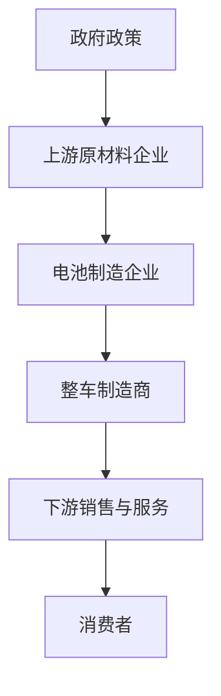
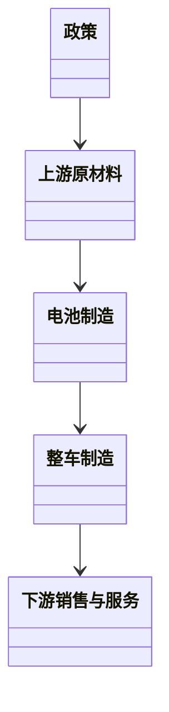
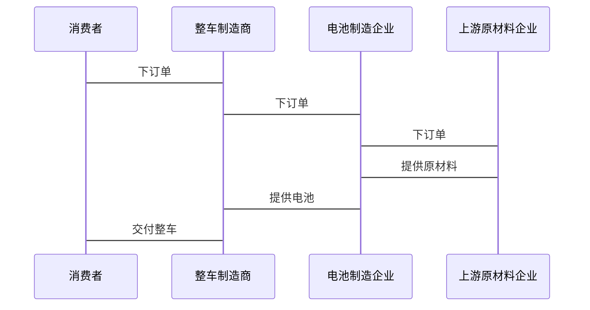

                 


# 新能源汽车产业链的投资机会与风险

> 关键词：新能源汽车产业链，投资机会，风险分析，技术趋势，市场动态

> 摘要：本文系统分析新能源汽车产业链的投资机会与风险，涵盖上游原材料、中游制造、下游应用与服务等环节，结合技术趋势和市场动态，提供深度分析与投资建议。

---

# 第一部分: 新能源汽车产业链的背景与发展趋势

## 第1章: 新能源汽车产业链的概述

### 1.1 新能源汽车的定义与发展背景

#### 1.1.1 新能源汽车的定义与分类
- 新能源汽车（NEV）：指采用新型动力系统，完全或主要依靠电能驱动的汽车，包括纯电动汽车（BEV）、插电式混合动力汽车（PHEV）和燃料电池汽车（FCEV）。
- 分类：根据动力来源可分为纯电动汽车、插电式混合动力汽车和燃料电池汽车。

#### 1.1.2 新能源汽车发展的驱动因素
- 环境保护：减少碳排放，应对气候变化。
- 能源安全：减少对石油的依赖，推动能源结构转型。
- 技术进步：电池技术、电机技术和智能驾驶技术的快速发展。
- 政策支持：各国政府通过补贴、税收优惠等政策推动新能源汽车发展。

#### 1.1.3 全球及中国新能源汽车市场现状
- 全球市场：2022年，全球新能源汽车销量突破1000万辆，中国是最大的市场，占全球销量的60%以上。
- 中国市场：中国是全球最大的新能源汽车市场，政府政策支持和企业技术进步推动了市场的快速发展。

### 1.2 新能源汽车产业链的结构与特点

#### 1.2.1 产业链的上游、中游和下游环节
- 上游：原材料（锂、镍、钴等）、电池材料、电机材料等。
- 中游：电池制造、电机制造、电控系统等。
- 下游：整车制造、充电设施、销售与服务等。

#### 1.2.2 各环节的核心参与者与关键资源
- 上游：矿产资源企业、电池材料供应商。
- 中游：电池制造商、电机制造商、电控系统供应商。
- 下游：整车制造商、充电基础设施运营商、汽车销售和服务企业。

#### 1.2.3 产业链的协同效应与发展趋势
- 协同效应：产业链各环节紧密合作，形成完整的生态系统。
- 发展趋势：技术驱动、成本下降、市场竞争加剧。

### 1.3 新能源汽车产业链的未来趋势

#### 1.3.1 技术创新对产业链的影响
- 电池技术：提高能量密度，降低成本。
- 智能驾驶：推动汽车智能化，改变产业链结构。
- 充电技术：快充技术的发展，提升用户体验。

#### 1.3.2 市场需求的变化与驱动因素
- 消费者需求：年轻消费者更倾向于购买新能源汽车。
- 政策驱动：政府继续推动新能源汽车普及。

#### 1.3.3 产业链的全球化布局与竞争格局
- 全球化布局：中国企业加速海外布局，国际企业进入中国市场。
- 竞争格局：市场竞争加剧，优胜劣汰。

### 1.4 本章小结
本章介绍了新能源汽车的定义、分类、发展背景，分析了产业链的结构与特点，展望了未来发展趋势。

---

# 第二部分: 新能源汽车产业链的核心概念与联系

## 第2章: 产业链核心概念的原理与联系

### 2.1 产业链的核心要素与属性特征

#### 2.1.1 各环节的核心要素对比
- 上游：原材料价格、供应链稳定性。
- 中游：技术水平、生产效率。
- 下游：市场需求、售后服务。

#### 2.1.2 产业链的协同效应与价值传递
- 协同效应：产业链各环节协同合作，提升整体效率。
- 价值传递：从原材料到整车，价值逐步增加。

### 2.2 产业链的ER实体关系图



### 2.3 产业链的系统架构图


### 2.4 本章小结
本章通过ER实体关系图和系统架构图，展示了新能源汽车产业链的核心要素与联系。

---

## 第3章: 上游原材料的投资机会

### 3.1 上游原材料的市场需求与供给

#### 3.1.1 稀有金属的需求增长
- 电动汽车的普及导致锂、镍、钴等需求激增。
- 市场供给：矿产资源有限，存在供给瓶颈。

#### 3.1.2 原材料供应链的风险与机遇
- 风险：原材料价格波动、供应链中断。
- 机遇：技术进步带来替代材料的可能性。

#### 3.1.3 投资机会的评估与选择
- 关注高增长的原材料，如锂、镍、钴等。

### 3.2 上游原材料的技术创新与成本优化

#### 3.2.1 新材料的应用与发展
- 新材料：如磷酸铁锂（LFP）电池材料的应用。
- 技术创新：提高材料利用率，降低成本。

#### 3.2.2 原材料的替代技术与成本控制
- 替代材料：寻找替代锂、镍、钴的材料。
- 成本控制：通过技术创新和规模化生产降低成本。

#### 3.2.3 技术创新对投资的影响
- 技术创新降低了原材料依赖，提升了投资的安全性。

### 3.3 上游原材料的市场风险与应对策略

#### 3.3.1 原材料价格波动的风险
- 风险分析：价格波动对上游企业的影响。
- 应对策略：签订长期合同，多元化采购。

#### 3.3.2 供应链中断的风险
- 风险分析：原材料供应中断对整车制造的影响。
- 应对策略：多元化供应链布局。

#### 3.3.3 风险应对策略与投资建议
- 投资建议：关注供应链稳定的原材料供应商。

### 3.4 本章小结
本章分析了上游原材料的市场需求与供给，技术创新与成本优化，以及市场风险与应对策略。

---

## 第4章: 中游制造环节的风险分析

### 4.1 中游制造环节的核心挑战

#### 4.1.1 技术门槛高
- 制造技术复杂，需要高精尖技术。

#### 4.1.2 成本压力大
- 生产成本高，价格竞争激烈。

#### 4.1.3 市场竞争激烈
- 新能源汽车市场竞争加剧，企业面临价格压力。

### 4.2 中游制造环节的技术风险

#### 4.2.1 技术落后风险
- 技术更新换代快，企业技术落后面临被淘汰的风险。

#### 4.2.2 技术研发投入不足
- 技术研发投入不足可能导致产品竞争力下降。

### 4.3 中游制造环节的市场风险

#### 4.3.1 市场需求变化
- 消费者偏好变化，市场需求波动。

#### 4.3.2 价格竞争加剧
- 价格战导致企业利润下降。

### 4.4 中游制造环节的风险应对策略

#### 4.4.1 加大技术研发投入
- 提高技术水平，保持竞争优势。

#### 4.4.2 优化生产流程
- 降低生产成本，提高效率。

#### 4.4.3 提高产品质量
- 提升产品质量，增强市场竞争力。

### 4.5 本章小结
本章分析了中游制造环节的核心挑战、技术风险和市场风险，并提出了应对策略。

---

## 第5章: 下游应用与服务的风险

### 5.1 下游应用与服务的核心环节

#### 5.1.1 充电基础设施建设
- 充电设施的需求增长，建设成本高。

#### 5.1.2 汽车销售与服务
- 销售模式变化，售后服务需求增加。

### 5.2 下游应用与服务的市场风险

#### 5.2.1 市场竞争加剧
- 新能源汽车销售市场竞争激烈。

#### 5.2.2 用户需求变化
- 用户需求多样化，服务模式需不断创新。

### 5.3 下游应用与服务的风险应对策略

#### 5.3.1 加强充电基础设施建设
- 投资充电设施，提升用户体验。

#### 5.3.2 提升售后服务能力
- 建立完善的售后服务体系，增强客户满意度。

### 5.4 本章小结
本章分析了下游应用与服务的核心环节和市场风险，并提出了应对策略。

---

## 第6章: 新能源汽车产业链的技术分析

### 6.1 电池技术的发展与应用

#### 6.1.1 电池技术的现状与趋势
- 现状：磷酸铁锂（LFP）电池技术成熟，能量密度提高。
- 趋势：固态电池技术的发展，提升电池安全性。

#### 6.1.2 电池技术对产业链的影响
- 技术进步降低电池成本，提升整车性能。

### 6.2 智能驾驶技术的应用与发展

#### 6.2.1 智能驾驶技术的现状
- 当前技术水平：L2-L3级别的自动驾驶技术应用广泛。

#### 6.2.2 智能驾驶对产业链的影响
- 推动整车制造技术升级，促进传感器和芯片产业发展。

### 6.3 充电技术的创新与应用

#### 6.3.1 快充技术的发展
- 快充技术提升用户体验，缩短充电时间。

#### 6.3.2 充电技术对产业链的影响
- 推动充电基础设施建设，促进能源结构转型。

### 6.4 本章小结
本章分析了电池技术、智能驾驶技术和充电技术的发展与应用，探讨了其对产业链的影响。

---

## 第7章: 新能源汽车产业链的系统架构设计

### 7.1 问题场景介绍

#### 7.1.1 产业链协同问题
- 产业链各环节协同不足，影响整体效率。

#### 7.1.2 系统架构设计目标
- 提高产业链协同效率，降低整体成本。

### 7.2 系统功能设计

#### 7.2.1 领域模型设计


#### 7.2.2 系统架构设计


### 7.3 系统接口设计

#### 7.3.1 产业链各环节的接口
- 上游原材料与电池制造之间的接口：原材料供应协议。
- 电池制造与整车制造之间的接口：电池采购合同。
- 整车制造与下游销售之间的接口：整车交付协议。

### 7.4 系统交互设计

#### 7.4.1 产业链协同的交互流程


### 7.5 本章小结
本章通过系统架构设计，展示了新能源汽车产业链的协同关系和交互流程。

---

## 第8章: 新能源汽车产业链的项目实战

### 8.1 环境安装

#### 8.1.1 项目背景
- 某电池企业投资决策分析。

#### 8.1.2 项目目标
- 分析投资机会与风险，提供投资建议。

### 8.2 系统核心实现源代码

#### 8.2.1 投资分析代码
```python
# 投资分析代码示例
import pandas as pd

def calculate_NPV(revenue, cost, discount_rate):
    return sum((revenue[i] - cost[i]) / (1 + discount_rate) ** i for i in range(len(revenue)))

def calculate_IRR(net_cash_flows, discount_rate):
    return (sum(net_cash_flows[i] / (1 + discount_rate) ** i for i in range(len(net_cash_flows))) ) 

# 示例数据
revenue = [100, 200, 300, 400]  # 单位：万元
cost = [50, 60, 70, 80]  # 单位：万元
discount_rate = 0.10

NPV = calculate_NPV(revenue, cost, discount_rate)
IRR = calculate_IRR([ -100, 200, 300, 400 ], 0.10)
print(f"净现值：{NPV:.2f}万元")
print(f"内部收益率：{IRR:.2f}%")
```

#### 8.2.2 代码应用解读与分析
- 净现值（NPV）：投资项目的收益现值与成本现值的差额。
- 内部收益率（IRR）：投资项目的收益率，高于资金成本的投资项目可行。

### 8.3 实际案例分析

#### 8.3.1 投资决策分析
- 某电池企业投资案例：分析净现值和内部收益率，判断投资可行性。

### 8.4 项目小结
本章通过实际案例分析，展示了新能源汽车产业链投资分析的方法和步骤。

---

## 第9章: 总结与展望

### 9.1 本章总结
- 新能源汽车产业链的投资机会与风险分析。

### 9.2 未来展望
- 未来技术发展对产业链的影响。
- 市场竞争的加剧与投资机会的变化。

### 9.3 本章小结
总结全文，展望未来。

---

## 第10章: 附录

### 10.1 附录A: 数据与图表

#### 10.1.1 全球新能源汽车销量趋势图
- 图表展示全球新能源汽车销量的年增长率。

#### 10.1.2 中国新能源汽车市场占有率分析
- 图表展示中国新能源汽车市场占有率的变化。

### 10.2 附录B: 行业研究报告摘要

#### 10.2.1 行业研究报告摘要
- 摘要：新能源汽车行业的投资机会与风险分析。

---

# 作者：AI天才研究院/AI Genius Institute & 禅与计算机程序设计艺术 /Zen And The Art of Computer Programming

---

以上是《新能源汽车产业链的投资机会与风险》的技术博客文章的完整目录大纲和部分具体内容。如需进一步扩展或调整，请随时告知！

