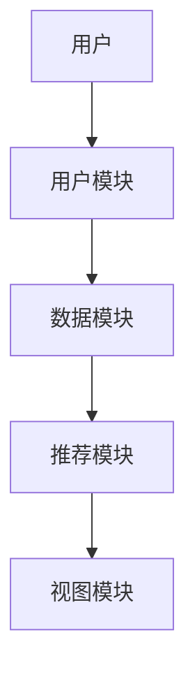

                 


```markdown
# 旅游AI Agent：智能行程规划与推荐

> 关键词：AI Agent，旅游推荐，行程规划，智能系统，深度学习，协同过滤

> 摘要：本文深入探讨了旅游AI Agent在智能行程规划与推荐中的应用。通过分析推荐系统原理、数据处理方法、核心算法及系统架构，结合实际项目案例，展示了如何利用AI技术提升旅游体验。文章内容涵盖背景介绍、算法实现、系统设计和未来展望，为读者提供全面的技术解析。

---

## 第一章: 旅游AI Agent概述

### 1.1 旅游AI Agent的定义与背景

#### 1.1.1 什么是旅游AI Agent
旅游AI Agent（Artificial Intelligence Agent）是一种智能系统，旨在通过分析用户需求和偏好，提供个性化的旅游行程规划和推荐服务。它能够理解用户意图，主动提供信息，并协助用户完成旅游决策。

#### 1.1.2 旅游AI Agent的发展背景
随着人工智能技术的快速发展，旅游业对智能化服务的需求日益增长。传统的旅游行程规划依赖人工经验，效率低下且难以满足个性化需求。AI Agent的出现，解决了这些痛点，为用户提供高效、个性化的旅游服务。

#### 1.1.3 旅游AI Agent的核心目标
- 提供个性化行程推荐
- 实现实时信息获取与处理
- 优化行程安排，提升用户体验
- 支持多语言、多文化背景的用户需求

### 1.2 旅游行程规划与推荐的背景

#### 1.2.1 传统旅游行程规划的痛点
- 信息不对称：用户难以获取全面的旅游信息
- 时间成本高：手动查找和筛选信息耗时耗力
- 个性化不足：传统服务难以满足每个人的偏好

#### 1.2.2 智能推荐系统的优势
- 高效性：快速获取和处理大量数据
- 个性化：基于用户行为和偏好进行推荐
- 可扩展性：支持大规模用户和数据处理

#### 1.2.3 旅游AI Agent的应用场景
- 个性化行程推荐
- 实时景点推荐
- 酒店、航班推荐
- 旅游路线优化

### 1.3 AI技术在旅游行业的应用现状

#### 1.3.1 AI在旅游行业的典型应用
- 智能行程规划
- 个性化推荐系统
- 景点实时信息推送

#### 1.3.2 当前存在的问题与挑战
- 数据隐私问题
- 算法推荐的准确性
- 多语言和多文化支持的复杂性

#### 1.3.3 未来发展趋势
- 更加个性化的推荐服务
- 强化学习在行程优化中的应用
- 多模态数据的融合

---

## 第二章: 推荐系统原理与算法

### 2.1 推荐系统的分类

#### 2.1.1 协同过滤推荐
协同过滤是一种基于用户行为相似性推荐的算法。通过分析用户的评分或行为数据，找到与当前用户相似的用户群体，推荐这些用户喜欢的物品。

#### 2.1.2 基于内容的推荐
基于内容的推荐系统分析物品本身的特征（如景点的描述、酒店的评价），并根据用户的偏好推荐相似的物品。

#### 2.1.3 混合推荐模型
混合推荐模型结合协同过滤和基于内容的推荐方法，通过集成多种推荐策略，提高推荐的准确性和多样性。

### 2.2 协同过滤算法实现

#### 2.2.1 基于用户的协同过滤
基于用户的协同过滤算法通过计算用户之间的相似度，推荐相似用户喜欢的物品。其步骤包括数据收集、相似度计算、推荐生成。

#### 2.2.2 基于物品的协同过滤
基于物品的协同过滤算法通过计算物品之间的相似度，推荐用户可能感兴趣的物品。其流程包括数据预处理、相似度计算、推荐生成。

#### 2.2.3 协同过滤的优缺点
- 优点：简单易实现，能够发现用户群体的共同兴趣
- 缺点：冷启动问题，计算复杂度高

### 2.3 基于深度学习的推荐算法

#### 2.3.1 基于神经网络的推荐系统
基于神经网络的推荐系统利用深度学习模型（如神经网络协同过滤）来捕捉用户和物品的复杂关系。

#### 2.3.2 注意力机制在推荐中的应用
注意力机制通过关注重要的用户行为或物品特征，提高推荐系统的准确性。

#### 2.3.3 深度强化学习在推荐中的应用
深度强化学习通过强化学习的策略优化，提升推荐系统的实时决策能力。

---

## 第三章: 旅游数据的获取与处理

### 3.1 旅游数据的来源

#### 3.1.1 用户行为数据
用户行为数据包括用户的搜索记录、点击行为、评分数据等，用于分析用户的兴趣和偏好。

#### 3.1.2 场景数据
场景数据包括景点的地理位置、开放时间、门票价格等信息，用于推荐和行程规划。

#### 3.1.3 产品数据
产品数据包括酒店、航班、景点门票等产品的详细信息，用于个性化推荐。

### 3.2 数据预处理与特征提取

#### 3.2.1 数据清洗
数据清洗包括去除噪声数据、填补缺失值、处理异常值等，确保数据质量。

#### 3.2.2 特征工程
特征工程包括提取有用的特征、降维处理、特征组合等，提升模型的性能。

#### 3.2.3 数据增强
数据增强通过生成更多的数据样本，提高模型的泛化能力。

### 3.3 用户画像构建

#### 3.3.1 用户画像的定义
用户画像是通过对用户行为数据的分析，构建用户的基本特征和兴趣偏好。

#### 3.3.2 用户画像的构建步骤
1. 数据收集与整合
2. 数据清洗与特征提取
3. 用户分群与标签化
4. 画像可视化与分析

#### 3.3.3 用户画像的应用
用户画像是推荐系统的重要输入，用于个性化推荐和行程规划。

---

## 第四章: AI Agent的核心算法

### 4.1 强化学习在行程规划中的应用

#### 4.1.1 强化学习的基本概念
强化学习是一种通过智能体与环境交互，学习最优策略的机器学习方法。

#### 4.1.2 强化学习在行程规划中的应用
智能体通过学习最优路径，推荐最优的行程安排。

#### 4.1.3 强化学习的实现步骤
1. 状态空间定义
2. 动作空间定义
3. 奖励函数设计
4. 策略优化

### 4.2 深度学习在推荐系统中的应用

#### 4.2.1 深度学习的基本概念
深度学习是一种基于人工神经网络的机器学习方法，能够学习数据的高层次特征。

#### 4.2.2 深度学习在推荐系统中的应用
- 用户表示学习
- 物品表示学习
- 行为建模

#### 4.2.3 深度学习的实现步骤
1. 数据预处理
2. 模型构建
3. 模型训练
4. 模型评估

---

## 第五章: 智能行程规划的实现

### 5.1 智能行程规划的基本概念

#### 5.1.1 行程生成
行程生成是根据用户的需求和偏好，生成一系列景点、酒店等的安排。

#### 5.1.2 行程优化
行程优化是对生成的行程进行调整，使其更符合用户的需求。

#### 5.1.3 行程个性化推荐
基于用户画像和推荐算法，提供个性化的行程推荐。

### 5.2 行程生成与优化算法

#### 5.2.1 基于遗传算法的行程优化
遗传算法通过模拟自然选择的过程，优化行程的安排。

#### 5.2.2 基于模拟退火的行程优化
模拟退火算法通过逐步降温，找到全局最优解。

#### 5.2.3 基于强化学习的行程生成
强化学习通过与环境交互，学习最优的行程生成策略。

### 5.3 行程个性化推荐

#### 5.3.1 基于协同过滤的个性化推荐
协同过滤算法通过用户相似性推荐行程。

#### 5.3.2 基于深度学习的个性化推荐
深度学习算法通过学习用户的表示，推荐行程。

#### 5.3.3 综合推荐策略
结合多种推荐方法，提升推荐的准确性和多样性。

---

## 第六章: 系统架构与实现

### 6.1 系统架构设计

#### 6.1.1 系统功能模块
- 用户模块：用户注册、登录、信息管理
- 数据模块：数据采集、存储、处理
- 推荐模块：协同过滤、深度学习推荐
- 视图模块：用户界面、结果展示

#### 6.1.2 系统架构图


### 6.2 系统接口设计

#### 6.2.1 接口定义
- 用户信息接口：获取用户信息
- 数据接口：获取景点数据
- 推荐接口：返回推荐结果

#### 6.2.2 接口实现
- RESTful API设计
- 接口文档编写

### 6.3 系统交互设计

#### 6.3.1 交互流程
1. 用户输入需求
2. 系统分析需求
3. 系统生成推荐
4. 用户查看结果
5. 用户反馈

#### 6.3.2 交互界面设计
- 界面布局
- 界面元素设计
- 界面交互逻辑

---

## 第七章: 项目实战

### 7.1 项目背景与需求分析

#### 7.1.1 项目背景
一个旅游AI Agent的开发项目，旨在为用户提供个性化的行程规划和推荐服务。

#### 7.1.2 项目需求
- 用户信息管理
- 数据处理
- 推荐系统实现
- 系统集成与部署

### 7.2 项目实现

#### 7.2.1 环境安装
安装Python、TensorFlow、Flask等开发环境。

#### 7.2.2 核心代码实现
实现协同过滤算法和深度学习推荐模型。

#### 7.2.3 代码解读与分析
解释关键代码的功能和实现原理。

### 7.3 实际案例分析

#### 7.3.1 案例背景
一个用户的旅游需求分析。

#### 7.3.2 系统推荐过程
展示系统如何根据用户需求生成推荐行程。

#### 7.3.3 推荐结果分析
分析推荐结果的准确性和用户满意度。

### 7.4 项目小结

#### 7.4.1 项目总结
总结项目的实现过程和取得的成果。

#### 7.4.2 项目改进方向
提出项目后续优化的方向和建议。

---

## 第八章: 未来展望

### 8.1 旅游AI Agent的发展趋势

#### 8.1.1 技术进步带来的变化
深度学习和强化学习的进一步应用。

#### 8.1.2 数据共享与隐私保护
数据共享的挑战与隐私保护的解决方案。

#### 8.1.3 多模态数据的融合
结合图像、视频等多种数据源，提升推荐的准确性。

### 8.2 旅游AI Agent的技术挑战

#### 8.2.1 数据质量与多样性
如何处理数据噪声和多样化的用户需求。

#### 8.2.2 算法的实时性与效率
提升算法的运行效率，满足实时推荐需求。

#### 8.2.3 用户隐私与数据安全
保护用户隐私，确保数据安全。

### 8.3 未来的研究方向

#### 8.3.1 更加个性化的推荐系统
研究如何进一步提升推荐的个性化程度。

#### 8.3.2 AI Agent的多语言支持
实现多语言和多文化的推荐能力。

#### 8.3.3 AI Agent的实时决策能力
提升AI Agent的实时决策和自适应能力。

---

## 作者：AI天才研究院/AI Genius Institute & 禅与计算机程序设计艺术 /Zen And The Art of Computer Programming
```

