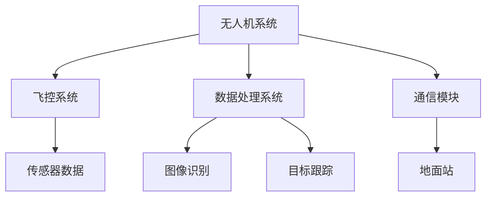
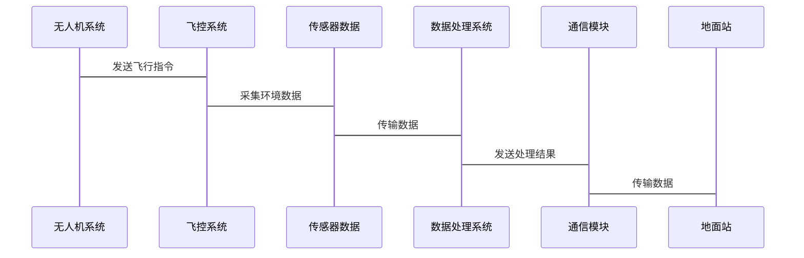

                 

# 无人机技术在各行业应用的投资机会

## 关键词：无人机技术、投资机会、行业应用、技术原理、系统架构

## 摘要：无人机技术作为一种革命性的技术手段，正在迅速渗透到农业、物流、安防、能源和医疗等多个行业。本文将从无人机技术的核心原理、系统架构、行业应用场景、投资分析与商业模型、未来趋势与挑战等方面进行详细分析，为投资者提供全面的行业洞察和投资建议。

---

## 第1章：无人机技术的背景与概述

### 1.1 无人机技术的基本概念

#### 1.1.1 无人机的定义与分类

- **定义**：无人机（Unmanned Aerial Vehicle, UAV）是指通过无线电遥控设备或 onboard 自动化程序控制的不载人飞行器。
- **分类**：
  - 按用途：消费级无人机（航拍、娱乐）、工业级无人机（农业、物流、安防）。
  - 按飞行高度：低空无人机、中空无人机、高空无人机。
  - 按导航方式：自主导航无人机、遥控操作无人机。

#### 1.1.2 无人机技术的发展历程

- **早期阶段**：20世纪初，无人机主要用于军事领域。
- **快速发展阶段**：21世纪初，技术进步推动了无人机在民用领域的广泛应用。
- **智能化阶段**：近年来，AI、5G和物联网技术的融合使无人机更加智能化、自动化。

#### 1.1.3 无人机技术的核心技术特点

- **自主飞行**：依赖AI算法实现路径规划、避障和自主导航。
- **实时通信**：依赖高效的无线通信技术实现数据传输和远程控制。
- **多传感器融合**：结合GPS、摄像头、激光雷达等传感器实现精准感知。

### 1.2 无人机技术的应用领域概述

#### 1.2.1 农业、物流、安防等领域的应用现状

- **农业**：无人机用于农田监测、精准喷洒、作物估产。
- **物流**：无人机用于偏远地区的物资配送。
- **安防**：无人机用于监控、巡逻和应急响应。

#### 1.2.2 无人机技术在工业领域的潜力

- **能源行业**：无人机用于输电线路巡检、油田监控。
- **建筑行业**：无人机用于工地监测、3D建模。
- **交通行业**：无人机用于交通监控、智能驾驶辅助。

#### 1.2.3 无人机技术的未来发展趋势

- **智能化**：AI技术的进一步融合将提升无人机的自主决策能力。
- **联网化**：5G技术的应用将增强无人机的实时通信能力。
- **多领域协同**：无人机将与机器人、物联网等技术协同工作，形成更复杂的生态系统。

### 1.3 无人机技术的投资机会分析

#### 1.3.1 无人机技术的市场潜力

- **市场规模**：预计到2030年，全球无人机市场规模将达到数千亿美元。
- **增长驱动因素**：技术进步、政策支持、行业需求多样化。

#### 1.3.2 无人机技术在不同行业的投资回报率分析

- **农业**：高回报，但需要考虑天气和政策风险。
- **物流**：高潜力，但需要解决技术成熟度和成本问题。
- **安防**：稳定需求，回报相对较低。

#### 1.3.3 无人机技术的政策支持与行业壁垒

- **政策支持**：各国政府出台政策推动无人机技术的发展。
- **行业壁垒**：技术门槛高，需要跨学科整合能力。

---

## 第2章：无人机技术的核心原理与系统架构

### 2.1 无人机系统的组成与工作原理

#### 2.1.1 无人机硬件组成：飞行器、传感器、导航系统

- **飞行器**：无人机的主体，包括机翼、旋翼、机身等。
- **传感器**：用于感知环境数据，如摄像头、激光雷达、IMU（惯性测量单元）。
- **导航系统**：GPS、惯性导航系统（INS）等。

#### 2.1.2 无人机软件系统：飞控系统、数据处理系统

- **飞控系统**：负责无人机的飞行控制，包括姿态控制、速度控制。
- **数据处理系统**：用于处理传感器数据，生成地图、分析图像。

#### 2.1.3 无人机通信技术：无线通信、数据传输

- **无线通信**：Wi-Fi、蓝牙、4G/5G网络。
- **数据传输**：通过MQTT协议实现无人机与地面站的数据交互。

### 2.2 无人机技术的关键算法与数学模型

#### 2.2.1 无人机导航算法：路径规划、避障算法

- **路径规划算法**：如A*算法、RRT算法。
- **避障算法**：基于深度学习的实时避障算法。

#### 2.2.2 无人机数据处理算法：图像识别、目标跟踪

- **图像识别算法**：如卷积神经网络（CNN）用于目标检测。
- **目标跟踪算法**：如KCF（Kernelized Correlation Filters）用于实时跟踪。

#### 2.2.3 无人机通信协议：TCP/IP、MQTT协议

- **TCP/IP协议**：用于无人机与互联网的连接。
- **MQTT协议**：轻量级协议，适用于低带宽、高延迟的网络环境。

### 2.3 无人机系统的架构设计

#### 2.3.1 无人机系统功能模块划分

- **飞行控制模块**：负责无人机的飞行状态控制。
- **数据处理模块**：负责传感器数据的处理与分析。
- **通信模块**：负责无人机与地面站的数据传输。

#### 2.3.2 无人机系统架构图（Mermaid流程图）

#### 2.3.3 无人机系统接口设计与交互序列图

---

## 第3章：无人机技术在农业领域的投资机会

### 3.1 农业无人机的应用场景分析

#### 3.1.1 农业无人机的喷洒作业

- **精准喷洒**：通过无人机的传感器和AI算法实现精准农药喷洒，减少浪费。
- **效率提升**：相比传统人工喷洒，效率提高数倍。

#### 3.1.2 农业无人机的作物监测

- **图像识别**：通过无人机搭载的摄像头进行作物健康监测，识别病虫害。
- **数据驱动决策**：通过数据分析优化种植方案。

#### 3.1.3 农业无人机的精准农业

- **变量率技术**：根据不同区域的土壤条件调整种植策略。
- **节省成本**：通过精准管理降低农资投入。

### 3.2 农业无人机的投资分析

#### 3.2.1 农业无人机的市场需求分析

- **市场潜力**：全球农业无人机市场规模稳步增长。
- **区域分布**：发展中国家需求旺盛，发达国家市场趋于饱和。

#### 3.2.2 农业无人机的成本与收益分析

- **初始成本高**：无人机购置和维护成本较高。
- **长期收益**：通过精准农业和高效管理降低成本，提高产量。

#### 3.2.3 农业无人机的市场竞争格局

- **主要厂商**：大疆创新、极飞科技、Agisoft。
- **竞争态势**：技术差异化竞争，价格战逐渐激烈。

### 3.3 农业无人机的技术与商业模式创新

#### 3.3.1 农业无人机的技术改进方向

- **电池技术**：提升续航能力，延长作业时间。
- **AI算法优化**：提高目标识别准确率和避障能力。

#### 3.3.2 农业无人机的商业模式创新

- **订阅服务**：按需付费，降低用户初始投入。
- **数据服务**：提供基于无人机数据的分析服务。

#### 3.3.3 农业无人机的未来发展趋势

- **智能化**：无人机与AI、大数据技术深度融合。
- **生态化**：无人机与其他农业设备协同工作，形成智能化农业生态系统。

---

## 第4章：无人机技术在物流领域的投资机会

### 4.1 物流无人机的应用场景分析

#### 4.1.1 物流无人机的配送服务

- **偏远地区配送**：解决最后一公里难题。
- **高效配送**：无人机配送速度快，减少运输时间。

#### 4.1.2 物流无人机的仓储管理

- **库存监控**：无人机用于仓库的实时监控和库存盘点。
- **无人仓储**：无人机与机器人协同工作，实现无人化仓储管理。

#### 4.1.3 物流无人机的路径优化

- **智能路径规划**：通过算法优化配送路径，降低能耗。
- **动态调整**：实时调整配送路径，应对突发情况。

### 4.2 物流无人机的投资分析

#### 4.2.1 物流无人机的市场需求分析

- **市场潜力**：全球物流无人机市场规模增长迅速。
- **区域分布**：发展中国家需求旺盛，发达国家市场趋于饱和。

#### 4.2.2 物流无人机的成本与收益分析

- **初始成本高**：无人机购置和维护成本较高。
- **长期收益**：通过高效配送降低成本，提高客户满意度。

#### 4.2.3 物流无人机的市场竞争格局

- **主要厂商**：大疆创新、顺丰科技、Zipline。
- **竞争态势**：技术差异化竞争，价格战逐渐激烈。

### 4.3 物流无人机的技术与商业模式创新

#### 4.3.1 物流无人机的技术改进方向

- **电池技术**：提升续航能力，延长作业时间。
- **AI算法优化**：提高目标识别准确率和避障能力。

#### 4.3.2 物流无人机的商业模式创新

- **订阅服务**：按需付费，降低用户初始投入。
- **数据服务**：提供基于无人机数据的分析服务。

#### 4.3.3 物流无人机的未来发展趋势

- **智能化**：无人机与AI、大数据技术深度融合。
- **生态化**：无人机与其他物流设备协同工作，形成智能化物流生态系统。

---

## 第5章：无人机技术在安防领域的投资机会

### 5.1 安防无人机的应用场景分析

#### 5.1.1 安防无人机的监控服务

- **实时监控**：无人机用于重点区域的实时监控，发现异常情况。
- **夜间监控**：通过红外摄像头实现夜间监控。

#### 5.1.2 安防无人机的巡逻任务

- **自动巡逻**：无人机按照预设路线进行巡逻，节省人力。
- **应急响应**：无人机在突发事件中快速部署，提供实时画面。

#### 5.1.3 安防无人机的应急救援

- **灾害救援**：无人机用于灾区的快速评估和救援物资投送。
- **反恐维稳**：无人机用于警方的巡逻和犯罪嫌疑人追踪。

### 5.2 安防无人机的投资分析

#### 5.2.1 安防无人机的市场需求分析

- **市场潜力**：全球安防无人机市场规模稳步增长。
- **区域分布**：发展中国家需求旺盛，发达国家市场趋于饱和。

#### 5.2.2 安防无人机的成本与收益分析

- **初始成本高**：无人机购置和维护成本较高。
- **长期收益**：通过高效监控降低成本，提高安全水平。

#### 5.2.3 安防无人机的市场竞争格局

- **主要厂商**：大疆创新、海康威视、大华股份。
- **竞争态势**：技术差异化竞争，价格战逐渐激烈。

### 5.3 安防无人机的技术与商业模式创新

#### 5.3.1 安防无人机的技术改进方向

- **电池技术**：提升续航能力，延长作业时间。
- **AI算法优化**：提高目标识别准确率和避障能力。

#### 5.3.2 安防无人机的商业模式创新

- **订阅服务**：按需付费，降低用户初始投入。
- **数据服务**：提供基于无人机数据的分析服务。

#### 5.3.3 安防无人机的未来发展趋势

- **智能化**：无人机与AI、大数据技术深度融合。
- **生态化**：无人机与其他安防设备协同工作，形成智能化安防生态系统。

---

## 第6章：无人机技术在能源领域的投资机会

### 6.1 能源无人机的应用场景分析

#### 6.1.1 能源无人机的输电线路巡检

- **高效巡检**：无人机用于输电线路的定期巡检，发现潜在故障。
- **实时监控**：通过无人机搭载的传感器实时监测线路状态。

#### 6.1.2 能源无人机的油田监控

- **精准监测**：无人机用于油田的环境监测和资源勘探。
- **数据驱动决策**：通过数据分析优化油田开发方案。

#### 6.1.3 能源无人机的风力发电维护

- **高效维护**：无人机用于风力发电设备的定期检查和维护。
- **降低成本**：通过无人机巡检减少人工成本和时间。

### 6.2 能源无人机的投资分析

#### 6.2.1 能源无人机的市场需求分析

- **市场潜力**：全球能源无人机市场规模稳步增长。
- **区域分布**：发展中国家需求旺盛，发达国家市场趋于饱和。

#### 6.2.2 能源无人机的成本与收益分析

- **初始成本高**：无人机购置和维护成本较高。
- **长期收益**：通过高效监控降低成本，提高能源利用效率。

#### 6.2.3 能源无人机的市场竞争格局

- **主要厂商**：大疆创新、通用电气、西门子。
- **竞争态势**：技术差异化竞争，价格战逐渐激烈。

### 6.3 能源无人机的技术与商业模式创新

#### 6.3.1 能源无人机的技术改进方向

- **电池技术**：提升续航能力，延长作业时间。
- **AI算法优化**：提高目标识别准确率和避障能力。

#### 6.3.2 能源无人机的商业模式创新

- **订阅服务**：按需付费，降低用户初始投入。
- **数据服务**：提供基于无人机数据的分析服务。

#### 6.3.3 能源无人机的未来发展趋势

- **智能化**：无人机与AI、大数据技术深度融合。
- **生态化**：无人机与其他能源设备协同工作，形成智能化能源生态系统。

---

## 第7章：无人机技术在医疗领域的投资机会

### 7.1 医疗无人机的应用场景分析

#### 7.1.1 医疗无人机的物资配送

- **偏远地区配送**：无人机用于医疗物资的远程配送。
- **应急响应**：无人机在突发事件中快速部署，提供医疗物资支持。

#### 7.1.2 医疗无人机的远程诊断

- **实时诊断**：无人机搭载医疗设备，实现远程诊断和治疗。
- **数据传输**：通过无人机传输医疗数据，实现远程会诊。

#### 7.1.3 医疗无人机的健康监测

- **持续监测**：无人机用于患者的健康监测和病情跟踪。
- **数据整合**：通过无人机整合医疗数据，提供个性化的医疗服务。

### 7.2 医疗无人机的投资分析

#### 7.2.1 医疗无人机的市场需求分析

- **市场潜力**：全球医疗无人机市场规模稳步增长。
- **区域分布**：发展中国家需求旺盛，发达国家市场趋于饱和。

#### 7.2.2 医疗无人机的成本与收益分析

- **初始成本高**：无人机购置和维护成本较高。
- **长期收益**：通过高效配送降低成本，提高医疗服务效率。

#### 7.2.3 医疗无人机的市场竞争格局

- **主要厂商**：大疆创新、Medtronic、飞塔。
- **竞争态势**：技术差异化竞争，价格战逐渐激烈。

### 7.3 医疗无人机的技术与商业模式创新

#### 7.3.1 医疗无人机的技术改进方向

- **电池技术**：提升续航能力，延长作业时间。
- **AI算法优化**：提高目标识别准确率和避障能力。

#### 7.3.2 医疗无人机的商业模式创新

- **订阅服务**：按需付费，降低用户初始投入。
- **数据服务**：提供基于无人机数据的分析服务。

#### 7.3.3 医疗无人机的未来发展趋势

- **智能化**：无人机与AI、大数据技术深度融合。
- **生态化**：无人机与其他医疗设备协同工作，形成智能化医疗生态系统。

---

## 第8章：无人机技术的投资分析与商业模型

### 8.1 无人机技术的投资现状与趋势

#### 8.1.1 无人机技术的投资现状

- **主要投资领域**：农业、物流、安防、能源、医疗。
- **主要投资者**：科技巨头、风险投资机构、政府基金。

#### 8.1.2 无人机技术的未来投资趋势

- **技术驱动型投资**：关注AI、5G、物联网等技术驱动的无人机创新。
- **行业应用型投资**：关注无人机在特定行业的深度应用。

### 8.2 无人机技术的商业模型分析

#### 8.2.1 无人机技术的直接销售模式

- **硬件销售**：销售无人机设备。
- **软件销售**：销售无人机控制软件和数据处理系统。

#### 8.2.2 无人机技术的服务模式

- **租赁服务**：提供无人机租赁服务，按小时收费。
- **数据服务**：提供基于无人机数据的分析服务，按需收费。

#### 8.2.3 无人机技术的平台模式

- **共享平台**：搭建无人机共享平台，提供按需使用的服务。
- **生态系统平台**：构建无人机生态系统，整合上下游资源。

### 8.3 无人机技术的未来发展趋势与挑战

#### 8.3.1 未来发展趋势

- **智能化**：无人机与AI、大数据技术深度融合。
- **联网化**：5G技术的应用将推动无人机的联网化和实时通信能力。
- **多领域协同**：无人机将与机器人、物联网等技术协同工作，形成更复杂的生态系统。

#### 8.3.2 挑战与解决方案

- **技术挑战**：提升无人机的自主决策能力和通信能力。
- **政策挑战**：需要各国政府制定更完善的无人机使用政策和法规。
- **安全挑战**：防止无人机被滥用，确保飞行安全。

---

## 第9章：无人机技术的未来展望与挑战

### 9.1 无人机技术的未来发展方向

#### 9.1.1 无人机技术的核心技术突破

- **AI算法优化**：提高无人机的自主决策能力。
- **电池技术进步**：提升无人机的续航能力。
- **通信技术升级**：实现更高效的无人机与地面站通信。

#### 9.1.2 无人机技术的行业应用拓展

- **农业**：进一步优化精准农业技术。
- **物流**：推动无人机在城市配送中的应用。
- **安防**：提升无人机在应急响应中的能力。

#### 9.1.3 无人机技术的全球化发展

- **国际市场拓展**：推动无人机技术的全球化应用。
- **国际合作**：加强国际间的无人机技术合作与交流。

### 9.2 无人机技术的挑战与解决方案

#### 9.2.1 技术挑战

- **自主决策能力**：需要更先进的AI算法和传感器技术。
- **通信能力**：需要更高效的通信技术和网络支持。

#### 9.2.2 政策与法律挑战

- **空域管理**：需要各国政府制定更完善的无人机使用政策和法规。
- **隐私保护**：需要平衡无人机的应用与个人隐私保护。

#### 9.2.3 安全挑战

- **无人机安全**：防止无人机被恶意攻击或滥用。
- **数据安全**：确保无人机数据的安全传输和存储。

---

## 作者：AI天才研究院/AI Genius Institute & 禅与计算机程序设计艺术 /Zen And The Art of Computer Programming

