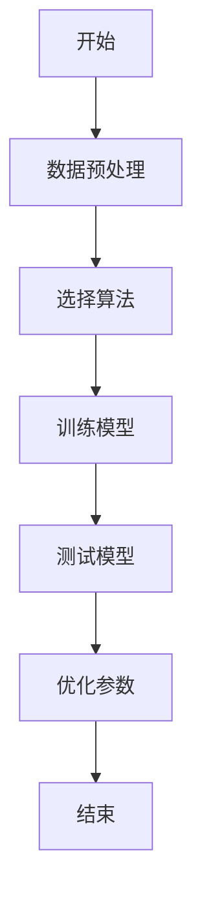

                 


# 智慧城市技术在可持续发展中的应用与投资

## 关键词：智慧城市，可持续发展，物联网，大数据，人工智能，投资分析

## 摘要：  
智慧城市建设是全球城市化进程中的重要趋势，旨在通过技术创新和数据驱动的方式解决城市化进程中的资源分配不均、环境污染和交通拥堵等问题。本文从技术角度出发，系统地分析了智慧城市技术的核心概念、应用场景及其在可持续发展中的价值。同时，结合实际案例，探讨了智慧城市建设中的投资策略和风险控制。通过深入的技术分析和实际应用案例，本文为读者提供了关于智慧城市建设的全面视角，帮助决策者更好地把握技术趋势和投资机会。

---

## 第一部分: 智慧城市技术与可持续发展概述

### 第1章: 智慧城市技术与可持续发展的背景

#### 1.1 智慧城市的基本概念  
- **1.1.1 城市化的挑战与问题背景**  
  随着城市化进程的加快，传统城市发展模式面临资源消耗过大、环境污染严重、交通拥堵等问题。智慧城市建设通过技术创新和数据驱动的方式，试图解决这些问题，推动城市的可持续发展。  

- **1.1.2 智慧城市的核心目标**  
  智慧城市的建设目标包括提高资源利用效率、优化城市服务、提升居民生活质量、减少环境污染等。  

- **1.1.3 可持续发展在智慧城市中的意义**  
  可持续发展强调在满足当前需求的同时，不损害后代发展的可能性。在智慧城市中，可持续发展是通过技术创新和资源优化实现的，例如通过智能交通系统减少能源消耗，通过绿色建筑技术降低碳排放等。  

#### 1.2 智慧城市技术的定义与特点  
- **1.2.1 智慧城市技术的定义**  
  智慧城市技术是指通过物联网、大数据、人工智能、云计算等技术手段，对城市中的资源、环境、交通、能源等系统进行智能化管理与优化的技术集合。  

- **1.2.2 技术特点对比分析**  
  智慧城市技术具有实时性、数据驱动、智能化、集成化等特点。与传统城市技术相比，智慧城市技术更加注重数据的实时采集和分析，能够快速响应城市运行中的问题。  

- **1.2.3 技术与可持续发展的关系**  
  智慧城市技术通过优化资源配置、减少能源消耗、提高城市运行效率等方式，直接推动城市的可持续发展。  

#### 1.3 智慧城市与可持续发展的关联  
- **1.3.1 可持续发展的核心要素**  
  可持续发展包括经济、社会和环境三个方面。在智慧城市中，技术的应用需要在这三个方面实现平衡。  

- **1.3.2 智慧城市技术如何促进可持续发展**  
  通过智能交通系统优化交通流量，减少碳排放；通过智能电网技术提高能源利用效率；通过绿色建筑技术降低能源消耗等。  

- **1.3.3 边界与外延**  
  智慧城市技术的应用范围广泛，但需要明确其边界，避免过度技术化导致的资源浪费和环境破坏。  

#### 1.4 本章小结  
本章通过分析智慧城市的背景、技术定义及其与可持续发展的关系，为后续内容奠定了基础。智慧城市建设不仅是技术问题，更是社会和环境问题的综合解决方案。

---

## 第二部分: 智慧城市技术的核心概念与联系

### 第2章: 智慧城市技术的核心概念与联系

#### 2.1 核心概念原理  
- **2.1.1 物联网（IoT）在智慧城市中的作用**  
  物联网技术通过传感器和通信网络，实时采集城市中的数据，为智慧城市的运行提供基础支持。  

- **2.1.2 大数据与人工智能的结合**  
  大数据技术用于处理海量城市数据，人工智能技术用于分析数据并提供决策支持。  

- **2.1.3 云计算在智慧城市中的应用**  
  云计算技术为智慧城市提供了弹性的计算资源和数据存储能力，支持城市系统的高效运行。  

#### 2.2 核心概念属性特征对比  
- **2.2.1 物联网与大数据的对比**  
  物联网注重数据的采集和传输，大数据注重数据的存储和分析。  

- **2.2.2 人工智能与云计算的对比**  
  人工智能注重数据的分析和决策，云计算注重资源的分配和管理。  

- **2.2.3 智慧城市技术的整体架构**  
  智慧城市技术由感知层、网络层、计算层和应用层组成，各层协同工作，实现城市的智能化管理。  

#### 2.3 ER实体关系图  
```mermaid
erDiagram
    city {
        id
        name
        location
    }
    sensor {
        id
        type
        data
    }
    citizen {
        id
        name
        address
    }
    city -- sensor : has
    city -- citizen : contains
    sensor --> data : collects
```

#### 2.4 本章小结  
本章通过分析智慧城市技术的核心概念及其之间的关系，展示了各技术在智慧城市建设中的协同作用。物联网、大数据、人工智能和云计算共同构建了智慧城市的技术基础。

---

## 第三章: 智慧城市技术的算法原理

### 3.1 算法原理概述  
- **3.1.1 机器学习在智慧城市中的应用**  
  机器学习技术广泛应用于智能交通、能源管理和环境保护等领域。  

- **3.1.2 算法选择与优化**  
  根据具体应用场景选择合适的算法，并通过参数调优和模型优化提高算法性能。  

- **3.1.3 算法实现的步骤**  
  数据预处理、特征提取、模型训练、模型评估和模型部署。  

### 3.2 算法流程图  


### 3.3 算法实现代码  
```python
import numpy as np
from sklearn import datasets
from sklearn.tree import DecisionTreeClassifier

# 加载数据集
iris = datasets.load_iris()
X = iris.data
y = iris.target

# 创建决策树模型
model = DecisionTreeClassifier()
model.fit(X, y)

# 预测
predicted = model.predict(X)
print(predicted)
```

### 3.4 本章小结  
本章通过具体的算法实现，展示了智慧城市建设中技术的实现过程。机器学习算法在智慧城市中的应用为城市的智能化管理提供了强大的技术支持。

---

## 第四章: 智慧城市技术的应用场景

### 4.1 智能交通系统  
- **4.1.1 交通流量预测**  
  使用机器学习算法预测交通流量，优化交通信号灯的控制策略。  

- **4.1.2 智能停车管理**  
  通过物联网技术实时监控停车位的使用情况，帮助驾驶员快速找到停车位。  

### 4.2 智能能源管理  
- **4.2.1 智能电网**  
  通过智能电网技术实现能源的高效分配和管理，降低能源浪费。  

- **4.2.2 可再生能源整合**  
  将风能、太阳能等可再生能源整合到城市能源系统中，实现低碳发展。  

### 4.3 智慧环保  
- **4.3.1 环境监测**  
  使用传感器实时监测空气质量和水质，及时发现环境污染问题。  

- **4.3.2 环境保护决策支持**  
  通过数据分析提供环境保护的决策支持，优化城市的环境保护策略。  

### 4.4 本章小结  
本章通过具体的应用场景展示了智慧城市建设中技术的实际应用。智能交通、智能能源管理和智慧环保等领域的应用为城市的可持续发展提供了有力支持。

---

## 第五章: 智慧城市建设的投资分析与优化策略

### 5.1 投资分析的核心要素  
- **5.1.1 成本效益分析**  
  通过分析项目的成本和收益，评估项目的可行性。  

- **5.1.2 风险评估**  
  识别项目中的潜在风险，并制定应对策略。  

- **5.1.3 投资回报分析**  
  通过财务模型评估项目的投资回报率，为投资决策提供依据。  

### 5.2 投资优化策略  
- **5.2.1 技术选择优化**  
  根据项目需求选择最合适的技术方案，避免技术过时和资源浪费。  

- **5.2.2 运维成本控制**  
  通过优化系统的运维流程，降低运维成本。  

- **5.2.3 风险控制策略**  
  建立风险预警机制，及时发现和解决潜在问题。  

### 5.3 本章小结  
本章通过分析智慧城市建设中的投资问题，提出了科学的投资分析方法和优化策略，为投资者提供了实用的指导。

---

## 第六章: 智慧城市系统架构与设计

### 6.1 系统架构设计  
- **6.1.1 领域模型类图**  
  展示系统的各个模块及其交互关系。  

- **6.1.2 系统架构图**  
  展示系统的整体架构，包括感知层、网络层、计算层和应用层。  

### 6.2 系统接口设计  
- **6.2.1 API设计**  
  定义系统的接口规范，确保系统模块之间的通信顺畅。  

- **6.2.2 接口交互设计**  
  通过序列图展示系统模块之间的交互流程。  

### 6.3 本章小结  
本章通过系统架构设计和接口设计，展示了智慧城市建设的技术实现过程。系统的模块化设计和标准化接口为后续的开发和维护提供了便利。

---

## 第七章: 智慧城市项目的实战与案例分析

### 7.1 项目实施步骤  
- **7.1.1 环境安装**  
  安装必要的软件和硬件环境，确保系统的正常运行。  

- **7.1.2 系统核心实现**  
  根据设计文档实现系统的各个模块，完成功能开发。  

- **7.1.3 代码实现**  
  编写系统的源代码，确保代码的可读性和可维护性。  

### 7.2 案例分析  
- **7.2.1 智能交通系统案例**  
  通过具体案例展示智能交通系统的实现过程和实际效果。  

- **7.2.2 能源管理系统案例**  
  通过案例分析展示能源管理系统的实际应用和优化效果。  

### 7.3 本章小结  
本章通过具体的项目实施和案例分析，展示了智慧城市建设中的技术实现过程。项目的实战经验为后续的智慧城市建设提供了宝贵的参考。

---

## 第八章: 智慧城市技术的未来展望与投资机会

### 8.1 技术发展趋势  
- **8.1.1 人工智能的进一步应用**  
  随着人工智能技术的不断发展，其在智慧城市中的应用将更加广泛和深入。  

- **8.1.2 区块链技术的应用**  
  区块链技术在智慧城市中的应用前景广阔，特别是在数据安全和信任机制方面。  

### 8.2 投资机会分析  
- **8.2.1 新兴技术领域的投资机会**  
  区块链、边缘计算等新兴技术在智慧城市中的应用将带来新的投资机会。  

- **8.2.2 可持续发展领域的投资机会**  
  在可持续发展领域，绿色能源、智能交通等技术的投资潜力巨大。  

### 8.3 本章小结  
本章通过分析智慧城市建设的未来技术发展趋势和投资机会，为投资者提供了新的视角和思路。

---

## 作者：AI天才研究院/AI Genius Institute & 禅与计算机程序设计艺术 /Zen And The Art of Computer Programming

---

**注意：以上内容为文章的完整大纲和部分章节内容，实际撰写时需要根据具体需求进一步扩展每个章节的内容，确保文章的深度和广度符合要求。**

