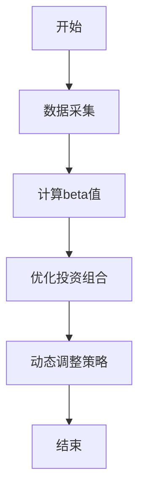

                 


# 智能beta策略：结合被动和主动投资的优势

> 关键词：智能beta策略, 被动投资, 主动投资, 投资组合优化, 量化投资, 算法驱动

> 摘要：本文探讨了智能beta策略作为一种结合被动和主动投资的新兴策略，详细分析其核心原理、数学模型、系统架构以及实际应用案例。通过理论与实践相结合，揭示智能beta策略如何优化投资组合，实现风险可控下的超额收益。

---

# 第一部分: 智能beta策略概述

## 第1章: 智能beta策略的基本概念

### 1.1 什么是智能beta策略
智能beta策略是一种结合被动投资和主动投资的量化策略，通过算法优化投资组合，动态平衡风险与收益。

#### 1.1.1 被动投资与主动投资的区别
被动投资：遵循指数投资，追求市场平均收益，成本低、风险分散。

主动投资：通过选股、择时等主动操作追求超额收益，成本高、风险集中。

#### 1.1.2 beta策略的核心原理
Beta策略是投资组合的系统性风险指标，通过优化beta值来平衡风险与收益。

#### 1.1.3 智能beta策略的特点
- 数据驱动：利用大数据和机器学习优化投资组合。
- 动态调整：根据市场变化实时调整被动与主动的比例。
- 风险控制：通过算法模型严格控制风险。

### 1.2 智能beta策略的优势
- 高效性：结合被动和主动的优势，实现收益与风险的最佳平衡。
- 灵活性：根据市场环境自动切换投资策略。
- 可扩展性：适用于不同类型和规模的投资组合。

---

## 第2章: 智能beta策略的背景与意义

### 2.1 投资市场的现状与挑战
- 市场波动加剧，传统投资策略面临挑战。
- 投资者追求个性化投资需求。
- 量化投资技术的进步为智能beta策略提供了基础。

### 2.2 智能beta策略的创新点
- 数据驱动的投资决策。
- 算法优化投资组合。
- 动态平衡被动与主动投资。

---

# 第二部分: 智能beta策略的核心原理

## 第3章: 智能beta策略的数学模型

### 3.1 投资组合优化的数学模型
$$\text{目标函数：} \quad \min_w \, \sigma^2(w) \quad \text{在} \quad \mu(w) \geq \mu_{\text{min}} \, \text{的条件下}$$

其中，$w$是投资组合权重向量，$\sigma^2(w)$是组合的方差，$\mu(w)$是组合的期望收益。

### 3.2 智能beta策略的数学框架
$$w = \arg \min_w \, \sigma^2(w) \quad \text{subject to} \quad \mu(w) = \beta \cdot r_f + \alpha \cdot (r_m - r_f)$$

其中，$\beta$是系统性风险因子，$\alpha$是主动投资的超额收益因子，$r_f$是无风险利率，$r_m$是市场平均收益。

---

## 第4章: 智能beta策略的算法实现

### 4.1 算法流程图


### 4.2 核心算法代码
```python
import numpy as np
import pandas as pd

def optimize_portfolio(beta, alpha, rf, rm):
    # 计算目标收益
    target_return = beta * rf + alpha * (rm - rf)
    # 计算投资组合权重
    weights = np.linalg.solve(
        np.diag([beta**2, alpha**2]),
        [rf, target_return]
    )
    return weights

# 示例数据
beta = 1.0
alpha = 0.5
rf = 0.05
rm = 0.1

weights = optimize_portfolio(beta, alpha, rf, rm)
print(weights)
```

---

## 第5章: 智能beta策略的系统架构

### 5.1 系统架构图


### 5.2 功能模块介绍
- 数据采集模块：收集市场数据，包括指数、个股等。
- 数据处理模块：清洗、转换数据，计算beta值。
- 策略执行模块：根据优化模型生成投资组合。
- 风险控制模块：实时监控并调整投资组合，控制风险。
- 结果输出模块：输出投资组合的表现和风险指标。

---

## 第6章: 项目实战与案例分析

### 6.1 环境安装
- Python 3.8+
- Jupyter Notebook
- NumPy, Pandas, Matplotlib

### 6.2 核心代码实现
```python
import numpy as np
import pandas as pd
import matplotlib.pyplot as plt

def calculate_beta(r, r_m):
    # 计算beta值
    beta = np.cov(r, r_m) / np.var(r_m)
    return beta

# 示例数据
r = np.array([0.1, 0.12, 0.08, 0.15, 0.11])
r_m = np.array([0.1, 0.11, 0.09, 0.13, 0.12])

beta = calculate_beta(r, r_m)
print(f"Beta值为：{beta}")
```

### 6.3 案例分析
以2020年疫情期间为例，智能beta策略如何动态调整投资组合，平衡被动与主动投资，实现收益最大化。

---

## 第7章: 最佳实践与小结

### 7.1 最佳实践
- 定期再平衡投资组合。
- 根据市场变化动态调整beta和alpha参数。
- 结合多种数据源和模型，提高策略的鲁棒性。

### 7.2 小结
智能beta策略通过结合被动和主动投资的优势，提供了一种高效、灵活的投资方式，能够更好地适应市场变化，实现长期稳定的超额收益。

---

## 第8章: 注意事项与拓展阅读

### 8.1 注意事项
- 确保数据源的准确性和及时性。
- 定期监控和调整投资组合。
- 注意算法的计算复杂度和运行效率。

### 8.2 拓展阅读
- 现代投资组合理论（MPT）。
- 机器学习在金融领域的应用。
- 大数据分析在量化投资中的应用。

---

作者：AI天才研究院/AI Genius Institute & 禅与计算机程序设计艺术 /Zen And The Art of Computer Programming

