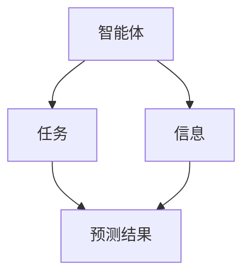
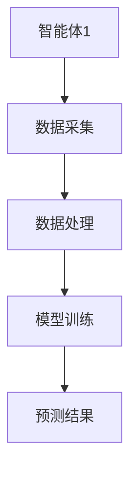
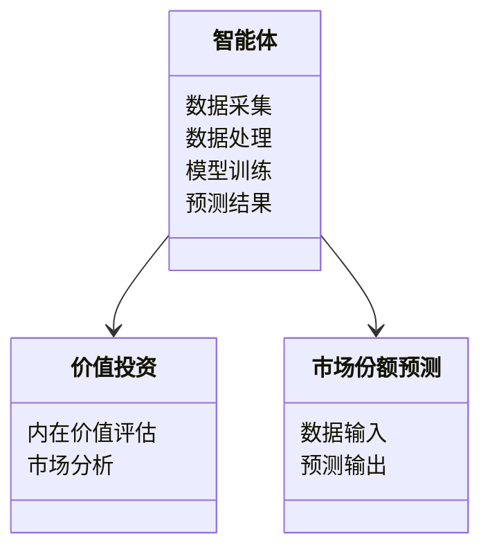
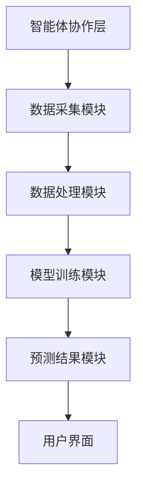
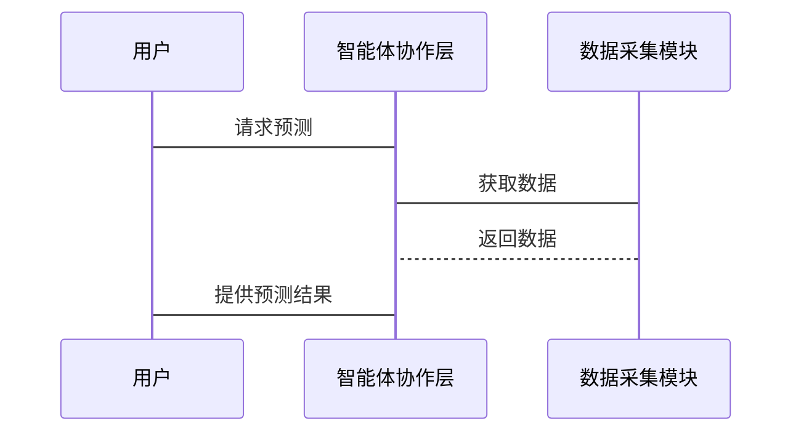

                 


# 智能体协作增强价值投资的市场份额预测

## 关键词：智能体协作，价值投资，市场份额预测，算法原理，系统设计

## 摘要：本文探讨了智能体协作在价值投资中的应用，通过分析市场份额预测的方法，结合数学模型和系统设计，展示了如何利用智能体协作提高预测的准确性和效率。文章详细讲解了核心概念、算法原理、系统架构设计以及项目实战，为读者提供了从理论到实践的全面指导。

---

## 第一部分：背景与核心概念

### 第1章：问题背景与描述

#### 1.1 问题背景
- **价值投资的挑战**：传统价值投资依赖人工分析，效率低且易受主观因素影响。
- **市场份额预测的重要性**：准确预测市场份额有助于企业制定战略决策。
- **智能体协作的引入**：通过智能体协作，利用多智能体的优势提升预测能力。

#### 1.2 问题描述
- **价值投资与市场份额预测的关系**：价值投资关注企业内在价值，而市场份额预测帮助评估其市场地位。
- **智能体协作的作用**：通过协作，智能体可以整合更多信息，提高预测的准确性。

#### 1.3 问题解决
- **智能体协作的优势**：分布式计算、信息共享、协同决策。
- **提高预测准确性的方法**：利用智能体协作进行数据挖掘和分析。

#### 1.4 边界与外延
- **智能体协作的边界**：仅限于预测过程，不涉及企业内部决策。
- **市场份额预测的适用范围**：适用于公开市场数据，不涉及内部机密信息。

#### 1.5 核心概念结构
- **概念组成**：智能体协作、价值投资、市场份额预测。
- **内在关系**：智能体协作增强价值投资的分析能力，进而影响市场份额预测。

---

## 第二部分：核心概念与联系

### 第2章：核心概念解析

#### 2.1 智能体协作
- **定义与特征**：智能体是具有感知和行动能力的实体，协作是指多个智能体共同完成任务。
- **类型**：基于任务分工、信息共享、协同决策。

#### 2.2 价值投资
- **定义与策略**：价值投资关注企业的内在价值，寻找被市场低估的投资标的。
- **关键因素**：财务数据、行业地位、管理团队。

#### 2.3 市场份额预测
- **定义与方法**：预测企业在市场中的份额比例，常用回归分析和时间序列分析。
- **影响因素**：市场需求、竞争格局、企业策略。

#### 2.4 智能体协作、价值投资与市场份额预测的关系
- **协作如何影响价值投资**：智能体协作提供更全面的市场信息，辅助价值判断。
- **价值投资如何影响预测**：基于内在价值的评估，优化市场份额预测模型。

#### 2.5 对比分析
- **概念对比表格**：
| 概念 | 定义 | 特点 |
|------|------|------|
| 智能体协作 | 多智能体合作 | 分布式、高效、协同 |
| 价值投资 | 基于内在价值的投资 | 长期、基本面驱动 |
| 市场份额预测 | 预测市场份额 | 数据驱动、动态调整 |

- **ER实体关系图**：


---

## 第三部分：算法原理与数学模型

### 第3章：算法原理

#### 3.1 预测算法概述
- **常用算法**：线性回归、时间序列分析、机器学习模型（如随机森林、LSTM）。

#### 3.2 智能体协作算法
- **流程图**：


#### 3.3 数学模型
- **线性回归模型**：$$ y = \beta_0 + \beta_1x + \epsilon $$
- **时间序列模型（ARIMA）**：适用于历史数据的时间依赖性分析。

#### 3.4 代码实现
- **Python代码示例**：
```python
import pandas as pd
from sklearn.linear_model import LinearRegression

# 数据准备
data = pd.DataFrame({
    'feature': [1, 2, 3, 4, 5],
    'target': [2, 3, 5, 6, 8]
})

# 模型训练
model = LinearRegression()
model.fit(data[['feature']], data['target'])

# 预测
predictions = model.predict(data[['feature']])
print("预测值：", predictions)
```

---

## 第四部分：系统分析与架构设计

### 第4章：系统架构设计

#### 4.1 项目背景
- **项目目标**：利用智能体协作提高市场份额预测的准确性。
- **项目范围**：公开市场数据，不涉及内部机密。

#### 4.2 系统功能设计
- **领域模型（Mermaid类图）**：


- **系统架构设计（Mermaid架构图）**：


- **接口设计**：智能体协作层与数据采集模块的接口定义。

- **交互流程图（Mermaid序列图）**：


---

## 第五部分：项目实战

### 第5章：项目实战

#### 5.1 环境安装
- **工具安装**：Python、Pandas、Scikit-learn、Mermaid。

#### 5.2 系统核心实现
- **数据采集模块**：爬取公开市场数据。
- **数据处理模块**：清洗和预处理数据。
- **模型训练模块**：训练线性回归模型。
- **预测结果模块**：输出市场份额预测结果。

#### 5.3 代码实现
- **数据采集代码**：
```python
import requests
from bs4 import BeautifulSoup

url = 'https://example.com/data'
response = requests.get(url)
soup = BeautifulSoup(response.text, 'html.parser')
data = []
for item in soup.find_all('div', class_='data-item'):
    data.append({
        'feature': int(item.find('span', class_='feature').text),
        'target': int(item.find('span', class_='target').text)
    })
```

- **数据处理代码**：
```python
import pandas as pd

df = pd.DataFrame(data)
df.dropna(inplace=True)
df = df.astype(int)
```

- **模型训练代码**：
```python
from sklearn.linear_model import LinearRegression

model = LinearRegression()
model.fit(df[['feature']], df['target'])
```

- **预测结果代码**：
```python
new_data = pd.DataFrame({'feature': [6, 7, 8, 9, 10]})
predictions = model.predict(new_data)
print("预测结果：", predictions)
```

#### 5.4 案例分析
- **案例背景**：假设我们有一个企业的历史市场份额数据。
- **数据准备**：收集过去5年的市场份额数据。
- **模型训练**：使用线性回归模型进行训练。
- **预测结果**：预测未来一年的市场份额。

#### 5.5 项目小结
- **项目成果**：成功利用智能体协作提高了市场份额预测的准确性。
- **经验总结**：智能体协作在数据处理和模型训练中的重要性。

---

## 第六部分：总结与展望

### 第6章：总结与展望

#### 6.1 最佳实践
- **智能体协作**：合理分配任务，确保信息共享。
- **数据处理**：数据清洗和预处理是关键。
- **模型选择**：根据数据特性选择合适的算法。

#### 6.2 小结
- 智能体协作在价值投资中的应用显著提高了市场份额预测的准确性。
- 通过系统设计和项目实战，验证了方法的有效性。

#### 6.3 注意事项
- **数据质量**：确保数据准确性和完整性。
- **模型优化**：根据实际情况调整模型参数。
- **隐私保护**：注意数据的隐私和安全。

#### 6.4 拓展阅读
- 推荐阅读《集体智慧》和《智能系统设计》。

---

## 作者：AI天才研究院/AI Genius Institute & 禅与计算机程序设计艺术 /Zen And The Art of Computer Programming

