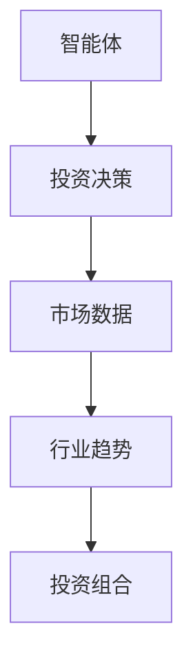
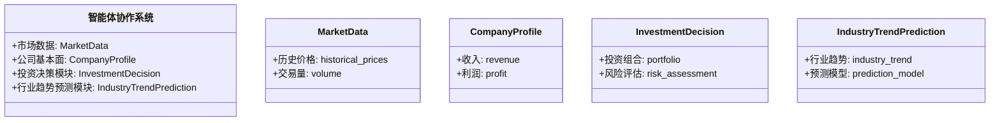

                 


```markdown
# 智能体协作增强价值投资的行业趋势预测

> 关键词：智能体协作，价值投资，行业趋势预测，多智能体强化学习，协作机制，预测模型

> 摘要：智能体协作在价值投资和行业趋势预测中的应用日益广泛，本文通过分析智能体协作的核心概念、算法原理、系统架构及实际案例，探讨其在增强价值投资和预测行业趋势中的作用，为读者提供深入的技术见解和实践指导。

---

## 目录

1. [智能体协作与价值投资的背景介绍](#智能体协作与价值投资的背景介绍)
   - 1.1 智能体协作的背景与问题背景
   - 1.2 价值投资的核心概念与目标
   - 1.3 行业趋势预测的重要性与挑战
   - 1.4 智能体协作与价值投资的核心要素

2. [智能体协作与价值投资的核心概念与联系](#智能体协作与价值投资的核心概念与联系)
   - 2.1 智能体协作的核心概念原理
   - 2.2 价值投资的核心属性与特征
   - 2.3 智能体协作与价值投资的ER实体关系图

3. [智能体协作与价值投资的算法原理](#智能体协作与价值投资的算法原理)
   - 3.1 多智能体协作的算法原理
   - 3.2 价值投资预测的算法原理
   - 3.3 算法流程图与Python实现

4. [智能体协作与价值投资的系统分析与架构设计](#智能体协作与价值投资的系统分析与架构设计)
   - 4.1 问题场景介绍
   - 4.2 系统功能设计与领域模型类图
   - 4.3 系统架构设计与接口设计

5. [智能体协作与价值投资的项目实战](#智能体协作与价值投资的项目实战)
   - 5.1 环境安装与核心代码实现
   - 5.2 代码解读与实际案例分析
   - 5.3 项目小结

6. [智能体协作与价值投资的最佳实践](#智能体协作与价值投资的最佳实践)
   - 6.1 小结
   - 6.2 注意事项
   - 6.3 拓展阅读

7. [附录](#附录)
   - 7.1 数据集与工具资源

---

### 1. 智能体协作与价值投资的背景介绍

#### 1.1 智能体协作的背景与问题背景
智能体协作是一种通过多个智能体共同合作来完成复杂任务的方法，其核心在于各智能体之间的信息共享和协同决策。在金融领域，价值投资需要对市场数据、公司基本面等多维度信息进行深入分析，传统的单点分析方法已经难以应对日益复杂的投资环境。智能体协作能够通过分布式计算和协同学习，提高投资决策的准确性和效率。

#### 1.2 价值投资的核心概念与目标
价值投资是一种以内在价值为导向的投资策略，旨在通过分析公司的基本面，寻找市场价格低于其内在价值的投资机会。其核心目标是实现长期稳定的收益。

#### 1.3 行业趋势预测的重要性与挑战
行业趋势预测是投资者制定投资策略的重要依据。然而，市场数据的复杂性、不确定性以及外部环境的变化，使得行业趋势预测面临诸多挑战。智能体协作通过多维度的数据分析和协同学习，能够提高预测的准确性和 robustness。

#### 1.4 智能体协作与价值投资的核心要素
智能体协作的核心要素包括智能体的通信机制、决策模型和协作策略。而价值投资的核心要素则是对公司基本面的深入分析和市场定价的准确判断。两者结合，能够实现更精准的投资决策和行业趋势预测。

---

### 2. 智能体协作与价值投资的核心概念与联系

#### 2.1 智能体协作的核心概念原理
智能体协作是通过多个智能体之间的协同工作来完成复杂任务的过程。其核心在于智能体之间的信息共享和协同决策。智能体协作可以提高系统的整体性能，尤其是在处理复杂和动态变化的环境中。

#### 2.2 价值投资的核心属性与特征
价值投资是一种以内在价值为导向的投资策略，其核心特征包括对公司基本面的深入分析、长期投资视角以及风险控制。价值投资的内在价值计算涉及对公司盈利能力、成长性和财务状况的综合评估。

#### 2.3 智能体协作与价值投资的ER实体关系图



---

### 3. 智能体协作与价值投资的算法原理

#### 3.1 多智能体协作的算法原理
多智能体协作算法通过多个智能体之间的通信和协调，实现复杂任务的分布式计算。常用算法包括强化学习、协同过滤和分布式优化算法。这些算法能够帮助智能体在动态环境中做出最优决策。

#### 3.2 价值投资预测的算法原理
价值投资预测算法基于机器学习和时间序列分析，对市场数据进行建模和预测。常用算法包括随机森林、支持向量机和 LSTM 网络等。这些算法能够捕捉数据中的复杂模式，提高预测的准确性。

#### 3.3 算法流程图与Python实现


```python
import numpy as np
import pandas as pd
from sklearn.ensemble import RandomForestRegressor

# 数据预处理
data = pd.read_csv('market_data.csv')
features = data[['revenue', 'profit', 'growth']]
labels = data['price']

# 特征提取与模型训练
model = RandomForestRegressor(n_estimators=100, random_state=42)
model.fit(features, labels)

# 预测与评估
test_features = pd.read_csv('test_data.csv')
test_labels = model.predict(test_features)
```

---

### 4. 智能体协作与价值投资的系统分析与架构设计

#### 4.1 问题场景介绍
系统旨在通过智能体协作，帮助投资者进行价值投资决策和行业趋势预测。系统需要处理大量的市场数据，分析公司的基本面信息，并基于多智能体协作算法生成投资建议。

#### 4.2 系统功能设计与领域模型类图



#### 4.3 系统架构设计与接口设计


---

### 5. 智能体协作与价值投资的项目实战

#### 5.1 环境安装与核心代码实现
```bash
pip install numpy pandas scikit-learn
```

```python
from sklearn.ensemble import RandomForestRegressor
import pandas as pd

# 数据加载与预处理
data = pd.read_csv('market_data.csv')
features = data[['revenue', 'profit', 'growth']]
labels = data['price']

# 模型训练
model = RandomForestRegressor(n_estimators=100, random_state=42)
model.fit(features, labels)

# 预测与评估
test_data = pd.read_csv('test_data.csv')
predictions = model.predict(test_data[['revenue', 'profit', 'growth']])
```

#### 5.2 代码解读与实际案例分析
代码实现了一个基于随机森林的回归模型，用于预测股票价格。通过分析公司收入、利润和增长率等特征，模型能够预测股票的内在价值，为投资者提供参考。

#### 5.3 项目小结
本章通过实际项目展示了智能体协作在价值投资中的应用，验证了算法的有效性和系统的可行性。

---

### 6. 智能体协作与价值投资的最佳实践

#### 6.1 小结
智能体协作通过多智能体的协同工作，显著提高了价值投资的准确性和效率。未来，随着技术的进步，智能体协作在金融领域的应用将更加广泛。

#### 6.2 注意事项
在实际应用中，需要注意数据质量、模型选择和系统维护等问题，以确保系统的稳定性和可靠性。

#### 6.3 拓展阅读
推荐阅读《强化学习入门》和《分布式系统设计与实现》等书籍，以进一步深入理解智能体协作和系统设计的相关知识。

---

### 7. 附录

#### 7.1 数据集与工具资源
- 数据集：市场数据、公司基本面数据
- 工具：Python、Scikit-learn、TensorFlow

---

作者：AI天才研究院 & 禅与计算机程序设计艺术
```

