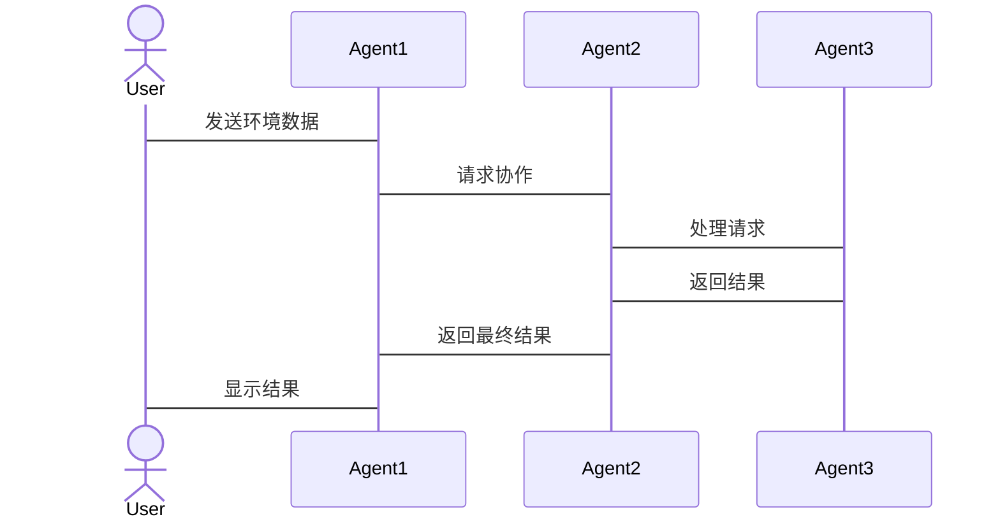

                 


# 智能体协作实现全面的公司环境影响分析

## 关键词：智能体协作、环境影响分析、分布式系统、一致性协议、通信协议、算法实现

## 摘要：  
本文探讨了如何利用智能体协作技术实现对公司环境影响的全面分析。通过智能体之间的协作，企业能够更高效、更准确地评估其环境影响，从而支持可持续发展目标的实现。本文从智能体协作的基本概念出发，深入分析了环境影响分析的重要性，并详细介绍了智能体协作的核心协议与算法。最后，通过实际案例展示了智能体协作在环境影响分析中的应用，为企业提供了可操作的解决方案。

---

# 第1章 智能体协作的基本概念

## 1.1 智能体协作的定义与特点

### 1.1.1 智能体的定义  
智能体（Agent）是指能够感知环境、做出决策并采取行动的实体。智能体可以是软件程序、机器人或其他能够自主操作的系统。智能体协作则是多个智能体通过通信和协调共同完成任务的过程。

### 1.1.2 智能体协作的核心特点  
智能体协作具有以下特点：  
1. **分布式性**：智能体分布在不同的位置，彼此之间通过通信进行协作。  
2. **自主性**：每个智能体都具有自主决策的能力。  
3. **协作性**：智能体之间通过协作完成共同目标。  
4. **动态性**：环境和任务需求可能随时变化，智能体需要灵活调整协作策略。  

### 1.1.3 智能体协作与传统方法的对比  
与传统集中式方法相比，智能体协作具有以下优势：  
1. **高可用性**：分布式结构使得单点故障的可能性降低。  
2. **灵活性**：智能体可以根据环境变化动态调整协作策略。  
3. **扩展性**：可以通过增加智能体数量来扩展系统能力。  

---

## 1.2 环境影响分析的重要性

### 1.2.1 环境影响分析的维度  
环境影响分析可以从多个维度进行，包括：  
1. **碳排放**：企业运营过程中产生的温室气体排放。  
2. **资源消耗**：能源、水、原材料等资源的使用情况。  
3. **废物排放**：生产过程中产生的废弃物及其处理方式。  
4. **生态影响**：对生态系统的影响，如生物多样性损失等。  

### 1.2.2 企业环境影响分析的必要性  
随着全球对可持续发展的关注增加，企业必须对其环境影响进行评估和优化。这不仅有助于减少对环境的负担，还能提升企业的社会责任形象。  

### 1.2.3 智能体协作在环境影响分析中的作用  
智能体协作可以通过以下方式提升环境影响分析的效率和准确性：  
1. **数据收集与整合**：智能体可以实时收集企业运营中的环境数据，并通过协作实现数据的整合与分析。  
2. **决策支持**：智能体可以根据分析结果为企业提供优化建议，帮助企业在减少环境影响的同时提高效率。  

---

# 第2章 智能体协作的协议与算法

## 2.1 智能体协作的一致性协议

### 2.1.1 分布式一致性协议  
一致性协议是确保分布式系统中各智能体状态一致性的关键。常见的分布式一致性协议包括Paxos、Raft和Atomic Consistency等。

### 2.1.2 一致性协议的实现步骤  
一致性协议的实现步骤如下：  
1. **初始化**：智能体向协调者发送请求。  
2. **选举主节点**：协调者选择一个主节点作为一致性协议的领导者。  
3. **提交请求**：主节点将请求提交给所有智能体。  
4. **确认一致性**：所有智能体确认请求后，协议完成。  

### 2.1.3 一致性协议的优缺点对比  
- **优点**：确保系统一致性，提高系统的可靠性和可用性。  
- **缺点**：通信开销较高，可能影响系统的实时性。  

---

## 2.2 智能体之间的通信协议

### 2.2.1 通信协议的设计原则  
通信协议的设计应遵循以下原则：  
1. **简洁性**：协议应简单易懂，减少通信开销。  
2. **可靠性**：确保消息的准确传递和接收。  
3. **安全性**：防止数据泄露和恶意攻击。  

### 2.2.2 基于消息队列的通信机制  
智能体之间的通信可以通过消息队列实现，具体步骤如下：  
1. **发送消息**：智能体将消息发送到消息队列。  
2. **接收消息**：其他智能体从队列中接收消息并处理。  
3. **确认消息**：接收方确认消息处理完成，发送方收到确认后删除消息。  

### 2.2.3 通信协议的实现案例  
以下是一个简单的通信协议实现案例：  
```python
import queue

# 发送方
def send_message(agent_id, message, queue):
    queue.put((agent_id, message))

# 接收方
def receive_message(agent_id, queue):
    while True:
        if not queue.empty():
            message = queue.get()
            if message[0] != agent_id:
                continue
            # 处理消息
            print(f"Agent {agent_id} received message: {message[1]}")
```

---

## 2.3 智能体协作的算法实现

### 2.3.1 分布式算法的数学模型  
分布式算法的数学模型可以用以下公式表示：  
$$ \text{Result} = f(\text{Input}_1, \text{Input}_2, \ldots, \text{Input}_n) $$  
其中，$f$ 是算法的函数，$\text{Input}_i$ 是第 $i$ 个智能体的输入。

### 2.3.2 算法实现的伪代码示例  
以下是一个简单的智能体协作算法的伪代码示例：  
```python
def collaborative_algorithm(agent_id, agents):
    # 初始化
    state = initialize_state()
    
    while True:
        # 接收消息
        messages = receive_messages(agent_id, agents)
        
        # 处理消息
        for message in messages:
            process_message(message)
        
        # 发送消息
        send_message(agent_id, agents, updated_state)
```

### 2.3.3 算法复杂度分析  
智能体协作算法的复杂度可以通过以下公式计算：  
$$ O(n \cdot k) $$  
其中，$n$ 是智能体的数量，$k$ 是每次协作的通信次数。

---

# 第3章 环境影响分析的模型与方法

## 3.1 环境影响分析的模型构建

### 3.1.1 环境影响分析模型的定义  
环境影响分析模型是一个用于评估企业运营对环境影响的数学模型。模型需要考虑多个因素，包括能源消耗、废物排放等。

### 3.1.2 模型构建的步骤与方法  
模型构建的步骤如下：  
1. **数据收集**：收集企业的环境数据。  
2. **模型设计**：根据数据设计模型的结构。  
3. **模型验证**：通过实际数据验证模型的准确性。  
4. **模型优化**：根据验证结果优化模型。  

### 3.1.3 模型的验证与优化  
模型的验证可以通过以下步骤进行：  
1. **数据拟合**：将实际数据与模型预测结果进行对比。  
2. **误差分析**：计算模型的预测误差并进行分析。  
3. **参数调整**：根据误差分析结果调整模型参数。  

---

## 3.2 基于智能体的环境影响分析方法

### 3.2.1 方法的理论基础  
基于智能体的环境影响分析方法依赖于分布式计算和协作算法。智能体通过协作实现对环境数据的实时分析和优化。

### 3.2.2 方法的实现流程  
实现流程如下：  
1. **数据采集**：智能体采集环境数据。  
2. **数据传输**：数据通过通信协议传输到其他智能体。  
3. **数据分析**：智能体对数据进行分析并生成优化建议。  
4. **结果反馈**：优化建议通过反馈机制传递给企业。  

### 3.2.3 方法的优缺点对比  
- **优点**：实时性强，能够快速响应环境变化。  
- **缺点**：需要较高的计算资源和通信带宽。  

---

# 第4章 系统架构设计

## 4.1 系统分层架构

### 4.1.1 应用层设计  
应用层负责与用户的交互和数据展示。  
- **功能**：环境影响分析结果的可视化展示。  
- **实现**：基于Web的用户界面。  

### 4.1.2 服务层设计  
服务层负责智能体协作的核心逻辑。  
- **功能**：一致性协议的实现和通信协议的管理。  
- **实现**：基于分布式服务框架。  

### 4.1.3 数据层设计  
数据层负责数据的存储和管理。  
- **功能**：环境数据的存储和检索。  
- **实现**：使用分布式数据库。  

---

## 4.2 系统接口设计

### 4.2.1 智能体间接口设计  
智能体之间的接口设计如下：  
1. **输入接口**：接收其他智能体发送的消息。  
2. **输出接口**：发送智能体处理后的消息。  

### 4.2.2 系统与用户接口设计  
系统与用户的接口设计如下：  
1. **输入接口**：用户输入环境影响分析的需求。  
2. **输出接口**：显示环境影响分析结果。  

---

## 4.3 系统交互流程

### 4.3.1 交互流程图  
以下是一个系统的交互流程图：  


---

# 第5章 项目实战

## 5.1 环境影响分析系统部署

### 5.1.1 环境部署  
1. 安装必要的软件和工具，如Python、分布式数据库等。  
2. 配置网络环境，确保智能体之间的通信畅通。  

### 5.1.2 系统核心实现源代码  
以下是一个环境影响分析系统的实现代码示例：  
```python
import queue

def send_message(agent_id, message, queue):
    queue.put((agent_id, message))

def receive_message(agent_id, queue):
    while True:
        if not queue.empty():
            message = queue.get()
            if message[0] != agent_id:
                continue
            # 处理消息
            print(f"Agent {agent_id} received message: {message[1]}")

# 示例用法
if __name__ == "__main__":
    queue = queue.Queue()
    agent1 = 1
    agent2 = 2
    send_message(agent1, "环境数据", queue)
    receive_message(agent2, queue)
```

---

## 5.2 代码应用解读与分析

### 5.2.1 代码实现解读  
上述代码实现了两个智能体之间的消息通信。智能体1发送环境数据，智能体2接收并处理数据。  

### 5.2.2 代码实现分析  
1. **send_message函数**：负责将消息发送到消息队列。  
2. **receive_message函数**：负责从消息队列中接收并处理消息。  
3. **主程序**：展示了两个智能体之间的通信过程。  

---

## 5.3 实际案例分析

### 5.3.1 案例背景  
某制造企业希望通过智能体协作技术优化其环境影响分析流程。  

### 5.3.2 案例分析  
1. **数据采集**：智能体采集企业的能源消耗和废物排放数据。  
2. **数据分析**：智能体对数据进行分析并生成优化建议。  
3. **结果反馈**：优化建议通过用户界面反馈给企业。  

---

## 5.4 项目小结

---

# 第6章 总结与展望

## 6.1 本章总结  
本文详细介绍了智能体协作在环境影响分析中的应用。通过智能体协作技术，企业可以更高效、更准确地评估其环境影响，从而支持可持续发展目标的实现。

## 6.2 未来展望  
未来，随着人工智能和分布式系统的不断发展，智能体协作在环境影响分析中的应用将更加广泛和深入。可以通过引入更复杂的算法和优化通信协议来进一步提升系统的效率和准确性。

---

# 附录

## 附录A 一致性协议的实现代码  
```python
def initialize_state():
    return "initial_state"

def collaborative_algorithm(agent_id, agents):
    state = initialize_state()
    while True:
        messages = receive_messages(agent_id, agents)
        for message in messages:
            process_message(message)
        send_message(agent_id, agents, updated_state)
```

## 附录B 通信协议的实现代码  
```python
import queue

def send_message(agent_id, message, queue):
    queue.put((agent_id, message))

def receive_message(agent_id, queue):
    while True:
        if not queue.empty():
            message = queue.get()
            if message[0] != agent_id:
                continue
            print(f"Agent {agent_id} received message: {message[1]}")
```

## 附录C 环境影响分析模型的数学公式  
$$ \text{环境影响} = \sum_{i=1}^{n} (\text{资源消耗}_i + \text{废物排放}_i) $$

---

# 参考文献  
1. 书籍：《分布式系统：原理与实现》  
2. 论文：《基于智能体的环境影响分析方法研究》  
3. 网站：分布式系统与智能体协作技术的最新进展  

---

# 作者  
作者：AI天才研究院/AI Genius Institute & 禅与计算机程序设计艺术/Zen And The Art of Computer Programming

