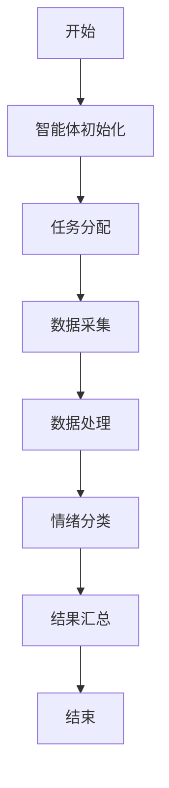
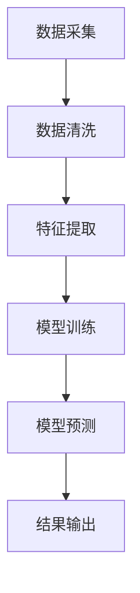
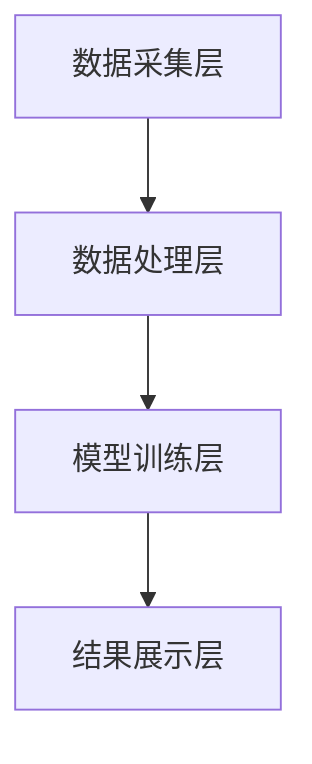
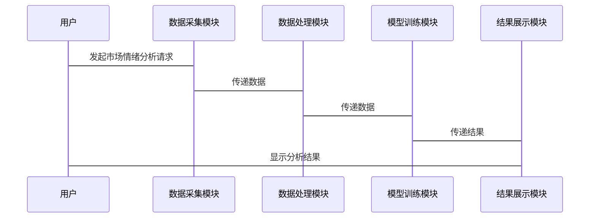

                 


# 智能体协作实现全面的市场情绪分析

> 关键词：智能体协作、市场情绪分析、分布式计算、机器学习、自然语言处理

> 摘要：本文探讨了如何通过智能体协作来实现全面的市场情绪分析。首先介绍了市场情绪分析的重要性和传统方法的局限性，然后详细阐述了智能体协作的概念、原理及其在市场情绪分析中的应用。接着从算法原理、系统架构、项目实战等多个维度展开，展示了如何通过智能体协作来提高市场情绪分析的效率和准确性。最后总结了智能体协作的优势和未来发展方向。

---

## 第一部分: 智能体协作与市场情绪分析概述

### 第1章: 智能体协作与市场情绪分析的背景

#### 1.1 市场情绪分析的重要性
##### 1.1.1 市场情绪分析的定义与作用
市场情绪分析是指通过分析市场参与者的言论、交易行为和市场数据，来判断市场的整体情绪状态。市场情绪可以分为 bullish（看涨）、bearish（看跌）和其他中性情绪。市场情绪分析在金融领域具有重要意义，可以帮助投资者做出更明智的决策，预测市场走势，并优化投资策略。

##### 1.1.2 传统市场情绪分析的局限性
传统的市场情绪分析方法主要依赖于人工分析和简单的文本挖掘技术。这些方法存在以下问题：
- 数据来源单一，难以覆盖多维度的市场信息。
- 分析效率低，难以实时处理海量数据。
- 情绪分类不够精准，难以捕捉市场的细微变化。

##### 1.1.3 智能体协作的优势与潜力
智能体协作是一种分布式计算方法，通过多个智能体协同工作，能够高效地完成复杂任务。智能体协作在市场情绪分析中的优势包括：
- 分布式计算能力，能够同时处理海量数据。
- 多智能体协同，可以覆盖市场的多个维度信息。
- 高度可扩展性，能够根据需求动态调整计算资源。

---

#### 1.2 智能体协作的概念与特点
##### 1.2.1 智能体的定义与分类
智能体（Agent）是一种能够感知环境并采取行动以实现目标的实体。智能体可以分为以下几类：
- **反应式智能体**：根据当前环境信息做出反应。
- **认知式智能体**：具有推理、规划和决策能力。
- **协作式智能体**：能够与其他智能体协同工作。

##### 1.2.2 智能体协作的核心要素
智能体协作的核心要素包括：
- **通信机制**：智能体之间需要通过某种协议进行信息交换。
- **任务分配**：根据智能体的能力和当前任务需求，动态分配任务。
- **协调与同步**：确保多个智能体协同工作，避免冲突。

##### 1.2.3 智能体协作与市场情绪分析的结合
智能体协作与市场情绪分析的结合主要体现在以下几个方面：
- **数据采集**：多个智能体分别从不同的数据源（如社交媒体、新闻网站、交易数据）采集市场信息。
- **数据处理**：智能体协作对采集到的多源数据进行清洗、预处理和特征提取。
- **情绪分类**：通过智能体协作，利用多种算法（如规则匹配、机器学习模型）对市场情绪进行分类。

---

#### 1.3 本章小结
本章介绍了市场情绪分析的重要性和传统方法的局限性，重点阐述了智能体协作的概念、特点及其在市场情绪分析中的优势。智能体协作通过分布式计算和多智能体协同，能够高效地处理海量数据，提高市场情绪分析的准确性和效率。

---

## 第二部分: 智能体协作的核心概念与联系

### 第2章: 智能体协作的核心原理

#### 2.1 智能体协作的理论基础
##### 2.1.1 分布式计算与多智能体系统
分布式计算是一种通过多台计算节点协作完成任务的计算模式。多智能体系统是一种由多个智能体组成的分布式系统，智能体之间通过通信和协作完成复杂任务。

##### 2.1.2 智能体协作的通信机制
智能体之间的通信机制是智能体协作的核心。通信机制包括：
- **消息传递**：智能体通过发送消息进行信息交换。
- **协议设计**：智能体之间需要遵循某种通信协议，确保信息传递的准确性和高效性。

##### 2.1.3 智能体协作的决策模型
智能体协作的决策模型是智能体根据环境信息和任务需求做出决策的数学模型。常见的决策模型包括：
- **基于规则的决策模型**：通过预定义的规则进行决策。
- **基于机器学习的决策模型**：通过训练模型进行决策。

---

#### 2.2 智能体协作与市场情绪分析的关联
##### 2.2.1 市场情绪分析的多维度需求
市场情绪分析需要从多个维度获取信息，包括：
- **文本数据**：社交媒体、新闻文章等文本数据。
- **交易数据**：市场的交易量、价格波动等数据。
- **情感数据**：市场参与者的主观情绪。

##### 2.2.2 智能体协作在情绪分析中的角色
智能体协作在市场情绪分析中的角色包括：
- **数据采集智能体**：负责从不同数据源采集市场信息。
- **数据处理智能体**：对采集到的数据进行清洗和预处理。
- **情绪分类智能体**：利用算法对市场情绪进行分类。

##### 2.2.3 智能体协作的优势与应用场景
智能体协作在市场情绪分析中的优势包括：
- **高效性**：通过分布式计算，提高数据处理效率。
- **准确性**：通过多智能体协同，提高情绪分类的准确性。
- **可扩展性**：可以根据需求动态调整计算资源。

---

#### 2.3 实体关系图与流程图
##### 2.3.1 实体关系图（ER图）展示
```mermaid
erDiagram
    customer {
        id : integer
        name : string
        email : string
    }
    order {
        id : integer
        customer_id : integer
        product_id : integer
        order_date : date
    }
    product {
        id : integer
        name : string
        price : integer
    }
    customer -- order : places
    product -- order : contains
```

##### 2.3.2 智能体协作流程图（Mermaid）


---

## 第三部分: 市场情绪分析的算法原理

### 第3章: 基于智能体协作的市场情绪分析算法

#### 3.1 基于规则的市场情绪分类
##### 3.1.1 规则的定义与设计
基于规则的市场情绪分类是通过预定义的规则对文本进行分类。例如，可以定义以下规则：
- 如果文本中包含“看涨”、“上涨”等关键词，则分类为看涨情绪。
- 如果文本中包含“看跌”、“下跌”等关键词，则分类为看跌情绪。

##### 3.1.2 规则的实现流程
基于规则的市场情绪分类的实现流程如下：
1. 数据采集：从社交媒体、新闻网站等数据源采集文本数据。
2. 数据清洗：去除无关信息，提取与市场情绪相关的文本。
3. 规则匹配：根据预定义的规则对文本进行分类。
4. 结果输出：输出分类结果。

##### 3.1.3 规则的优缺点分析
基于规则的市场情绪分类的优点是简单易实现，缺点是分类精度有限，难以处理复杂的市场情绪。

---

#### 3.2 基于机器学习的市场情绪分类
##### 3.2.1 机器学习模型的选择
常用的机器学习模型包括：
- **支持向量机（SVM）**：适用于小规模数据集。
- **随机森林（Random Forest）**：适用于大规模数据集。
- **深度学习模型（如 LSTM）**：适用于长文本数据。

##### 3.2.2 数据预处理与特征提取
数据预处理包括：
- **分词**：将文本数据分解为词语或短语。
- **去停用词**：去除对情感分析无用的词语（如“的”、“了”等）。
- **向量化**：将词语转换为向量表示（如词袋模型、词嵌入模型）。

##### 3.2.3 模型训练与优化
模型训练包括：
- **训练数据准备**：将预处理后的数据分为训练集和验证集。
- **模型训练**：使用训练数据训练模型。
- **模型优化**：通过调整超参数（如学习率、正则化参数）提高模型性能。

---

#### 3.3 智能体协作的算法实现
##### 3.3.1 分布式计算框架
常用的分布式计算框架包括：
- **MapReduce**：适用于离线计算。
- **Spark**：适用于实时计算。

##### 3.3.2 智能体之间的通信协议
智能体之间的通信协议需要满足以下要求：
- **高效性**：确保智能体之间能够快速交换信息。
- **可靠性**：确保信息传递的准确性和完整性。

##### 3.3.3 协作任务的分配与协调
任务分配与协调可以通过以下方式实现：
- **负载均衡**：根据智能体的负载情况动态分配任务。
- **任务同步**：确保多个智能体协同工作，避免冲突。

---

#### 3.4 算法流程图（Mermaid）


---

## 第四部分: 系统分析与架构设计

### 第4章: 智能体协作系统的架构设计

#### 4.1 系统功能需求分析
##### 4.1.1 市场数据采集模块
市场数据采集模块负责从社交媒体、新闻网站等数据源采集市场信息。

##### 4.1.2 智能体协作模块
智能体协作模块负责对采集到的数据进行分布式计算和协作处理。

##### 4.1.3 情绪分析结果展示模块
情绪分析结果展示模块负责将分析结果以可视化的方式展示给用户。

---

#### 4.2 系统架构设计
##### 4.2.1 分层架构设计
系统架构设计采用分层架构，包括：
- **数据采集层**：负责数据采集。
- **数据处理层**：负责数据清洗和特征提取。
- **模型训练层**：负责模型训练和预测。
- **结果展示层**：负责结果展示。

##### 4.2.2 模块间的交互关系
模块间的交互关系可以通过以下流程图表示：


##### 4.2.3 系统的可扩展性与可维护性
系统的可扩展性可以通过模块化设计实现，系统的可维护性可以通过日志记录和错误处理实现。

---

#### 4.3 系统接口设计
##### 4.3.1 数据接口规范
数据接口规范需要满足以下要求：
- **数据格式**：统一数据格式，确保数据一致性。
- **接口协议**：使用 RESTful API 或其他协议进行数据交换。

##### 4.3.2 智能体协作接口
智能体协作接口需要满足以下要求：
- **通信协议**：确保智能体之间的通信效率和可靠性。
- **任务分配**：确保任务分配的公平性和合理性。

##### 4.3.3 用户接口设计
用户接口设计需要满足以下要求：
- **用户友好性**：确保用户能够方便地使用系统。
- **可视化展示**：将分析结果以可视化的方式展示给用户。

---

#### 4.4 系统交互流程图（Mermaid）


---

## 第五部分: 项目实战

### 第5章: 项目实战与分析

#### 5.1 项目背景与目标
##### 5.1.1 项目背景
本项目旨在通过智能体协作实现全面的市场情绪分析，帮助投资者做出更明智的决策。

##### 5.1.2 项目目标
项目目标包括：
- 实现市场数据的采集与处理。
- 实现智能体协作的分布式计算。
- 实现市场情绪的分类与可视化。

---

#### 5.2 项目环境与工具
##### 5.2.1 环境安装
项目需要以下环境和工具：
- **Python**：编程语言。
- **NLTK**：自然语言处理库。
- **scikit-learn**：机器学习库。
- **Spark**：分布式计算框架。

##### 5.2.2 数据集准备
数据集包括：
- **社交媒体数据**：如 Twitter、微博等平台的文本数据。
- **新闻数据**：如财经新闻网站的文章数据。
- **交易数据**：如股票价格、交易量等数据。

---

#### 5.3 系统核心实现
##### 5.3.1 数据采集模块实现
数据采集模块可以通过以下代码实现：
```python
import tweepy

# 授权信息
auth = tweepy.OAuthHandler('consumer_key', 'consumer_secret')
auth.set_access_token('access_token', 'access_token_secret')

# 创建API对象
api = tweepy.API(auth)

# 采集数据
tweets = api.search(q='market', count=100)
```

##### 5.3.2 数据处理模块实现
数据处理模块可以通过以下代码实现：
```python
from nltk.corpus import stopwords
from nltk.tokenize import word_tokenize

# 分词
tokens = word_tokenize(text.lower())
# 去除停用词
filtered_tokens = [token for token in tokens if token not in stopwords.words('english')]
```

##### 5.3.3 情绪分类模块实现
情绪分类模块可以通过以下代码实现：
```python
from sklearn.feature_extraction.text import TfidfVectorizer
from sklearn.svm import SVC

# 特征提取
vectorizer = TfidfVectorizer()
X = vectorizer.fit_transform(corpus)
y = [0, 1]  # 0代表中性情绪，1代表看涨情绪

# 模型训练
model = SVC()
model.fit(X, y)
```

---

#### 5.4 项目小结
本项目通过智能体协作实现了市场情绪分析的全流程，包括数据采集、数据处理、情绪分类和结果展示。通过本项目的实践，可以进一步优化算法和系统架构，提高市场情绪分析的准确性和效率。

---

## 第六部分: 总结与展望

### 第6章: 总结与展望

#### 6.1 总结
本文探讨了智能体协作在市场情绪分析中的应用，通过理论分析、算法实现和项目实践，展示了智能体协作在市场情绪分析中的优势和潜力。

#### 6.2 未来展望
未来的研究方向包括：
- **算法优化**：进一步优化智能体协作算法，提高市场情绪分析的准确性和效率。
- **系统扩展**：进一步扩展系统的功能，支持更多类型的数据源和更复杂的情绪分类任务。
- **应用推广**：将智能体协作应用于更多领域，如舆情监控、金融风险控制等。

---

## 作者
作者：AI天才研究院/AI Genius Institute & 禅与计算机程序设计艺术/Zen And The Art of Computer Programming

