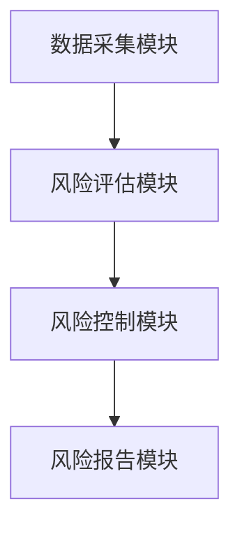

                 


# 智能体协作实现全面的风险评估与管理

---

## 关键词

智能体协作, 风险评估, 风险管理, 分布式计算, 博弈论模型, 共识机制

---

## 摘要

本文系统地探讨了智能体协作在全面风险评估与管理中的应用。通过分析智能体协作的核心概念、算法原理、系统架构及实际案例，展示了如何利用智能体协作技术提升风险管理的效率与准确性。文章从背景介绍、核心概念、算法实现、系统设计到项目实战，层层深入，结合理论与实践，为读者提供了一套完整的智能体协作风险管理解决方案。

---

## 第一部分: 智能体协作与风险管理概述

### 第1章: 智能体协作与风险管理概述

#### 1.1 问题背景与挑战

##### 1.1.1 风险管理的传统方法与局限性

传统风险管理方法通常依赖于人工评估和单点计算，存在以下问题：
- **信息孤岛**：不同部门或系统之间的数据难以共享，导致评估结果片面。
- **计算复杂性**：大规模数据的处理和分析需要大量人工干预，效率低下。
- **实时性不足**：传统方法难以实现实时风险监控和快速响应。

##### 1.1.2 智能体协作的必要性与优势

智能体协作通过分布式计算和多智能体协同，解决了传统方法的局限性：
- **分布式计算**：智能体协作可以将任务分解为多个子任务，通过分布式计算提高效率。
- **实时性**：智能体协作可以实现实时数据处理和风险评估。
- **鲁棒性**：通过多智能体的协同，系统具有更强的容错性和抗干扰能力。

##### 1.1.3 当前风险管理中的主要问题

当前风险管理中的主要问题包括：
- 数据孤岛问题
- 计算效率问题
- 实时性不足问题
- 系统鲁棒性问题

---

#### 1.2 智能体协作的核心概念

##### 1.2.1 智能体的基本定义与特征

智能体（Agent）是一种能够感知环境并采取行动以实现目标的实体。其主要特征包括：
- **自主性**：智能体能够自主决策。
- **反应性**：智能体能够根据环境变化做出反应。
- **协作性**：智能体能够与其他智能体协作完成任务。

##### 1.2.2 智能体协作的定义与分类

智能体协作是指多个智能体通过协同工作完成共同目标的过程。根据协作方式的不同，可以将智能体协作分为：
- **分布式协作**：智能体之间通过分布式计算协同完成任务。
- **集中式协作**：智能体通过集中式协调机制协同完成任务。
- **混合式协作**：结合分布式和集中式协作的特点。

##### 1.2.3 智能体协作与风险管理的结合

智能体协作与风险管理的结合主要体现在：
- **风险评估**：通过智能体协作实现实时风险评估。
- **风险控制**：通过智能体协作实现风险的动态控制。
- **风险报告**：通过智能体协作生成风险报告。

---

#### 1.3 问题描述与解决思路

##### 1.3.1 风险评估与管理的核心问题

风险评估与管理的核心问题包括：
- 如何快速、准确地评估风险？
- 如何实现风险的实时监控？
- 如何制定有效的风险应对策略？

##### 1.3.2 智能体协作在风险管理中的应用场景

智能体协作在风险管理中的应用场景包括：
- **实时风险评估**：通过智能体协作实现实时数据处理和风险评估。
- **风险传播分析**：通过智能体协作分析风险传播路径。
- **风险应对策略制定**：通过智能体协作制定风险应对策略。

##### 1.3.3 解决方案的总体思路

解决方案的总体思路包括：
- **智能体设计**：设计能够感知环境并采取行动的智能体。
- **协作机制设计**：设计智能体之间的协作机制。
- **风险管理算法设计**：设计智能体协作实现风险管理的算法。

---

## 第二部分: 智能体协作与风险管理的核心概念

### 第2章: 智能体协作与风险管理的核心概念

#### 2.1 智能体协作的原理

##### 2.1.1 分布式智能体协作机制

分布式智能体协作机制是指多个智能体通过分布式计算协同完成任务。其核心步骤包括：
1. **任务分解**：将整体任务分解为多个子任务。
2. **智能体分配**：将子任务分配给不同的智能体。
3. **任务执行**：智能体分别执行分配的任务。
4. **结果汇总**：汇总各智能体的结果，形成最终结果。

##### 2.1.2 智能体之间的通信与协调

智能体之间的通信与协调是智能体协作的关键。通信机制包括：
- **消息传递**：智能体之间通过消息传递信息。
- **同步机制**：智能体之间通过同步机制保持协调。

##### 2.1.3 协作任务的分解与分配

协作任务的分解与分配需要考虑以下因素：
- **任务复杂度**：任务的复杂程度。
- **智能体能力**：智能体的能力和资源。
- **协作效率**：协作效率的优化。

---

##### 2.2 风险评估与管理的数学模型

##### 2.2.1 风险评估的基本模型

风险评估的基本模型可以表示为：
$$ R = f(e, s) $$
其中，$R$ 表示风险，$e$ 表示环境因素，$s$ 表示系统状态。

##### 2.2.2 风险管理的数学框架

风险管理的数学框架可以表示为：
$$ M = \{ R_1, R_2, ..., R_n \} $$
其中，$R_i$ 表示第$i$个风险，$M$ 表示风险集合。

##### 2.2.3 智能体协作中的风险传递与优化

智能体协作中的风险传递与优化可以通过以下步骤实现：
1. **风险识别**：识别潜在风险。
2. **风险分析**：分析风险的影响。
3. **风险应对**：制定应对策略。

---

##### 2.3 核心概念对比分析

##### 2.3.1 智能体协作与传统风险管理方法的对比

| 特性                | 智能体协作           | 传统风险管理方法       |
|---------------------|--------------------|------------------------|
| 计算方式            | 分布式计算          | 集中式计算            |
| 实时性              | 实时性高            | 实时性低              |
| 鲁棒性              | 鲁棒性高            | 鲁棒性低              |

##### 2.3.2 不同协作机制的优缺点分析

| 协作机制            | 优点                | 缺点                  |
|---------------------|--------------------|------------------------|
| 分布式协作          | 高效、灵活          | 需要复杂的协调机制    |
| 集中式协作          | 简单、易于管理      | 需要高度依赖中心节点  |

##### 2.3.3 风险评估模型的特征与适用场景

| 模型特征            | 适用场景            |
|---------------------|--------------------|
| 高精度              | 高风险场景          |
| 高效率              | 大规模数据场景      |

---

## 第三部分: 智能体协作的算法原理

### 第3章: 智能体协作的算法原理

#### 3.1 分布式协作算法

##### 3.1.1 分布式计算的基本原理

分布式计算的基本原理包括：
1. **任务分解**：将整体任务分解为多个子任务。
2. **任务分配**：将子任务分配给不同的计算节点。
3. **任务执行**：各计算节点分别执行分配的任务。
4. **结果汇总**：汇总各计算节点的结果，形成最终结果。

##### 3.1.2 分布式协作算法的实现步骤

分布式协作算法的实现步骤包括：
1. **初始化**：初始化智能体和任务。
2. **任务分解**：将任务分解为多个子任务。
3. **任务分配**：将子任务分配给智能体。
4. **任务执行**：智能体分别执行分配的任务。
5. **结果汇总**：汇总各智能体的结果，形成最终结果。

##### 3.1.3 分布式算法的数学模型与公式

分布式算法的数学模型可以表示为：
$$ f(x) = \sum_{i=1}^{n} f_i(x_i) $$
其中，$x_i$ 表示第$i$个智能体的输入，$f_i$ 表示第$i$个智能体的函数。

#### 3.2 共识机制与智能体协作

##### 3.2.1 共识机制的定义与作用

共识机制的定义与作用包括：
- **定义**：共识机制是指通过智能体之间的协商达成一致的机制。
- **作用**：确保智能体之间的协作一致性。

##### 3.2.2 共识算法在智能体协作中的应用

共识算法在智能体协作中的应用包括：
1. **一致性检查**：检查各智能体的计算结果是否一致。
2. **一致性调整**：通过协商调整各智能体的计算结果，使其一致。

##### 3.2.3 共识机制的数学模型与公式

共识机制的数学模型可以表示为：
$$ x = \arg\min_x \sum_{i=1}^{n} \frac{1}{2n} \left\| x - x_i \right\|^2 $$
其中，$x_i$ 表示第$i$个智能体的初始值，$x$ 表示最终一致值。

#### 3.3 博弈论模型在智能体协作中的应用

##### 3.3.1 博弈论的基本概念与原理

博弈论的基本概念与原理包括：
- **博弈论**：研究多个决策者在竞争环境下的决策行为的理论。
- **纳什均衡**：所有参与方在给定其他方的策略下，都不会改变自己的策略的状态。

##### 3.3.2 博弈论模型在协作中的应用

博弈论模型在协作中的应用包括：
1. **策略制定**：通过博弈论模型制定智能体的协作策略。
2. **策略优化**：通过博弈论模型优化智能体的协作策略。

##### 3.3.3 博弈论模型的数学模型与公式

博弈论模型的数学模型可以表示为：
$$ u_i(a_i, a_{-i}) = \max_{a_i} \min_{a_{-i}} u_i(a_i, a_{-i}) $$
其中，$a_i$ 表示智能体$i$的行动，$u_i$ 表示智能体$i$的效用函数。

---

## 第四部分: 智能体协作的系统架构设计

### 第4章: 智能体协作的系统架构设计

#### 4.1 问题场景介绍

问题场景包括：
- **大规模数据处理**：系统需要处理大规模数据。
- **实时性要求**：系统需要实现实时风险评估。
- **高可用性要求**：系统需要具有高可用性。

#### 4.2 系统功能设计

##### 4.2.1 领域模型设计

领域模型设计包括：
- **实体设计**：定义系统中的实体及其关系。
- **服务设计**：定义系统中的服务及其接口。

##### 4.2.2 系统功能模块

系统功能模块包括：
1. **数据采集模块**：负责采集系统数据。
2. **风险评估模块**：负责评估系统风险。
3. **风险控制模块**：负责控制系统风险。
4. **风险报告模块**：负责生成风险报告。

#### 4.3 系统架构设计

##### 4.3.1 系统架构图



##### 4.3.2 系统接口设计

系统接口设计包括：
- **数据接口**：定义数据采集和传输的接口。
- **服务接口**：定义系统服务的接口。

##### 4.3.3 系统交互设计

系统交互设计包括：
- **数据采集流程**：数据采集模块采集数据并传递给风险评估模块。
- **风险评估流程**：风险评估模块评估风险并传递给风险控制模块。
- **风险控制流程**：风险控制模块制定控制策略并传递给风险报告模块。
- **风险报告流程**：风险报告模块生成风险报告。

---

## 第五部分: 智能体协作的项目实战

### 第5章: 智能体协作的项目实战

#### 5.1 环境安装与配置

##### 5.1.1 环境要求

环境要求包括：
- **操作系统**：Linux/Windows/MacOS
- **编程语言**：Python 3.8+
- **依赖库**：numpy, matplotlib, etc.

##### 5.1.2 环境配置

环境配置步骤包括：
1. **安装Python**：安装Python 3.8+。
2. **安装依赖库**：使用pip安装numpy, matplotlib等依赖库。
3. **配置开发环境**：配置IDE或编辑器。

#### 5.2 系统核心实现

##### 5.2.1 核心代码实现

以下是核心代码实现：

```python
import numpy as np
import matplotlib.pyplot as plt

class RiskAssessmentAgent:
    def __init__(self, id):
        self.id = id
        self.data = None

    def receive_data(self, data):
        self.data = data

    def assessRisk(self):
        # 简单的风险评估算法
        return np.mean(self.data)

def main():
    # 初始化智能体
    agent1 = RiskAssessmentAgent(1)
    agent2 = RiskAssessmentAgent(2)
    agents = [agent1, agent2]

    # 生成数据
    data1 = np.random.randn(100)
    data2 = np.random.randn(100)

    # 分配数据
    agent1.receive_data(data1)
    agent2.receive_data(data2)

    # 评估风险
    risk1 = agent1.assessRisk()
    risk2 = agent2.assessRisk()

    # 绘制结果
    plt.figure()
    plt.plot(data1, label=f'Agent {agent1.id}')
    plt.plot(data2, label=f'Agent {agent2.id}')
    plt.legend()
    plt.show()

if __name__ == "__main__":
    main()
```

##### 5.2.2 代码解读与分析

- **类定义**：定义了`RiskAssessmentAgent`类，表示风险评估智能体。
- **方法定义**：`receive_data`方法用于接收数据，`assessRisk`方法用于评估风险。
- **主函数**：初始化智能体，生成数据，分配数据，评估风险并绘制结果。

##### 5.2.3 算法实现细节

算法实现细节包括：
- **数据接收**：智能体接收数据。
- **风险评估**：智能体评估风险。
- **结果绘制**：绘制风险评估结果。

#### 5.3 案例分析与解读

##### 5.3.1 案例分析

案例分析包括：
- **数据生成**：生成两组随机数据。
- **数据分配**：将数据分配给两个智能体。
- **风险评估**：智能体分别评估风险。
- **结果绘制**：绘制数据和风险评估结果。

##### 5.3.2 实际案例解读

实际案例解读包括：
- **案例背景**：某企业需要评估两个业务部门的风险。
- **数据来源**：每个部门提供自己的数据。
- **风险评估**：通过智能体协作实现风险评估。
- **结果分析**：分析风险评估结果并制定应对策略。

#### 5.4 项目小结

项目小结包括：
- **项目目标**：实现智能体协作的风险评估系统。
- **项目成果**：完成了智能体协作的风险评估系统的开发。
- **经验总结**：总结项目实施中的经验教训。

---

## 第六部分: 智能体协作的最佳实践

### 第6章: 智能体协作的最佳实践

#### 6.1 小结

小结包括：
- **核心内容**：总结智能体协作实现风险管理的核心内容。
- **关键点**：强调智能体协作的关键点，如分布式计算、共识机制、博弈论模型等。
- **未来展望**：展望智能体协作在风险管理中的未来发展。

#### 6.2 注意事项

注意事项包括：
- **数据安全**：注意数据的安全性和隐私性。
- **系统稳定性**：确保系统的稳定性和可靠性。
- **算法优化**：不断优化算法以提高效率和准确性。

#### 6.3 拓展阅读

拓展阅读包括：
- **推荐书籍**：推荐几本关于智能体协作和风险管理的书籍。
- **推荐论文**：推荐几篇关于智能体协作和风险管理的论文。
- **在线课程**：推荐几门关于智能体协作和风险管理的在线课程。

---

## 作者信息

作者：AI天才研究院/AI Genius Institute & 禅与计算机程序设计艺术 /Zen And The Art of Computer Programming

---

**摘要**：本文系统地探讨了智能体协作在全面风险评估与管理中的应用。通过分析智能体协作的核心概念、算法原理、系统架构及实际案例，展示了如何利用智能体协作技术提升风险管理的效率与准确性。文章从背景介绍、核心概念、算法实现、系统设计到项目实战，层层深入，结合理论与实践，为读者提供了一套完整的智能体协作风险管理解决方案。

