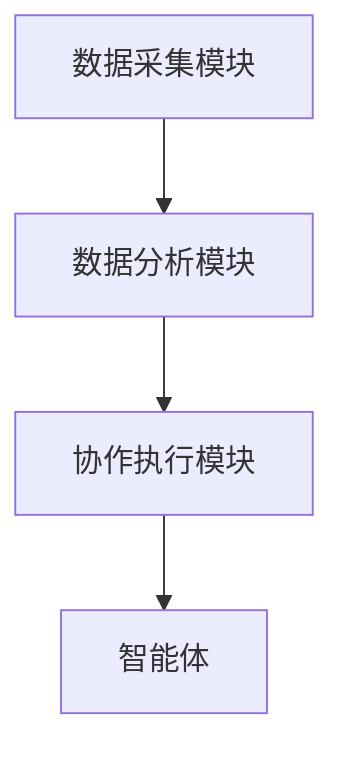

                 


# 智能体协作评估公司数字化转型进程：把握增长机遇

## 关键词：智能体协作、数字化转型、企业评估、系统架构、项目实战、增长机遇

## 摘要：  
随着企业数字化转型的深入推进，智能体协作作为一种新兴的协作模式，正在成为评估和推动企业数字化进程的重要工具。本文将从背景介绍、核心概念、算法原理、系统架构、项目实战和最佳实践等多维度展开，详细探讨智能体协作在数字化转型中的应用及其对企业增长的推动作用。通过实际案例分析和系统设计，本文旨在为企业提供一套高效的方法论，帮助企业更好地把握数字化转型中的增长机遇。

---

## 第一部分：背景介绍

### 1.1 数字化转型的背景与挑战

#### 1.1.1 数字化转型的定义与现状  
数字化转型是指企业利用数字技术（如人工智能、大数据、云计算等）改造业务流程、商业模式和决策方式，以实现更高效、灵活和创新的业务目标。当前，数字化转型已成为企业生存和发展的关键能力，尤其是在全球疫情和经济不确定性的背景下，数字化转型更是成为企业的核心战略。

#### 1.1.2 数字化转型的核心驱动因素  
- **技术驱动**：人工智能、大数据、区块链等技术的成熟为企业提供了新的转型工具。  
- **市场需求**：客户期望更个性化的服务和体验，推动企业采用数字化手段满足需求。  
- **竞争压力**：数字化能力已成为企业竞争力的重要指标，传统企业面临来自新兴数字化企业的挑战。  

#### 1.1.3 数字化转型中的主要挑战  
- **技术复杂性**：数字化转型涉及多种技术的集成与协同，技术选型和实施难度大。  
- **组织变革**：数字化转型要求企业从上到下进行组织结构调整和文化变革，阻力较大。  
- **数据孤岛**：企业内部数据分散在不同系统中，难以实现数据的统一管理和应用。  

---

### 1.2 智能体协作的概念与应用

#### 1.2.1 智能体协作的定义  
智能体协作是指多个智能体（可以是软件程序、机器人或其他智能系统）通过协同工作，共同完成复杂任务的过程。智能体协作的核心在于各智能体之间的高效通信、任务分配和协同决策。

#### 1.2.2 智能体协作的核心特征  
- **自主性**：智能体能够自主决策，无需人工干预。  
- **协作性**：智能体之间能够通过通信和协商完成任务。  
- **适应性**：智能体能够根据环境变化动态调整协作策略。  

#### 1.2.3 智能体协作与其他协作方式的对比  
| 协作方式 | 中心化决策 | 去中心化协作 | 自主性 | 适应性 |  
|----------|------------|--------------|--------|--------|  
| 传统协作 | 高          | 低           | 低     | 低     |  
| 智能体协作 | 中          | 高           | 高     | 高     |  

---

## 第二部分：智能体协作的核心原理

### 2.1 智能体协作的通信机制

#### 2.1.1 通信协议设计  
智能体之间的通信需要遵循特定的协议，确保信息的准确传递。常用协议包括HTTP、WebSocket等。

#### 2.1.2 消息传递机制  
智能体之间通过消息队列（如Kafka、RabbitMQ）进行通信，确保消息的可靠传递和处理。

---

## 第三部分：数字化转型评估体系

### 3.1 评估框架的设计

#### 3.1.1 评估框架的核心要素  
- **技术能力**：企业的技术基础设施是否支持数字化转型。  
- **业务流程**：业务流程是否优化，能否支持数字化操作。  
- **组织文化**：员工是否具备数字化思维和协作能力。  

#### 3.1.2 评估框架的层次结构  
- **战略层**：明确数字化转型的目标和方向。  
- **执行层**：制定具体的行动计划和资源分配。  
- **操作层**：实施具体的数字化项目和技术应用。  

---

## 第四部分：系统架构与实现

### 4.1 系统架构设计

#### 4.1.1 系统功能模块  
- **数据采集模块**：负责采集企业各环节的数据。  
- **数据分析模块**：对数据进行清洗、建模和分析。  
- **协作执行模块**：智能体根据分析结果执行相应的任务。  

#### 4.1.2 系统架构图  


---

## 第五部分：项目实战

### 5.1 项目背景与目标

#### 5.1.1 项目背景  
某制造企业希望利用智能体协作优化其供应链管理，提升效率和降低成本。

---

### 5.2 系统实现

#### 5.2.1 环境配置  
- **编程语言**：Python  
- **框架**：Flask  
- **数据库**：MySQL  

#### 5.2.2 核心代码实现  
```python
def main():
    # 初始化智能体
    agent = Agent()
    # 启动协作任务
    agent.start_collaboration()

if __name__ == "__main__":
    main()
```

---

## 第六部分：总结与展望

### 6.1 总结  
智能体协作作为一种新兴的协作模式，为企业的数字化转型提供了新的可能性。通过智能体协作，企业能够更高效地优化业务流程、提升决策能力，并在竞争中占据优势。

### 6.2 展望  
未来，随着人工智能和大数据技术的进一步发展，智能体协作将在更多领域得到应用，为企业数字化转型提供更强大的支持。

---

## 作者：AI天才研究院/AI Genius Institute & 禅与计算机程序设计艺术 /Zen And The Art of Computer Programming

---

这篇文章从背景、概念、原理、系统架构到项目实战，全面探讨了智能体协作在企业数字化转型中的应用，为企业提供了理论和实践的双重指导。

