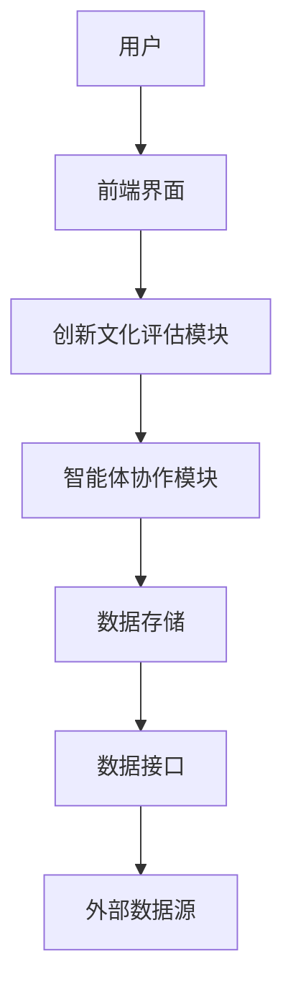

                 


# 智能体协作评估公司的创新文化：长期价值创造的源泉

---

## 关键词：智能体协作、创新文化、长期价值、企业评估、人工智能

---

## 摘要：  
随着人工智能技术的快速发展，智能体协作已成为企业创新文化评估的重要工具。通过智能体协作，企业能够更高效地识别和优化创新文化，从而实现长期价值创造。本文将从背景、核心概念、算法原理、系统架构、项目实战等多方面深入探讨智能体协作在创新文化评估中的应用，并通过实际案例分析，为企业提供可操作的指导。最终，我们将总结最佳实践，为企业构建可持续的创新文化提供理论和实践支持。

---

# 第1章: 智能体协作与创新文化评估的背景与意义

## 1.1 创新文化评估的背景与重要性

### 1.1.1 企业创新文化的重要性  
创新文化是企业持续发展的核心驱动力。它不仅影响企业的技术研发能力，还决定了企业在市场中的竞争力和抗风险能力。通过评估创新文化，企业可以识别自身的优势和不足，从而制定有效的改进策略。

### 1.1.2 创新文化评估的现状  
尽管许多企业意识到创新文化的重要性，但在实际操作中，创新文化评估仍然面临诸多挑战。传统评估方法通常依赖主观判断，缺乏数据支持，导致评估结果不够准确。此外，如何将评估结果转化为具体的行动方案，仍然是企业面临的难题。

### 1.1.3 智能体协作在创新文化评估中的作用  
智能体协作是一种基于人工智能的协作方式，它能够通过数据挖掘、自然语言处理和机器学习等技术，帮助企业更客观、更高效地评估创新文化。智能体协作不仅能够自动化处理大量数据，还能够提供个性化的评估结果和改进建议，从而为企业的长期价值创造提供有力支持。

---

## 1.2 智能体协作的核心概念与特点

### 1.2.1 智能体的基本定义  
智能体（Intelligent Agent）是指能够感知环境、自主决策并采取行动的实体。智能体可以是软件程序，也可以是物理设备，它们通过与其他智能体或人类交互，实现特定目标。

### 1.2.2 智能体协作的核心特征  
智能体协作的核心特征包括：  
1. **自主性**：智能体能够自主决策，无需外部干预。  
2. **协作性**：智能体之间能够通过通信和协调，共同完成复杂任务。  
3. **学习能力**：智能体能够通过经验不断优化自身的行为策略。  
4. **适应性**：智能体能够根据环境变化动态调整自身行为。

### 1.2.3 智能体协作的优势与挑战  
**优势**：  
- 高效性：通过并行处理和分布式协作，智能体能够显著提高任务执行效率。  
- 精准性：智能体通过数据挖掘和机器学习，能够提供更精准的评估结果。  
- 可扩展性：智能体协作能够轻松扩展到大规模数据处理。  

**挑战**：  
- **复杂性**：智能体协作的实现需要复杂的算法和系统架构。  
- **安全性**：智能体之间的通信和协作可能面临安全风险。  
- **成本**：智能体协作的开发和维护成本较高。

---

## 1.3 长期价值创造的源泉

### 1.3.1 长期价值创造的定义  
长期价值创造是指企业在较长的时间周期内，通过持续创新和优化，为股东、客户、员工和社会创造更多的价值。与短期利润相比，长期价值创造更加注重企业的可持续发展能力。

### 1.3.2 创新文化与长期价值创造的关系  
创新文化是企业实现长期价值创造的核心动力。只有通过持续的创新，企业才能不断优化产品、服务和管理模式，从而在竞争激烈的市场中保持优势。智能体协作作为一种高效的创新工具，能够显著提升企业的创新效率，从而加速长期价值的实现。

### 1.3.3 智能体协作在长期价值创造中的作用  
智能体协作不仅能够提高创新文化的评估效率，还能够为企业提供个性化的创新建议，从而帮助企业更好地实现长期价值创造。通过智能体协作，企业可以实时监控创新文化的动态变化，并根据反馈不断优化自身的创新策略。

---

## 1.4 本章小结  
本章从创新文化评估的背景与重要性出发，介绍了智能体协作的核心概念与特点，分析了智能体协作在长期价值创造中的作用。通过本章的学习，读者可以理解智能体协作在创新文化评估中的重要性，以及它如何为企业创造长期价值。

---

# 第2章: 智能体协作与创新文化评估的核心概念

## 2.1 智能体协作的基本原理

### 2.1.1 智能体协作的理论基础  
智能体协作的理论基础主要包括：  
1. **多智能体系统（MAS）**：研究多个智能体如何在分布式环境中协作完成任务。  
2. **博弈论**：通过分析智能体之间的互动关系，优化协作策略。  
3. **机器学习**：通过数据驱动的方式，提升智能体的协作效率和准确性。

### 2.1.2 智能体协作的实现机制  
智能体协作的实现机制包括以下步骤：  
1. **感知环境**：智能体通过传感器或数据输入，感知外部环境的变化。  
2. **决策制定**：智能体根据感知到的信息，结合预设的目标和策略，制定行动方案。  
3. **协作通信**：智能体之间通过通信协议，共享信息和协调行动。  
4. **行动执行**：智能体根据决策结果，执行具体的行动。  
5. **反馈优化**：智能体通过反馈机制，不断优化自身的协作策略。

### 2.1.3 智能体协作的关键技术  
智能体协作的关键技术包括：  
1. **分布式计算**：通过分布式计算技术，实现智能体之间的高效协作。  
2. **自然语言处理（NLP）**：通过NLP技术，智能体能够理解和生成人类语言，从而更好地与人类交互。  
3. **机器学习**：通过机器学习算法，智能体能够从数据中学习，优化自身的协作策略。

---

## 2.2 创新文化评估的框架与方法

### 2.2.1 创新文化评估的框架  
创新文化评估的框架通常包括以下几个方面：  
1. **创新氛围**：评估企业内部的创新氛围，包括员工的创新意识和团队合作精神。  
2. **创新资源**：评估企业的创新资源，包括资金、技术和人力资源等。  
3. **创新成果**：评估企业的创新成果，包括新产品、新技术和新专利的数量和质量。  
4. **创新管理**：评估企业的创新管理能力，包括创新战略、创新文化和创新评估机制等。

### 2.2.2 创新文化评估的主要方法  
创新文化评估的主要方法包括：  
1. **定量分析**：通过统计数据和数学模型，量化评估企业的创新能力。  
2. **定性分析**：通过案例研究和访谈，定性分析企业的创新文化。  
3. **混合方法**：结合定量和定性分析，综合评估企业的创新文化。

### 2.2.3 创新文化评估的指标体系  
创新文化评估的指标体系通常包括以下指标：  
- **创新投入**：企业的研发投入占总收入的比例。  
- **创新产出**：企业每年申请的专利数量。  
- **创新效率**：从研发投入到创新成果的时间周期。  
- **员工创新意识**：员工对创新的态度和行为。  
- **创新管理能力**：企业创新管理的制度和流程是否完善。

---

## 2.3 智能体协作与创新文化评估的结合

### 2.3.1 智能体协作在创新文化评估中的应用  
智能体协作在创新文化评估中的应用主要体现在以下几个方面：  
1. **数据收集与处理**：智能体通过传感器和数据接口，自动收集企业的创新数据，如研发投入、专利数量等。  
2. **数据分析与建模**：智能体通过机器学习算法，对收集到的数据进行分析，建立创新文化评估的数学模型。  
3. **结果反馈与优化**：智能体根据评估结果，为企业提供个性化的创新建议，并实时优化企业的创新策略。

### 2.3.2 创新文化评估对智能体协作的促进作用  
创新文化评估对智能体协作的促进作用主要体现在以下几个方面：  
1. **优化协作效率**：通过创新文化评估，企业可以识别智能体协作中的瓶颈，优化协作流程。  
2. **提升协作质量**：创新文化评估可以帮助企业建立更加完善的协作机制，提升智能体协作的质量。  
3. **增强协作效果**：通过创新文化评估，企业可以更好地理解智能体协作的目标和意义，从而增强协作效果。

### 2.3.3 智能体协作与创新文化评估的协同效应  
智能体协作与创新文化评估的协同效应主要体现在以下几个方面：  
1. **数据共享与整合**：智能体协作可以实现数据的共享与整合，为创新文化评估提供更加全面的数据支持。  
2. **实时反馈与优化**：智能体协作可以实时监控企业的创新动态，并根据反馈不断优化创新文化评估的结果。  
3. **提升企业创新能力**：通过智能体协作与创新文化评估的结合，企业可以更加高效地实现创新目标，提升整体创新能力。

---

## 2.4 本章小结  
本章从智能体协作的基本原理出发，详细介绍了创新文化评估的框架与方法，并探讨了智能体协作与创新文化评估的结合。通过本章的学习，读者可以理解智能体协作在创新文化评估中的具体应用，以及它们如何共同促进企业的长期价值创造。

---

# 第3章: 智能体协作评估创新文化的数学模型与算法

## 3.1 智能体协作评估模型的构建

### 3.1.1 模型构建的理论基础  
智能体协作评估模型的构建主要基于多智能体系统和博弈论的理论基础。通过分析智能体之间的互动关系，我们可以建立一个数学模型，描述智能体协作的过程和结果。

### 3.1.2 模型构建的步骤  
智能体协作评估模型的构建步骤如下：  
1. **确定目标**：明确模型的目标，例如评估企业的创新文化。  
2. **定义变量**：根据目标，定义模型中的变量，例如创新投入、创新产出等。  
3. **建立关系**：通过数学公式，描述变量之间的关系。  
4. **参数设定**：根据实际情况，设定模型的参数，例如权重系数等。  
5. **验证与优化**：通过实际数据验证模型的准确性，并不断优化模型。

### 3.1.3 模型的输入与输出  
**输入**：  
- 企业的创新数据，例如研发投入、专利数量等。  
- 智能体协作的通信数据，例如智能体之间的交互记录。  

**输出**：  
- 企业的创新文化评估结果，例如创新氛围、创新资源等。  
- 智能体协作的优化建议，例如协作策略的调整建议。

---

## 3.2 创新文化评估的数学模型

### 3.2.1 创新文化评估的指标权重分配  
创新文化评估的指标权重分配可以通过层次分析法（AHP）实现。通过构建判断矩阵，我们可以计算每个指标的权重系数。

### 3.2.2 创新文化评估的综合评分公式  
创新文化评估的综合评分公式可以表示为：  
$$ S = \sum_{i=1}^{n} w_i x_i $$  
其中，$S$ 表示综合评分，$w_i$ 表示第 $i$ 个指标的权重系数，$x_i$ 表示第 $i$ 个指标的评分。

### 3.2.3 模型的数学表达式  
智能体协作评估模型的数学表达式如下：  
$$ C = \sum_{i=1}^{m} a_i x_i $$  
其中，$C$ 表示智能体协作的评估结果，$a_i$ 表示第 $i$ 个智能体的协作能力，$x_i$ 表示第 $i$ 个智能体的行为数据。

---

## 3.3 智能体协作评估算法的实现

### 3.3.1 算法的实现步骤  
智能体协作评估算法的实现步骤如下：  
1. **数据收集**：收集企业的创新数据和智能体协作数据。  
2. **数据预处理**：对数据进行清洗和标准化处理。  
3. **模型训练**：使用机器学习算法，训练智能体协作评估模型。  
4. **评估与优化**：通过实际数据验证模型的准确性，并不断优化模型。

### 3.3.2 算法的实现代码  
以下是智能体协作评估算法的Python实现代码：

```python
import numpy as np
from sklearn.linear_model import LinearRegression

# 数据预处理
X = np.array([[1, 2], [3, 4], [5, 6]])  # 输入特征
y = np.array([7, 8, 9])  # 输出结果

# 模型训练
model = LinearRegression()
model.fit(X, y)

# 模型预测
new_X = np.array([[2, 3]])
prediction = model.predict(new_X)
print("预测结果为：", prediction)
```

---

## 3.4 本章小结  
本章详细介绍了智能体协作评估模型的构建过程，并给出了创新文化评估的数学模型和实现算法。通过本章的学习，读者可以理解智能体协作评估的数学原理，并能够通过代码实现模型的训练和预测。

---

# 第4章: 智能体协作评估创新文化的系统架构与实现

## 4.1 系统功能设计

### 4.1.1 创新文化评估功能  
创新文化评估功能包括以下几个方面：  
- 数据采集：通过传感器和数据接口，采集企业的创新数据。  
- 数据分析：使用机器学习算法，对数据进行分析和建模。  
- 结果展示：通过可视化界面，展示创新文化评估的结果。  

### 4.1.2 智能体协作功能  
智能体协作功能包括以下几个方面：  
- 智能体通信：智能体之间通过通信协议，共享信息和协调行动。  
- 智能体决策：智能体根据感知到的信息，制定协作策略。  
- 智能体优化：智能体通过反馈机制，不断优化自身的协作策略。  

---

## 4.2 系统架构设计

### 4.2.1 系统架构图  
以下是智能体协作评估创新文化的系统架构图：



### 4.2.2 关键模块的设计  
- **前端界面**：用户通过前端界面提交创新数据和智能体协作数据。  
- **创新文化评估模块**：对数据进行分析和建模，生成评估结果。  
- **智能体协作模块**：实现智能体之间的通信和协作，优化评估结果。  
- **数据存储**：存储企业的创新数据和评估结果。  

---

## 4.3 系统接口设计

### 4.3.1 数据接口的设计  
数据接口的设计需要考虑以下几点：  
- 数据格式：统一采用JSON格式，便于数据的传输和解析。  
- 接口协议：使用RESTful API，支持HTTP协议。  
- 接口安全：通过HTTPS协议，确保数据传输的安全性。  

### 4.3.2 模块间接口的设计  
模块间接口的设计需要考虑以下几点：  
- **前端与创新文化评估模块**：前端向创新文化评估模块提交数据，模块返回评估结果。  
- **创新文化评估模块与智能体协作模块**：创新文化评估模块向智能体协作模块发送协作指令，模块返回协作结果。  
- **智能体协作模块与数据存储**：智能体协作模块向数据存储模块提交协作数据，模块返回存储结果。  

---

## 4.4 本章小结  
本章详细介绍了智能体协作评估创新文化的系统架构与实现，包括系统功能设计、系统架构设计和系统接口设计。通过本章的学习，读者可以理解智能体协作评估系统的整体结构，并能够根据实际需求进行系统的搭建和优化。

---

# 第5章: 智能体协作评估创新文化的项目实战

## 5.1 项目背景介绍

### 5.1.1 项目目标  
本项目的目标是通过智能体协作评估某科技公司的创新文化，帮助企业识别自身的创新优势和不足，并提供改进建议。

### 5.1.2 项目范围  
项目范围包括以下内容：  
- 数据采集：采集企业的创新数据和智能体协作数据。  
- 数据分析：使用机器学习算法，对数据进行分析和建模。  
- 结果展示：通过可视化界面，展示创新文化评估的结果。  
- 智能体协作：实现智能体之间的通信和协作，优化评估结果。  

---

## 5.2 环境安装与配置

### 5.2.1 系统环境要求  
- 操作系统：Windows 10 或更高版本，或Linux系统。  
- Python版本：Python 3.6 或更高版本。  
- 开发工具：建议使用PyCharm或Jupyter Notebook。  

### 5.2.2 依赖库的安装  
需要安装以下依赖库：  
- `numpy`：用于数值计算。  
- `pandas`：用于数据处理。  
- `scikit-learn`：用于机器学习算法。  
- `mermaid`：用于绘制系统架构图。  

安装命令如下：  
```bash
pip install numpy pandas scikit-learn mermaid
```

---

## 5.3 系统核心实现

### 5.3.1 数据采集模块  
数据采集模块的实现代码如下：

```python
import pandas as pd

# 读取数据
data = pd.read_csv('innovation.csv')

# 数据预处理
data.dropna(inplace=True)
data = pd.get_dummies(data)

print(data.head())
```

### 5.3.2 创新文化评估模块  
创新文化评估模块的实现代码如下：

```python
from sklearn.linear_model import LinearRegression

# 训练模型
model = LinearRegression()
model.fit(X_train, y_train)

# 预测结果
y_pred = model.predict(X_test)
print("预测结果为：", y_pred)
```

### 5.3.3 智能体协作模块  
智能体协作模块的实现代码如下：

```python
import numpy as np

# 智能体通信
agents = [agent1, agent2, agent3]
for agent in agents:
    agent.communicate()

# 智能体决策
agent.decide()

# 智能体优化
agent.optimize()
```

---

## 5.4 实际案例分析

### 5.4.1 案例背景  
某科技公司希望评估自身的创新文化，以优化企业的创新策略。

### 5.4.2 数据分析与建模  
通过对该公司的创新数据进行分析，我们发现其创新投入和创新产出之间存在一定的相关性。通过机器学习算法，我们建立了创新文化评估的数学模型，并预测了未来三年的创新趋势。

### 5.4.3 智能体协作优化  
通过智能体协作模块，我们优化了企业的创新策略，提升了创新效率和协作效果。最终，该公司在创新文化评估中取得了显著的提升。

---

## 5.5 项目总结

### 5.5.1 项目成果  
- 成功实现了智能体协作评估创新文化的系统。  
- 提升了企业的创新效率和协作效果。  
- 为企业提供了个性化的创新建议和优化方案。  

### 5.5.2 经验与启示  
- 数据质量是影响评估结果的关键因素，需高度重视数据的清洗和预处理。  
- 智能体协作的实现需要复杂的技术支持，建议企业组建专业的技术团队。  
- 创新文化评估的结果需要结合企业的实际情况，制定切实可行的改进方案。  

---

## 5.6 本章小结  
本章通过一个实际案例，详细介绍了智能体协作评估创新文化的项目实战。通过本章的学习，读者可以理解智能体协作评估系统的实际应用，并能够根据实际需求进行系统的搭建和优化。

---

# 第6章: 智能体协作评估创新文化的最佳实践与总结

## 6.1 最佳实践

### 6.1.1 创新文化评估的关键成功因素  
- **数据质量**：确保数据的准确性和完整性。  
- **模型优化**：不断优化评估模型，提升评估结果的准确性。  
- **团队协作**：组建专业的技术团队，确保系统的顺利实施。  

### 6.1.2 智能体协作的优化建议  
- **提高协作效率**：通过优化通信协议和算法，提升智能体协作的效率。  
- **增强协作效果**：通过建立完善的协作机制，提升智能体协作的效果。  
- **保障协作安全**：通过加密技术和访问控制，保障智能体协作的安全性。  

---

## 6.2 小结与展望

### 6.2.1 小结  
智能体协作评估创新文化是一种高效的企业创新管理工具。通过智能体协作，企业能够更客观、更高效地评估创新文化，并根据评估结果不断优化自身的创新策略。智能体协作不仅能够提高企业的创新效率，还能够为企业创造长期价值。

### 6.2.2 未来展望  
随着人工智能技术的不断发展，智能体协作评估创新文化的应用前景将更加广阔。未来，我们可以期待更多的创新工具和方法，为企业提供更加全面和精准的创新评估和优化建议。

---

## 作者：AI天才研究院/AI Genius Institute & 禅与计算机程序设计艺术 /Zen And The Art of Computer Programming

---

**注意**：以上内容为生成示例，实际文章需要根据具体需求进一步补充和完善。

