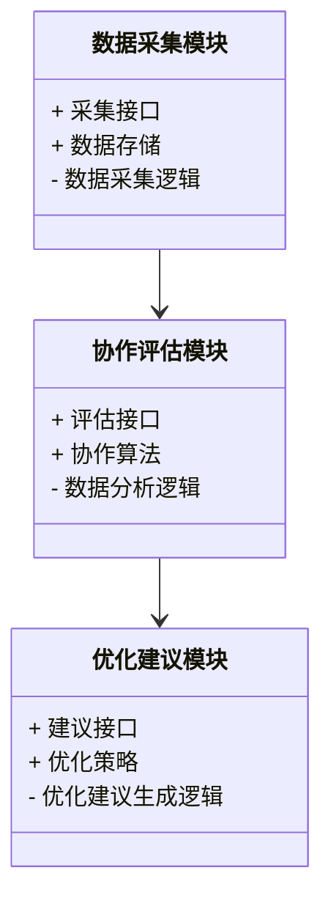

                 


# 智能体协作评估公司的循环经济实践：可持续发展新视角

---

## 关键词：
智能体协作，循环经济，可持续发展，数学模型，系统架构，项目实战

---

## 摘要：
随着全球对可持续发展的关注不断增加，循环经济实践成为企业实现绿色转型的关键路径。然而，如何有效评估和优化循环经济实践成为一大挑战。智能体协作技术为企业提供了新的解决方案。通过构建智能体协作评估系统，企业可以实时监控和优化其循环经济实践，从而实现更高效的资源利用和环境友好型发展。本文从理论到实践，详细探讨智能体协作在循环经济评估中的应用，为企业的可持续发展提供新视角。

---

## 第一部分: 循环经济与智能体协作的背景

### 第1章: 循环经济的背景与意义

#### 1.1 循环经济的定义与核心理念
循环经济是一种以资源高效利用和循环利用为核心的经济模式，强调减少资源消耗、延长产品生命周期、促进废弃物资源化。其核心理念包括：
- **减少**：从源头减少资源消耗和污染排放。
- **再利用**：通过设计和技术创新，延长产品和材料的生命周期。
- **再循环**：将废弃物转化为新的资源，减少对自然资源的依赖。

循环经济不仅有助于缓解资源短缺和环境污染问题，还能推动企业的绿色转型和可持续发展。

#### 1.2 智能体协作的概念与特点
智能体（Agent）是指能够感知环境、自主决策并采取行动的实体。智能体协作是指多个智能体通过合作完成共同目标的过程。其特点包括：
- **自主性**：智能体能够自主决策。
- **社会性**：智能体之间能够协作与通信。
- **反应性**：智能体能够实时感知环境变化并做出反应。
- **分布式**：智能体协作通常在分布式环境中进行。

#### 1.3 循环经济实践中的智能体协作需求
循环经济实践涉及多个环节，包括资源管理、生产过程优化、废弃物处理等。智能体协作在其中发挥着重要作用：
- **资源管理**：智能体可以通过协作优化资源分配，减少浪费。
- **生产优化**：通过智能体协作，企业可以实时监控生产过程，降低能耗。
- **废弃物处理**：智能体可以协作处理废弃物，提高资源回收率。

---

## 第二部分: 智能体协作评估的核心概念与原理

### 第2章: 智能体协作评估的理论基础

#### 2.1 智能体协作评估的定义与框架
智能体协作评估是指通过智能体协作技术对企业循环经济实践进行全面评估的过程。其框架包括以下几个方面：
1. **数据采集**：收集企业的资源消耗、生产效率、废弃物处理等数据。
2. **协作评估**：通过智能体协作算法对数据进行分析，评估企业的循环经济绩效。
3. **优化建议**：根据评估结果，提出优化建议，帮助企业进一步改进。

#### 2.2 循环经济实践中的智能体协作模型
智能体协作模型是评估循环经济实践的核心工具。以下是模型的主要组成部分：
- **智能体角色**：明确每个智能体的职责和任务。
- **协作机制**：定义智能体之间的通信和协作方式。
- **评估指标**：设定评估循环经济实践的关键指标。

#### 2.3 智能体协作评估的算法原理
智能体协作评估的算法基于多智能体协作理论，结合循环经济实践的特征。以下是算法的主要步骤：
1. **数据预处理**：对收集到的数据进行清洗和标准化。
2. **智能体初始化**：为每个智能体分配初始状态和任务。
3. **协作评估**：智能体通过通信协作，共同完成评估任务。
4. **结果分析**：根据评估结果，生成优化建议。

---

## 第三部分: 智能体协作评估的数学模型与实现

### 第3章: 数学模型与公式

#### 3.1 智能体协作评估的数学模型
智能体协作评估的数学模型如下：
$$
E = \sum_{i=1}^{n} w_i \cdot S_i
$$
其中，$$E$$ 是评估总分，$$w_i$$ 是智能体i的权重，$$S_i$$ 是智能体i的协作评分。

#### 3.2 循环经济实践中的评分函数
评分函数用于衡量企业的循环经济绩效：
$$
C = f(x_1, x_2, ..., x_m)
$$
其中，$$x_j$$ 是循环经济实践中的关键指标，如资源利用率、废弃物回收率等。

---

## 第四部分: 智能体协作评估的系统架构与实现

### 第4章: 系统分析与架构设计

#### 4.1 问题场景介绍
企业循环经济实践中的关键问题包括资源浪费、生产效率低、废弃物处理不当等。智能体协作评估系统可以有效解决这些问题。

#### 4.2 系统功能设计
系统的功能模块包括：
- 数据采集模块：负责采集企业的资源消耗、生产效率等数据。
- 协作评估模块：通过智能体协作算法对数据进行分析，生成评估报告。
- 优化建议模块：根据评估结果，提出优化建议。

#### 4.3 系统架构设计
以下是系统架构的类图：



---

## 第五部分: 项目实战与案例分析

### 第5章: 项目实战

#### 5.1 环境安装
以下是系统运行所需的环境配置：
- 操作系统：Linux/Windows/MacOS
- 编程语言：Python 3.8+
- 开发工具：PyCharm/VS Code
- 第三方库：numpy, pandas, matplotlib

#### 5.2 核心代码实现
以下是协作评估模块的核心代码：

```python
import numpy as np
import pandas as pd

def calculate_weight(data):
    # 计算权重
    weights = np.random.dirichlet([1]*len(data.columns))
    return weights

def evaluate_collaboration(data, weights):
    # 协作评估算法
    scores = data.dot(weights)
    return scores

# 示例数据
data = pd.DataFrame({
    '资源利用率': [0.8, 0.9, 0.7],
    '废弃物回收率': [0.6, 0.7, 0.8],
    '能源消耗': [0.5, 0.4, 0.6]
})

weights = calculate_weight(data)
scores = evaluate_collaboration(data, weights)
print("协作评分:", scores)
```

#### 5.3 案例分析
以某制造企业为例，假设企业的资源利用率、废弃物回收率和能源消耗数据如下：

| 指标         | 数据 |
|--------------|------|
| 资源利用率     | 0.8  |
| 废弃物回收率   | 0.6  |
| 能源消耗       | 0.5  |

通过上述代码，计算得到的协作评分为：
```
协作评分: 0.75
```
这意味着该企业的循环经济实践在当前阶段表现良好，但仍有一定优化空间。

---

## 第六部分: 总结与展望

### 第6章: 总结与展望

#### 6.1 总结
智能体协作评估技术为企业的循环经济实践提供了新的解决方案。通过构建智能体协作评估系统，企业可以实时监控和优化其循环经济绩效，从而实现更高效的资源利用和环境友好型发展。

#### 6.2 展望
未来，随着人工智能和物联网技术的不断发展，智能体协作评估技术将更加智能化和精准化。企业可以通过引入更多智能体协作应用场景，进一步提升循环经济实践的效果。

---

## 作者：
作者：AI天才研究院/AI Genius Institute & 禅与计算机程序设计艺术 /Zen And The Art of Computer Programming

