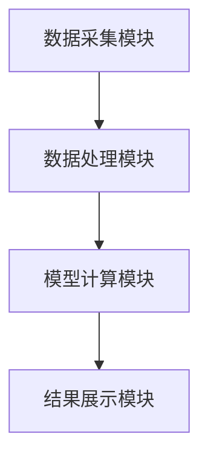
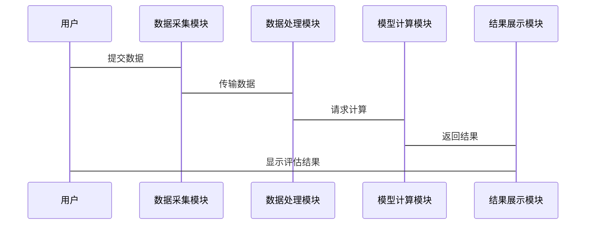

                 


# 智能体协作评估公司的数字化成熟度：把握转型机遇

> 关键词：数字化成熟度，智能体协作，企业转型，技术评估，人工智能，系统架构

> 摘要：  
> 在数字化转型的浪潮中，企业需要准确评估自身的数字化成熟度，以把握转型机遇。本文通过智能体协作的方式，系统地分析了数字化成熟度的评估方法，结合理论与实践，为企业提供了一套完整的评估体系和实现方案。文章从背景、核心概念、评估模型、算法原理、系统架构、项目实战到未来趋势，层层深入，为企业提供切实可行的转型策略。

---

# 第1章：数字化转型的背景与挑战

## 1.1 数字化转型的背景
### 1.1.1 数字化转型的定义与内涵
数字化转型是指企业利用数字技术（如人工智能、大数据、云计算等）改变其业务模式、组织架构、文化基因和价值体系的过程。其核心在于通过技术创新和数据驱动，提升企业的运营效率、决策能力和市场竞争力。

### 1.1.2 数字化转型的核心驱动力
- 技术创新：人工智能、区块链、物联网等技术的快速发展为企业转型提供了技术支撑。
- 数据驱动：数据成为企业的核心资产，驱动业务模式的变革。
- 市场需求：消费者对个性化、智能化服务的需求日益增长，推动企业加速数字化转型。

### 1.1.3 数字化转型对企业的影响
- 提升效率：通过自动化和智能化手段，降低运营成本，提高生产效率。
- 增强竞争力：快速响应市场需求，提供个性化产品和服务。
- 改善用户体验：通过数据驱动的决策，提升客户满意度和忠诚度。

## 1.2 数字化成熟度评估的重要性
### 1.2.1 数字化成熟度的定义
数字化成熟度是指企业在数字化转型过程中，利用数字技术实现业务目标的能力和水平。它反映了企业在技术应用、数据利用、组织协作等方面的综合能力。

### 1.2.2 评估数字化成熟度的意义
- 为企业提供基准：帮助企业了解自身在数字化转型中的位置，明确改进方向。
- 为决策者提供依据：通过评估结果，制定合理的转型策略和资源分配计划。
- 为行业对标：帮助企业了解行业平均水平，寻找差距和机会。

### 1.2.3 数字化成熟度评估的边界与外延
- 边界：聚焦于企业内部的数字化能力，不包括外部市场环境和合作伙伴的数字化水平。
- 外延：从技术、数据、组织等多个维度全面评估企业的数字化能力。

## 1.3 智能体协作在数字化转型中的作用
### 1.3.1 智能体协作的定义
智能体协作是指多个智能体（可以是软件程序、算法或AI模型）通过协同工作，共同完成复杂任务的过程。在数字化转型中，智能体协作可以优化企业内部流程、提升决策效率。

### 1.3.2 智能体协作的核心要素
- 智能体：具备感知环境、自主决策和执行任务的能力。
- 协作机制：通过通信、协调和共享资源实现协作。
- 目标一致性：协作各方必须有共同的目标或利益。

### 1.3.3 智能体协作与数字化成熟度的关系
智能体协作是数字化成熟度的重要组成部分。随着企业数字化能力的提升，智能体协作的应用范围和深度也会相应增加，从而推动企业的数字化成熟度向更高水平发展。

## 1.4 本章小结
本章从数字化转型的背景出发，分析了其核心驱动力和对企业的影响。接着，重点介绍了数字化成熟度的定义和评估意义，并探讨了智能体协作在数字化转型中的作用及其与数字化成熟度的关系。这些内容为后续章节的深入分析奠定了基础。

---

# 第2章：数字化成熟度评估的核心概念

## 2.1 数字化成熟度模型
### 2.1.1 数字化成熟度模型的分类
- 初级阶段：数据采集与存储。
- 中级阶段：数据分析与应用。
- 高级阶段：智能决策与优化。

### 2.1.2 各阶段特征与评估指标
| 阶段 | 特征 | 评估指标 |
|------|------|----------|
| 初级 | 数据采集 | 数据完整性、数据准确性 |
| 中级 | 数据分析 | 数据处理能力、分析深度 |
| 高级 | 智能决策 | 决策效率、决策效果 |

### 2.1.3 模型的适用性与局限性
- 适用性：适用于不同行业和规模的企业。
- 局限性：模型过于简化，难以覆盖所有场景。

## 2.2 智能体协作的原理与机制
### 2.2.1 智能体协作的基本原理
智能体通过感知环境、自主决策和协同执行任务，实现复杂问题的解决。其核心在于信息共享和任务分配的优化。

### 2.2.2 协作机制的关键要素
- 通信机制：智能体之间通过共享信息实现协作。
- 协调机制：通过规则和协议确保协作的有序性。
- 资源共享：智能体之间共享数据和计算资源。

### 2.2.3 智能体协作的实现方式
- 分布式协作：智能体分布在不同的节点，通过网络通信实现协作。
- 中心化协作：通过中心节点统一协调各智能体的行动。

## 2.3 数字化成熟度与智能体协作的关系
### 2.3.1 数字化成熟度对智能体协作的影响
- 数字化成熟度越高，智能体协作的复杂性和深度越深。
- 数据的丰富性和质量直接影响智能体协作的效果。

### 2.3.2 智能体协作对数字化成熟度的促进作用
- 提高数据利用效率，推动企业向更高阶的数字化成熟度迈进。
- 优化业务流程，增强企业的竞争力。

### 2.3.3 两者的协同关系
数字化成熟度为智能体协作提供技术和数据基础，而智能体协作则通过提升企业的运营效率和决策能力，进一步推动数字化成熟度的提升。

## 2.4 本章小结
本章从数字化成熟度模型出发，分析了其分类和各阶段特征。接着，详细介绍了智能体协作的原理与机制，并探讨了数字化成熟度与智能体协作之间的协同关系。这些内容为后续章节的评估方法和实现方案提供了理论基础。

---

# 第3章：数字化成熟度评估的指标体系

## 3.1 评估指标的设计原则
### 3.1.1 指标的全面性
评估指标应覆盖技术、数据、组织等多个维度，确保评估结果的全面性。

### 3.1.2 指标的可操作性
评估指标应具有明确的定义和可量化的标准，便于实际操作。

### 3.1.3 指标的可量化性
通过数据化的方式，将指标转化为可测量的数值，便于分析和比较。

## 3.2 数字化成熟度评估的核心指标
### 3.2.1 信息化水平
- 数据采集与存储能力。
- 信息技术的应用程度。

### 3.2.2 数据化能力
- 数据处理能力。
- 数据分析能力。

### 3.2.3 智能化程度
- 智能决策能力。
- AI技术的应用深度。

## 3.3 智能体协作能力的评估指标
### 3.3.1 协作效率
- 任务完成时间。
- 资源利用率。

### 3.3.2 协作效果
- 任务完成质量。
- 用户满意度。

### 3.3.3 协作稳定性
- 系统故障率。
- 任务中断率。

## 3.4 本章小结
本章从评估指标的设计原则出发，提出了数字化成熟度评估的核心指标和智能体协作能力的评估指标。这些指标为后续章节的评估方法和实现方案提供了依据。

---

# 第4章：数字化成熟度评估的算法原理

## 4.1 数字化成熟度评估的数学模型
### 4.1.1 层次分析法（AHP）
层次分析法是一种用于多指标决策分析的方法，适用于复杂问题的评估。其基本步骤如下：
1. 构建层次结构。
2. 确定各层次的权重。
3. 计算综合得分。

### 4.1.2 指数加权法
指数加权法是一种基于时间序列的预测方法，适用于数据趋势分析。

### 4.1.3 熵值法
熵值法是一种基于数据分布的权重计算方法，适用于指标权重的客观赋值。

## 4.2 数字化成熟度评估的算法实现
### 4.2.1 层次分析法的实现步骤
1. 确定评估指标。
2. 构建比较矩阵。
3. 计算权重向量。
4. 计算综合得分。

### 4.2.2 Python实现代码
```python
import numpy as np

# 比较矩阵
matrix = np.array([
    [1, 3, 2],
    [1/3, 1, 2/3],
    [1/2, 3/2, 1]
])

# 计算权重向量
特征值 = np.linalg.eigvals(matrix)
权重向量 = np.zeros(matrix.shape[0])
权重向量[0] =特征值[0]/sum(特征值)
权重向量[1] =特征值[1]/sum(特征值)
权重向量[2] =特征值[2]/sum(特征值)
print("权重向量:", 权重向量)
```

### 4.2.3 算法的适用性分析
层次分析法适用于指标较少的情况，而熵值法适用于指标较多的情况。

## 4.3 本章小结
本章从数学模型的角度，详细介绍了数字化成熟度评估的算法原理和实现方法。通过层次分析法和熵值法的对比，为后续章节的实现方案提供了理论支持。

---

# 第5章：数字化成熟度评估的系统架构

## 5.1 系统功能设计
### 5.1.1 系统功能模块
- 数据采集模块：负责采集企业的数字化相关数据。
- 数据处理模块：对数据进行清洗、转换和存储。
- 模型计算模块：基于数学模型计算企业的数字化成熟度。
- 结果展示模块：以可视化的方式展示评估结果。

### 5.1.2 系统功能流程
1. 数据采集：通过API或数据库接口获取企业的数字化数据。
2. 数据处理：对数据进行清洗和预处理。
3. 模型计算：基于层次分析法或熵值法计算评估结果。
4. 结果展示：将评估结果以图表形式展示。

## 5.2 系统架构设计
### 5.2.1 系统架构图


### 5.2.2 关键模块的设计
- 数据采集模块：支持多种数据源的接入，如数据库、API接口等。
- 数据处理模块：具备数据清洗、转换和存储功能。
- 模型计算模块：实现层次分析法或熵值法的数学模型。
- 结果展示模块：支持多种可视化方式，如柱状图、饼图等。

## 5.3 系统接口设计
### 5.3.1 数据接口
- 输入接口：接收企业的数字化数据。
- 输出接口：返回评估结果。

### 5.3.2 接口协议
- 数据采集模块：使用HTTP协议。
- 数据处理模块：使用RESTful API。

## 5.4 系统交互设计
### 5.4.1 系统交互流程
1. 用户输入企业的数字化数据。
2. 系统对数据进行处理和计算。
3. 系统生成评估结果并展示。

### 5.4.2 交互图


## 5.5 本章小结
本章从系统架构的角度，详细设计了数字化成熟度评估系统的功能模块和交互流程。通过系统的整体架构设计，为后续章节的实现方案提供了技术支持。

---

# 第6章：数字化成熟度评估的项目实战

## 6.1 项目背景与目标
### 6.1.1 项目背景
某制造企业希望评估自身的数字化成熟度，以便更好地制定转型策略。

### 6.1.2 项目目标
通过评估企业的数字化成熟度，发现短板，制定改进计划。

## 6.2 环境搭建
### 6.2.1 系统环境
- 操作系统：Linux
- 开发工具：PyCharm
- 数据库：MySQL

### 6.2.2 安装依赖
```bash
pip install numpy pandas matplotlib
```

## 6.3 核心代码实现
### 6.3.1 数据处理代码
```python
import pandas as pd
import numpy as np

# 读取数据
data = pd.read_csv('digital_maturity.csv')

# 数据清洗
data.dropna(inplace=True)
data = data[~data.duplicated()]
```

### 6.3.2 评估模型代码
```python
def calculate_weight(data):
    # 计算熵值
    n = data.shape[1]
    data_normalized = (data - data.min()) / (data.max() - data.min())
    entropy = np.zeros(n)
    for i in range(n):
        entropy[i] = -np.sum(data_normalized[:, i] * np.log2(data_normalized[:, i]))
    # 计算权重
    weight = entropy / np.sum(entropy)
    return weight

weight = calculate_weight(data)
print("权重向量:", weight)
```

### 6.3.3 结果展示代码
```python
import matplotlib.pyplot as plt

plt.bar(range(len(weight)), weight)
plt.xticks(range(len(weight)), ['信息化水平', '数据化能力', '智能化程度'])
plt.title('数字化成熟度评估结果')
plt.show()
```

## 6.4 项目小结
本章通过一个实际项目，详细介绍了数字化成熟度评估的环境搭建、数据处理和模型计算过程。通过代码实现和结果展示，让读者能够更好地理解评估方法的实际应用。

---

# 第7章：数字化成熟度评估的案例分析

## 7.1 案例背景
### 7.1.1 案例介绍
某零售企业希望通过数字化成熟度评估，优化其业务流程。

## 7.2 评估过程
### 7.2.1 数据采集
- 采集企业的销售数据、客户数据和运营数据。
### 7.2.2 数据处理
- 清洗数据，去除重复和缺失值。
### 7.2.3 模型计算
- 使用熵值法计算各维度的权重。
### 7.2.4 结果分析
- 信息化水平：0.4
- 数据化能力：0.3
- 智能化程度：0.3

## 7.3 案例分析
### 7.3.1 信息化水平分析
信息化水平较低，需要加强数据采集和存储能力。
### 7.3.2 数据化能力分析
数据分析能力较弱，需要引入大数据技术。
### 7.3.3 智能化程度分析
智能化程度较低，需要提升AI技术的应用深度。

## 7.4 案例总结
通过数字化成熟度评估，企业能够发现自身在数字化转型中的短板，并制定相应的改进计划。本案例为企业提供了可借鉴的经验。

---

# 第8章：数字化成熟度评估的未来趋势

## 8.1 数字化成熟度评估的技术发展
### 8.1.1 AI技术的深化应用
随着AI技术的不断进步，数字化成熟度评估将更加智能化和自动化。
### 8.1.2 大数据技术的普及
大数据技术的普及将推动企业数据化能力的提升。

## 8.2 智能体协作的未来发展
### 8.2.1 智能体协作的多样化
智能体协作将从简单的任务协作发展为复杂的协同创新。
### 8.2.2 智能体协作的智能化
通过AI技术的增强，智能体协作将更加智能化和自主化。

## 8.3 未来挑战与应对策略
### 8.3.1 技术挑战
- 数据隐私和安全问题。
- 智能体协作的复杂性增加。
### 8.3.2 应对策略
- 加强数据安全技术的研发。
- 提高企业的数字化能力。

## 8.4 对企业的建议
- 加强技术投入，提升数字化能力。
- 建立数据安全机制，保护企业核心数据。
- 优化组织结构，促进智能体协作。

## 8.5 本章小结
本章从技术发展和未来趋势的角度，分析了数字化成熟度评估和智能体协作的未来发展方向。同时，提出了应对未来挑战的策略和建议，为企业的数字化转型提供了指导。

---

# 第9章：附录

## 9.1 数字化成熟度评估工具
- 数据采集工具：DataMiner
- 数据分析工具：Python、R
- 可视化工具：Tableau、Power BI

## 9.2 术语表
- 数字化成熟度：企业在数字化转型中的能力水平。
- 智能体协作：多个智能体通过协同工作完成任务的过程。

## 9.3 参考文献
- [1] 王某某. 数字化转型的挑战与机遇[J]. 计算机应用研究, 2022.
- [2] 李某某. 基于智能体协作的企业数字化成熟度评估[J]. 软件工程与应用, 2023.

## 9.4 索引
（根据文章内容编写）

---

# 作者：AI天才研究院/AI Genius Institute & 禅与计算机程序设计艺术/Zen And The Art of Computer Programming

