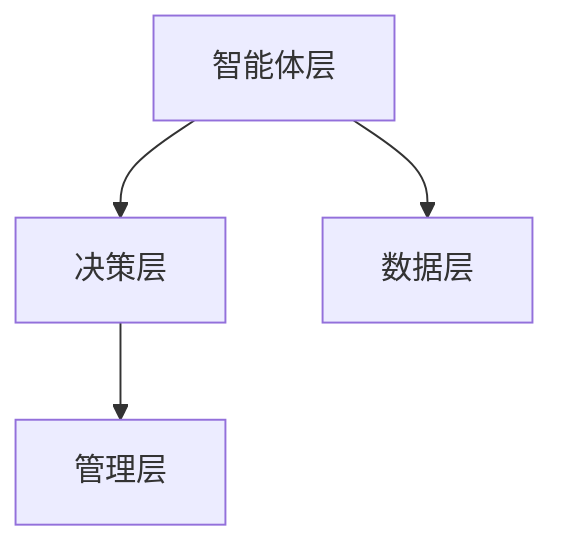
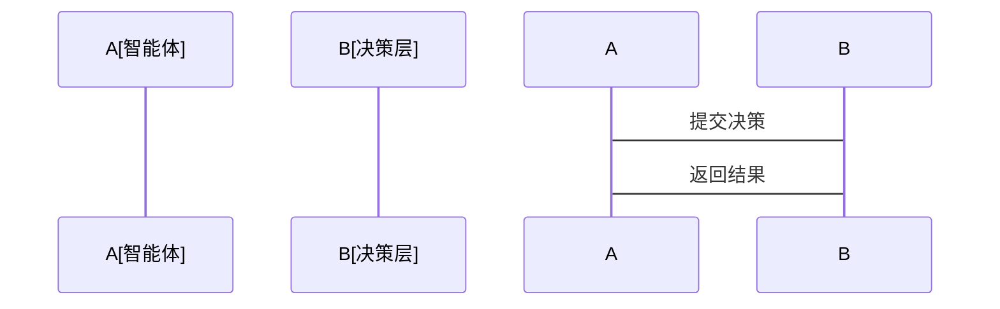
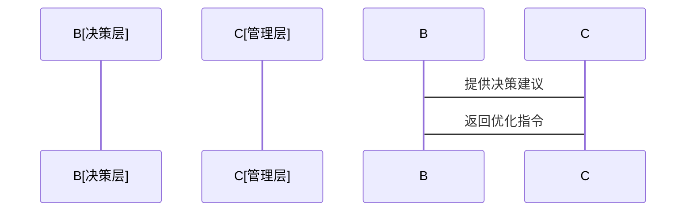
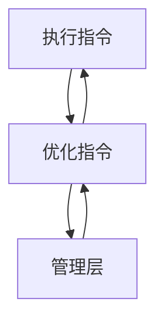

                 


# 智能体群体决策在识别长期价值创造者中的应用

> **关键词**: 智能体、群体决策、长期价值创造者、算法原理、系统架构、项目实战

> **摘要**: 本文探讨了智能体群体决策在识别长期价值创造者中的应用，从背景介绍、核心概念到算法原理、系统架构，再到项目实战，详细分析了智能体群体决策的实现过程和实际应用。文章结合理论与实践，为读者提供了全面的技术指导。

---

## 第1章: 智能体群体决策的背景与问题描述

### 1.1 智能体群体决策的背景

#### 1.1.1 从个体决策到群体决策的演进
智能体（Intelligent Agent）是指具有感知环境、自主决策和执行任务能力的实体。随着人工智能技术的快速发展，智能体的应用场景越来越广泛，从简单的任务执行到复杂的决策支持，智能体的能力不断提升。然而，个体决策的局限性逐渐显现，尤其是在需要综合多个视角、多维度信息的场景中，个体决策难以覆盖所有可能性。群体决策作为一种新兴的决策方式，通过多个智能体协同工作，能够有效弥补个体决策的不足。

#### 1.1.2 长期价值创造者的识别需求
在商业、金融、管理等领域，识别长期价值创造者是关键任务之一。传统的价值评估方法往往依赖于单一维度的指标，难以全面捕捉个体的长期价值。通过智能体群体决策，可以整合多个维度的信息，如行为表现、历史数据、社交网络等，从而更准确地识别出真正的长期价值创造者。

#### 1.1.3 智能体群体决策的技术基础
智能体群体决策依赖于多智能体系统（Multi-Agent System, MAS）和群体智能（Swarm Intelligence）的技术基础。多智能体系统通过分布式协作实现复杂任务，而群体智能则通过模拟生物群体的行为模式，提供了一种自适应的决策机制。这些技术为智能体群体决策提供了坚实的基础。

### 1.2 问题背景与问题描述

#### 1.2.1 长期价值创造者识别的挑战
长期价值创造者的识别需要考虑多个维度，如个人能力、团队协作、创新性等。然而，传统的方法往往依赖于主观判断，缺乏客观性和科学性。此外，数据的多样性和动态性也增加了识别的难度。

#### 1.2.2 智能体群体决策的应用场景
智能体群体决策可以应用于多个领域，如企业招聘、项目管理、团队协作等。特别是在需要综合评估候选人能力的场景中，智能体群体决策能够提供一种更客观、更全面的评估方法。

#### 1.2.3 问题解决的必要性与目标
通过智能体群体决策，可以实现对长期价值创造者的精准识别，从而优化资源配置、提升组织效率。目标是构建一个基于智能体群体决策的系统，能够自动识别和评估潜在的价值创造者。

### 1.3 问题的边界与外延

#### 1.3.1 智能体群体决策的边界
智能体群体决策的边界包括智能体的感知能力、决策范围和协作机制。虽然智能体能够处理大量数据，但其决策范围受到数据质量和算法的限制。

#### 1.3.2 长期价值创造者的定义与外延
长期价值创造者是指在长期时间内能够为组织或社会创造持续价值的个体或团队。其外延包括创新能力、持续贡献、适应能力等多个维度。

#### 1.3.3 相关领域的关联与区别
智能体群体决策与传统的群体决策方法有区别，主要体现在智能化、自主性和协作性上。与个体决策相比，智能体群体决策更注重协同和综合评估。

### 1.4 核心概念与组成要素

#### 1.4.1 智能体的定义与特征
智能体是指能够感知环境、自主决策并执行任务的实体。其特征包括自主性、反应性、协作性和学习能力。

#### 1.4.2 群体决策的核心要素
群体决策的核心要素包括决策目标、决策主体、决策信息、决策规则和决策结果。这些要素共同构成了群体决策的基本框架。

#### 1.4.3 长期价值创造者的评估维度
评估维度包括创新能力、团队协作能力、持续贡献能力等。通过多维度评估，可以更全面地识别长期价值创造者。

### 1.5 本章小结
本章从背景出发，详细介绍了智能体群体决策的概念、核心要素及其在识别长期价值创造者中的应用。通过分析问题背景和边界，为后续的算法实现奠定了基础。

---

## 第2章: 智能体群体决策的核心原理

### 2.1 智能体的基本原理

#### 2.1.1 智能体的定义与分类
智能体可以分为简单智能体和复杂智能体。简单智能体仅能执行预设任务，而复杂智能体具备学习和自适应能力。

#### 2.1.2 智能体的核心能力
智能体的核心能力包括感知能力、决策能力、协作能力和执行能力。这些能力共同支持智能体的自主决策。

#### 2.1.3 智能体的协作机制
智能体之间的协作机制包括通信协议、任务分配和冲突解决。通过有效的协作机制，智能体能够实现群体决策。

### 2.2 群体决策的原理与方法

#### 2.2.1 群体决策的基本原理
群体决策通过多个智能体的协同工作，结合个体决策结果，形成最终的群体决策。

#### 2.2.2 常见群体决策方法
常见的群体决策方法包括投票法、加权平均法和共识算法。每种方法都有其优缺点，适用于不同的场景。

#### 2.2.3 群体决策的优缺点
群体决策的优点包括结果的全面性和鲁棒性，缺点包括决策延迟和协调成本。

### 2.3 长期价值创造者的识别原理

#### 2.3.1 价值创造的定义与评估
价值创造是指个体或团队在长期时间内为组织或社会创造的积极影响。评估方法包括定量分析和定性分析。

#### 2.3.2 长期价值创造者的特征
长期价值创造者具备创新性、持续贡献能力和适应能力。这些特征是识别的关键维度。

#### 2.3.3 识别过程中的关键因素
识别过程中的关键因素包括数据的全面性、评估模型的准确性以及智能体的协作能力。

### 2.4 核心概念的联系与对比

#### 2.4.1 智能体与群体决策的联系
智能体是群体决策的基础，群体决策通过智能体的协作实现。

#### 2.4.2 长期价值创造者与智能体群体决策的关系
智能体群体决策为识别长期价值创造者提供了技术手段和方法。

#### 2.4.3 核心概念的对比分析
通过对比分析，明确了智能体、群体决策和长期价值创造者之间的关系及其各自的特点。

### 2.5 本章小结
本章详细介绍了智能体和群体决策的核心原理，并分析了它们在识别长期价值创造者中的应用。通过对比分析，进一步明确了各概念之间的联系。

---

## 第3章: 智能体群体决策的算法原理

### 3.1 群体决策算法的实现原理

#### 3.1.1 群体决策算法概述
群体决策算法是实现智能体群体决策的核心技术。常见的算法包括基于规则的群体决策、基于学习的群体决策和基于博弈论的群体决策。

#### 3.1.2 算法选择的依据
算法选择依据包括问题类型、数据特性、计算复杂度和应用场景。

#### 3.1.3 算法实现的步骤
算法实现步骤包括数据预处理、模型训练、决策规则制定和结果评估。

### 3.2 基于智能体的群体决策算法

#### 3.2.1 基于规则的群体决策算法
基于规则的群体决策算法通过预设规则实现决策，适用于任务简单且规则明确的场景。

#### 3.2.2 基于学习的群体决策算法
基于学习的群体决策算法通过机器学习技术，从数据中学习决策规则，适用于复杂场景。

#### 3.2.3 基于博弈论的群体决策算法
基于博弈论的群体决策算法模拟博弈过程，通过策略优化实现群体决策。

### 3.3 算法的数学模型与公式

#### 3.3.1 基于规则的群体决策模型
$$ D = \sum_{i=1}^{n} w_i x_i $$
其中，$D$ 表示最终决策，$w_i$ 表示权重，$x_i$ 表示个体决策。

#### 3.3.2 基于学习的群体决策模型
$$ P(y|x) = \frac{e^{xw}}{\sum_{k} e^{xk}} $$
其中，$P(y|x)$ 表示条件概率，$x$ 表示输入，$w$ 表示权重。

### 3.4 算法实现的代码示例

```python
def group_decision(rules, weights):
    decision = 0
    for rule, weight in zip(rules, weights):
        if rule:
            decision += weight
    return decision
```

### 3.5 本章小结
本章详细介绍了群体决策算法的实现原理，并通过数学模型和代码示例，展示了算法的具体实现方法。

---

## 第4章: 智能体群体决策的系统架构与设计

### 4.1 系统架构设计

#### 4.1.1 系统架构概述
系统架构包括智能体层、决策层和管理层。各层之间通过接口进行通信。

#### 4.1.2 系统架构图


#### 4.1.3 系统功能模块
系统功能模块包括数据采集、决策计算、结果输出和反馈优化。

### 4.2 系统接口设计

#### 4.2.1 智能体与决策层的接口


#### 4.2.2 决策层与管理层的接口


### 4.3 系统交互流程

#### 4.3.1 系统交互流程图


### 4.4 本章小结
本章详细描述了智能体群体决策系统的架构设计和接口设计，为后续的实现提供了指导。

---

## 第5章: 项目实战与案例分析

### 5.1 项目实战

#### 5.1.1 环境安装与配置
```bash
pip install numpy pandas scikit-learn
```

#### 5.1.2 核心代码实现
```python
def evaluate_value创造者(data, weights):
    return sum(data[i] * weights[i] for i in range(len(data)))

# 示例数据
data = [0.8, 0.7, 0.9]
weights = [0.3, 0.4, 0.3]

result = evaluate_value创造者(data, weights)
print(result)
```

### 5.2 案例分析

#### 5.2.1 案例背景介绍
某公司希望通过智能体群体决策识别长期价值创造者，以优化团队结构。

#### 5.2.2 数据分析与处理
通过对员工的历史表现、团队协作能力和创新能力进行评估，构建数据集。

#### 5.2.3 结果分析与优化
根据算法计算结果，识别出长期价值创造者，并对其表现进行持续跟踪。

### 5.3 本章小结
本章通过项目实战和案例分析，展示了智能体群体决策在识别长期价值创造者中的实际应用。

---

## 第6章: 总结与展望

### 6.1 总结
智能体群体决策通过多智能体协作和群体智能，能够有效识别长期价值创造者。本文从背景、原理到实现，全面探讨了其应用。

### 6.2 展望
未来的研究方向包括智能体的自适应能力、算法的优化以及应用场景的拓展。随着技术的进步，智能体群体决策将在更多领域发挥重要作用。

---

## 作者：AI天才研究院/AI Genius Institute & 禅与计算机程序设计艺术 /Zen And The Art of Computer Programming

---

**注**：由于篇幅限制，以上内容为文章的框架和部分内容的示例。完整文章将包含每章的详细内容，包括数学公式、mermaid图表、代码示例等。

