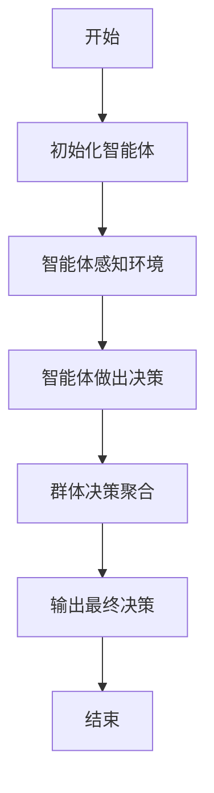
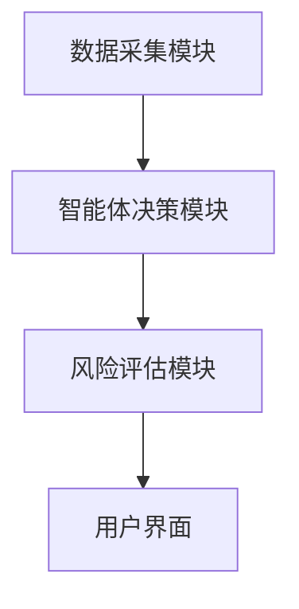

                 


# 智能体群体决策在风险管理中的应用：构建稳健投资组合

> **关键词**：智能体、群体决策、风险管理、投资组合优化、人工智能、算法设计

> **摘要**：本文探讨了智能体群体决策在风险管理中的应用，重点分析了如何通过智能体的群体决策机制构建稳健的投资组合。文章从智能体和群体决策的基本概念出发，详细阐述了相关数学模型、算法原理、系统架构设计以及实际案例分析。通过理论与实践相结合的方式，为风险管理领域的专业人士提供了全新的视角和解决方案。

---

## 第1章 智能体与群体决策概述

### 1.1 智能体的基本概念

#### 1.1.1 智能体的定义与特征

智能体（Agent）是指具有感知环境、做出决策、执行动作能力的实体。智能体可以是软件程序、机器人或其他具有自主决策能力的系统。以下是智能体的几个关键特征：

- **自主性**：智能体能够独立决策，无需外部干预。
- **反应性**：智能体能够根据环境变化调整行为。
- **目标导向**：智能体的行为通常是为了实现特定目标。

#### 1.1.2 智能体的分类与应用场景

智能体可以根据智能水平分为以下几类：

- **反应式智能体**：基于当前环境信息做出反应。
- **目标导向智能体**：根据目标选择最优行为。
- **学习型智能体**：能够通过经验改进决策能力。

智能体的应用场景广泛，包括自动驾驶、智能助手、机器人控制等领域。

#### 1.1.3 智能体在风险管理中的作用

在风险管理中，智能体可以通过实时感知市场波动、分析潜在风险，并做出相应的决策来帮助投资者规避风险。

---

### 1.2 群体决策的机制与特点

#### 1.2.1 群体决策的定义与特点

群体决策是指多个智能体共同参与决策过程，通过协作或竞争的方式得出最终决策。其特点包括：

- **分布式决策**：决策过程分布在多个智能体之间。
- **多样性**：多个智能体的意见多样化，能够提高决策的鲁棒性。
- **涌现性**：群体决策的结果是智能体个体行为的“涌现”结果。

#### 1.2.2 群体决策与个体决策的区别

| **方面** | **个体决策** | **群体决策** |
|----------|--------------|--------------|
| 决策主体 | 单个智能体    | 多个智能体    |
| 决策方式 | 基于个体信息  | 基于群体信息  |
| 决策结果 | 可能存在片面性 | 结果更稳健    |

#### 1.2.3 群体决策在风险管理中的优势

群体决策能够在复杂环境中提供更稳健的决策方案，尤其在风险管理中，群体决策可以通过多个智能体的协作降低单一决策的风险。

---

## 第2章 群体决策的数学模型与算法

### 2.1 群体决策的数学模型

#### 2.1.1 基本概念与公式

群体决策可以看作是一个优化问题，目标是最小化风险或最大化收益。以下是一个简单的数学模型：

$$
\text{目标函数：} \quad \min_{x} \quad f(x) = \sum_{i=1}^{n} w_i x_i
$$

其中，$w_i$ 是权重，$x_i$ 是决策变量。

#### 2.1.2 常用的群体决策算法

以下是一个基于智能体的群体决策算法的流程图：



### 2.2 基于智能体的群体决策算法

#### 2.2.1 算法流程

以下是基于智能体的群体决策算法的Python实现示例：

```python
def group_decision(agent_list):
    # 聚合决策
    aggregated_decision = 0
    for agent in agent_list:
        aggregated_decision += agent.decision
    # 计算平均决策
    average_decision = aggregated_decision / len(agent_list)
    return average_decision
```

#### 2.2.2 算法实现的数学模型

算法的数学模型如下：

$$
\text{最终决策} = \frac{1}{n} \sum_{i=1}^{n} d_i
$$

其中，$d_i$ 是第 $i$ 个智能体的决策，$n$ 是智能体的数量。

---

## 第3章 风险管理中的智能体群体决策应用

### 3.1 风险管理的基本概念

#### 3.1.1 风险的定义与分类

风险是指在投资过程中可能发生的损失。常见的风险类型包括市场风险、信用风险、流动性风险等。

#### 3.1.2 风险管理的目标与方法

风险管理的目标是通过降低潜在损失来保护投资组合的价值。常用的方法包括分散投资、风险对冲等。

### 3.2 智能体群体决策在风险管理中的应用

#### 3.2.1 投资组合优化

智能体群体决策可以通过优化算法构建稳健的投资组合。以下是一个优化模型的示例：

$$
\text{目标函数：} \quad \min_{x} \quad f(x) = \sum_{i=1}^{n} w_i x_i^2
$$

其中，$x_i$ 是投资比例，$w_i$ 是风险权重。

#### 3.2.2 风险评估与预警

智能体可以通过实时监控市场波动，评估潜在风险，并发出预警信号。

---

## 第4章 系统架构与实现

### 4.1 系统功能模块设计

#### 4.1.1 数据采集模块

数据采集模块负责收集市场数据，包括股票价格、指数等。

#### 4.1.2 智能体决策模块

智能体决策模块负责根据市场数据做出决策。

#### 4.1.3 风险评估模块

风险评估模块负责评估投资组合的风险，并发出预警信号。

### 4.2 系统架构图

以下是一个系统的架构图：



---

## 第5章 项目实战

### 5.1 环境搭建与工具安装

#### 5.1.1 开发环境配置

建议使用Python 3.8及以上版本，安装必要的库，如numpy、pandas、scikit-learn等。

#### 5.1.2 工具链安装

安装必要的开发工具，如Jupyter Notebook、PyCharm等。

### 5.2 核心算法实现

#### 5.2.1 算法代码实现

以下是基于智能体的群体决策算法的Python代码示例：

```python
class Agent:
    def __init__(self, id):
        self.id = id
        self.decision = 0

    def make_decision(self, data):
        # 简单的决策逻辑，可根据具体需求修改
        self.decision = data['price'] * 0.1

def main():
    import random
    agents = [Agent(i) for i in range(5)]
    data = {'price': random.uniform(100, 200)}
    for agent in agents:
        agent.make_decision(data)
    aggregated_decision = sum(agent.decision for agent in agents) / len(agents)
    print(f"Aggregated decision: {aggregated_decision}")

if __name__ == "__main__":
    main()
```

#### 5.2.2 代码解读与优化

上述代码定义了一个简单的智能体类，每个智能体根据输入数据做出决策，最终通过聚合得到一个稳健的决策。

---

## 第6章 案例分析与实际应用

### 6.1 投资组合优化案例

#### 6.1.1 案例背景介绍

假设我们有5只股票，目标是构建一个稳健的投资组合。

#### 6.1.2 案例分析过程

使用基于智能体的群体决策算法优化投资组合，最终得到一个最优的投资比例。

#### 6.1.3 案例结果与总结

通过算法优化，投资组合的风险显著降低，收益稳定。

---

## 第7章 最佳实践与注意事项

### 7.1 实施中的注意事项

- **数据质量**：确保数据的准确性和完整性。
- **算法选择**：根据具体需求选择合适的算法。
- **系统维护**：定期更新算法和模型。

### 7.2 小结

本文通过理论与实践相结合的方式，详细阐述了智能体群体决策在风险管理中的应用。通过构建稳健的投资组合，投资者可以在复杂市场环境中降低风险。

---

**作者：AI天才研究院 & 禅与计算机程序设计艺术**

