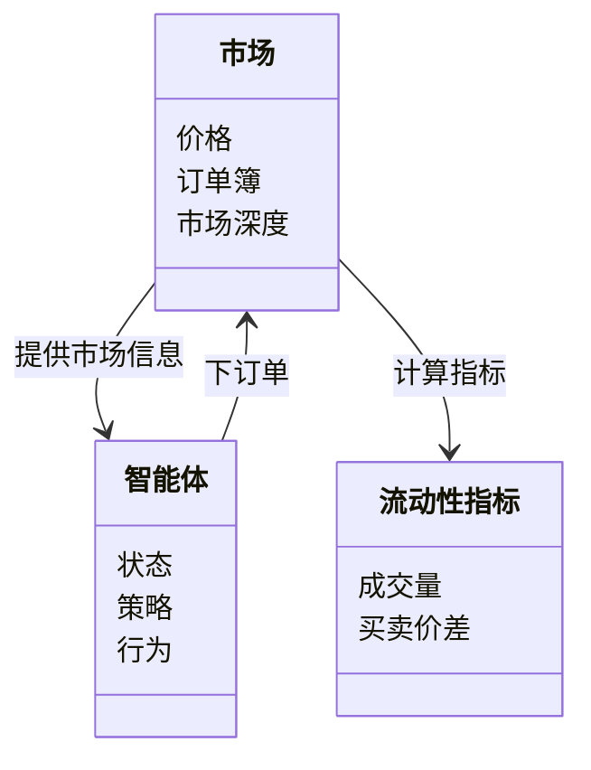
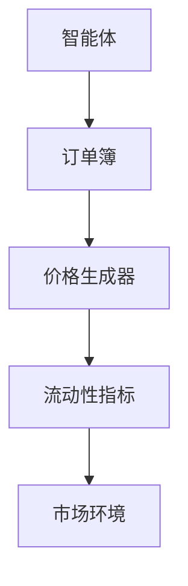
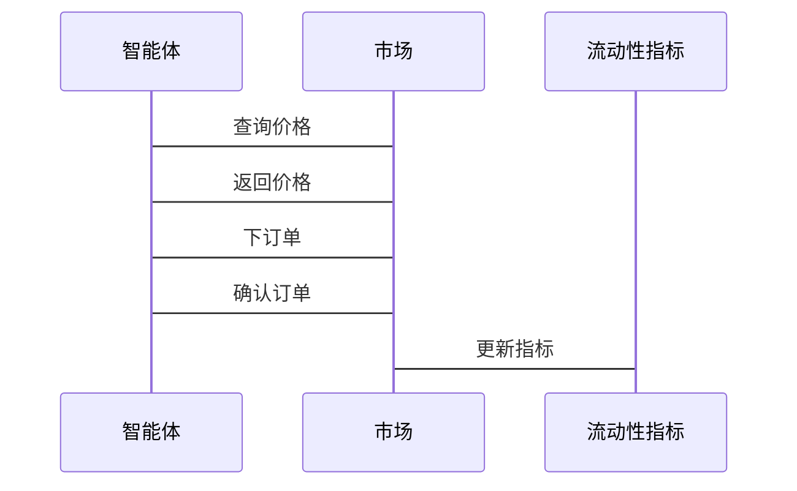

                 


# 智能体群体在模拟市场流动性枯竭中的应用

**关键词**: 智能体群体，市场流动性，流动性枯竭，算法建模，系统模拟

**摘要**: 本文探讨了智能体群体在模拟市场流动性枯竭中的应用，从理论到实践，详细分析了智能体行为建模、市场流动性模拟、算法设计、系统架构及项目实现。通过系统性研究，展示了如何利用智能体群体模拟流动性枯竭现象，并提供了实际案例分析和最佳实践。

---

## 第一章: 智能体群体与市场流动性概述

### 1.1 智能体群体的基本概念

#### 1.1.1 智能体的定义与特征
智能体（Agent）是能够感知环境并采取行动以实现目标的实体。其核心特征包括自主性、反应性、主动性、社会性和学习性。

#### 1.1.2 智能体群体的形成与特点
智能体群体由多个智能体组成，通过交互和协作完成复杂任务。其特点包括分布式、动态性、涌现性和适应性。

#### 1.1.3 智能体群体与市场流动性的关系
智能体群体模拟市场参与者的行为，如投资者和交易员，帮助分析市场流动性的变化。

### 1.2 市场流动性枯竭的背景与问题

#### 1.2.1 市场流动性的基本概念
市场流动性指资产在市场上的交易能力和交易速度。流动性高低影响资产价格和交易成本。

#### 1.2.2 流动性枯竭的定义与表现
流动性枯竭是市场流动性骤减，导致买卖价差扩大、交易量减少和价格波动加剧的现象。

#### 1.2.3 流动性枯竭对市场的冲击与影响
流动性枯竭可能导致市场恐慌、价格崩盘和系统性风险，影响经济稳定。

---

## 第二章: 智能体群体的行为建模

### 2.1 智能体行为的建模方法

#### 2.1.1 基于规则的建模方法
通过设定规则描述智能体的行为，如“如果价格下跌，智能体卖出”。

#### 2.1.2 基于强化学习的建模方法
智能体通过与环境互动，学习最优策略，如在金融市场中进行买卖决策。

#### 2.1.3 基于博弈论的建模方法
将市场参与者视为博弈者，分析其策略和均衡状态。

### 2.2 智能体行为的特征分析

#### 2.2.1 智能体的决策过程
智能体基于当前状态和历史信息做出决策，可能涉及复杂计算。

#### 2.2.2 智能体的交互方式
智能体通过市场订单簿进行交互，影响市场流动性和价格。

#### 2.2.3 智能体的群体行为特征
群体行为表现出涌现性，个体行为的总和产生非线性效应，如群体恐慌导致流动性骤减。

### 2.3 智能体行为的数学模型

#### 2.3.1 基于状态转移的智能体行为模型
使用马尔可夫链描述智能体的交易行为状态转移。

#### 2.3.2 基于概率的智能体行为模型
通过概率分布建模智能体的交易决策，如泊松过程模拟交易频率。

#### 2.3.3 基于强化学习的智能体行为模型
使用Q-learning算法，智能体通过与市场的互动学习最优策略。

---

## 第三章: 市场流动性模拟的基本原理

### 3.1 市场流动性的基本机制

#### 3.1.1 市场参与者的交易行为
投资者和交易员的买卖行为影响市场流动性，如高频交易加剧波动。

#### 3.1.2 交易订单流的特征
订单流的分布、频率和大小影响市场流动性，如长尾分布描述小订单的频繁出现。

### 3.2 市场流动性模拟的核心机制

#### 3.2.1 市场深度与买卖价差
市场深度影响流动性，买卖价差是流动性的重要指标。

#### 3.2.2 时间序列分析
通过分析历史交易数据，预测未来流动性变化。

#### 3.2.3 阶跃函数模型
当市场深度低于阈值时，流动性骤减，可用阶跃函数建模。

### 3.3 流动性枯竭的模拟场景

#### 3.3.1 单一资产的流动性枯竭
模拟单一资产因缺乏买方而导致价格暴跌。

#### 3.3.2 多资产关联的流动性危机
多个资产相互影响，导致系统性流动性枯竭。

#### 3.3.3 市场干预与流动性恢复
模拟中央银行干预对流动性的影响，如注入流动性或提高市场信心。

---

## 第四章: 智能体群体模拟流动性枯竭的算法设计

### 4.1 算法设计的核心思路

#### 4.1.1 分层递进的建模方法
从个体行为到群体行为，逐步构建系统模型。

#### 4.1.2 迭代优化的模拟策略
通过多次迭代优化模型参数，提高模拟精度。

#### 4.1.3 综合评估的评价指标
使用多种指标评估模型的准确性和鲁棒性，如均值、方差和相关系数。

### 4.2 基于强化学习的智能体算法

#### 4.2.1 智能体的环境定义
市场环境包括价格、订单簿和市场深度。

#### 4.2.2 状态空间与动作空间
状态空间包括价格、订单深度等，动作空间包括买入、卖出或持有。

#### 4.2.3 奖励机制设计
奖励函数衡量智能体的交易收益和风险。

### 4.3 算法实现的步骤

#### 4.3.1 环境搭建
定义市场环境，包括价格生成机制和订单簿管理。

#### 4.3.2 智能体初始化
初始化多个智能体，设定初始参数。

#### 4.3.3 交互与学习
智能体与环境互动，学习最优策略。

#### 4.3.4 模拟与评估
模拟市场运行，评估模型的准确性和鲁棒性。

---

## 第五章: 智能体群体模拟系统的架构设计

### 5.1 系统架构的总体设计

#### 5.1.1 领域模型
领域模型包括市场、订单、智能体和流动性指标。

#### 5.1.2 类图设计
用Mermaid绘制类图，展示市场、订单、智能体和流动性指标之间的关系。



#### 5.1.3 系统架构图
用Mermaid绘制系统架构图，展示各组件之间的关系。



#### 5.1.4 接口设计
定义系统接口，如智能体接口、市场接口和流动性指标接口。

#### 5.1.5 交互流程
用Mermaid绘制交互流程图，展示智能体与市场的互动。



---

## 第六章: 项目实战与案例分析

### 6.1 环境安装与配置

#### 6.1.1 安装必要的库
安装numpy、pandas、matplotlib和scikit-learn等库。

#### 6.1.2 环境配置
设置Python版本和依赖管理工具，如virtualenv。

### 6.2 核心代码实现

#### 6.2.1 智能体类实现
定义智能体类，包含状态、策略和行为方法。

```python
class Agent:
    def __init__(self, strategy):
        self.strategy = strategy
        self.state = None
    
    def act(self, market_info):
        return self.strategy.decision(market_info)
```

#### 6.2.2 市场模拟类实现
定义市场模拟类，管理价格和订单簿。

```python
class Market:
    def __init__(self):
        self.prices = []
        self.order_book = {}
    
    def update_price(self, price):
        self.prices.append(price)
    
    def process_order(self, order):
        if order['type'] == 'buy':
            self.order_book['buy'].append(order['price'])
        else:
            self.order_book['sell'].append(order['price'])
```

#### 6.2.3 流动性指标计算
定义流动性指标计算方法，如成交量和买卖价差。

### 6.3 实际案例分析

#### 6.3.1 案例背景
模拟一个资产在市场中的流动性变化，分析智能体群体的行为。

#### 6.3.2 数据生成与分析
生成交易数据，分析市场流动性的变化。

#### 6.3.3 模拟结果解读
解读智能体群体的交易行为对市场流动性的影响。

#### 6.3.4 案例总结
总结模拟结果，分析智能体群体在流动性枯竭中的作用。

---

## 第七章: 总结与展望

### 7.1 研究总结

#### 7.1.1 核心研究成果
智能体群体模拟市场流动性枯竭的方法和实现。

#### 7.1.2 理论与实践价值
本文的理论贡献和实际应用价值。

### 7.2 实际应用中的最佳实践

#### 7.2.1 数据采集与处理
强调高质量数据的重要性，建议使用实时数据源。

#### 7.2.2 模型优化与调参
建议进行多次实验和参数调整，提高模型准确性。

#### 7.2.3 结果验证与风险控制
验证模拟结果，制定风险控制措施，如设置止损点。

### 7.3 未来研究方向

#### 7.3.1 更复杂的市场模型
引入更多市场因素，如宏观经济指标和投资者情绪。

#### 7.3.2 多智能体协同优化
研究多个智能体的协同优化，提高模拟精度。

#### 7.3.3 高频交易模拟
深入研究高频交易对市场流动性的影响。

---

**作者：AI天才研究院 & 禅与计算机程序设计艺术**

