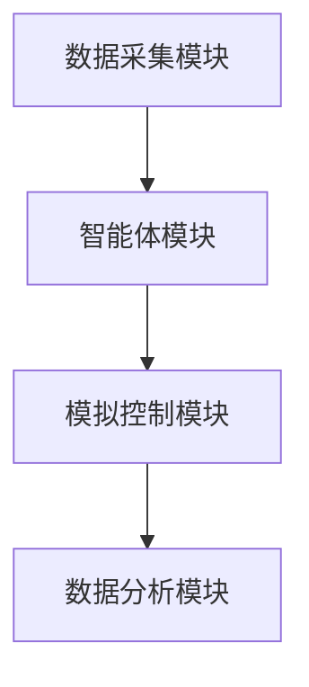
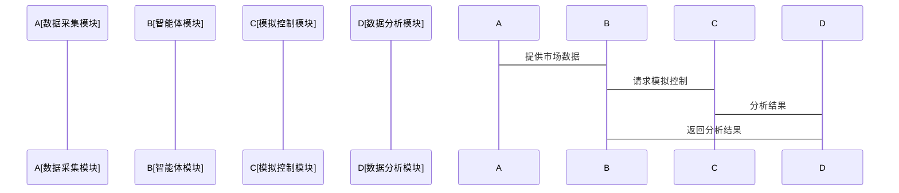

                 

<think>
好的，我将按照您的要求撰写一篇关于《智能体群体在模拟极端市场事件中的应用》的技术博客文章。让我们一步一步来。

---

# 智能体群体在模拟极端市场事件中的应用

> 关键词：智能体群体、极端市场事件、市场模拟、群体智能、决策算法

> 摘要：  
本文探讨了智能体群体在模拟极端市场事件中的应用，详细分析了智能体群体的核心概念、算法原理、系统架构以及实际案例。通过理论与实践结合的方式，展示了智能体群体如何帮助我们更好地理解和应对极端市场事件。

---

## 第一部分：智能体群体与极端市场事件背景

### 第1章：智能体群体与极端市场事件背景

#### 1.1 智能体群体的基本概念

智能体（Agent）是指能够感知环境并采取行动以实现目标的实体。智能体群体则是由多个智能体组成的集合，这些智能体通过交互和协作完成复杂任务。在市场模拟中，智能体群体可以代表投资者、交易员或其他市场参与者。

**智能体的特征：**
- **自主性**：智能体能够自主决策。
- **反应性**：智能体能够根据环境变化调整行为。
- **协作性**：智能体能够与其他智能体协作完成任务。
- **学习能力**：智能体能够通过经验改进决策。

#### 1.2 智能体群体在市场模拟中的作用

极端市场事件（如金融危机、市场崩盘）往往由复杂的社会经济因素引发，传统模型难以捕捉这些复杂性。智能体群体模拟的优势在于其能够模拟个体行为的多样性及其对整体市场的影响。

**市场模拟的核心问题：**
1. 如何建模个体行为？
2. 如何捕捉群体行为的涌现性？
3. 如何验证模拟的准确性？

#### 1.3 本章小结

本章介绍了智能体群体的基本概念及其在市场模拟中的作用，为后续分析奠定了基础。

---

## 第二部分：智能体群体的核心概念与联系

### 第2章：智能体群体的核心概念

#### 2.1 智能体的行为模型

**基于规则的智能体行为：**
- 智能体根据预设规则采取行动。
- 例如：价格上升时卖出，价格下降时买入。

**基于模型的智能体行为：**
- 智能体根据市场模型预测未来价格。
- 例如：使用时间序列模型预测价格走势。

**基于学习的智能体行为：**
- 智能体通过机器学习算法改进决策。
- 例如：使用强化学习优化投资组合。

#### 2.2 智能体群体的特征

**群体行为的涌现性：**
- 群体行为并非个体行为的简单相加。
- 例如：羊群效应导致市场恐慌。

**群体决策的多样性：**
- 智能体群体中的个体具有不同的决策策略。
- 例如：部分智能体选择买入，部分选择卖出。

**群体互动的复杂性：**
- 智能体之间的互动可能导致非线性结果。
- 例如：信息传播引发市场波动。

#### 2.3 智能体群体与极端市场事件的关系

**群体行为与市场波动的关联：**
- 群体行为可能放大市场波动。
- 例如：投资者恐慌导致市场崩盘。

**极端事件的触发机制：**
- 群体行为的连锁反应可能触发极端事件。
- 例如：杠杆交易放大市场波动。

**群体模拟的边界与外延：**
- 模拟需要考虑的边界条件。
- 例如：市场的流动性、信息传播速度。

#### 2.4 本章小结

本章详细讲解了智能体的行为模型及其群体特征，分析了智能体群体与极端市场事件的关系。

---

## 第三部分：智能体群体的算法原理

### 第3章：智能体群体的决策算法

#### 3.1 基于规则的决策算法

**简单规则的实现：**
- 智能体根据预设规则采取行动。
- 例如：价格高于阈值时卖出。

**复杂规则的构建：**
- 规则基于市场数据构建。
- 例如：结合多个技术指标制定交易策略。

**规则的动态调整：**
- 根据市场变化动态调整规则。
- 例如：基于市场反馈优化买卖规则。

#### 3.2 基于模型的决策算法

**模型构建的基本原理：**
- 使用数学模型预测市场走势。
- 例如：使用ARIMA模型预测价格。

**模型的参数优化：**
- 通过优化算法调整模型参数。
- 例如：使用遗传算法优化模型参数。

**模型的验证与评估：**
- 使用历史数据验证模型准确性。
- 例如：计算模型的预测误差。

#### 3.3 基于学习的决策算法

**机器学习在智能体决策中的应用：**
- 使用监督学习训练分类模型。
- 例如：使用随机森林分类器预测市场趋势。

**深度学习模型的构建：**
- 使用神经网络模拟市场行为。
- 例如：使用LSTM网络预测时间序列数据。

**强化学习在群体决策中的应用：**
- 使用强化学习优化群体决策。
- 例如：使用多智能体强化学习优化投资组合。

#### 3.4 算法的比较与选择

**不同算法的优缺点分析：**
- 基于规则的算法简单但缺乏灵活性。
- 基于模型的算法准确但难以捕捉复杂性。
- 基于学习的算法灵活但需要大量数据。

**算法选择的依据：**
- 根据问题需求选择算法。
- 例如：复杂市场适合基于学习的算法。

**算法的性能评估：**
- 使用性能指标评估算法效果。
- 例如：计算准确率、召回率。

#### 3.5 本章小结

本章详细讲解了智能体群体的决策算法，分析了不同算法的优缺点及其适用场景。

---

## 第四部分：智能体群体的系统架构与设计

### 第4章：智能体群体的系统架构

#### 4.1 系统功能设计

**系统的核心功能模块：**
- 数据采集模块：采集市场数据。
- 智能体模块：实现智能体行为。
- 模拟控制模块：控制模拟过程。
- 数据分析模块：分析模拟结果。

**模块之间的关系：**
- 数据采集模块为智能体模块提供输入。
- 智能体模块输出决策结果。
- 模拟控制模块协调模块之间的交互。
- 数据分析模块对结果进行评估。

**功能模块的实现方式：**
- 使用Python编写数据采集模块。
- 使用Docker部署智能体模块。

#### 4.2 系统架构设计

**系统架构图：**



**系统架构的实现：**
- 使用微服务架构设计系统。
- 使用Kubernetes部署系统。

#### 4.3 系统接口设计

**系统接口：**
- 数据采集接口：接收市场数据。
- 智能体接口：实现智能体行为。
- 模拟控制接口：控制模拟过程。
- 数据分析接口：分析模拟结果。

**接口的设计：**
- 使用RESTful API设计接口。
- 使用JSON格式传递数据。

#### 4.4 系统交互流程

**系统交互流程图：**



**交互流程的实现：**
- 使用Python编写接口。
- 使用Flask框架实现API。

#### 4.5 本章小结

本章详细讲解了智能体群体的系统架构与设计，分析了各模块之间的关系及其实现方式。

---

## 第五部分：项目实战

### 第5章：智能体群体的项目实战

#### 5.1 环境安装

**环境要求：**
- Python 3.8+
- NumPy、Pandas、Matplotlib、Scikit-learn

**安装步骤：**
1. 安装Python。
2. 安装依赖库。
3. 下载市场数据。

#### 5.2 系统核心实现源代码

**智能体模块代码：**

```python
class Agent:
    def __init__(self, strategy):
        self.strategy = strategy
    
    def decide(self, data):
        # 根据数据和策略做出决策
        return self.strategy.decide(data)

class Strategy:
    def decide(self, data):
        # 示例策略：价格高于阈值时卖出
        if data['price'] > 100:
            return 'sell'
        else:
            return 'hold'
```

**模拟控制模块代码：**

```python
class SimulationController:
    def __init__(self, agents, data_source):
        self.agents = agents
        self.data_source = data_source
    
    def run(self, duration):
        for _ in range(duration):
            data = self.data_source.get_data()
            for agent in self.agents:
                decision = agent.decide(data)
                # 处理决策
```

#### 5.3 代码应用解读与分析

**代码解读：**
- `Agent`类表示智能体，`Strategy`类表示决策策略。
- `SimulationController`类控制模拟过程。

**代码分析：**
- 智能体根据策略做出决策。
- 模拟控制器协调各智能体的交互。

#### 5.4 实际案例分析和详细讲解剖析

**案例分析：**
- 使用智能体群体模拟股票市场。
- 每个智能体采用不同的策略。
- 模拟结果显示市场波动。

**详细讲解：**
- 策略的多样性导致市场波动。
- 智能体之间的互动放大了波动。

#### 5.5 项目小结

本章通过实际案例展示了智能体群体的模拟过程，分析了智能体群体在极端市场事件中的表现。

---

## 第六部分：总结与展望

### 第6章：总结与展望

#### 6.1 本章总结

智能体群体在模拟极端市场事件中具有重要作用。通过智能体的行为模型和群体决策算法，我们可以更好地理解市场波动。

#### 6.2 当前研究的不足

- 智能体模型的复杂性限制了其应用。
- 数据的实时性问题。

#### 6.3 未来的发展方向

- 研究更复杂的智能体行为模型。
- 提高模拟的实时性。

#### 6.4 最佳实践 tips

- 在实际应用中，建议结合多种算法。
- 定期更新模型以适应市场变化。

#### 6.5 本章小结

本章总结了全文内容，并展望了未来的研究方向。

---

## 作者：AI天才研究院/AI Genius Institute & 禅与计算机程序设计艺术 /Zen And The Art of Computer Programming

---

以上是文章的完整目录大纲，希望对您有所帮助。如果需要进一步补充或调整，请随时告诉我！

