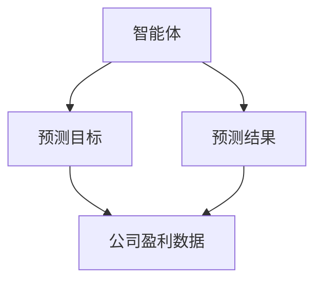

                 

# 智能体群体在预测公司盈利质量中的应用

> **关键词**：智能体群体、公司盈利预测、人工智能、群体智能、预测模型、强化学习、数据分析

> **摘要**：本文探讨了智能体群体在公司盈利质量预测中的应用，通过分析智能体群体的概念、算法原理、系统设计及实际案例，展示了其在预测中的优势和潜力。文章从传统预测方法的局限性出发，详细阐述了智能体群体的协作机制、算法实现及系统架构，最后通过实际案例验证了其在盈利预测中的有效性。

---

# 第一部分: 智能体群体在预测公司盈利质量中的应用概述

# 第1章: 智能体群体与公司盈利预测概述

## 1.1 问题背景与描述

### 1.1.1 传统公司盈利预测的局限性
传统的公司盈利预测主要依赖于财务指标分析、行业趋势分析和市场环境分析。然而，这些方法往往存在以下问题：
- 数据维度单一，难以捕捉非结构化数据（如市场情绪、行业新闻）。
- 预测模型的复杂性较高，难以实时更新和调整。
- 对异常情况（如市场崩盘、黑天鹅事件）的预测能力有限。

### 1.1.2 智能体群体预测的优势
智能体群体预测通过多智能体协作的方式，能够有效克服传统方法的局限性：
- 可以同时处理结构化和非结构化数据，提高预测的全面性。
- 智能体之间的协作机制能够模拟市场参与者的博弈行为，增强预测的动态适应性。
- 群体智能的自适应性使得模型能够实时更新，应对市场变化。

### 1.1.3 问题解决的思路与方法
智能体群体预测的核心思路是通过多个智能体协同工作，利用强化学习和群体智能算法，构建一个动态的、自适应的预测系统。具体方法包括：
1. **数据采集与处理**：从多源数据中提取相关信息，构建智能体的输入数据。
2. **智能体设计与训练**：设计智能体的结构和行为规则，通过强化学习训练智能体的预测能力。
3. **群体协作机制设计**：建立智能体之间的协作规则，确保群体的高效协同。
4. **预测结果优化**：通过群体智能的自适应性，不断优化预测模型，提高预测精度。

---

## 1.2 智能体群体的核心概念

### 1.2.1 智能体的定义与特征
智能体（Agent）是指能够感知环境并采取行动以实现目标的实体。在公司盈利预测中，智能体可以基于公司财务数据、市场信息、行业趋势等因素，预测公司的盈利情况。

智能体的主要特征包括：
- **自主性**：智能体能够独立决策。
- **反应性**：智能体能够根据环境变化调整行为。
- **协作性**：智能体能够与其他智能体协作完成任务。
- **学习性**：智能体能够通过经验改进预测能力。

### 1.2.2 智能体群体的形成与协作机制
智能体群体是由多个智能体组成的系统，通过协作机制实现预测目标。协作机制包括：
- **信息共享**：智能体之间共享数据和预测结果。
- **任务分配**：根据智能体的能力分配预测任务。
- **协调与冲突解决**：通过协调机制确保智能体之间的行为一致，解决冲突。

### 1.2.3 公司盈利质量预测的边界与外延
公司盈利质量预测的边界是指智能体预测的范围和限制，包括：
- **数据范围**：智能体能够处理的输入数据类型。
- **预测范围**：智能体能够预测的时间范围和公司范围。
- **预测精度**：智能体预测的准确性和稳定性。

---

## 1.3 智能体群体与公司盈利预测的关系

### 1.3.1 核心概念的结构与组成
智能体群体预测的核心概念包括：
- **智能体个体**：负责具体预测任务。
- **群体协作**：通过协作机制实现预测目标。
- **预测结果**：智能体群体的预测结果。

### 1.3.2 智能体群体预测的逻辑框架
智能体群体预测的逻辑框架包括：
1. **数据输入**：智能体接收公司盈利相关的数据。
2. **个体预测**：每个智能体基于自身算法预测公司盈利情况。
3. **群体协作**：智能体之间共享预测结果，调整预测模型。
4. **最终预测**：智能体群体输出最终的预测结果。

### 1.3.3 预测模型的输入输出关系
智能体群体预测模型的输入包括公司财务数据、市场数据、行业数据等，输出包括公司盈利预测结果、预测置信度等。

---

## 1.4 本章小结

---

# 第二部分: 智能体群体预测的核心概念与联系

# 第2章: 智能体群体的原理与特征

## 2.1 智能体群体的原理

### 2.1.1 多智能体协作的基本原理
多智能体协作的基本原理是通过智能体之间的信息共享和协作，实现预测任务的高效完成。具体步骤包括：
1. **信息采集**：智能体从数据源获取相关信息。
2. **信息处理**：智能体对信息进行分析和处理。
3. **协作决策**：智能体之间通过协作机制制定预测策略。
4. **结果输出**：智能体群体输出最终的预测结果。

### 2.1.2 智能体之间的信息交互机制
智能体之间的信息交互机制包括：
- **信息共享**：智能体之间共享数据和预测结果。
- **任务分配**：根据智能体的能力分配预测任务。
- **协调与冲突解决**：通过协调机制确保智能体之间的行为一致，解决冲突。

### 2.1.3 群体智能的自适应性与学习能力
群体智能的自适应性是指智能体群体能够根据环境变化自动调整预测模型。学习能力是指智能体能够通过经验改进预测能力。

---

## 2.2 智能体群体与传统预测方法的对比

### 2.2.1 传统统计模型的特点
传统统计模型的特点包括：
- **简单性**：模型结构简单，易于理解。
- **稳定性**：模型预测结果较为稳定。
- **局限性**：难以捕捉非结构化数据，预测能力有限。

### 2.2.2 机器学习模型的优势
机器学习模型的优势包括：
- **数据驱动**：能够处理大量数据，发现数据中的规律。
- **自适应性**：能够根据数据变化自动调整模型。
- **预测精度**：预测精度较高。

### 2.2.3 智能体群体预测的独特性
智能体群体预测的独特性包括：
- **多智能体协作**：通过多个智能体协作实现预测任务。
- **动态适应性**：能够根据环境变化自动调整预测模型。
- **非线性预测**：能够捕捉复杂的市场动态，实现非线性预测。

---

## 2.3 智能体群体预测的核心要素对比

### 2.3.1 智能体数量与预测精度的关系
智能体数量与预测精度的关系可以通过以下表格展示：

| 智能体数量 | 预测精度 |
|------------|-----------|
| 少          | 较低      |
| 中          | 中等      |
| 多          | 高        |

---

## 2.4 智能体群体预测的ER实体关系图

---

## 2.5 本章小结

---

# 第三部分: 智能体群体预测的算法原理

# 第3章: 基于强化学习的智能体群体预测算法

## 3.1 算法原理概述

### 3.1.1 强化学习的基本概念
强化学习是一种机器学习方法，通过智能体与环境的交互，学习最优策略。智能体通过与环境交互，获得奖励或惩罚，调整自己的行为以最大化累积奖励。

---

接下来的内容将详细阐述强化学习的算法原理、系统设计、项目实战和案例分析。

