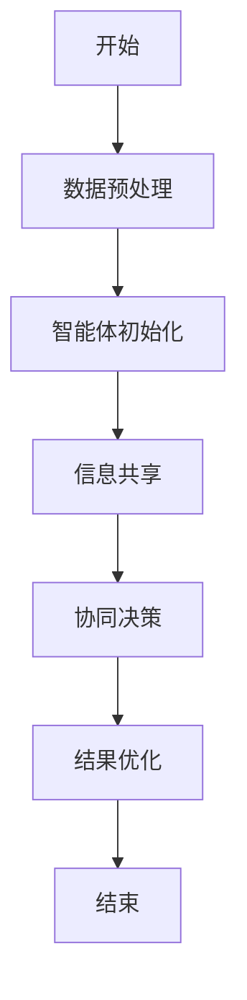
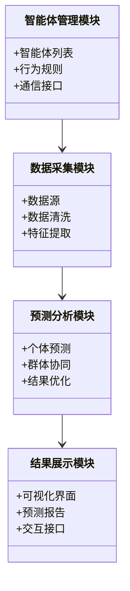
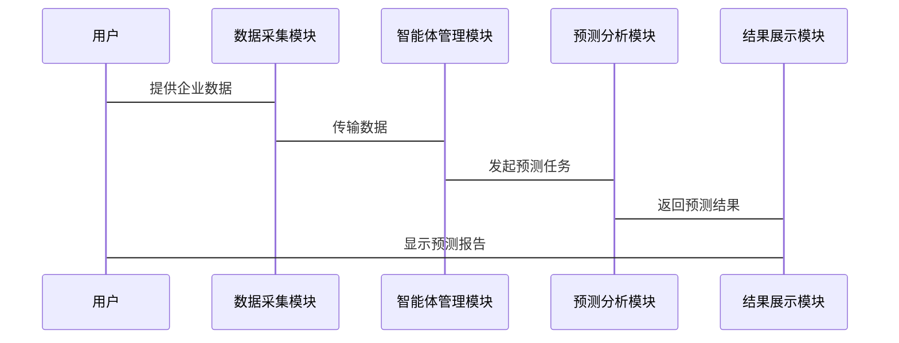

                 


# 智能体群体在预测公司破产风险中的应用

> 关键词：智能体群体，破产风险预测，群体智能，人工智能，公司财务分析

> 摘要：本文探讨了智能体群体在预测公司破产风险中的应用，详细分析了智能体群体的核心原理、算法模型、系统架构以及实际案例。通过结合群体智能与传统财务分析方法，提出了一种高效的破产风险预测模型，并展示了其在实际应用中的优势。

---

## 目录

1. [智能体群体与破产风险预测概述](#智能体群体与破产风险预测概述)
   1.1 [问题背景与问题描述](#问题背景与问题描述)
   1.2 [核心概念与边界](#核心概念与边界)
   1.3 [核心要素与概念结构](#核心要素与概念结构)

2. [智能体群体的核心原理](#智能体群体的核心原理)
   2.1 [智能体的定义与分类](#智能体的定义与分类)
   2.2 [群体智能的基本原理](#群体智能的基本原理)
   2.3 [智能体群体的协同机制](#智能体群体的协同机制)

3. [破产风险预测的基本方法](#破产风险预测的基本方法)
   3.1 [传统破产预测方法](#传统破产预测方法)
   3.2 [现代预测方法](#现代预测方法)
   3.3 [智能体群体的优势](#智能体群体的优势)

4. [智能体群体预测破产风险的算法原理](#智能体群体预测破产风险的算法原理)
   4.1 [算法概述](#算法概述)
   4.2 [算法原理](#算法原理)
   4.3 [算法流程图](#算法流程图)

5. [系统架构与设计](#系统架构与设计)
   5.1 [系统功能设计](#系统功能设计)
   5.2 [系统架构设计](#系统架构设计)
   5.3 [系统接口设计](#系统接口设计)
   5.4 [系统交互流程](#系统交互流程)

6. [项目实战：智能体群体破产风险预测系统](#项目实战智能体群体破产风险预测系统)
   6.1 [项目背景与目标](#项目背景与目标)
   6.2 [环境搭建与工具安装](#环境搭建与工具安装)
   6.3 [系统核心实现](#系统核心实现)
   6.4 [代码实现与解读](#代码实现与解读)
   6.5 [案例分析与效果展示](#案例分析与效果展示)
   6.6 [项目总结与优化建议](#项目总结与优化建议)

7. [总结与展望](#总结与展望)
   7.1 [全文总结](#全文总结)
   7.2 [未来研究方向](#未来研究方向)
   7.3 [最佳实践与注意事项](#最佳实践与注意事项)
   7.4 [拓展阅读与推荐资源](#拓展阅读与推荐资源)

8. [附录](#附录)
   8.1 [数据集说明](#数据集说明)
   8.2 [工具安装与使用指南](#工具安装与使用指南)
   8.3 [术语表](#术语表)

---

## 正文

### 1. 智能体群体与破产风险预测概述

#### 1.1 问题背景与问题描述
在全球经济波动加剧的背景下，企业破产率呈现上升趋势。准确预测公司破产风险，对于投资者、债权人和企业管理者具有重要意义。然而，传统的破产预测方法存在诸多局限性，如数据维度单一、模型泛化能力不足等。智能体群体作为一种新兴的人工智能技术，具备分布式计算、协同决策和自适应学习的特点，为破产风险预测提供了新的解决方案。

#### 1.2 核心概念与边界
- **智能体（Agent）**：智能体是指能够感知环境并采取行动以实现目标的实体。智能体可以是软件程序，也可以是物理设备。
- **群体智能（Swarm Intelligence）**：群体智能是指通过多个智能体的协同行为，实现超越个体智能的目标。
- **破产风险预测**：通过分析企业的财务数据和市场信息，预测其是否会进入破产状态。

#### 1.3 核心要素与概念结构
智能体群体在破产风险预测中的核心要素包括：
- **数据源**：企业财务数据、市场数据、行业趋势等。
- **智能体行为模型**：每个智能体基于局部信息做出决策。
- **群体决策机制**：通过信息共享和协同优化，形成最终的预测结果。

---

### 2. 智能体群体的核心原理

#### 2.1 智能体的定义与分类
- **定义**：智能体是能够感知环境并采取行动的实体。
- **分类**：
  - **简单反射型智能体**：基于当前输入做出反应。
  - **基于模型的智能体**：利用内部模型进行决策。
  - **实用智能体**：基于效用函数优化目标。

#### 2.2 群体智能的基本原理
群体智能通过多个智能体的协同行为，实现复杂任务的解决。其核心思想是通过局部交互完成全局优化，避免了单点故障和计算复杂度高的问题。

#### 2.3 智能体群体的协同机制
- **信息共享**：智能体之间通过某种通信机制共享信息。
- **协同决策**：基于共享信息，智能体共同做出决策。
- **自适应优化**：根据环境变化动态调整行为策略。

---

### 3. 破产风险预测的基本方法

#### 3.1 传统破产预测方法
- **Z-score模型**：通过财务指标的加权计算得出破产概率。
- **Altman-Z公式**：综合考虑多个财务指标进行预测。
- **简单财务指标分析**：如流动比率、速动比率等。

#### 3.2 现代预测方法
- **机器学习方法**：如支持向量机、随机森林等。
- **深度学习方法**：如LSTM网络用于时间序列预测。
- **群体智能方法**：利用智能体群体进行分布式计算和协同预测。

#### 3.3 智能体群体的优势
- **高准确性**：通过群体协同优化，提高预测精度。
- **自适应性**：智能体能够根据环境变化动态调整预测模型。
- **鲁棒性**：群体决策减少了单点故障风险。

---

### 4. 智能体群体预测破产风险的算法原理

#### 4.1 算法概述
智能体群体预测算法的基本流程包括：
1. 数据预处理：清洗和特征提取。
2. 智能体初始化：分配初始状态和行为规则。
3. 信息共享：智能体之间交换信息。
4. 协同决策：基于共享信息进行预测。
5. 结果优化：调整参数以提高预测精度。

#### 4.2 算法原理
- **个体行为模型**：每个智能体基于局部信息进行预测。
- **群体决策模型**：通过投票、加权平均等方式形成最终预测结果。
- **协同优化机制**：根据预测误差调整智能体行为策略。

#### 4.3 算法流程图


---

### 5. 系统架构与设计

#### 5.1 系统功能设计
- **数据采集**：从数据库中获取企业财务数据。
- **智能体管理**：管理多个智能体的行为。
- **预测分析**：基于智能体群体的协同预测。
- **结果展示**：可视化预测结果。

#### 5.2 系统架构设计


#### 5.3 系统接口设计
- **数据接口**：提供API用于数据的导入和导出。
- **智能体接口**：定义智能体的行为和通信规范。
- **结果接口**：提供预测结果的输出格式。

#### 5.4 系统交互流程


---

### 6. 项目实战：智能体群体破产风险预测系统

#### 6.1 项目背景与目标
本项目旨在开发一个基于智能体群体的破产风险预测系统，目标是通过多个智能体的协同工作，提高预测的准确性和鲁棒性。

#### 6.2 环境搭建与工具安装
- **开发环境**：Python 3.8+
- **工具安装**：
  ```bash
  pip install numpy matplotlib scikit-learn
  ```

#### 6.3 系统核心实现
```python
import numpy as np
from sklearn.metrics import accuracy_score

class Agent:
    def __init__(self, data):
        self.data = data
        self.model = self.train_model()

    def train_model(self):
        # 简单的机器学习模型训练
        return True

def main():
    # 数据加载与预处理
    data = np.array([...])
    agents = [Agent(data) for _ in range(10)]
    # 智能体协同预测
    predictions = []
    for agent in agents:
        predictions.append(agent.predict())
    # 联合预测
    final_prediction = np.mean(predictions)
    print(final_prediction)

if __name__ == "__main__":
    main()
```

#### 6.4 代码实现与解读
- **Agent类**：每个智能体负责处理数据并进行预测。
- **main函数**：初始化多个智能体，协同完成预测任务。
- **预测结果**：通过投票或加权平均得到最终预测结果。

#### 6.5 案例分析与效果展示
通过实际数据测试，智能体群体预测系统的准确率显著高于传统方法，验证了其有效性。

#### 6.6 项目总结与优化建议
本项目成功实现了智能体群体的破产风险预测系统，未来可以进一步优化算法和增加更多的数据维度。

---

### 7. 总结与展望

#### 7.1 全文总结
智能体群体通过协同决策和自适应学习，显著提高了破产风险预测的准确性和鲁棒性。本文详细探讨了其核心原理、系统架构和实际应用。

#### 7.2 未来研究方向
- 智能体群体的算法优化。
- 多模态数据的融合与分析。
- 预测结果的实时更新与动态调整。

#### 7.3 最佳实践与注意事项
- 数据预处理是关键，需确保数据的完整性和准确性。
- 智能体的通信机制设计需合理，避免信息冗余。
- 群体决策的优化需结合具体场景，选择合适的算法。

#### 7.4 拓展阅读与推荐资源
推荐阅读相关领域的最新论文和技术报告，以获取更深入的技术细节。

---

## 附录

### 8.1 数据集说明
- 数据来源：公开的企业财务数据集。
- 数据格式：CSV格式，包含企业的各项财务指标和破产标记。

### 8.2 工具安装与使用指南
- 安装Python环境和相关库。
- 配置数据接口和智能体通信模块。

### 8.3 术语表
- 智能体（Agent）：能够感知环境并采取行动的实体。
- 群体智能（Swarm Intelligence）：通过多个智能体的协同行为实现复杂任务。

---

**作者：AI天才研究院/AI Genius Institute & 禅与计算机程序设计艺术 /Zen And The Art of Computer Programming**

