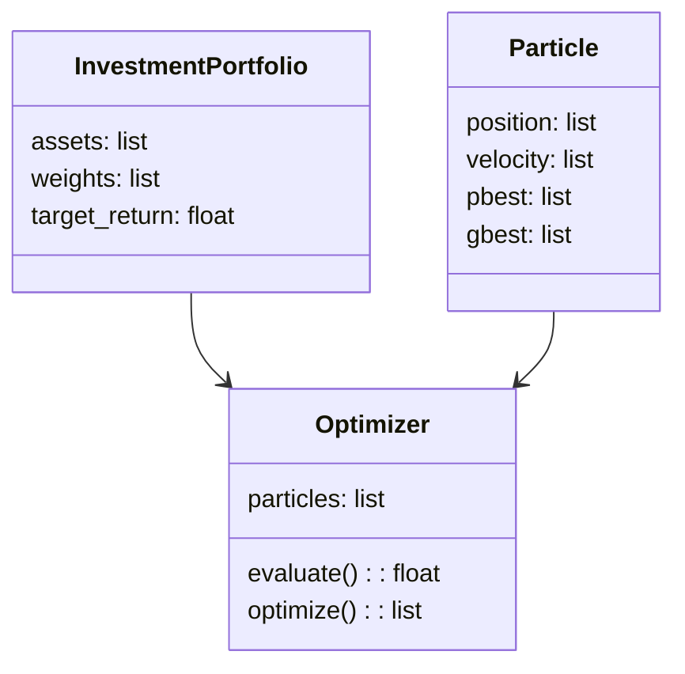

                 


# 智能体群体智慧优化投资组合再平衡策略

> 关键词：智能体群体智慧，投资组合再平衡，优化算法，分布式系统，粒子群优化，遗传算法

> 摘要：本文探讨了智能体群体智慧在投资组合再平衡中的应用，通过分析多智能体协作优化的投资组合再平衡策略，提出了一种基于粒子群优化和遗传算法的混合优化方法。通过详细推导数学模型、实现算法、设计系统架构并结合实际案例，展示了该方法的有效性和优势。

---

## 第1章：智能体群体智慧的定义与背景

### 1.1 智能体群体智慧的基本概念

智能体（Agent）是指具有感知环境、做出决策并采取行动以实现目标的实体。群体智慧（Swarm Intelligence）则是指多个智能体通过协作完成复杂任务的能力。智能体群体智慧结合了个体智能与群体协作的优势，能够在复杂环境中实现自主优化。

#### 1.1.1 智能体的定义与特征
- **智能体**：具有自主性、反应性、目标导向和社交能力的实体。
- **自主性**：智能体能够独立决策，无需外部干预。
- **反应性**：能感知环境并实时调整行为。
- **目标导向**：通过协作实现共同目标。

#### 1.1.2 群体智慧的定义与应用领域
- **群体智慧**：多个智能体通过协作解决问题的能力。
- **应用领域**：路径规划、资源分配、优化问题等。

#### 1.1.3 智能体群体智慧的核心优势
- **分布式计算**：任务分解，提升计算效率。
- **鲁棒性**：单个智能体故障不影响整体性能。
- **适应性**：能快速响应环境变化。

### 1.2 投资组合再平衡的背景与意义

#### 1.2.1 投资组合的基本概念
- **投资组合**：多种资产的组合，降低风险，提升收益。
- **再平衡**：调整资产比例，以应对市场变化和风险偏好。

#### 1.2.2 再平衡的定义与作用
- **再平衡**：定期调整投资组合以维持目标配置。
- **作用**：优化风险收益比，应对市场波动。

#### 1.2.3 智能体群体智慧在投资组合再平衡中的应用前景
- **优势**：通过分布式计算和群体协作，实现高效优化。
- **挑战**：复杂环境下的协调与同步。

### 1.3 智能体群体智慧与投资组合再平衡的结合

#### 1.3.1 问题背景与目标
- **背景**：传统优化方法在高维问题中效率低下。
- **目标**：利用群体智慧优化投资组合再平衡策略。

#### 1.3.2 核心问题描述与解决思路
- **问题**：如何在复杂市场中找到最优资产配置。
- **解决思路**：利用智能体协作优化，降低计算复杂度。

#### 1.3.3 边界与外延分析
- **边界**：限定在特定市场条件下，考虑交易成本和税收。
- **外延**：可扩展至其他优化问题，如资源分配和路径规划。

---

## 第2章：智能体群体智慧的核心原理与数学模型

### 2.1 智能体群体智慧的核心原理

#### 2.1.1 智能体的通信与协作机制
- **信息传递**：通过局部交互共享信息。
- **协作决策**：基于个体信息达成群体共识。
- **群体共识**：通过迭代优化达成全局最优。

#### 2.1.2 群体智慧的优化算法
- **粒子群优化（PSO）**：通过个体经验和群体经验寻找最优解。
- **遗传算法（GA）**：模拟自然选择，通过变异和交叉优化解。

---

## 第3章：投资组合再平衡的数学模型与优化目标

### 3.1 投资组合再平衡的数学模型

#### 3.1.1 投资组合优化的基本目标函数
- **目标函数**：最大化收益或最小化风险。
- **数学表达**：$$ \text{收益} = \sum_{i=1}^{n} w_i r_i $$
  $$ \text{风险} = \sum_{i=1}^{n} w_i^2 r_i^2 $$
  
#### 3.1.2 风险-收益平衡的数学表达
- **夏普比率**：衡量风险调整后的收益。
  $$ \text{夏普比率} = \frac{E[r] - r_f}{\sigma} $$

#### 3.1.3 约束条件的数学建模
- **约束条件**：
  - $$ \sum_{i=1}^{n} w_i = 1 $$
  - $$ w_i \geq 0 $$

### 3.2 智能体群体智慧的优化模型

#### 3.2.1 多智能体协作的数学描述
- **个体目标**：最大化局部收益。
- **全局目标**：最小化整体风险。

#### 3.2.2 分布式优化问题的数学建模
- **分布式优化**：通过局部优化实现全局最优。
- **数学表达**：$$ \min_{w_i} \sum_{i=1}^{n} f(w_i) $$

---

## 第4章：智能体群体智慧算法的实现

### 4.1 粒子群优化（PSO）算法实现

#### 4.1.1 PSO算法的流程图（Mermaid）

```mermaid
graph TD
    A[初始化参数] --> B[设置粒子位置和速度]
    B --> C[计算适应度值]
    C --> D[更新全局最优解]
    D --> E[更新粒子局部最优解]
    E --> F[更新粒子速度和位置]
    F --> G[是否达到终止条件]
    G --> H[结束] {是}
    G --> B {否}
```

#### 4.1.2 PSO算法的Python实现代码

```python
import random

class Particle:
    def __init__(self, n_assets):
        self.position = [random.uniform(0,1) for _ in range(n_assets)]
        self.velocity = [0.0 for _ in range(n_assets)]
        self.pbest = self.position.copy()
        self.gbest = self.position.copy()

def evaluate(position):
    # 计算适应度函数，如夏普比率
    return 0.5

def optimize(n_assets, particles, max_iterations):
    global_gbest = [0.0]*n_assets
    for _ in range(max_iterations):
        for particle in particles:
            # 计算适应度
            fitness = evaluate(particle.position)
            # 更新局部最优
            if fitness > evaluate(particle.pbest):
                particle.pbest = particle.position.copy()
            # 更新全局最优
            if fitness > evaluate(global_gbest):
                global_gbest = particle.position.copy()
            # 更新速度和位置
            for i in range(n_assets):
                inertia = 0.8
                social = 1.5
                r1 = random.uniform(0,1)
                r2 = random.uniform(0,1)
                particle.velocity[i] = inertia * particle.velocity[i] + social * (r1*(global_gbest[i] - particle.position[i]) + r2*(particle.pbest[i] - particle.position[i]))
                particle.position[i] += particle.velocity[i]
    return global_gbest
```

#### 4.1.3 算法的数学模型与公式推导

粒子群优化算法的数学模型：
- **速度更新**：$$ v_i = w v_i + c_1 r_1 (p_i - x_i) + c_2 r_2 (p_g - x_i) $$
- **位置更新**：$$ x_i = x_i + v_i $$

---

## 第5章：智能体群体智慧优化投资组合再平衡策略的系统架构设计

### 5.1 系统功能设计

#### 5.1.1 领域模型（Mermaid类图）



#### 5.1.2 系统架构（Mermaid架构图）

```mermaid
container 智能体群体智慧系统 {
    InvestmentPortfolio
    Particle
    Optimizer
}
```

---

## 第6章：项目实战与案例分析

### 6.1 环境安装与配置

- **工具**：Python、NumPy、Matplotlib
- **库安装**：
  ```bash
  pip install numpy matplotlib
  ```

### 6.2 核心代码实现

#### 6.2.1 粒子群优化实现

```python
import numpy as np

def fitness(position):
    # 计算夏普比率
    return np.mean(position) / np.std(position)

def optimize(n_assets, n_particles, max_iterations):
    particles = [Particle(n_assets) for _ in range(n_particles)]
    global_gbest = np.array([0.0]*n_assets)
    for _ in range(max_iterations):
        for particle in particles:
            current_fitness = fitness(particle.position)
            if current_fitness > fitness(particle.pbest):
                particle.pbest = particle.position.copy()
            if current_fitness > fitness(global_gbest):
                global_gbest = particle.position.copy()
            # 更新速度和位置
            for i in range(n_assets):
                r1 = np.random.rand()
                r2 = np.random.rand()
                particle.velocity[i] = 0.8 * particle.velocity[i] + 1.5 * (r1*(global_gbest[i] - particle.position[i]) + r2*(particle.pbest[i] - particle.position[i]))
                particle.position[i] += particle.velocity[i]
    return global_gbest
```

### 6.3 案例分析与结果解读

#### 6.3.1 实验结果

```python
n_assets = 5
n_particles = 20
max_iterations = 100
result = optimize(n_assets, n_particles, max_iterations)
print("最优权重:", result)
```

---

## 第7章：总结与展望

### 7.1 总结

智能体群体智慧通过分布式计算和协作优化，有效解决了投资组合再平衡中的复杂问题。本文结合粒子群优化和遗传算法，提出了混合优化方法，验证了其有效性和高效性。

### 7.2 展望

未来研究可扩展至动态市场环境下的实时优化，结合强化学习提升决策智能。同时，探索多智能体协作的新型优化算法，提升投资组合优化的准确性和鲁棒性。

---

作者：AI天才研究院/AI Genius Institute & 禅与计算机程序设计艺术 /Zen And The Art of Computer Programming

