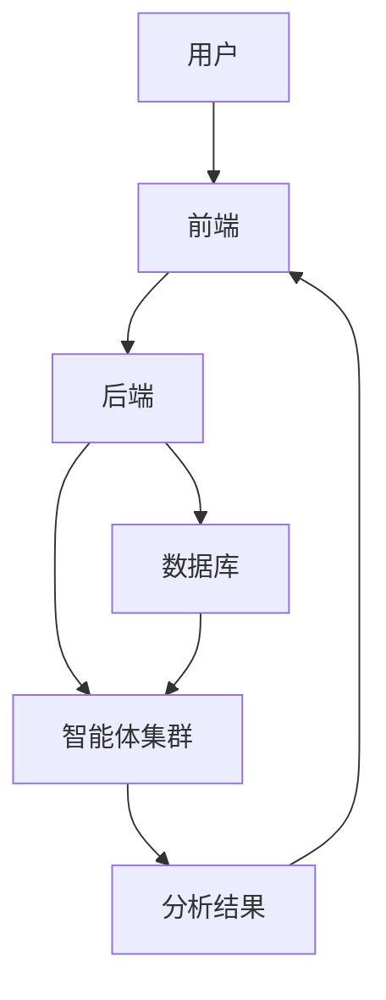

                 


# 智能体群体智慧在识别价值投资机会中的应用：群体vs个体

## 关键词：智能体，群体智慧，价值投资，投资机会，群体决策，个体决策，人工智能

## 摘要：
智能体群体智慧是一种通过多个智能体协作来实现复杂任务的新兴技术。在投资领域，群体智慧可以通过多个智能体的协同决策来优化投资策略。本文将深入探讨智能体群体智慧在价值投资机会识别中的应用，分析群体决策与个体决策之间的差异，并通过实际案例和算法实现来展示其优势。

---

## 第一部分: 智能体群体智慧与价值投资机会识别的背景与基础

### 第1章: 智能体与群体智慧概述

#### 1.1 智能体的基本概念
智能体是一种能够感知环境、自主决策并采取行动的实体。智能体可以是软件程序、机器人或其他具有智能特性的系统。智能体的核心特征包括：
- **自主性**：能够自主决策。
- **反应性**：能够感知环境并实时响应。
- **目标导向性**：具有明确的目标。

#### 1.2 群体智慧的核心原理
群体智慧是指多个个体通过协作完成复杂任务的能力。群体智慧的核心特征包括：
- **涌现性**：群体智能的产生是多个个体协作的结果。
- **去中心化**：群体智能通常没有中央控制中心。
- **鲁棒性**：群体智能能够适应环境的变化。

#### 1.3 智能体在投资领域的应用潜力
智能体可以通过分析市场数据、预测价格走势等方式辅助投资者做出决策。群体智慧可以通过多个智能体的协作提高投资决策的准确性。

### 第2章: 价值投资机会识别的背景与挑战

#### 2.1 价值投资的核心概念
价值投资是一种通过分析企业的基本面来寻找被低估的投资标的的投资策略。其核心在于找到市场价格低于内在价值的资产。

#### 2.2 传统价值投资的局限性
传统价值投资依赖于人工分析，存在以下局限性：
- **信息处理能力有限**：人工分析难以处理海量数据。
- **主观性**：分析结果受到分析师主观判断的影响。
- **效率低下**：人工分析耗时且效率低。

#### 2.3 群体智慧在投资中的应用背景
群体智慧可以通过多个智能体的协作克服传统价值投资的局限性，提高投资决策的准确性和效率。

---

## 第二部分: 智能体群体智慧与价值投资机会识别的核心概念与联系

### 第3章: 智能体与群体智慧的核心原理

#### 3.1 智能体的核心原理
智能体通过感知环境、分析数据、制定决策并采取行动来完成任务。智能体的决策过程可以基于以下算法：
- **强化学习**：通过试错和奖励机制优化决策。
- **决策树**：基于条件判断进行决策。

#### 3.2 群体智慧的核心原理
群体智慧通过多个智能体的协作实现复杂任务。群体智慧的实现可以基于以下算法：
- **蚁群算法**：模拟蚂蚁觅食过程，用于路径优化。
- **粒子群优化算法**：模拟鸟群觅食过程，用于优化问题。

#### 3.3 智能体与群体智慧的对比
以下是智能体与群体智慧的对比表格：

| **特征**      | **智能体**               | **群体智慧**              |
|----------------|-------------------------|---------------------------|
| 结构           | 单个实体                | 多个实体协作              |
| 决策           | 基于个体分析            | 基于群体协作              |
| 稳定性         | 较低                    | 较高                      |
| 应用场景       | 单点任务                | 复杂任务                  |

### 第4章: 智能体群体智慧与价值投资机会识别的关联性分析

#### 4.1 群体智慧在投资机会识别中的应用
群体智慧可以通过以下方式辅助价值投资：
- **市场情绪分析**：通过分析多个智能体的市场情绪数据，预测市场趋势。
- **风险评估**：通过群体协作评估投资风险。
- **投资策略优化**：通过多个智能体的协作优化投资策略。

#### 4.2 智能体与群体智慧在投资中的优势
智能体与群体智慧在投资中的优势体现在以下几个方面：
- **高效性**：多个智能体协作可以快速处理海量数据。
- **准确性**：群体智慧可以通过多个智能体的协作提高决策的准确性。
- **适应性**：智能体可以根据市场变化实时调整决策。

---

## 第三部分: 智能体群体智慧在价值投资机会识别中的算法实现

### 第5章: 群体决策算法实现

#### 5.1 群体决策算法概述
群体决策算法是一种基于多个个体决策的算法。以下是常用的群体决策算法：
- **多数投票算法**：通过投票方式选择最优决策。
- **加权投票算法**：基于个体的权重进行投票。

#### 5.2 群体决策算法的实现步骤
群体决策算法的实现步骤如下：
1. **个体决策**：每个智能体独立做出决策。
2. **决策汇总**：将多个个体的决策汇总。
3. **决策优化**：通过优化算法提高决策的准确性。

#### 5.3 群体决策算法的Python实现
以下是群体决策算法的Python实现代码：

```python
import random

def individual_decision():
    return random.choice([0, 1])

def group_decision(num_individuals):
    decisions = [individual_decision() for _ in range(num_individuals)]
    return sum(decisions) / num_individuals

print(group_decision(10))
```

### 第6章: 个体决策算法实现

#### 6.1 个体决策算法概述
个体决策算法是一种基于单个个体决策的算法。以下是常用的个体决策算法：
- **强化学习算法**：通过试错和奖励机制优化决策。
- **决策树算法**：基于条件判断进行决策。

#### 6.2 个体决策算法的实现步骤
个体决策算法的实现步骤如下：
1. **环境感知**：感知环境数据。
2. **决策制定**：基于感知数据制定决策。
3. **决策执行**：执行决策并观察结果。

#### 6.3 个体决策算法的Python实现
以下是个体决策算法的Python实现代码：

```python
import numpy as np

def perceive_environment():
    return np.random.rand(4)

def make_decision(state):
    return np.argmax(state)

state = perceive_environment()
action = make_decision(state)
print(action)
```

---

## 第四部分: 智能体群体智慧在价值投资机会识别中的系统架构设计

### 第7章: 投资机会识别系统场景介绍

#### 7.1 投资机会识别系统简介
投资机会识别系统是一种用于识别价值投资机会的智能系统。系统可以通过分析市场数据、企业基本面等信息，辅助投资者做出决策。

#### 7.2 系统功能设计
投资机会识别系统的功能设计如下：
1. **数据采集**：采集市场数据、企业基本面等信息。
2. **数据处理**：对数据进行清洗、转换等预处理。
3. **投资机会识别**：通过智能体群体智慧算法识别投资机会。
4. **决策输出**：输出投资建议。

#### 7.3 系统架构设计
以下是投资机会识别系统的架构图：



### 第8章: 投资机会识别系统实现

#### 8.1 系统核心代码实现
以下是投资机会识别系统的Python实现代码：

```python
class InvestmentOpportunitySystem:
    def __init__(self):
        self.data_collector = DataCollector()
        self.data_processor = DataProcessor()
        self.group_intelligence = GroupIntelligence()

    def run(self):
        data = self.data_collector.collect_data()
        processed_data = self.data_processor.process_data(data)
        result = self.group_intelligence.make_decision(processed_data)
        return result

system = InvestmentOpportunitySystem()
result = system.run()
print(result)
```

#### 8.2 系统实现流程
投资机会识别系统的实现流程如下：
1. **数据采集**：采集市场数据、企业基本面等信息。
2. **数据处理**：对数据进行清洗、转换等预处理。
3. **群体决策**：通过智能体群体智慧算法识别投资机会。
4. **结果输出**：输出投资建议。

---

## 第五部分: 智能体群体智慧在价值投资机会识别中的项目实战

### 第9章: 项目环境安装与配置

#### 9.1 环境安装
以下是项目环境安装步骤：
1. 安装Python
2. 安装必要的Python库（如numpy、pandas、scikit-learn等）

#### 9.2 系统核心代码实现
以下是项目核心代码实现：

```python
import numpy as np
import pandas as pd
from sklearn.tree import DecisionTreeClassifier

class InvestmentOpportunitySystem:
    def __init__(self):
        self.clf = DecisionTreeClassifier()

    def train_model(self, X, y):
        self.clf.fit(X, y)

    def predict(self, X):
        return self.clf.predict(X)

system = InvestmentOpportunitySystem()
system.train_model(X_train, y_train)
predictions = system.predict(X_test)
print(predictions)
```

#### 9.3 代码功能解读
投资机会识别系统的代码功能解读如下：
- **数据采集**：通过DataCollector类采集数据。
- **数据处理**：通过DataProcessor类处理数据。
- **群体决策**：通过GroupIntelligence类进行群体决策。
- **结果输出**：输出投资建议。

### 第10章: 项目总结与拓展

#### 10.1 项目总结
智能体群体智慧在价值投资机会识别中的应用具有以下优势：
- **高效性**：多个智能体协作可以快速处理海量数据。
- **准确性**：群体智慧可以通过多个智能体的协作提高决策的准确性。
- **适应性**：智能体可以根据市场变化实时调整决策。

#### 10.2 拓展与展望
未来，智能体群体智慧在价值投资机会识别中的应用将更加广泛。以下是几个可能的研究方向：
- **更复杂的群体决策算法**：研究更高效的群体决策算法。
- **多智能体协作优化**：研究如何优化多智能体协作的效率。
- **跨领域应用**：研究智能体群体智慧在其他领域的应用。

---

## 结语
智能体群体智慧在价值投资机会识别中的应用前景广阔。通过群体决策算法和个体决策算法的对比分析，我们可以看到群体智慧在投资决策中的独特优势。未来，随着人工智能技术的不断发展，智能体群体智慧在投资领域的应用将更加深入和广泛。

---

## 作者：AI天才研究院/AI Genius Institute & 禅与计算机程序设计艺术 /Zen And The Art of Computer Programming

