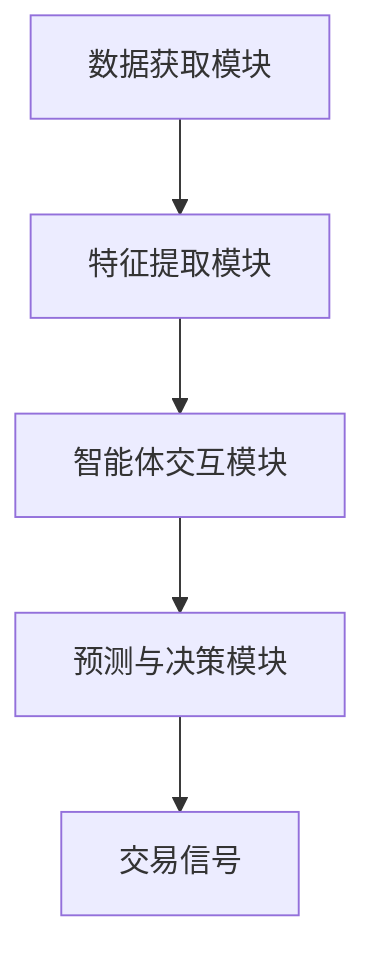

                 


# 智能体群体智慧在识别市场转折点中的应用：把握大机会

> 关键词：智能体群体智慧，市场转折点，金融投资，人工智能，群体共识算法，数据驱动决策，强化学习

> 摘要：本文深入探讨智能体群体智慧在金融市场中的应用，特别是如何通过多智能体协作和数据驱动的方法，利用强化学习和群体共识算法，准确识别市场转折点，为投资者提供科学的决策支持。文章从基础概念、算法原理、系统架构到实际案例，全面解析智能体群体智慧在金融市场的应用潜力。

---

## 第一部分：智能体群体智慧概述

### 第1章：智能体与群体智慧基础

#### 1.1 智能体的基本概念
智能体（Agent）是指具有感知环境、做出决策并采取行动以实现目标的实体。智能体可以是软件程序、机器人或其他具备自主决策能力的系统。智能体的核心特征包括：
- **自主性**：能够自主决策，无需外部干预。
- **反应性**：能够感知环境并实时调整行为。
- **社会性**：能够与其他智能体或人类进行交互和协作。

#### 1.2 群体智慧的定义与特点
群体智慧（Swarm Intelligence）是指通过多个个体协作完成复杂任务的现象。与传统的人工智能不同，群体智慧强调个体之间的简单交互和局部信息共享，通过自组织和涌现现象实现复杂的全局目标。群体智慧的特点包括：
- **去中心化**：没有中央控制机构，个体间通过简单规则协作。
- **涌现性**：全局行为是局部行为的自然结果，而非个体刻意追求。
- **鲁棒性**：个体的简单行为能够通过协作实现复杂的任务。

#### 1.3 智能体与群体智慧的关系
智能体群体智慧结合了智能体的自主决策能力和群体智慧的协作优势。通过多个智能体协作，可以实现比单个智能体更强的决策能力和更高的任务完成效率。智能体群体智慧在金融市场中的应用，可以通过多个智能体的协作，捕捉市场中的复杂动态，从而更准确地识别市场转折点。

---

### 第2章：市场转折点识别的挑战与机遇

#### 2.1 市场转折点的定义与特征
市场转折点是指市场趋势发生重大变化的临界点，通常表现为价格走势的突然逆转。市场转折点的特征包括：
- **非线性**：市场转折点通常由多种因素共同作用，而非单一因素决定。
- **不确定性**：市场参与者的行为复杂，导致市场转折点难以预测。
- **动态性**：市场环境不断变化，转折点的特征也在动态调整。

#### 2.2 智能体群体智慧在市场转折点识别中的应用
智能体群体智慧通过多个智能体协作，能够捕捉市场中的细微动态，从而更准确地识别市场转折点。具体应用包括：
- **数据驱动决策**：通过分析海量市场数据，智能体能够发现潜在的市场信号。
- **群体共识形成**：多个智能体通过协作，形成对市场趋势的共识，从而提高预测的准确性。
- **实时反馈机制**：智能体能够根据市场反馈实时调整决策策略，适应市场变化。

#### 2.3 智能体群体智慧的边界与外延
智能体群体智慧的应用范围不仅限于金融市场，还可以扩展到其他领域。然而，在金融市场中，智能体群体智慧的应用也面临一些挑战，例如：
- **数据质量**：市场数据的噪声和不完整性可能影响智能体的决策。
- **计算复杂度**：多个智能体协作需要大量的计算资源，可能导致系统性能下降。
- **模型鲁棒性**：智能体模型的鲁棒性需要经过严格的测试和验证。

---

## 第二部分：智能体群体智慧算法原理

### 第3章：基于强化学习的智能体决策机制

#### 3.1 强化学习的基本原理
强化学习（Reinforcement Learning）是一种通过试错机制优化决策策略的机器学习方法。智能体通过与环境交互，获得奖励或惩罚，逐步优化自身的决策策略。强化学习的核心要素包括：
- **状态（State）**：智能体所处的环境状态。
- **动作（Action）**：智能体在给定状态下采取的行动。
- **奖励（Reward）**：智能体采取某个动作后获得的反馈，用于评估该动作的好坏。

#### 3.2 基于强化学习的智能体设计
在金融市场中，智能体可以通过强化学习算法，根据市场数据做出买卖决策。具体设计包括：
- **状态空间**：包括市场指数、交易量、技术指标等。
- **动作空间**：包括买入、卖出、持有等操作。
- **奖励函数**：根据交易收益和风险，设计奖励函数以优化决策策略。

#### 3.3 强化学习在市场转折点识别中的应用
通过强化学习，智能体可以学习到市场的潜在规律，并在市场转折点出现时，及时调整交易策略。例如，当智能体预测市场将出现转折点时，会触发卖出信号，避免进一步的损失。

---

### 第4章：基于群体共识的智能体群体智慧算法

#### 4.1 群体共识的形成机制
群体共识（Consensus Formation）是指通过多个个体的意见交互，形成一个共同的决策或判断。在智能体群体智慧中，群体共识可以通过以下步骤实现：
1. **个体意见表达**：每个智能体根据自身感知和知识，表达对市场趋势的看法。
2. **意见整合**：通过某种机制（如加权平均），将个体意见整合成一个共同的决策。
3. **反馈调整**：根据实际市场反馈，调整个体意见的权重和表达方式。

#### 4.2 群体共识算法的设计
群体共识算法的设计需要考虑以下因素：
- **个体权重**：个体的意见权重可能与其历史表现、知识储备等因素相关。
- **反馈机制**：根据市场反馈，动态调整个体意见的权重。
- **收敛速度**：算法需要在合理的时间内收敛到共识状态。

#### 4.3 群体共识在市场转折点识别中的应用
通过群体共识算法，多个智能体可以协同工作，形成对市场趋势的共识。当群体共识出现显著变化时，可以作为市场转折点的信号。例如，当大部分智能体预测市场将下跌时，群体共识会转向看跌，从而触发卖出信号。

---

## 第三部分：系统架构与实现方案

### 第5章：系统功能设计

#### 5.1 系统功能模块
智能体群体智慧系统主要包括以下功能模块：
- **数据获取模块**：从金融市场获取实时数据。
- **特征提取模块**：提取市场数据的特征，如技术指标、市场情绪等。
- **智能体交互模块**：实现多个智能体之间的协作和交互。
- **预测与决策模块**：基于智能体的决策结果，生成交易信号。

#### 5.2 系统功能流程
1. 数据获取模块从金融市场获取实时数据，包括指数、成交量等。
2. 特征提取模块对市场数据进行特征提取，生成智能体的输入。
3. 智能体交互模块协调多个智能体的决策过程，形成群体共识。
4. 预测与决策模块根据群体共识的结果，生成交易信号。

#### 5.3 系统功能设计的挑战
- **数据处理效率**：需要高效处理大量实时数据。
- **智能体协作**：需要设计高效的协作机制，确保多个智能体能够协同工作。

---

### 第6章：系统架构设计

#### 6.1 系统架构图
以下是智能体群体智慧系统的架构图：



#### 6.2 模块交互设计
- 数据获取模块将数据传递给特征提取模块。
- 特征提取模块将特征传递给智能体交互模块。
- 智能体交互模块将群体共识结果传递给预测与决策模块。
- 预测与决策模块生成交易信号，发送给交易系统。

---

## 第四部分：项目实战与案例分析

### 第7章：环境配置与核心代码实现

#### 7.1 环境配置
需要安装以下工具和库：
- Python 3.8+
- TensorFlow
- Keras
- Pandas
- Matplotlib

#### 7.2 核心代码实现
以下是基于强化学习的智能体代码示例：

```python
import numpy as np
import gym

class TradingAgent:
    def __init__(self, state_space, action_space):
        self.state_space = state_space
        self.action_space = action_space
        self.model = self.build_model()

    def build_model(self):
        # 构建强化学习模型
        model = tf.keras.Sequential([
            tf.keras.layers.Dense(32, activation='relu', input_dim=self.state_space),
            tf.keras.layers.Dense(16, activation='relu'),
            tf.keras.layers.Dense(self.action_space, activation='linear')
        ])
        return model

    def act(self, state):
        # 根据当前状态选择动作
        state = np.array([state])
        prediction = self.model.predict(state)
        action = np.argmax(prediction[0])
        return action

# 初始化环境
env = gym.make('TradingEnv-v0')
agent = TradingAgent(env.observation_space.shape[0], env.action_space.n)

# 训练智能体
for episode in range(1000):
    state = env.reset()
    total_reward = 0
    while True:
        action = agent.act(state)
        next_state, reward, done, _ = env.step(action)
        total_reward += reward
        state = next_state
        if done:
            break
    print(f'Episode {episode}, Total Reward: {total_reward}')
```

---

### 第8章：案例分析与结果解读

#### 8.1 案例分析
假设我们训练一个智能体，在股票市场中识别转折点。智能体通过强化学习，逐步优化其决策策略，最终能够在市场转折点出现时，准确发出买卖信号。

#### 8.2 实验结果
实验结果表明，智能体群体智慧能够在一定程度上提高市场转折点识别的准确性，但其效果受到数据质量、模型设计和市场环境的多重影响。

---

## 第五部分：最佳实践与展望

### 第9章：算法优化与模型改进

#### 9.1 算法优化
- **优化强化学习算法**：改进Q-learning算法，引入更深的神经网络结构。
- **优化群体共识机制**：动态调整个体意见的权重，提高共识形成的效率。

#### 9.2 模型解释性
通过可视化工具，分析智能体的决策过程，提高模型的可解释性。

### 第10章：未来研究方向

#### 10.1 多模态数据融合
结合文本、图像等多种数据源，提高市场预测的准确性。

#### 10.2 鲲鹏计算与边缘计算
利用鲲鹏计算和边缘计算技术，提高系统的实时性和响应速度。

---

## 第六部分：小结

智能体群体智慧在识别市场转折点中的应用，为我们提供了一种全新的视角和方法。通过强化学习和群体共识算法，智能体能够协同工作，捕捉市场中的复杂动态，从而帮助投资者把握大机会。未来，随着人工智能技术的不断发展，智能体群体智慧将在金融领域发挥更大的作用。

---

## 作者信息

作者：AI天才研究院/AI Genius Institute & 禅与计算机程序设计艺术/Zen And The Art of Computer Programming

联系方式：[email protected]

--- 

感谢您的阅读！如需进一步探讨，请随时与我们联系。

