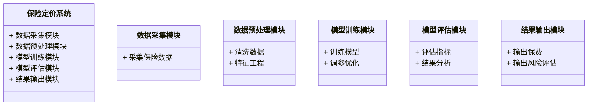
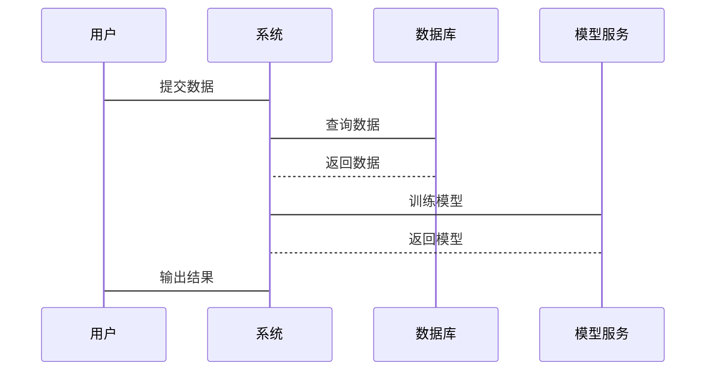

                 


# 智能保险产品定价模型

## 关键词：智能定价、保险模型、机器学习、数据驱动、风险评估

## 摘要：智能保险产品定价模型是一种基于机器学习和大数据分析的创新定价方法，通过整合多元数据和复杂算法，实现对保险产品的精准定价。本文将从传统定价方法的局限性出发，探讨智能定价模型的核心概念、算法原理、系统设计及实际应用，为保险行业提供新的定价思路和解决方案。

---

# 第1章: 保险定价的基本概念与传统方法

## 1.1 保险定价的基本概念

### 1.1.1 保险产品的基本定义
保险产品是一种以风险为核心，通过合同形式提供风险保障的金融工具。保险定价是确定保险产品价格的过程，旨在平衡 insurer 和被保险人之间的利益。

### 1.1.2 保险定价的核心要素
保险定价的核心要素包括：
1. **风险因素**：影响保险产品的风险因素，如年龄、健康状况、驾驶记录等。
2. **保险金额**：保险产品的赔偿金额。
3. **保费**：投保人需要支付的费用。
4. **保险期限**：保险产品的有效期限。

### 1.1.3 传统保险定价方法的优缺点
传统保险定价方法主要包括经验定价法和分类定价法。

#### 经验定价法
经验定价法基于历史数据，通过统计分析确定保费。优点是简单易行，缺点是难以应对复杂的风险因素。

#### 分类定价法
分类定价法将投保人按风险特征分类，根据类别确定保费。优点是分类清晰，缺点是分类标准可能不够精细。

---

## 1.2 保险定价的数学模型

### 1.2.1 保险定价的基本公式
保险定价的基本公式为：
$$保费 = 风险保费 + 管理费用 + 利润$$

### 1.2.2 保险精算的基本原理
保险精算是通过数学模型和统计方法，对保险产品的风险和成本进行评估和定价的学科。精算的核心工具包括概率论、数理统计和优化算法。

### 1.2.3 传统定价方法的局限性
传统定价方法的局限性包括：
1. **数据维度有限**：传统方法通常只考虑少量的特征，难以捕捉复杂的风险因素。
2. **模型假设过于简化**：传统模型假设风险分布均匀，忽略了个体差异。
3. **难以应对市场变化**：传统定价方法难以快速响应市场变化和客户需求。

---

## 1.3 智能保险定价的必要性

### 1.3.1 保险行业面临的挑战
保险行业面临的风险日益复杂，传统的定价方法难以满足精准定价的需求。

### 1.3.2 数据驱动定价的优势
数据驱动定价通过整合多元数据，利用机器学习算法，实现对风险的精准识别和定价。

### 1.3.3 智能定价的未来趋势
智能定价将成为保险行业的主流，通过实时数据和动态模型，实现个性化定价和服务。

---

## 1.4 本章小结
本章介绍了保险定价的基本概念和传统方法，分析了传统定价方法的局限性，并提出了智能保险定价的必要性和未来趋势。

---

# 第2章: 智能保险定价模型的核心概念

## 2.1 数据特征与处理

### 2.1.1 保险数据的特征分析
保险数据的特征包括：
1. **客户信息**：年龄、性别、职业等。
2. **行为数据**：驾驶记录、健康状况等。
3. **历史数据**：理赔记录、保费支付记录等。

### 2.1.2 数据清洗与预处理
数据清洗是通过去除噪声数据和异常值，提高数据质量。预处理包括数据标准化和特征选择。

### 2.1.3 数据增强与特征工程
数据增强通过生成新特征，提高模型的表达能力。特征工程是通过选择和创建特征，优化模型性能。

---

## 2.2 模型选择与优化

### 2.2.1 线性回归模型
线性回归模型是一种简单但有效的定价模型，适用于线性关系较强的场景。

### 2.2.2 支持向量机模型
支持向量机模型通过构建超平面，实现对数据的分类和回归。

### 2.2.3 随机森林与梯度提升树
随机森林和梯度提升树是基于树的集成模型，适用于复杂非线性关系的定价场景。

---

## 2.3 智能定价模型的评估指标

### 2.3.1 均方误差（MSE）
MSE是模型预测值与真实值的平方差的平均值，公式为：
$$MSE = \frac{1}{n}\sum_{i=1}^{n}(y_i - \hat{y}_i)^2$$

### 2.3.2 R平方值（R²）
R平方值是模型解释能力的指标，公式为：
$$R^2 = 1 - \frac{SSE}{SST}$$
其中，SSE是残差平方和，SST是总平方和。

### 2.3.3 准确率与召回率
准确率是模型正确预测的比例，召回率是模型召回正样本的比例。

---

## 2.4 本章小结
本章介绍了智能保险定价模型的核心概念，包括数据特征、模型选择和评估指标。

---

# 第3章: 智能保险定价模型的算法原理

## 3.1 线性回归模型

### 3.1.1 线性回归的基本原理
线性回归通过最小化预测值与真实值的平方差，求解回归系数。

### 3.1.2 最小二乘法的数学推导
最小二乘法的数学推导如下：
$$\hat{\beta} = (X^T X)^{-1} X^T y$$

### 3.1.3 线性回归的优缺点
线性回归的优点是简单易懂，缺点是无法处理非线性关系。

---

## 3.2 随机森林模型

### 3.2.1 随机森林的原理
随机森林是一种基于树的集成模型，通过随机选择特征和样本，构建多棵决策树，取其平均值作为预测结果。

### 3.2.2 随机森林的构建过程
随机森林的构建过程包括特征选择、样本选择和决策树构建。

### 3.2.3 随机森林的调参技巧
随机森林的调参技巧包括调整树的数量、树的深度和特征选择的数量。

---

## 3.3 XGBoost模型

### 3.3.1 XGBoost的基本原理
XGBoost是一种基于树的优化算法，通过正则化和剪枝技术，提高模型的泛化能力。

### 3.3.2 XGBoost的优化算法
XGBoost的优化算法包括梯度提升和Adam优化。

### 3.3.3 XGBoost在保险定价中的应用
XGBoost在保险定价中的应用包括风险评估和保费预测。

---

## 3.4 神经网络模型

### 3.4.1 神经网络的基本结构
神经网络的基本结构包括输入层、隐藏层和输出层。

### 3.4.2 深度学习在保险定价中的应用
深度学习在保险定价中的应用包括图像识别和自然语言处理。

### 3.4.3 神经网络的训练与优化
神经网络的训练与优化包括反向传播和梯度下降。

---

## 3.5 本章小结
本章介绍了智能保险定价模型的算法原理，包括线性回归、随机森林、XGBoost和神经网络模型。

---

# 第4章: 智能保险定价模型的系统分析与架构设计

## 4.1 系统需求分析

### 4.1.1 保险定价系统的功能需求
保险定价系统的功能需求包括数据采集、模型训练和结果输出。

### 4.1.2 保险定价系统的性能需求
保险定价系统的性能需求包括处理速度和内存占用。

---

## 4.2 系统功能设计

### 4.2.1 领域模型（mermaid 类图）


### 4.2.2 系统架构设计（mermaid 架构图）
```mermaid
browser
    ----
    front-end
    ----
    back-end
        ----
        数据库
        ----
        API网关
        ----
        模型服务
```

### 4.2.3 系统接口设计
系统接口设计包括数据接口和API接口。

### 4.2.4 系统交互设计（mermaid 序列图）


---

## 4.2 本章小结
本章介绍了智能保险定价模型的系统分析与架构设计，包括系统需求分析、功能设计、架构设计和交互设计。

---

# 第5章: 智能保险定价模型的项目实战

## 5.1 环境搭建

### 5.1.1 安装Python
安装Python环境，包括Python 3.8及以上版本。

### 5.1.2 安装依赖库
安装依赖库，包括numpy、pandas、scikit-learn、xgboost和keras。

---

## 5.2 数据收集与预处理

### 5.2.1 数据收集
收集保险相关数据，包括客户信息、行为数据和历史数据。

### 5.2.2 数据清洗
清洗数据，去除噪声数据和异常值。

### 5.2.3 特征工程
进行特征工程，包括特征选择和数据增强。

---

## 5.3 模型实现

### 5.3.1 线性回归模型实现
```python
import numpy as np
from sklearn.linear_model import LinearRegression

# 创建数据集
X = np.array([1, 2, 3, 4, 5]).reshape(-1, 1)
y = np.array([2, 4, 5, 4, 5])

# 训练模型
model = LinearRegression()
model.fit(X, y)

# 预测结果
print(model.predict(X))
```

### 5.3.2 XGBoost模型实现
```python
import xgboost as xgb

# 创建数据集
dtrain = xgb.DMatrix(X, label=y)

# 设置参数
params = {
    'objective': 'reg:squarederror',
    'max_depth': 6,
    'eta': 0.3,
    'subsample': 0.8
}

# 训练模型
model = xgb.train(params, dtrain)

# 预测结果
print(model.predict(dtrain))
```

### 5.3.3 神经网络模型实现
```python
import keras
from keras.models import Sequential
from keras.layers import Dense

# 创建数据集
model = Sequential()
model.add(Dense(64, activation='relu', input_dim=1))
model.add(Dense(1))

# 编译模型
model.compile(optimizer='adam', loss='mean_squared_error')

# 训练模型
model.fit(X, y, epochs=100, batch_size=1)

# 预测结果
print(model.predict(X))
```

---

## 5.4 模型评估与优化

### 5.4.1 模型评估
使用MSE和R²指标评估模型性能。

### 5.4.2 模型优化
通过调参和特征选择优化模型性能。

---

## 5.5 本章小结
本章通过实际案例分析，介绍了智能保险定价模型的项目实战，包括环境搭建、数据预处理、模型实现和评估优化。

---

# 第6章: 智能保险定价模型的最佳实践

## 6.1 最佳实践 tips
1. **数据质量**：确保数据的完整性和准确性。
2. **模型选择**：根据实际需求选择合适的模型。
3. **实时更新**：定期更新模型，确保模型的准确性。

## 6.2 小结
智能保险定价模型通过数据驱动和机器学习技术，实现对保险产品的精准定价。

## 6.3 注意事项
1. **数据隐私**：注意保护客户数据隐私。
2. **模型解释性**：确保模型的可解释性。
3. **法律法规**：遵守相关法律法规。

## 6.4 拓展阅读
推荐阅读《机器学习实战》和《深入浅出机器学习》。

---

# 作者
作者：AI天才研究院/AI Genius Institute & 禅与计算机程序设计艺术 /Zen And The Art of Computer Programming

