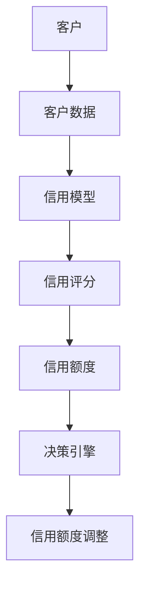
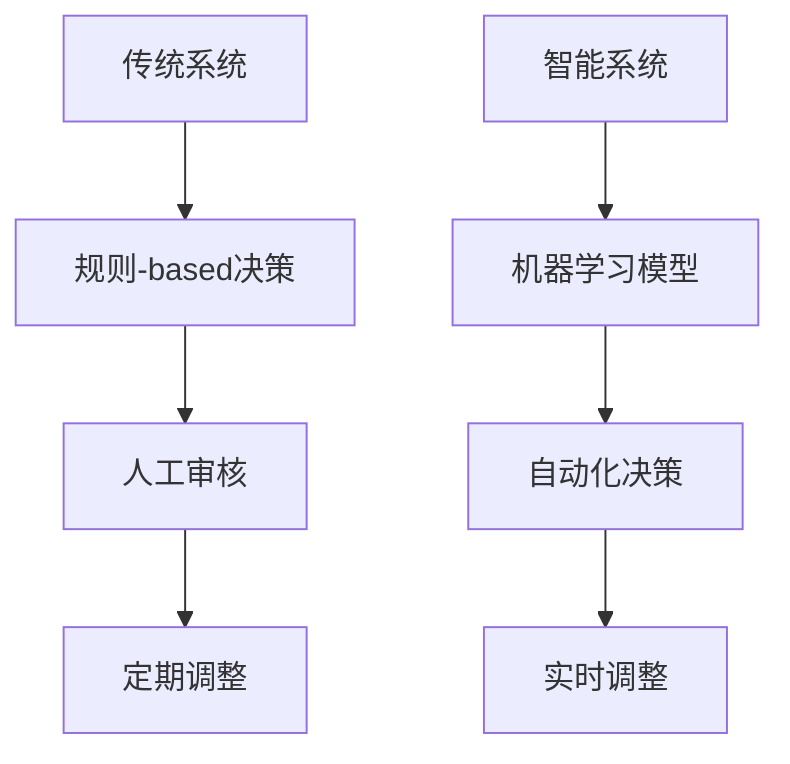
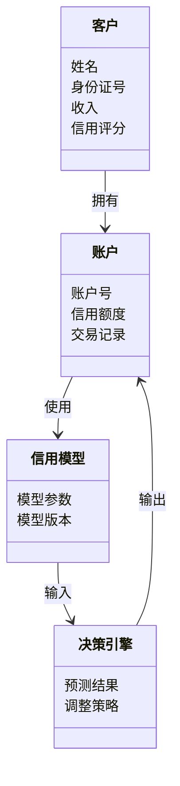
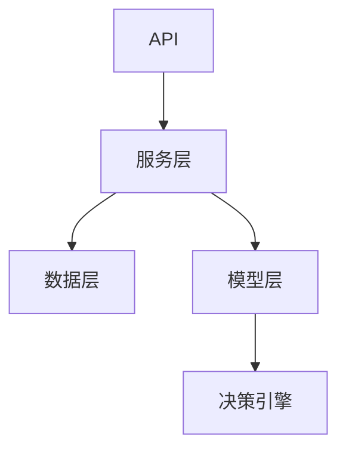
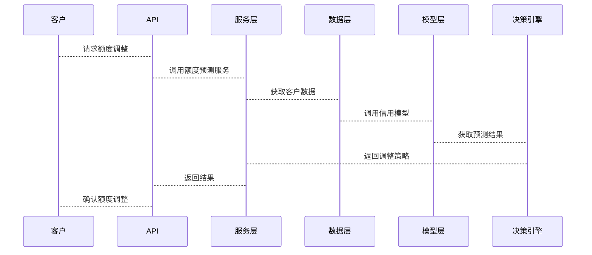

                 


# 第一部分: 智能信用卡额度管理系统的概述

# 第1章: 智能信用卡额度管理系统的背景与问题

## 1.1 智能信用卡额度管理的背景
### 1.1.1 传统信用卡额度管理的痛点
传统信用卡额度管理主要依赖人工审核和简单的规则-based系统，存在效率低下、精准度不足、客户体验差等问题。例如，银行在评估客户信用额度时，往往只能根据有限的几项指标（如收入、信用历史等）进行粗放式的额度分配，无法充分考虑客户的个性化需求和风险特征。

### 1.1.2 智能化管理的必要性
随着人工智能和大数据技术的快速发展，信用卡行业面临更高的客户期望和更复杂的市场环境。智能信用卡额度管理系统可以通过实时数据分析、精准客户画像和自动化决策，显著提高额度管理的效率和准确性，同时降低运营成本和风险。

### 1.1.3 信用卡行业的数字化转型
信用卡行业正经历从传统规则-based系统向智能化、数据驱动的决策系统的转型。通过引入机器学习、自然语言处理等技术，银行可以更深入地分析客户的信用行为、消费模式，从而实现个性化的额度管理和风险管理。

## 1.2 问题描述与目标
### 1.2.1 信用卡额度管理的核心问题
- 如何在海量客户中快速准确地评估每位客户的信用风险和支付能力。
- 如何动态调整客户的信用额度，以适应其变化的财务状况和消费行为。
- 如何在风险控制和客户体验之间找到平衡，避免过度授信和客户流失。

### 1.2.2 智能系统的目标与关键指标
- **目标**: 实现信用卡额度的智能化、个性化和动态化管理，提高授信准确性和客户满意度。
- **关键指标**: 
  - 额度预测准确率
  - 风险控制能力
  - 客户满意度
  - 系统响应时间

### 1.2.3 系统的边界与外延
智能信用卡额度管理系统主要针对信用卡发卡和额度调整业务，不包括信用评分、欺诈检测等其他信用卡管理模块。系统的边界是与客户信息管理系统、交易数据分析系统、风险管理系统的接口。

## 1.3 系统的核心要素与概念结构
### 1.3.1 核心要素分析
智能信用卡额度管理系统的核心要素包括：
1. **客户数据**: 包括基本资料、信用历史、消费记录、收入情况等。
2. **行为数据**: 客户的交易频率、金额、时间、地点等。
3. **市场环境**: 包括经济指标、行业趋势、政策法规等。
4. **信用模型**: 用于评估客户的信用风险和支付能力的数学模型。
5. **决策引擎**: 根据模型输出和实时数据，自动调整客户的信用额度。

### 1.3.2 概念结构图
以下是智能信用卡额度管理系统的核心概念结构图：



### 1.3.3 核心要素的特征对比
以下表格对比了传统信用卡额度管理和智能信用卡额度管理在核心要素上的区别：

| 特征               | 传统信用卡额度管理 | 智能信用卡额度管理 |
|--------------------|---------------------|--------------------|
| 数据来源           | 有限的客户资料     | 全面的客户数据     |
| 分析方法           | 规则-based         | 数据驱动的机器学习 |
| 调整频率           | 定期审核           | 实时动态调整       |
| 决策透明度         | 低                 | 高                 |
| 精准度             | 低                 | 高                 |

---

# 第2章: 智能信用卡额度管理的核心概念

## 2.1 核心概念的原理
### 2.1.1 数据驱动的额度计算
智能信用卡额度管理系统通过收集和分析大量的客户数据，利用机器学习算法构建信用模型，从而实现对客户信用额度的精准预测和动态调整。

### 2.1.2 人工智能算法的应用
人工智能算法（如逻辑回归、决策树、随机森林、神经网络等）被广泛应用于信用评分和额度预测，通过训练模型来识别客户的风险特征和信用行为。

### 2.1.3 系统的实时性与准确性
智能系统能够实时监控客户的交易数据和信用行为，快速响应市场变化和客户需求，确保额度调整的实时性和准确性。

## 2.2 核心概念的属性特征对比
### 2.2.1 传统与智能系统的对比表格
以下表格对比了传统信用卡额度管理和智能信用卡额度管理在核心概念上的区别：

| 特性               | 传统信用卡额度管理 | 智能信用卡额度管理 |
|--------------------|---------------------|--------------------|
| 技术基础           | 规则-based系统     | 人工智能和大数据技术 |
| 数据来源           | 简单的客户资料     | 全面的客户数据     |
| 决策方式           | 人工审核           | 自动化决策         |
| 调整频率           | 定期               | 实时               |
| 精准度             | 较低               | 较高               |

### 2.2.2 系统架构的对比分析
以下是传统与智能信用卡额度管理系统架构的对比：



## 2.3 系统的ER实体关系图
以下是智能信用卡额度管理系统的ER实体关系图：

```mermaid
erd
    客户 --> 拥有 --> 账户
    账户 --> 关联 --> 信用额度
    信用额度 --> 受影响于 --> 信用评分
    信用评分 --> 由 ... 实现 --> 信用模型
```

---

# 第3章: 智能信用卡额度管理的算法原理

## 3.1 算法原理概述
### 3.1.1 常见算法的选择与对比
智能信用卡额度管理中常用的算法包括：
1. **逻辑回归**: 用于分类问题，适合预测客户是否符合某种信用条件。
2. **决策树**: 用于分类和回归问题，适合处理非线性关系。
3. **随机森林**: 通过集成多个决策树模型，提高准确性和鲁棒性。
4. **神经网络**: 适合处理复杂的非线性关系，能够捕捉数据中的深层特征。

### 3.1.2 算法的数学模型与公式
以下是几种常用算法的数学模型和公式：

#### 1. 逻辑回归
$$ P(y=1|x) = \frac{e^{\beta_0 + \beta_1x}}{1 + e^{\beta_0 + \beta_1x}} $$

#### 2. 决策树
决策树的分裂准则可以使用基尼指数或信息增益，例如：
$$ \text{基尼指数} = \sum_{k=1}^{n} p_k(1 - p_k) $$

#### 3. 随机森林
随机森林通过随机采样和特征选择，构建多个决策树，并通过投票或加权的方式进行预测。

#### 4. 神经网络
神经网络的激活函数可以使用Sigmoid、ReLU等，例如：
$$ a = \sigma(wx + b) $$
其中，$\sigma$ 是Sigmoid函数：
$$ \sigma(z) = \frac{1}{1 + e^{-z}} $$

### 3.1.3 算法的优缺点分析
| 算法         | 优点                     | 缺点                     |
|--------------|--------------------------|--------------------------|
| 逻辑回归     | 简单、易于解释             | 适合线性关系，不适合复杂关系 |
| 决策树       | 易于解释，适合非线性数据   | 易受噪声数据影响           |
| 随机森林     | 高准确度、鲁棒性           | 计算复杂度高               |
| 神经网络     | 适合复杂数据，高精度       | 黑箱模型，解释性差         |

---

## 3.2 算法的详细讲解
### 3.2.1 线性回归模型
线性回归是一种简单的回归算法，适用于线性关系的预测。其模型形式为：
$$ y = \beta_0 + \beta_1x + \epsilon $$
其中，$\beta_0$ 和 $\beta_1$ 是回归系数，$\epsilon$ 是误差项。

### 3.2.2 决策树算法
决策树是一种树状结构，通过特征选择和分裂准则构建分类或回归树。例如，使用ID3算法的分裂准则：
$$ \text{信息增益} = \sum_{k=1}^{n} p_k \log_2 p_k $$

### 3.2.3 随机森林算法
随机森林是一种集成学习算法，通过随机采样和特征选择生成多个决策树，并通过投票或加权的方式进行预测。以下是随机森林的Python实现示例：

```python
from sklearn.ensemble import RandomForestClassifier

# 初始化模型
model = RandomForestClassifier(n_estimators=100, random_state=42)

# 训练模型
model.fit(X_train, y_train)

# 预测
y_pred = model.predict(X_test)
```

### 3.2.4 神经网络模型
神经网络是一种由人工神经元组成的网络结构，能够处理复杂的非线性关系。以下是简单的神经网络模型实现示例：

```python
import tensorflow as tf

# 定义模型
model = tf.keras.Sequential([
    tf.keras.layers.Dense(64, activation='relu'),
    tf.keras.layers.Dense(1, activation='sigmoid')
])

# 编译模型
model.compile(optimizer='adam', loss='binary_crossentropy', metrics=['accuracy'])

# 训练模型
model.fit(X_train, y_train, epochs=10, batch_size=32)
```

---

## 3.3 算法的数学模型与公式
### 3.3.1 线性回归的公式
$$ y = \beta_0 + \beta_1x + \epsilon $$

### 3.3.2 决策树的分裂准则
$$ \text{基尼指数} = \sum_{k=1}^{n} p_k(1 - p_k) $$

### 3.3.3 神经网络的激活函数
$$ a = \sigma(wx + b) $$

其中，$\sigma$ 是Sigmoid函数：
$$ \sigma(z) = \frac{1}{1 + e^{-z}} $$

---

## 3.4 算法的实现与代码示例
以下是使用逻辑回归算法进行信用评分的Python代码示例：

```python
from sklearn.linear_model import LogisticRegression
from sklearn.metrics import accuracy_score

# 初始化模型
model = LogisticRegression(random_state=42)

# 训练模型
model.fit(X_train, y_train)

# 预测
y_pred = model.predict(X_test)

# 计算准确率
print("Accuracy:", accuracy_score(y_test, y_pred))
```

---

## 3.5 算法的优缺点分析
| 算法         | 优点                     | 缺点                     |
|--------------|--------------------------|--------------------------|
| 逻辑回归     | 简单、易于解释             | 适合线性关系，不适合复杂关系 |
| 决策树       | 易于解释，适合非线性数据   | 易受噪声数据影响           |
| 随机森林     | 高准确度、鲁棒性           | 计算复杂度高               |
| 神经网络     | 适合复杂数据，高精度       | 黑箱模型，解释性差         |

---

# 第4章: 智能信用卡额度管理系统的架构设计与实现

## 4.1 系统分析与设计
### 4.1.1 问题场景介绍
智能信用卡额度管理系统需要实时处理大量客户数据，包括客户的基本信息、交易记录、信用历史等，并利用机器学习模型进行额度预测和调整。

### 4.1.2 系统功能设计
系统功能模块包括：
1. **数据采集**: 从数据库中提取客户数据和交易数据。
2. **数据预处理**: 清洗和特征工程，将数据转化为适合算法输入的形式。
3. **模型训练**: 使用机器学习算法训练信用评分模型。
4. **额度预测**: 根据模型输出结果预测客户的信用额度。
5. **额度调整**: 根据实时数据动态调整客户的信用额度。

### 4.1.3 领域模型的Mermaid类图
以下是系统领域模型的Mermaid类图：



---

## 4.2 系统架构设计
### 4.2.1 系统架构图
以下是系统的分层架构图：



### 4.2.2 系统接口设计
系统主要接口包括：
1. **数据接口**: 提供客户数据和交易数据的读取和写入功能。
2. **模型接口**: 提供模型训练、预测和调整的API。
3. **决策接口**: 提供额度调整的决策结果输出。

### 4.2.3 系统交互设计
以下是系统的交互流程图：



---

## 4.3 项目实战: 实现智能信用卡额度管理系统

### 4.3.1 环境安装
需要安装的工具和库包括：
- Python 3.8+
- TensorFlow 2.0+
- Scikit-learn 0.24+
- Pandas 1.3+
- Jupyter Notebook

### 4.3.2 核心代码实现
以下是智能信用卡额度管理系统的Python实现示例：

```python
import pandas as pd
import numpy as np
from sklearn.model

