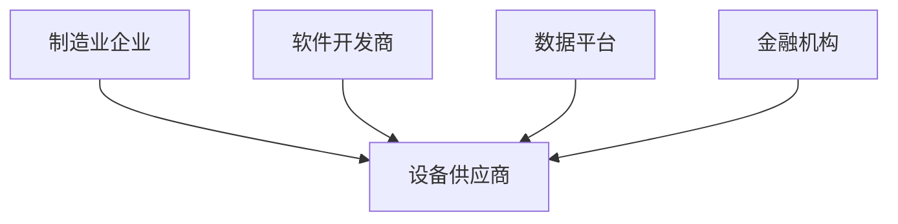
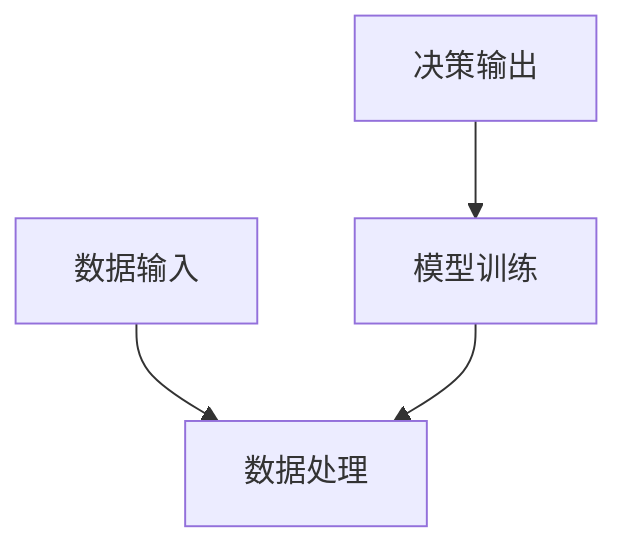
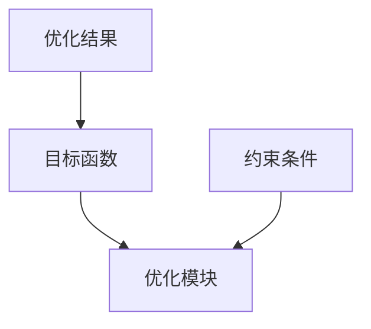
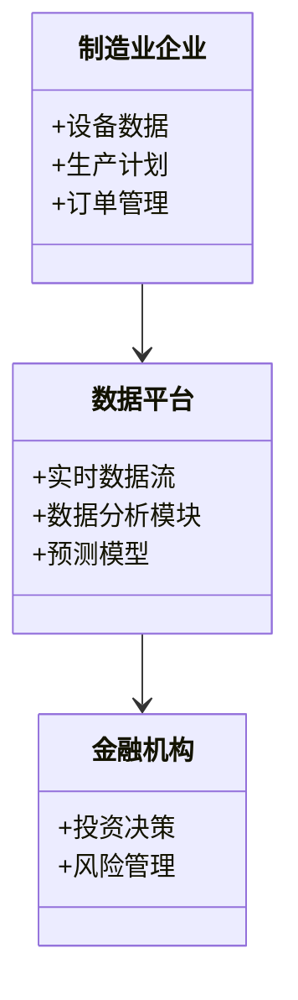
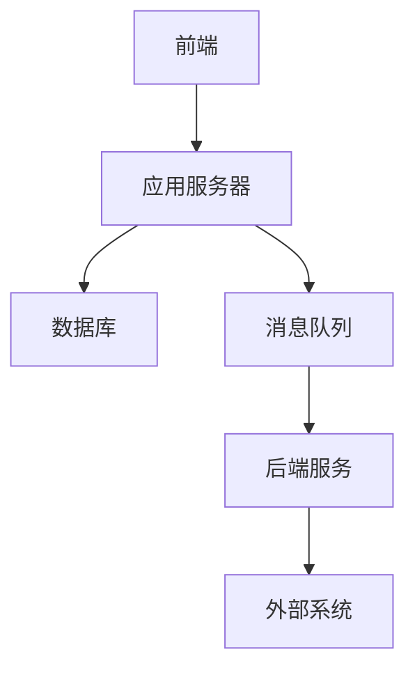

                 


# 智能制造趋势下的产业链投资分析

## 关键词：
智能制造，产业链，投资分析，工业4.0，物联网，大数据，人工智能

## 摘要：
智能制造是当前制造业发展的主要趋势，通过数字化、智能化和网络化技术的融合，极大地提升了生产效率和产品质量。本文从产业链的角度，分析智能制造的核心技术、市场机会和投资策略。文章首先介绍智能制造的定义与发展背景，然后探讨其产业链结构和关键要素，接着分析投资策略与风险，最后结合实际案例和系统架构设计，为投资者提供深度分析和建议。

---

# 第一部分：智能制造的定义与发展

## 第1章：智能制造的定义与背景

### 1.1 智能制造的定义与内涵
智能制造是基于物联网、大数据、人工智能等技术，通过数字化和智能化手段，实现生产过程的自动化、精准化和高效化。其核心在于将物理世界与数字世界深度融合，构建智能化的生产体系。

#### 1.1.1 制造业的数字化转型
- 数字化转型是制造业从传统模式向现代模式转变的关键。
- 数字化转型包括设备数据化、生产流程优化、供应链智能化等多个方面。

#### 1.1.2 智能制造的核心特征
- 数据驱动：通过传感器和物联网技术，实时采集生产数据。
- 自动化：实现生产过程的自动化控制和优化。
- 智能决策：基于数据分析和预测模型，辅助决策。

#### 1.1.3 智能制造与工业4.0的关系
- 工业4.0是智能制造的理论基础，强调智能化、网络化和个性化生产。
- 智能制造是工业4.0的具体实现形式。

### 1.2 智能制造的技术趋势
智能制造的技术发展趋势主要体现在以下几个方面：

#### 1.2.1 工业互联网与物联网
- 工业互联网是连接设备、系统和数据的桥梁。
- 物联网技术实现了设备间的互联互通，为生产过程提供了实时数据支持。

#### 1.2.2 大数据分析与人工智能
- 大数据分析用于挖掘生产数据的价值，优化生产流程。
- 人工智能技术（如机器学习、深度学习）用于预测生产故障、优化库存管理。

#### 1.2.3 数字孪生与虚拟制造
- 数字孪生技术通过虚拟模型模拟物理设备的运行状态，实现预测性维护。
- 虚拟制造技术用于产品设计和生产流程的仿真优化。

### 1.3 产业链结构与投资机会
智能制造产业链包括上游技术供应商、中游系统集成商和下游应用企业。投资者应关注以下领域的投资机会：

#### 1.3.1 上游技术供应商
- 智能传感器、工业机器人、工业软件等技术供应商是产业链的核心。

#### 1.3.2 中游系统集成商
- 系统集成商负责将各种技术整合到生产系统中，是智能制造实施的关键。

#### 1.3.3 下游应用企业
- 制造业企业是智能制造技术的直接应用者，也是投资的主要受益者。

---

# 第二部分：智能制造产业链的核心概念与联系

## 第2章：智能制造产业链的核心要素

### 2.1 智能制造产业链的实体关系图
智能制造产业链涉及多个实体，包括制造业企业、设备供应商、软件开发商、数据平台和金融机构。以下是它们之间的关系图：



### 2.2 智能制造的核心算法原理
智能制造中的算法主要用于数据分析和优化决策。以下是几种常见算法的流程图：

#### 2.2.1 数据驱动的预测模型


#### 2.2.2 优化算法


### 2.3 数学模型与公式
智能制造中的数学模型主要用于预测和优化。以下是几个关键模型：

#### 数据驱动的预测模型
$$y = \beta_0 + \beta_1x_1 + \beta_2x_2 + \epsilon$$
其中，$y$ 是预测目标，$x_1, x_2$ 是输入变量，$\epsilon$ 是误差项。

#### 优化算法
$$\text{目标函数：} \quad f(x) = \min_{x} (c_1x_1 + c_2x_2)$$
$$\text{约束条件：} \quad g(x) = x_1 + x_2 \leq 1$$

### 2.4 系统架构设计
智能制造系统的架构设计包括数据采集层、数据处理层和决策层。以下是系统架构图：



---

# 第三部分：智能制造产业链的投资策略与分析

## 第3章：智能制造产业链的投资策略

### 3.1 技术驱动的投资机会
智能制造领域的技术进步为投资者提供了丰富的机会。

#### 3.1.1 工业互联网平台
- 投资工业互联网平台可以实现设备数据的互联互通。
- 平台经济模式为投资者提供了长期稳定的收益。

#### 3.1.2 人工智能与机器学习
- 人工智能技术在生产预测和质量控制中具有重要应用。
- 投资相关技术企业可以享受技术进步带来的红利。

#### 3.1.3 数字孪生技术
- 数字孪生技术为设备维护和生产优化提供了新思路。
- 投资数字孪生平台可以提升企业的竞争力。

### 3.2 政策与市场分析
政策和市场环境是影响投资的重要因素。

#### 3.2.1 国家政策支持
- 各国政府纷纷出台政策支持智能制造发展。
- 政策红利为投资者提供了有利的市场环境。

#### 3.2.2 市场需求分析
- 制造业升级的需求推动了智能制造市场的增长。
- 市场需求的多样性为投资者提供了广泛的选择。

#### 3.2.3 行业竞争格局
- 行业竞争格局决定投资风险和收益。
- 投资者应关注行业领先企业的动态。

### 3.3 风险管理与投资组合
在智能制造投资中，风险管理至关重要。

#### 3.3.1 投资风险识别
- 技术风险：技术更新换代快，投资需谨慎。
- 市场风险：市场需求波动大，需关注市场变化。

#### 3.3.2 风险控制策略
- 分散投资：通过投资不同领域的项目降低风险。
- 选择优质企业：投资行业领先企业，确保收益稳定。

#### 3.3.3 投资组合优化
- 根据市场变化动态调整投资组合。
- 组合投资可以有效降低整体风险。

---

# 第四部分：智能制造产业链的案例分析与系统设计

## 第4章：智能制造产业链的案例分析

### 4.1 智能制造项目实战

#### 4.1.1 环境安装
- 操作系统：Linux或Windows。
- 开发工具：Python、TensorFlow、Kafka等。

#### 4.1.2 系统核心实现
以下是智能制造系统的核心代码示例：

```python
import numpy as np
from sklearn.linear_model import LinearRegression

# 数据准备
X = np.array([[1], [2], [3], [4], [5]])
y = np.array([2, 4, 5, 4, 6])

# 模型训练
model = LinearRegression()
model.fit(X, y)

# 预测结果
print(model.predict([[6]]))  # 输出：[[7.8]]
```

#### 4.1.3 代码解读与分析
- 代码实现了基于线性回归的生产预测模型。
- 该模型可以用于预测生产成本或产量。

#### 4.1.4 案例分析
- 某汽车制造企业引入智能制造系统后，生产效率提升了20%。
- 通过数据分析优化了供应链管理，降低了库存成本。

---

## 第5章：智能制造系统的架构设计

### 5.1 系统功能设计
智能制造系统包括数据采集、数据分析、决策支持等功能模块。

#### 5.1.1 领域模型


### 5.2 系统架构设计
智能制造系统的架构设计如下：



### 5.3 系统接口设计
以下是系统主要接口的描述：

#### 5.3.1 数据采集接口
- 接口名称：`get_sensor_data`
- 功能：从传感器获取实时数据。
- 请求格式：`POST /api/sensor/data`

#### 5.3.2 数据分析接口
- 接口名称：`analyze_data`
- 功能：对数据进行分析和预测。
- 请求格式：`POST /api/analyze`

### 5.4 系统交互设计
以下是系统交互的序列图：

```mermaid
sequenceDiagram
参与者：投资者
系统：智能制造平台
投资者 -> 系统：提交投资需求
系统 -> 数据平台：获取实时数据
数据平台 -> 系统：返回分析结果
系统 -> 投资者：展示投资建议
```

---

## 第6章：智能制造产业链的未来趋势与挑战

### 6.1 未来趋势
智能制造的未来发展将呈现以下趋势：

#### 6.1.1 技术融合
- 多技术融合将推动智能制造的进一步发展。
- 人工智能、区块链等技术将深度融合于智能制造系统。

#### 6.1.2 全球化发展
- 全球化合作将成为智能制造发展的重要驱动力。
- 国际间的技术交流和合作将加速智能制造的普及。

### 6.2 投资者关注的挑战
智能制造投资面临以下挑战：

#### 6.2.1 技术风险
- 技术更新换代快，投资需关注技术领先性。
- 技术失败可能导致投资损失。

#### 6.2.2 市场竞争
- 市场竞争加剧，投资需关注企业的核心竞争力。
- 投资者需选择具有竞争优势的企业。

#### 6.2.3 政策变化
- 政策变化可能影响投资收益。
- 投资者需关注政策动向，灵活调整投资策略。

---

# 第七部分：投资建议与最佳实践

## 第7章：投资建议与最佳实践

### 7.1 投资策略总结
- **长期投资**：智能制造是长期趋势，投资者应关注长期收益。
- **分散投资**：通过分散投资降低风险。
- **关注技术领先企业**：选择技术领先的企业进行投资。

### 7.2 小结
智能制造是制造业升级的重要方向，投资机会丰富。投资者应结合技术趋势和市场环境，制定合理的投资策略。

### 7.3 注意事项
- **风险控制**：投资需注意风险，避免盲目跟风。
- **持续学习**：智能制造技术更新快，投资者需持续学习。

### 7.4 拓展阅读
- 《工业4.0：未来ufacturing》
- 《大数据时代》

---

# 作者信息

作者：AI天才研究院/AI Genius Institute & 禅与计算机程序设计艺术 /Zen And The Art of Computer Programming

---

以上是《智能制造趋势下的产业链投资分析》的技术博客文章的大纲和内容。如果需要进一步扩展或详细讲解某一部分，请随时告知！

