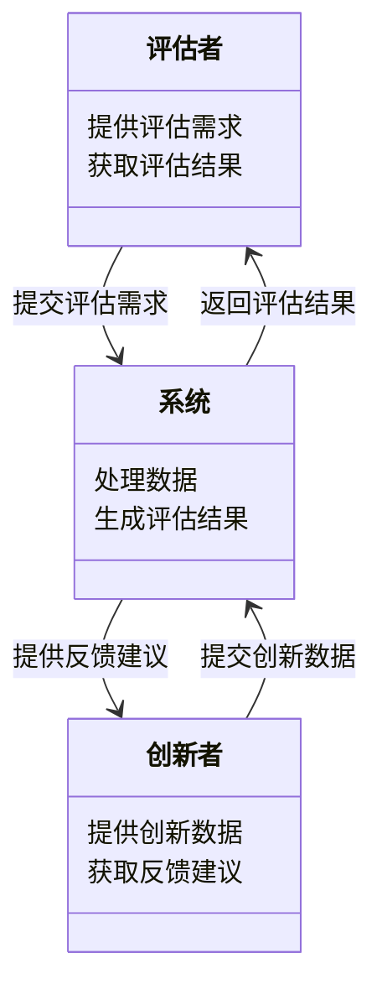

                 


# 智能化公司创新文化评估：多智能体AI的新视角

> 关键词：多智能体AI、创新文化评估、企业创新、人工智能、系统架构

> 摘要：随着人工智能技术的不断发展，企业创新文化的评估方式也在不断进化。传统的评估方法逐渐暴露出其局限性，而多智能体AI的引入为创新文化评估提供了全新的视角。本文将从多智能体AI的基本原理出发，探讨其在创新文化评估中的应用，分析其优势和挑战，并通过具体案例展示其在实际中的应用效果。

---

# 第一部分: 智能化公司创新文化评估的背景与意义

## 第1章: 创新文化评估的核心概念

### 1.1 问题背景与问题描述

#### 1.1.1 传统企业创新评估的局限性
传统的创新评估方法通常依赖于定量指标，例如专利数量、新产品发布速度等。然而，这种方法往往忽视了创新文化的动态性和复杂性。创新文化是一个涉及团队协作、员工激励、组织结构等多个维度的系统性问题，而传统的评估方法难以捕捉这些复杂因素。

#### 1.1.2 多智能体AI在创新文化评估中的优势
多智能体AI通过模拟多个智能体之间的交互，能够更全面地捕捉创新文化中的关键因素。例如，可以通过分析员工之间的协作模式、知识共享行为等，来评估企业的创新氛围。多智能体AI的分布式计算能力使其能够处理大规模数据，并提供实时反馈。

#### 1.1.3 创新文化评估的边界与外延
创新文化评估的边界在于如何平衡短期指标与长期目标。外延则包括如何将评估结果应用于实际管理决策中，例如优化组织结构、提升员工激励机制等。

### 1.2 多智能体AI的基本原理

#### 1.2.1 多智能体系统的核心要素
多智能体系统由多个具有自主决策能力的智能体组成，这些智能体通过协同工作完成复杂任务。核心要素包括：
- **智能体**：能够感知环境并采取行动的实体。
- **交互**：智能体之间的通信与协作。
- **环境**：智能体所处的外部环境，包括任务目标和约束条件。

#### 1.2.2 多智能体AI与传统AI的区别
传统AI通常依赖中心化控制，而多智能体AI强调分布式决策和协同。多智能体AI能够更好地处理复杂系统中的动态问题，例如组织内部的知识共享和创新行为。

#### 1.2.3 多智能体AI在企业创新文化评估中的应用潜力
多智能体AI可以模拟员工的创新行为，分析团队协作效率，预测创新文化的发展趋势。例如，通过模拟不同团队的协作模式，可以优化组织结构，提升创新效率。

---

## 第2章: 多智能体AI与创新文化评估的关系

### 2.1 多智能体AI的实体关系图

```mermaid
erDiagram
    actor 评估者 {
        id
        评估标准
        评估结果
    }
    actor 创新者 {
        id
        创新行为
        创新成果
    }
    actor 系统 {
        id
        算法模型
        数据存储
    }
    评估者 --> 系统 : 提供评估需求
    创新者 --> 系统 : 提供创新数据
    系统 --> 评估者 : 返回评估结果
    系统 --> 创新者 : 提供反馈建议
```

### 2.2 多智能体AI的领域模型



---

# 第二部分: 多智能体AI的算法原理与数学模型

## 第3章: 多智能体AI的核心算法

### 3.1 多智能体协作算法

#### 3.1.1 算法流程

```mermaid
graph TD
    A[评估者] --> B[创新者] : 提供反馈
    B --> C[系统] : 提供创新数据
    C --> D[结果] : 生成评估结果
    D --> A : 返回评估结果
```

#### 3.1.2 Python实现代码

```python
class Agent:
    def __init__(self, id):
        self.id = id
        self.behavior = None

    def perceive(self, environment):
        # 根据环境感知采取行动
        pass

    def act(self):
        # 根据感知结果采取行动
        pass

class System:
    def __init__(self, agents):
        self.agents = agents

    def evaluate(self):
        # 评估创新文化
        pass

# 示例用法
agent1 = Agent(1)
agent2 = Agent(2)
system = System([agent1, agent2])
system.evaluate()
```

#### 3.1.3 数学模型与公式

创新文化评估的数学模型可以表示为：

$$
C = \sum_{i=1}^{n} w_i \cdot x_i
$$

其中，\( C \) 表示创新文化指数，\( w_i \) 是第 \( i \) 个因素的权重，\( x_i \) 是第 \( i \) 个因素的评分。

---

## 第4章: 创新文化评估的数学模型

### 4.1 创新文化评估的指标体系

创新文化评估的关键指标包括：
- 创新氛围（\( x_1 \)）
- 团队协作效率（\( x_2 \)）
- 员工激励机制（\( x_3 \)）
- 知识共享程度（\( x_4 \)）

权重 \( w_i \) 可以根据企业的具体情况确定。

---

## 第5章: 多智能体AI的系统架构

### 5.1 系统功能设计

#### 5.1.1 领域模型


#### 5.1.2 系统架构设计

```mermaid
graph TD
    A[前端] --> B[后端系统] : 发送评估需求
    B --> C[数据库] : 查询创新数据
    C --> B : 返回数据
    B --> A : 返回评估结果
```

---

## 第6章: 创新文化评估的案例分析

### 6.1 案例背景

某高科技公司希望评估其研发团队的创新文化。通过多智能体AI系统，分析团队协作效率、知识共享程度等指标。

### 6.2 系统实现

#### 6.2.1 环境安装
安装Python、机器学习库（如scikit-learn）和可视化工具（如Matplotlib）。

#### 6.2.2 核心代码实现

```python
import numpy as np
from sklearn.metrics import accuracy_score

class Agent:
    def __init__(self, id):
        self.id = id
        self.data = []

    def perceive(self, environment):
        self.data = environment
        return self.data

    def act(self):
        return self.data

class System:
    def __init__(self, agents):
        self.agents = agents

    def evaluate(self):
        results = []
        for agent in self.agents:
            environment = np.random.rand(5)
            agent.perceive(environment)
            results.append(agent.act())
        return results

# 示例用法
agent1 = Agent(1)
agent2 = Agent(2)
system = System([agent1, agent2])
results = system.evaluate()
print(results)
```

### 6.3 结果分析

通过分析结果，可以发现团队协作效率较高，但知识共享程度有待提升。

---

# 第三部分: 总结与展望

## 第7章: 总结与小结

### 7.1 小结

多智能体AI为创新文化评估提供了全新的视角，能够更全面地捕捉创新文化中的关键因素。

### 7.2 最佳实践 tips

- 在实际应用中，需结合企业的具体情况调整模型参数。
- 数据质量和实时性对评估结果有重要影响。

### 7.3 注意事项

- 确保数据隐私和安全。
- 定期更新模型以适应企业发展的变化。

### 7.4 拓展阅读

建议进一步研究多智能体AI在组织行为学中的应用。

---

作者：AI天才研究院/AI Genius Institute & 禅与计算机程序设计艺术 /Zen And The Art of Computer Programming

