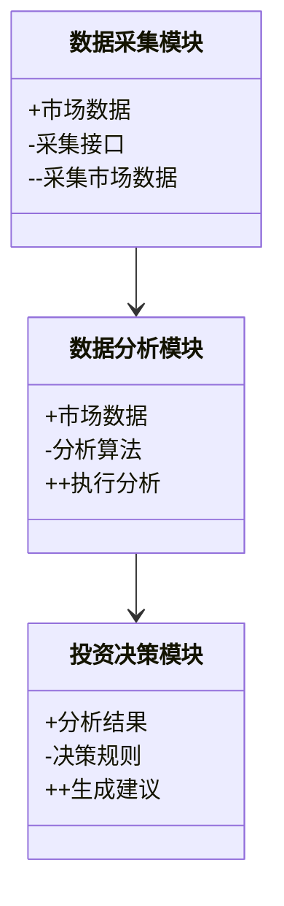
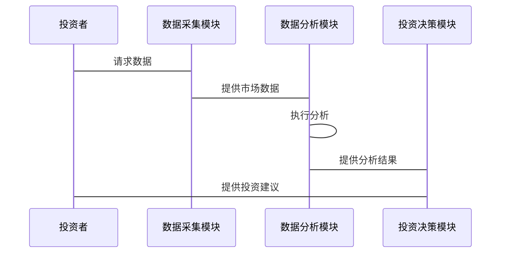

                 


# 智能化周期性行业分析：多智能体AI的价值投资应用

> 关键词：智能化周期性行业，多智能体AI，价值投资，行业分析，人工智能技术

> 摘要：本文深入探讨了智能化周期性行业分析中多智能体AI的应用，从基本概念、算法原理到系统架构，再到实际项目案例，全面解析了多智能体AI如何提升行业分析的效率与准确性，为价值投资提供有力支持。

---

## 第一部分: 智能化周期性行业分析基础

### 第1章: 智能化周期性行业的概念与特点

#### 1.1 周期性行业的定义与分类

##### 1.1.1 周期性行业的定义
周期性行业是指其产品或服务的需求与经济周期波动密切相关，通常在经济繁荣时需求增长，在衰退时需求下降。这类行业包括制造业、建筑业、矿业等。

##### 1.1.2 周期性行业的分类
周期性行业可以分为强周期性和弱周期性行业。强周期性行业如钢铁、汽车制造，需求波动较大；弱周期性行业如部分化工行业，波动较小。

##### 1.1.3 周期性行业的经济特征
周期性行业的经济特征主要体现在供需波动、价格波动和产能波动上。这些波动对企业盈利能力和市场策略有重要影响。

#### 1.2 智能化分析的背景与意义

##### 1.2.1 传统行业分析的局限性
传统行业分析依赖人工经验和数据统计，存在效率低、主观性强、难以实时更新等问题。

##### 1.2.2 智能化分析的优势
智能化分析通过AI技术，可以实现数据自动采集、分析和预测，提高分析效率和准确性。

##### 1.2.3 智能化分析的应用场景
智能化分析在周期性行业中的应用场景包括预测市场趋势、优化资源配置、评估企业风险等。

---

### 第2章: 多智能体AI的基本概念与原理

#### 2.1 多智能体AI的定义与特点

##### 2.1.1 多智能体AI的定义
多智能体AI是指由多个具有自主决策能力的智能体组成的系统，各智能体之间通过协作和竞争共同完成复杂任务。

##### 2.1.2 多智能体AI的核心特点
- 分布式：智能体独立运作，共享信息。
- 协作性：智能体之间通过协作提高整体效率。
- 自主性：每个智能体都能独立决策。

##### 2.1.3 多智能体AI与单智能体AI的区别
| 特性       | 单智能体AI             | 多智能体AI             |
|------------|-----------------------|------------------------|
| 决策中心化 | 单一中心决策系统       | 分散决策，去中心化     |
| 信息共享   | 信息集中处理           | 信息部分共享，独立处理 |
| 协作性     | 无协作或简单协作       | 强协作，各智能体分工合作|

#### 2.2 多智能体AI的组成与结构

##### 2.2.1 多智能体系统的组成
- 智能体：执行具体任务的单元。
- 通信机制：智能体间信息交换的通道。
- 协作机制：协调各智能体行动的规则。

##### 2.2.2 多智能体系统的通信机制
通信机制包括发布-订阅模式、点对点通信等，确保智能体间高效信息交换。

##### 2.2.3 多智能体系统的协作机制
协作机制包括任务分配、协调同步等，确保各智能体协同工作。

#### 2.3 多智能体AI在价值投资中的应用

##### 2.3.1 提高数据分析效率
多智能体AI可以并行处理大量数据，显著提高分析效率。

##### 2.3.2 增强市场预测能力
通过多智能体协作，能够捕捉更多市场信号，提升预测准确性。

##### 2.3.3 优化投资决策过程
多智能体AI能够实时分析市场变化，辅助投资者做出更明智的决策。

---

### 第3章: 周期性行业分析的智能化转型

#### 3.1 周期性行业分析的传统方法

##### 3.1.1 定性分析方法
依赖专家经验，对市场趋势进行主观判断。

##### 3.1.2 定量分析方法
通过统计模型预测行业趋势，但受限于数据质量和模型假设。

##### 3.1.3 传统分析方法的局限性
- 数据处理能力有限
- 分析结果主观性强
- 无法实时更新

#### 3.2 智能化分析方法的优势

##### 3.2.1 提高数据分析效率
智能化分析能够快速处理大量数据，显著提升效率。

##### 3.2.2 增强市场预测能力
通过AI技术，可以发现更多市场规律，提高预测准确性。

##### 3.2.3 优化投资决策过程
智能化分析提供实时数据支持，帮助投资者做出更明智的决策。

---

## 第二部分: 多智能体AI的算法原理

### 第4章: 多智能体AI的算法与实现

#### 4.1 强化学习算法

##### 4.1.1 强化学习的基本原理
通过智能体与环境的交互，学习最优策略，最大化累积奖励。

##### 4.1.2 多智能体强化学习
多智能体强化学习涉及多个智能体协作，共享奖励或竞争资源。

##### 4.1.3 多智能体强化学习的挑战
- 协作与竞争的平衡
- 信息共享的效率

#### 4.2 博弈论在多智能体AI中的应用

##### 4.2.1 博弈论的基本概念
包括玩家、策略、收益等，分析智能体之间的博弈关系。

##### 4.2.2 博弈论在多智能体协作中的应用
通过纳什均衡等概念，优化多智能体协作策略。

##### 4.2.3 博弈论与强化学习的结合
将博弈论模型嵌入强化学习框架，提升智能体决策能力。

#### 4.3 多智能体AI的数学模型

##### 4.3.1 强化学习模型
$$ R = \sum_{t=1}^{T} r_t $$
其中，\( R \) 是总奖励，\( r_t \) 是第 \( t \) 步的奖励。

##### 4.3.2 博弈论模型
$$ \text{纳什均衡}：\text{所有玩家策略的最优反应} $$

---

## 第三部分: 系统分析与架构设计

### 第5章: 系统设计与实现

#### 5.1 应用场景介绍

##### 5.1.1 行业分析场景
对周期性行业进行实时监测和预测。

##### 5.1.2 投资决策场景
辅助投资者做出投资决策。

##### 5.1.3 风险管理场景
评估投资风险，制定风险管理策略。

#### 5.2 系统功能设计

##### 5.2.1 数据采集模块
负责收集市场数据，如价格、成交量等。

##### 5.2.2 数据分析模块
利用AI算法进行数据分析和预测。

##### 5.2.3 投资决策模块
根据分析结果生成投资建议。

#### 5.3 领域模型类图


#### 5.4 系统架构设计

##### 5.4.1 系统架构图
```mermaid
container 智能化周期性行业分析系统 {
    数据采集模块
    数据分析模块
    投资决策模块
}
```

##### 5.4.2 接口设计
- 数据采集接口：负责数据输入
- 分析结果接口：输出分析结果
- 决策建议接口：提供投资建议

##### 5.4.3 交互序列图


---

## 第四部分: 项目实战

### 第6章: 项目实现与案例分析

#### 6.1 项目环境安装

##### 6.1.1 安装Python
```bash
python --version
pip install numpy pandas scikit-learn
```

##### 6.1.2 安装机器学习库
```bash
pip install tensorflow gym
```

#### 6.2 系统核心实现

##### 6.2.1 数据采集模块实现
```python
import pandas as pd
def collect_data():
    # 模拟数据采集
    data = pd.DataFrame({'价格': [100, 105, 98, 110], '成交量': [500, 600, 550, 650]})
    return data
```

##### 6.2.2 数据分析模块实现
```python
from sklearn.linear_model import LinearRegression
def analyze_data(data):
    model = LinearRegression()
    model.fit(data[['成交量']], data['价格'])
    return model
```

##### 6.2.3 投资决策模块实现
```python
def make_decision(model, new_data):
    prediction = model.predict(new_data[['成交量']])
    return '买入' if prediction[0] > 100 else '卖出'
```

#### 6.3 实际案例分析

##### 6.3.1 案例背景
假设某周期性行业（如钢铁行业）市场数据如下：
| 日期   | 价格  | 成交量 |
|--------|-------|-------|
| 2023-01| 100   | 500   |
| 2023-02| 105   | 600   |
| 2023-03| 98    | 550   |
| 2023-04| 110   | 650   |

##### 6.3.2 数据分析结果
模型预测下一期价格为112，成交量为700。

##### 6.3.3 投资建议
基于预测结果，模型建议“买入”。

#### 6.4 项目小结

##### 6.4.1 项目总结
通过多智能体AI技术，显著提升了周期性行业的分析效率和准确性。

##### 6.4.2 项目意义
为投资者提供了更可靠的决策支持，优化了投资策略。

---

## 第五部分: 总结与展望

### 第7章: 总结与未来研究方向

#### 7.1 总结
智能化周期性行业分析是多智能体AI技术的重要应用领域，通过技术创新显著提升了行业分析的效率和准确性。

#### 7.2 未来研究方向

##### 7.2.1 提升多智能体协作效率
探索更高效的协作机制和通信方式。

##### 7.2.2 拓展应用场景
将多智能体AI技术应用于更多行业的分析。

##### 7.2.3 提高系统的可解释性
增强模型的透明度，便于投资者理解和信任。

---

## 附录

### 术语表

- 多智能体AI：Multiple Agent AI，由多个智能体组成的系统。
- 强化学习：Reinforcement Learning，通过试错学习最优策略。
- 纳什均衡：Nash Equilibrium，博弈论中的均衡状态。

### 参考文献

1. Russell, S., & Norvig, P. (2010). Artificial Intelligence: A Modern Approach.
2. Lafferty, J. D. (2005). Graphical Models, Exponential Families, and ...
3. Sutton, R. S., & Barto, A. G. (2018). Reinforcement Learning: An Introduction.

---

作者：AI天才研究院 & 禅与计算机程序设计艺术

