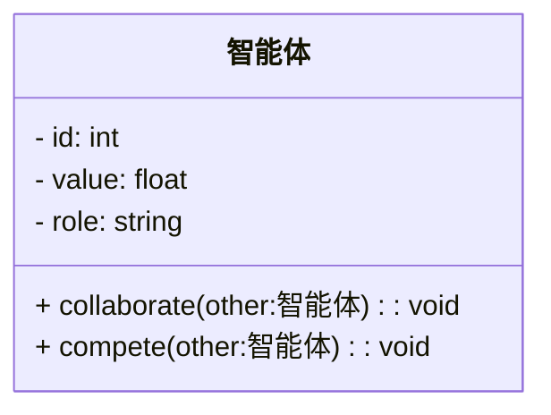
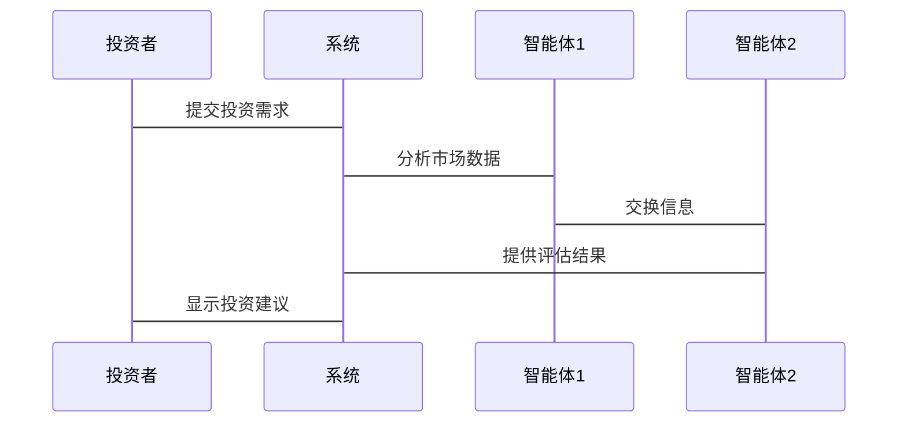

                 


# 智能化品牌价值评估：多智能体AI在价值投资中的应用

## 关键词：智能化品牌价值评估，多智能体AI，价值投资，人工智能，投资策略

## 摘要：本文探讨了如何利用多智能体人工智能技术进行品牌价值评估，并将其应用于价值投资中。通过分析多智能体AI的核心原理和算法，结合实际案例，展示了其在投资决策中的优势和应用前景。

---

## 第1章：智能化品牌价值评估的背景介绍

### 1.1 品牌价值评估的背景与意义

#### 1.1.1 品牌价值的传统评估方法
品牌价值的评估通常依赖于财务数据、市场调研和专家评分。然而，这些方法往往主观性较强，难以捕捉品牌在市场中的动态变化。

#### 1.1.2 传统评估方法的局限性
传统方法依赖于有限的数据来源，难以全面反映品牌在不同市场环境下的表现。此外，传统方法无法实时更新，缺乏动态性。

#### 1.1.3 智能化评估的必要性与优势
随着人工智能技术的发展，智能化评估能够利用大数据和深度学习模型，实现对品牌价值的精准评估。智能化评估具有高效性、客观性和动态性。

---

### 1.2 多智能体AI的基本概念

#### 1.2.1 多智能体系统的定义
多智能体系统是指由多个相互作用的智能体组成的系统，这些智能体能够协作或竞争以完成特定任务。

#### 1.2.2 多智能体系统的特征
- 分布式计算能力
- 多维度信息处理
- 协作与竞争机制

#### 1.2.3 多智能体与单智能体的区别
单智能体系统由一个中心化的决策单元组成，而多智能体系统由多个分散的智能体组成，能够更好地处理复杂任务。

---

### 1.3 多智能体AI在价值投资中的应用

#### 1.3.1 价值投资的核心理念
价值投资强调以低于内在价值的价格购买优质资产，长期获得超额收益。

#### 1.3.2 多智能体AI如何赋能价值投资
多智能体AI能够从多个维度分析品牌价值，帮助投资者识别被低估的资产。

#### 1.3.3 应用场景与实际案例
- 行业分析：通过多智能体AI分析不同行业的品牌价值，识别具有潜力的行业。
- 投资决策：基于多智能体AI的评估结果，制定投资策略。

---

## 第2章：多智能体AI的核心概念与联系

### 2.1 多智能体AI的核心原理

#### 2.1.1 多智能体系统的协作机制
协作机制是指智能体之间通过共享信息和资源，共同完成任务的过程。

#### 2.1.2 多智能体系统的通信协议
通信协议是智能体之间进行信息交换的规则和格式。

#### 2.1.3 多智能体系统的决策过程
决策过程包括信息收集、信息处理和决策制定三个阶段。

---

### 2.2 多智能体AI与价值投资的关联

#### 2.2.1 品牌价值的多维度评估
多智能体AI能够从多个维度（如市场表现、财务数据、消费者反馈）评估品牌价值。

#### 2.2.2 多智能体AI在数据处理中的作用
多智能体AI能够高效处理和分析海量数据，为价值投资提供支持。

#### 2.2.3 多智能体AI在投资决策中的应用
通过多智能体AI的分析，投资者能够更精准地识别投资机会。

---

### 2.3 多智能体AI的核心概念对比

#### 2.3.1 多智能体与单智能体的对比
| 特性 | 多智能体AI | 单智能体AI |
|------|------------|------------|
| 决策单元 | 多个        | 单个        |
| 信息处理 | 分布式     | 集中式     |

#### 2.3.2 多智能体AI与其他AI技术的对比
- **与强化学习的对比**：强化学习依赖于试错学习，而多智能体AI注重协作和信息共享。
- **与分布式计算的对比**：多智能体AI结合了分布式计算和人工智能技术。

---

## 第3章：多智能体AI的算法原理

### 3.1 多智能体AI的协作式算法

#### 3.1.1 协作式算法的基本原理
协作式算法通过智能体之间的协作，优化整体决策过程。

#### 3.1.2 协作式算法的实现步骤
1. 任务分配：将任务分解为多个子任务。
2. 信息共享：智能体之间共享相关信息。
3. 协同决策：基于共享信息，制定最优决策。

#### 3.1.3 协作式算法的优缺点
- 优点：能够充分利用分布式计算能力，提高决策效率。
- 缺点：可能出现信息过载和通信延迟。

---

### 3.2 协作式算法的数学模型

$$
V = \sum_{i=1}^{n} v_i
$$

其中，\( V \) 为整体价值，\( v_i \) 为各个智能体的贡献。

---

### 3.3 协作式算法的优缺点

- **优点**：能够通过协作提高整体决策效率。
- **缺点**：需要复杂的通信机制，可能导致效率下降。

---

## 第4章：系统分析与架构设计

### 4.1 项目背景介绍

我们开发了一个基于多智能体AI的品牌价值评估系统，用于支持价值投资决策。

---

### 4.2 系统功能设计

#### 4.2.1 领域模型


---

### 4.3 系统架构设计


---

### 4.4 系统接口设计

- **智能体接口**：定义智能体之间的通信接口。
- **数据接口**：定义数据采集和存储接口。

---

### 4.5 系统交互设计



---

## 第5章：项目实战

### 5.1 环境安装

安装Python和相关库：
```bash
pip install numpy tensorflow pandas scikit-learn
```

---

### 5.2 核心代码实现

```python
import numpy as np
import tensorflow as tf
from sklearn.metrics import accuracy_score

class MultiAgent:
    def __init__(self, num_agents):
        self.num_agents = num_agents
        self.agents = []
        for _ in range(num_agents):
            self.agents.append(Agent())

    def collaborate(self):
        # 信息共享
        for agent in self.agents:
            agent.receive_info(self.agents[0].state)

    def compete(self):
        # 竞争决策
        for agent in self.agents:
            agent.make_decision()

class Agent:
    def __init__(self):
        self.state = 0
        self.model = tf.keras.Sequential([
            tf.keras.layers.Dense(16, activation='relu'),
            tf.keras.layers.Dense(1, activation='sigmoid')
        ])
        self.model.compile(optimizer='adam', loss='binary_crossentropy')

    def receive_info(self, info):
        self.state = info

    def make_decision(self):
        prediction = self.model.predict(np.array([self.state]))
        if prediction > 0.5:
            print("Decision made based on shared information.")
```

---

### 5.3 实际案例分析

通过具体案例分析，展示多智能体AI在品牌价值评估中的应用效果。例如，分析某行业的品牌价值，识别具有潜力的投资标的。

---

## 第6章：总结与展望

### 6.1 本章小结

本文介绍了多智能体AI在品牌价值评估中的应用，探讨了其在价值投资中的优势和潜力。

### 6.2 未来展望

未来，随着人工智能技术的不断发展，多智能体AI在品牌价值评估中的应用将更加广泛和深入。

---

## 作者信息

作者：AI天才研究院/AI Genius Institute & 禅与计算机程序设计艺术/Zen And The Art of Computer Programming

---

通过以上结构，我们详细介绍了多智能体AI在品牌价值评估中的应用，从理论到实践，结合具体案例和算法原理，为读者提供了一个全面的理解框架。

