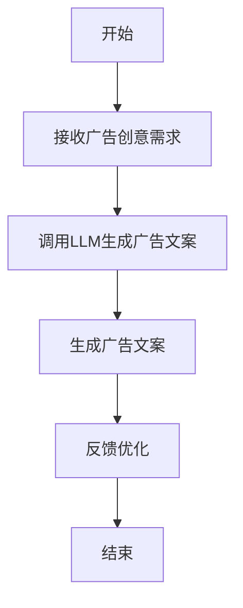
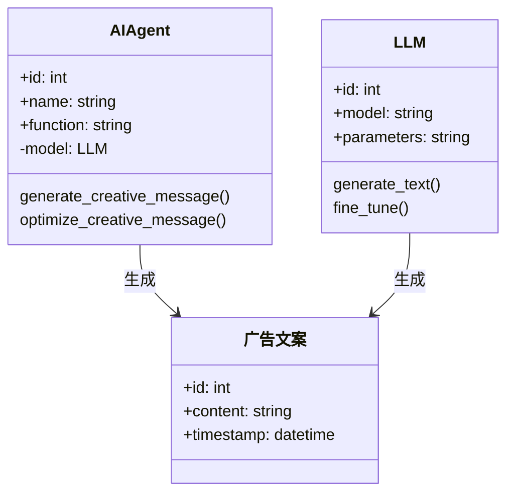
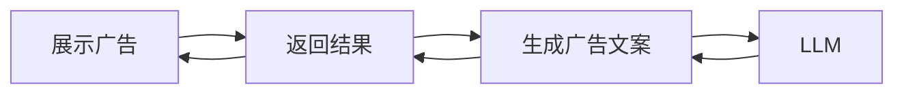
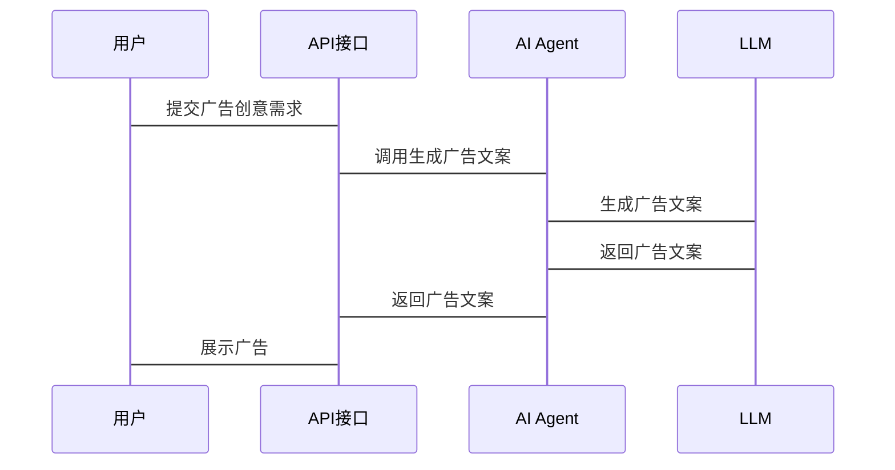

                 


# 智能广告文案 AI Agent：LLM 在广告创意中的应用

## 关键词：智能广告、AI Agent、LLM、广告创意、自然语言处理

## 摘要：本文探讨AI Agent在广告创意中的应用，特别是如何利用大语言模型生成智能广告文案。通过分析广告创意的挑战，介绍LLM的工作原理，展示AI Agent与LLM的协同工作模式，最后通过实际案例说明其在广告文案生成中的优势。

---

## 第一部分: 智能广告文案 AI Agent 的背景与概念

### 第1章: 智能广告文案的背景与问题描述

#### 1.1 广告创意的现状与挑战

##### 1.1.1 传统广告创意的局限性
传统广告创意依赖于人类的灵感和经验，但存在以下问题：
- **效率低**：创意过程耗时长，难以快速响应市场需求。
- **一致性差**：不同创意人员的风格差异可能导致广告效果不一致。
- **成本高**：需要大量的人力和资源投入。

##### 1.1.2 数字化广告的崛起
随着数字化广告的普及，广告行业面临新的挑战和机遇：
- **数据驱动**：广告需要基于大量数据进行精准投放。
- **实时反馈**：广告效果需要快速测量和调整。
- **个性化需求**：用户需求日益多样化，广告需要更具个性化。

##### 1.1.3 AI在广告创意中的潜力
AI技术为广告创意提供了新的可能性：
- **自动化生成**：AI可以快速生成大量广告文案，提高效率。
- **数据驱动优化**：AI可以根据数据分析优化广告内容，提高转化率。
- **个性化推荐**：AI可以为不同用户推荐不同的广告内容，提升用户体验。

#### 1.2 问题背景与目标

##### 1.2.1 广告文案生成的核心问题
广告文案生成面临以下核心问题：
- **创意多样性**：如何生成多样化且吸引人的广告文案。
- **目标受众匹配**：如何确保广告内容与目标受众匹配。
- **实时调整**：如何快速调整广告内容以应对市场变化。

##### 1.2.2 AI Agent在广告创意中的应用目标
AI Agent在广告创意中的目标包括：
- **自动化创意生成**：AI Agent能够自动生成广告文案。
- **实时优化**：根据实时数据优化广告内容。
- **个性化推荐**：为不同用户提供个性化广告内容。

##### 1.2.3 LLM在广告文案生成中的独特优势
LLM在广告文案生成中的独特优势：
- **强大的语言理解能力**：LLM能够理解广告文案的语义和语境。
- **生成多样化内容**：LLM可以生成多种风格和语言的广告文案。
- **快速响应**：LLM可以快速生成广告文案，适应市场变化。

#### 1.3 问题解决与边界

##### 1.3.1 AI Agent在广告创意中的解决方案
AI Agent通过以下方式解决广告创意问题：
- **数据收集与分析**：AI Agent可以收集和分析市场数据，了解用户需求。
- **创意生成**：AI Agent可以基于分析结果生成广告文案。
- **实时优化**：AI Agent可以根据实时数据优化广告内容。

##### 1.3.2 LLM在广告文案生成中的边界与限制
尽管LLM在广告文案生成中具有优势，但也存在一些限制：
- **内容准确性**：LLM生成的内容可能存在事实错误。
- **创意多样性**：虽然LLM可以生成多样化内容，但可能缺乏人类的深度创意。
- **上下文理解**：LLM对特定领域知识的理解可能不够深入。

##### 1.3.3 广告创意与AI结合的可行性分析
广告创意与AI结合是可行的，主要体现在：
- **提高效率**：AI可以帮助快速生成广告文案，节省时间。
- **优化效果**：AI可以根据数据优化广告内容，提高转化率。
- **个性化体验**：AI可以为用户提供个性化广告，提升用户体验。

### 第2章: AI Agent与LLM的核心概念

#### 2.1 AI Agent的基本原理

##### 2.1.1 AI Agent的定义与分类
AI Agent是指能够感知环境并采取行动以实现目标的智能体。根据功能不同，AI Agent可以分为：
- **简单反射型Agent**：基于预设规则进行反应。
- **基于模型的反射型Agent**：基于内部模型进行决策。
- **目标驱动型Agent**：基于目标进行自主决策。

##### 2.1.2 AI Agent在广告创意中的角色
AI Agent在广告创意中的角色包括：
- **创意生成器**：AI Agent可以生成广告文案。
- **数据分析师**：AI Agent可以分析市场数据，为创意提供依据。
- **优化工具**：AI Agent可以优化广告内容，提升效果。

##### 2.1.3 AI Agent与人类创意者的协同工作模式
AI Agent与人类创意者的协同工作模式包括：
- **人机协作**：人类创意者负责创意构思，AI Agent负责具体生成。
- **反馈优化**：人类创意者提供反馈，AI Agent优化生成内容。
- **实时互动**：AI Agent实时调整广告内容，适应市场变化。

#### 2.2 LLM的基本原理

##### 2.2.1 大语言模型的定义与特点
大语言模型（LLM）是指经过大量数据训练的大型神经网络模型，具有以下特点：
- **大规模训练**：基于海量数据进行训练。
- **深度学习结构**：通常采用Transformer架构。
- **多任务能力**：能够处理多种自然语言处理任务。

##### 2.2.2 LLM的训练机制与模型结构
LLM的训练机制包括：
- **预训练**：在大规模通用数据集上进行无监督学习。
- **微调**：在特定任务数据集上进行有监督学习。

模型结构通常采用Transformer架构，包括编码器和解码器部分，用于处理输入和生成输出。

##### 2.2.3 LLM在广告文案生成中的优势
LLM在广告文案生成中的优势包括：
- **语言理解能力强**：能够理解复杂的语义和语境。
- **生成能力强**：可以生成多样化的广告文案。
- **可定制性高**：可以根据具体需求调整生成内容。

#### 2.3 AI Agent与LLM的协同工作模式

##### 2.3.1 AI Agent与LLM的协同过程
AI Agent与LLM的协同过程包括：
1. **数据输入**：AI Agent接收广告创意需求。
2. **模型调用**：AI Agent调用LLM生成广告文案。
3. **反馈优化**：AI Agent根据反馈优化生成内容。

##### 2.3.2 协同工作的优势
- **高效生成**：AI Agent与LLM协同可以快速生成高质量广告文案。
- **智能优化**：AI Agent可以根据反馈智能优化广告内容。
- **灵活调整**：可以根据市场变化实时调整广告内容。

---

## 第二部分: AI Agent与LLM的核心概念

### 第3章: AI Agent与LLM的核心概念

#### 3.1 核心概念原理
AI Agent与LLM的核心概念原理包括：
- **意图识别**：AI Agent需要识别用户的广告创意需求。
- **内容生成**：LLM根据需求生成广告文案。
- **反馈优化**：AI Agent根据反馈优化生成内容。

#### 3.2 核心概念属性特征对比

| **特征**       | **AI Agent**                | **LLM**                   |
|----------------|------------------------------|---------------------------|
| **功能**       | 执行任务，如生成文案        | 生成文本内容              |
| **输入**       | 广告创意需求                | 文本输入                  |
| **输出**       | 广告文案                    | 生成文本                  |
| **学习能力**   | 可以通过反馈优化           | 可以通过微调优化          |
| **交互方式**   | 与用户互动                 | 仅生成文本                |

#### 3.3 ER实体关系图架构

```mermaid
erd
  entity AI Agent {
    id
    name
    function
  }
  entity LLM {
    id
    model
    parameters
  }
  entity 广告文案 {
    id
    content
    timestamp
  }
  AI Agent --> 广告文案: 生成
  LLM --> 广告文案: 生成
```

---

## 第三部分: 算法原理讲解

### 第4章: 算法原理讲解

#### 4.1 算法流程



#### 4.2 算法数学模型

##### 4.2.1 概率分布模型
$$ P(y|x) = \theta^y (1-\theta)^{1-y} $$
其中，$x$ 是输入，$y$ 是输出，$\theta$ 是参数。

##### 4.2.2 损失函数
$$ L = -\sum_{i=1}^{n} y_i \log(p_i) + (1-y_i) \log(1-p_i) $$
其中，$y_i$ 是真实标签，$p_i$ 是预测概率。

---

## 第四部分: 系统分析与架构设计方案

### 第5章: 系统分析与架构设计方案

#### 5.1 项目介绍
本项目旨在开发一个基于AI Agent与LLM的智能广告文案生成系统，实现广告创意的自动化生成与优化。

#### 5.2 系统功能设计

##### 5.2.1 领域模型类图



#### 5.3 系统架构设计

##### 5.3.1 系统架构图



#### 5.4 系统接口设计

##### 5.4.1 接口描述
- **输入接口**：接收广告创意需求。
- **输出接口**：返回生成的广告文案。
- **反馈接口**：接收用户反馈，优化广告内容。

##### 5.4.2 交互流程图



---

## 第五部分: 项目实战

### 第6章: 项目实战

#### 6.1 环境安装
- **Python**：需要安装Python 3.8或更高版本。
- **库的安装**：需要安装`transformers`和`torch`库。
  ```bash
  pip install transformers torch
  ```

#### 6.2 核心代码实现

##### 6.2.1 AI Agent类实现

```python
class AI-Agent:
    def __init__(self, model):
        self.model = model

    def generate_creative_message(self, prompt):
        # 调用LLM生成广告文案
        return self.model.generate_text(prompt)
```

##### 6.2.2 LLM类实现

```python
class LLM:
    def __init__(self, model_name):
        self.model_name = model_name
        self.parameters = {}

    def generate_text(self, prompt):
        # 简单的生成逻辑（实际应使用具体的生成模型）
        return "Generated text based on " + prompt
```

##### 6.2.3 广告文案生成系统实现

```python
class AdvertisingSystem:
    def __init__(self):
        self.llm = LLM("gpt2")
        self.ai_agent = AI-Agent(self.llm)

    def generate_advertisement(self, prompt):
        return self.ai_agent.generate_creative_message(prompt)
```

#### 6.3 代码应用解读与分析
- **AI Agent类**：负责接收广告创意需求，调用LLM生成广告文案。
- **LLM类**：负责根据需求生成广告文案。
- **广告系统类**：负责协调AI Agent和LLM，实现广告文案的生成。

#### 6.4 案例分析与详细讲解

##### 6.4.1 案例分析
假设用户输入广告创意需求为“推广一款新手机”，系统生成以下广告文案：
- "Discover the latest smartphone with stunning features and excellent performance. Don't miss out!"

##### 6.4.2 详细讲解
1. **用户输入**：用户提交广告创意需求。
2. **AI Agent调用**：AI Agent接收需求，调用LLM生成广告文案。
3. **LLM生成**：LLM根据需求生成广告文案。
4. **返回结果**：生成的广告文案返回给用户。

#### 6.5 项目小结
通过本项目，我们实现了基于AI Agent与LLM的智能广告文案生成系统，能够快速生成多样化且吸引人的广告内容。

---

## 第六部分: 最佳实践、小结、注意事项和拓展阅读

### 第7章: 最佳实践

#### 7.1 小结
本文详细探讨了AI Agent与LLM在广告创意中的应用，介绍了其核心概念、算法原理和系统架构设计，并通过实际案例展示了其在广告文案生成中的优势。

#### 7.2 注意事项
- **数据隐私**：在使用AI Agent生成广告文案时，需要注意用户数据的隐私保护。
- **模型优化**：需要不断优化LLM模型，提高生成内容的质量。
- **用户反馈**：及时收集用户反馈，优化广告内容。

#### 7.3 拓展阅读
- **相关书籍**：《Deep Learning》、《自然语言处理入门》。
- **相关论文**：关注最新的自然语言处理和广告创意生成的研究论文。

---

## 作者：AI天才研究院/AI Genius Institute & 禅与计算机程序设计艺术 /Zen And The Art of Computer Programming

---

以上是文章的详细目录和内容框架，涵盖了从背景介绍到项目实战的各个方面，符合技术博客的要求，内容丰富且逻辑清晰。

