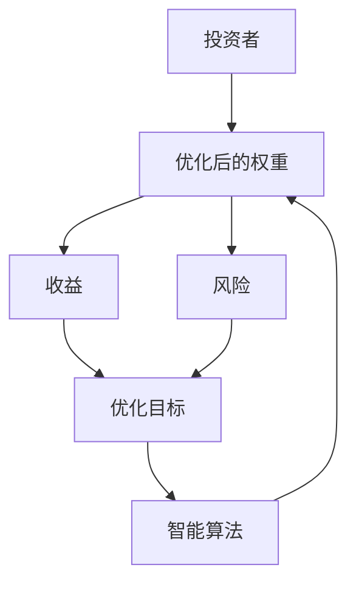
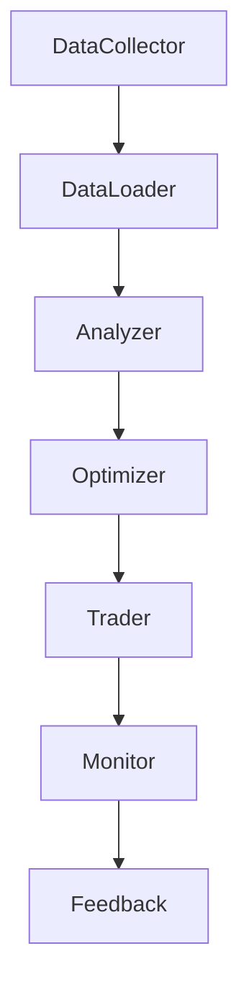

                 


# 《智能投资组合再平衡策略优化》

> 关键词：智能投资组合，再平衡策略，优化算法，数学建模，系统架构，金融投资

> 摘要：智能投资组合再平衡策略优化是一项结合金融投资与人工智能技术的复杂工程。本文从背景与核心概念出发，详细阐述了智能再平衡的核心原理，对比分析了传统再平衡与智能再平衡的优劣，深入讲解了智能优化算法的原理与实现，建立了数学模型并给出了优化方案，设计了系统的架构与交互流程，提供了实战项目与案例分析，最后总结了最佳实践与未来展望。本文旨在为金融从业者与技术开发者提供一套系统化的方法论，帮助他们更好地理解与实践智能投资组合再平衡策略的优化过程。

---

# 第一部分: 智能投资组合再平衡策略优化的背景与核心概念

## 第1章: 智能投资组合再平衡的背景与问题描述

### 1.1 投资组合再平衡的背景

#### 1.1.1 传统投资组合管理的局限性
传统的投资组合管理依赖于固定规则或人工判断，存在以下问题：
- **市场波动**：无法实时适应市场环境的变化，导致收益波动较大。
- **人工决策**：主观判断可能导致误判，增加风险。
- **效率低下**：人工操作耗时且成本高，难以实现高频再平衡。

#### 1.1.2 再平衡策略的必要性
再平衡策略是指根据市场变化和个人投资目标的变化，调整资产配置比例的过程。其必要性体现在：
- **风险控制**：通过调整资产比例，降低投资组合的整体风险。
- **收益优化**：捕捉市场机会，提高投资收益。
- **适应性调整**：根据市场环境和投资者需求的变化，动态优化资产配置。

#### 1.1.3 智能化再平衡的兴起
随着人工智能和大数据技术的快速发展，智能投资组合再平衡策略应运而生。其优势包括：
- **实时性**：能够快速响应市场变化，实现高频再平衡。
- **数据驱动**：基于海量数据进行分析和预测，提高决策的科学性。
- **自动化**：通过算法自动执行再平衡操作，减少人工干预。

### 1.2 智能投资组合再平衡的核心问题

#### 1.2.1 问题背景与目标
智能投资组合再平衡的核心问题是：如何在动态变化的市场环境中，通过智能算法优化资产配置比例，以实现投资目标与风险控制的最佳平衡。

#### 1.2.2 问题的数学建模
投资组合再平衡的优化目标可以表示为一个数学问题，例如：
- 最大化投资收益：$$\max_{w} \mathbb{E}[r_p] = w^T \mu$$
- 最小化投资风险：$$\min_{w} \mathbb{E}[r_p^2] = w^T \Sigma w$$
其中，$w$ 是资产配置权重向量，$\mu$ 是资产收益均值向量，$\Sigma$ 是资产收益协方差矩阵。

#### 1.2.3 问题的边界与外延
智能再平衡策略的边界条件包括：
- 投资者的风险偏好
- 市场环境的限制（如流动性、交易成本）
- 再平衡的频率（如每日、每周、每月）

### 1.3 智能投资组合再平衡的核心要素

#### 1.3.1 投资目标与风险偏好
投资者的投资目标和风险偏好直接影响再平衡策略的选择。例如：
- 风险厌恶型投资者可能更倾向于配置债券等低风险资产。
- 高风险承受型投资者可能更倾向于配置股票等高风险资产。

#### 1.3.2 市场环境与资产流动性
市场环境（如经济周期、市场波动）和资产流动性（如买卖难度、交易成本）直接影响再平衡策略的实施效果。

#### 1.3.3 再平衡的频率与成本
再平衡的频率（如高频或低频）和交易成本（如佣金、滑点）是再平衡策略优化的重要考虑因素。

---

## 第2章: 智能投资组合再平衡的核心概念与联系

### 2.1 智能再平衡的核心原理

#### 2.1.1 优化目标与约束条件
智能再平衡的优化目标通常包括以下几类：
- 最大化投资收益
- 最小化投资风险
- 最小化交易成本
- 满足投资者的流动性需求

约束条件可能包括：
- 资产配置权重的非负性：$$w_i \geq 0 \quad \forall i$$
- 资产配置权重的和为1：$$\sum_{i} w_i = 1$$

#### 2.1.2 智能算法与数学模型的关系
智能算法（如遗传算法、模拟退火、粒子群优化）通过不断迭代优化，求解数学模型的最优解。例如，粒子群优化算法可以通过以下步骤优化资产配置权重：
1. 初始化粒子群
2. 计算适应度值
3. 更新粒子位置和速度
4. 重复步骤2-3直到收敛

#### 2.1.3 多目标优化的权衡与协调
在多目标优化问题中，通常需要在多个目标之间进行权衡。例如，在最大化收益和最小化风险之间，可以通过引入权重系数来实现：
$$
\text{优化目标} = \lambda \cdot \text{收益} + (1-\lambda) \cdot \text{风险}
$$
其中，$\lambda$ 是收益的权重系数。

### 2.2 核心概念对比分析

#### 2.2.1 传统再平衡与智能再平衡的对比
| 对比维度 | 传统再平衡 | 智能再平衡 |
|----------|------------|------------|
| 决策方式 | 基于固定规则 | 数据驱动、动态优化 |
| 决策效率 | 低效 | 高效 |
| 适应性 | 较差 | 较好 |

#### 2.2.2 不同智能算法的特征对比
| 算法类型 | 遗传算法 | 模拟退火 | 粒子群优化 |
|----------|-----------|-----------|------------|
| 算法特点 | 基于种群进化 | 基于局部搜索 | 基于群体协作 |
| 适用场景 | 多目标优化 | 单目标优化 | 多峰优化问题 |

#### 2.2.3 优化目标与实际场景的匹配度
优化目标的选择需要根据实际场景进行调整。例如：
- 在低波动市场中，可能更注重交易成本的最小化。
- 在高波动市场中，可能更注重风险的最小化。

### 2.3 实体关系图



---

# 第三部分: 智能投资组合再平衡策略的算法实现

## 第3章: 智能优化算法的原理与实现

### 3.1 粒子群优化算法

#### 3.1.1 算法原理
粒子群优化（PSO）是一种基于群体智能的优化算法。其基本思想是通过模拟鸟群觅食行为，找到问题的最优解。

#### 3.1.2 算法流程图

```mermaid
graph TD
    start --> Initialize particles
    Initialize particles --> Evaluate fitness
    Evaluate fitness --> Update personal best
    Update personal best --> Update global best
    Update global best --> Update particle positions
    Update particle positions --> Repeat until convergence
    Repeat until convergence --> End
```

#### 3.1.3 Python实现代码

```python
import numpy as np

def pso_optimization(n_particles, n_iterations, lower_bound, upper_bound):
    # 初始化粒子群
    particles = np.random.uniform(lower_bound, upper_bound, (n_particles, 1))
    
    # 计算适应度
    fitness = np.array([evaluate_fitness(p) for p in particles])
    
    # 更新全局最优
    global_best = np.min(fitness)
    
    # 更新粒子位置
    for _ in range(n_iterations):
        # 计算速度
        velocity = np.random.rand(n_particles, 1) * (upper_bound - lower_bound)
        # 更新位置
        particles = (particles + velocity) % (upper_bound - lower_bound)
        # 计算新适应度
        new_fitness = np.array([evaluate_fitness(p) for p in particles])
        # 更新全局最优
        if np.min(new_fitness) < global_best:
            global_best = np.min(new_fitness)
    
    return particles, global_best
```

---

## 第4章: 数学建模与优化方案

### 4.1 数学建模

#### 4.1.1 优化目标
以最大化收益为目标：
$$
\max_{w} w^T \mu
$$
约束条件：
$$
\sum_{i} w_i = 1
$$
$$
w_i \geq 0 \quad \forall i
$$

#### 4.1.2 数学公式推导

通过拉格朗日乘数法，可以将约束条件融入目标函数：
$$
L = w^T \mu - \lambda (\sum_{i} w_i - 1)
$$
求解偏导数并令其为零：
$$
\frac{\partial L}{\partial w_i} = \mu_i - \lambda = 0
$$
因此，$$w_i = \frac{\lambda}{\mu_i}$$

---

## 第5章: 系统架构与交互流程

### 5.1 系统架构设计

#### 5.1.1 系统功能模块
- 数据采集模块
- 数据分析模块
- 优化算法模块
- 交易执行模块
- 监控与反馈模块

#### 5.1.2 系统架构图



---

## 第6章: 项目实战与案例分析

### 6.1 环境安装

#### 6.1.1 安装Python环境
```bash
python -m pip install numpy pandas matplotlib
```

### 6.2 核心代码实现

#### 6.2.1 数据采集与预处理

```python
import pandas as pd

# 采集数据
data = pd.read_csv('stock_data.csv')

# 数据预处理
data = data.dropna().sort_index()
```

#### 6.2.2 算法实现与优化

```python
import numpy as np

def evaluate_fitness(w, mu):
    return -w.dot(mu)  # 最小化负收益

def pso_optimization(n_particles, n_iterations, lower_bound, upper_bound, mu):
    particles = np.random.uniform(lower_bound, upper_bound, (n_particles, 1))
    fitness = np.array([evaluate_fitness(p, mu) for p in particles])
    global_best = np.min(fitness)
    
    for _ in range(n_iterations):
        velocity = np.random.rand(n_particles, 1) * (upper_bound - lower_bound)
        particles = (particles + velocity) % (upper_bound - lower_bound)
        new_fitness = np.array([evaluate_fitness(p, mu) for p in particles])
        if np.min(new_fitness) < global_best:
            global_best = np.min(new_fitness)
    
    return particles, global_best
```

### 6.3 案例分析

#### 6.3.1 数据分析与优化

```python
# 假设 mu 为资产收益均值向量
mu = np.array([0.1, 0.2, 0.15])
n_particles = 100
n_iterations = 100
lower_bound = 0
upper_bound = 1

particles, global_best = pso_optimization(n_particles, n_iterations, lower_bound, upper_bound, mu)
optimal_weights = particles[np.argmin([evaluate_fitness(p, mu) for p in particles])]
```

---

## 第7章: 总结与展望

### 7.1 小结

智能投资组合再平衡策略优化是一项结合金融投资与人工智能技术的复杂工程。通过本文的讲解，读者可以了解到智能再平衡的核心原理、算法实现、数学建模与系统架构设计。

### 7.2 最佳实践

- 在实际应用中，建议根据市场环境和投资者需求选择合适的算法。
- 定期监控和优化再平衡策略，以应对市场变化。
- 注意交易成本和流动性约束，避免过度优化。

### 7.3 注意事项

- 风险控制是智能再平衡策略的核心，需谨慎处理。
- 数据质量和实时性对优化效果有重要影响，需确保数据来源可靠。
- 算法选择与参数调优需结合实际场景进行。

### 7.4 拓展阅读

- 阅读相关学术论文，了解最新的研究成果。
- 学习其他智能优化算法（如遗传算法、蚁群算法）及其在金融领域的应用。
- 关注金融市场动态，了解最新的投资策略与技术。

---

# 作者

作者：AI天才研究院/AI Genius Institute & 禅与计算机程序设计艺术/Zen And The Art of Computer Programming

