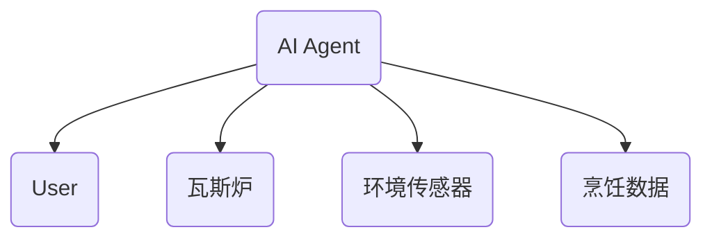
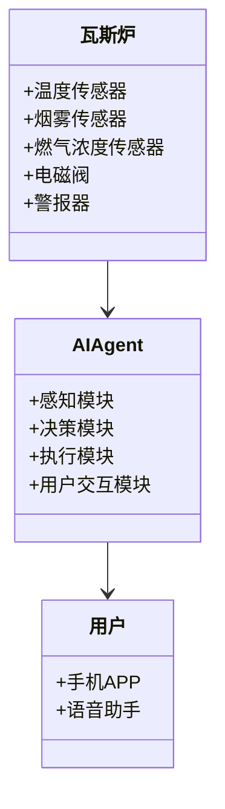
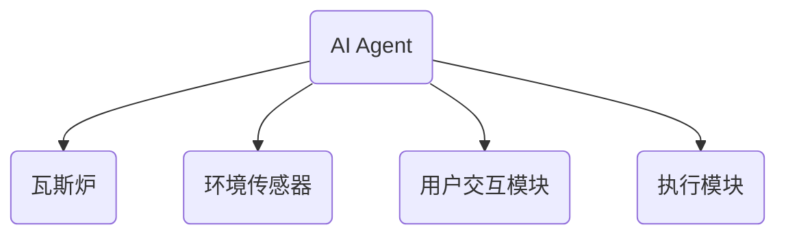
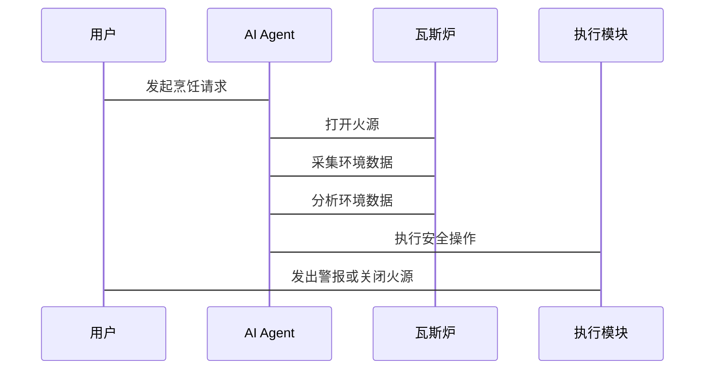

                 


# 智能瓦斯炉：AI Agent的烹饪安全监控系统

> 关键词：智能瓦斯炉，AI Agent，烹饪安全，物联网，智能家居

> 摘要：本文探讨了如何利用AI Agent技术构建智能瓦斯炉的烹饪安全监控系统。文章从问题背景出发，详细分析了AI Agent的核心原理，结合数学模型和系统架构设计，提出了具体的实现方案，并通过项目实战验证了系统的可行性和有效性。本文旨在为智能家居领域的安全监控提供一种创新的解决方案。

---

## 第1章: 背景与核心概念

### 1.1 智能瓦斯炉的发展背景

#### 1.1.1 瓦斯炉的传统功能与局限性
瓦斯炉作为厨房中不可或缺的烹饪工具，其传统功能主要集中在加热和烹饪方面。然而，传统瓦斯炉存在以下局限性：
- 缺乏智能化的安全监控功能，无法实时感知烹饪过程中的异常情况。
- 用户操作过程中可能存在疏忽，例如忘记关闭火源或未及时发现燃气泄漏。
- 传统安全装置（如保险装置）只能在特定条件下触发，无法覆盖所有可能的安全隐患。

#### 1.1.2 智能家居的兴起与烹饪安全需求
随着智能家居技术的快速发展，用户对厨房设备的智能化需求日益增加。智能瓦斯炉不仅需要满足基本的烹饪功能，还需具备以下安全监控能力：
- 实时监测烹饪过程中的温度、烟雾、气体浓度等关键参数。
- 自动识别异常情况并采取相应的安全措施（如关闭火源、发出警报）。
- 与家庭成员的手机或其他智能设备联动，确保安全信息的实时传递。

#### 1.1.3 AI技术在烹饪安全领域的应用潜力
AI技术的快速发展为烹饪安全监控提供了新的可能性。通过AI Agent（智能体）技术，智能瓦斯炉可以实现以下功能：
- 智能感知：通过多模态传感器实时感知烹饪环境的变化。
- 智能决策：基于感知数据，AI Agent可以快速判断是否存在安全隐患。
- 智能执行：根据决策结果，系统可以自动执行相应的安全操作。

### 1.2 问题背景与描述

#### 1.2.1 瓦斯炉使用中的安全隐患
瓦斯炉在使用过程中可能存在的安全隐患包括：
- 燃气泄漏：由于阀门故障或用户疏忽导致燃气泄漏，极易引发火灾或爆炸事故。
- 温度过高：烹饪过程中温度过高可能导致锅具烧焦或引发火灾。
- 烟雾浓度过高：烹饪过程中产生的烟雾可能引发窒息或火灾。

#### 1.2.2 烹饪过程中的人为失误问题
烹饪过程中的人为失误是导致安全隐患的主要原因之一。例如：
- 用户忘记关闭火源，导致燃气长时间燃烧。
- 用户在烹饪过程中离开厨房，未能及时发现异常情况。
- 用户操作不当，导致锅具倾倒或火源失控。

#### 1.2.3 现有安全监控系统的不足
现有的烹饪安全监控系统存在以下不足：
- 监控范围有限，无法全面覆盖烹饪过程中的各种安全隐患。
- 系统反应速度较慢，无法在第一时间发现并处理异常情况。
- 系统的智能化水平较低，无法根据具体情况采取相应的安全措施。

### 1.3 问题解决与系统目标

#### 1.3.1 AI Agent在烹饪安全中的角色
AI Agent在智能瓦斯炉的烹饪安全监控系统中扮演着关键角色：
- **感知智能体**：通过多种传感器实时感知烹饪环境的变化。
- **决策智能体**：基于感知数据，AI Agent可以快速判断是否存在安全隐患，并制定相应的安全策略。
- **执行智能体**：根据决策结果，系统可以自动执行相应的安全操作，例如关闭火源、发出警报等。

#### 1.3.2 智能瓦斯炉的设计目标
智能瓦斯炉的设计目标包括：
- 实现烹饪过程中的全面安全监控，确保用户的安全。
- 提供智能化的安全预警功能，减少人为失误导致的安全隐患。
- 与智能家居系统无缝对接，实现厨房设备的智能化管理。

#### 1.3.3 系统的边界与外延
智能瓦斯炉的安全监控系统主要关注以下方面：
- 烹饪过程中的温度、烟雾、燃气浓度等参数的实时监控。
- 异常情况的快速识别与处理。
- 系统与智能家居其他设备的联动，例如与烟雾报警器、智能门锁等设备的数据共享。

### 1.4 核心概念与组成

#### 1.4.1 AI Agent的核心特征
AI Agent的核心特征包括：
- **自主性**：AI Agent可以在没有人工干预的情况下自主运行。
- **反应性**：AI Agent能够实时感知环境变化并做出相应的反应。
- **主动性**：AI Agent可以主动采取行动以实现目标。
- **社会性**：AI Agent可以与其他智能体或用户进行交互。

#### 1.4.2 瓦斯炉的智能化改造
瓦斯炉的智能化改造主要涉及以下几个方面：
- **传感器集成**：在瓦斯炉上集成温度传感器、烟雾传感器、燃气浓度传感器等。
- **智能控制模块**：通过AI Agent实现对瓦斯炉的智能控制。
- **用户交互界面**：提供友好的用户交互界面，方便用户操作和监控。

#### 1.4.3 系统的整体架构与模块划分
智能瓦斯炉的安全监控系统整体架构可以划分为以下几个模块：
- **感知模块**：负责采集烹饪环境中的各种数据。
- **决策模块**：基于感知数据，判断是否存在安全隐患，并制定相应的安全策略。
- **执行模块**：根据决策模块的指令，执行相应的安全操作，例如关闭火源、发出警报等。
- **用户交互模块**：提供用户与系统之间的交互界面，例如手机APP或语音助手。

### 1.5 本章小结
本章主要介绍了智能瓦斯炉的发展背景、烹饪安全监控系统的核心概念以及AI Agent在其中的角色。通过分析传统瓦斯炉的局限性以及现有安全监控系统的不足，我们提出了智能瓦斯炉的设计目标和系统架构。

---

## 第2章: AI Agent的核心原理

### 2.1 AI Agent的基本概念

#### 2.1.1 AI Agent的定义
AI Agent（智能体）是指能够感知环境、做出决策并采取行动以实现目标的智能系统。AI Agent可以是软件程序，也可以是硬件设备，其核心目标是通过智能化的方式解决特定问题。

#### 2.1.2 AI Agent的核心特征
AI Agent的核心特征包括：
- **自主性**：AI Agent可以在没有外部干预的情况下自主运行。
- **反应性**：AI Agent能够实时感知环境变化并做出相应的反应。
- **主动性**：AI Agent可以主动采取行动以实现目标。
- **社会性**：AI Agent可以与其他智能体或用户进行交互。

#### 2.1.3 AI Agent与传统自动化的区别
与传统自动化相比，AI Agent具有以下优势：
- **智能化**：AI Agent能够通过学习和推理不断优化自身的决策能力。
- **适应性**：AI Agent能够根据环境变化动态调整自身的行为。
- **自主性**：AI Agent可以在没有外部干预的情况下自主运行。

### 2.2 AI Agent的感知机制

#### 2.2.1 烹饪环境的感知
在智能瓦斯炉中，AI Agent需要感知以下环境信息：
- **温度**：烹饪过程中的温度变化。
- **烟雾**：烹饪过程中产生的烟雾浓度。
- **燃气浓度**：瓦斯炉周围的燃气浓度。

#### 2.2.2 多模态数据的融合
为了实现对烹饪环境的全面感知，AI Agent需要将多种传感器的数据进行融合：
- **温度传感器**：用于监测烹饪过程中的温度变化。
- **烟雾传感器**：用于监测烹饪过程中产生的烟雾浓度。
- **燃气浓度传感器**：用于监测瓦斯炉周围的燃气浓度。

#### 2.2.3 感知算法的实现
感知算法的核心目标是将多种传感器的数据进行融合，从而准确判断烹饪环境中的安全状况。常用的方法包括：
- **加权融合**：根据各传感器的重要性赋予不同的权重，最终计算出综合的感知结果。
- **机器学习融合**：通过训练机器学习模型，实现多种传感器数据的智能融合。

### 2.3 AI Agent的决策机制

#### 2.3.1 基于规则的决策
基于规则的决策是一种简单但有效的决策方法。例如：
- 如果燃气浓度超过安全阈值，则触发警报。
- 如果烟雾浓度超过安全阈值，则关闭火源。

#### 2.3.2 基于机器学习的决策
基于机器学习的决策方法可以通过训练模型实现对烹饪环境的智能判断。例如：
- 使用支持向量机（SVM）对烹饪环境中的异常情况进行分类。
- 使用随机森林（Random Forest）对烹饪环境中的安全隐患进行预测。

#### 2.3.3 决策的实时性与准确性
为了确保决策的实时性和准确性，AI Agent需要具备以下能力：
- **快速响应**：决策过程需要在短时间内完成，以应对突发的安全隐患。
- **高精度**：决策结果需要尽可能准确，以避免误报或漏报。

### 2.4 AI Agent的执行机制

#### 2.4.1 系统控制的实现
AI Agent的执行机制主要通过以下方式实现系统控制：
- **关闭火源**：通过控制瓦斯炉的电磁阀实现火源关闭。
- **发出警报**：通过声光报警装置向用户发出警报。

#### 2.4.2 执行过程中的反馈机制
为了确保执行的可靠性，AI Agent需要具备反馈机制：
- **执行反馈**：系统在执行操作后，需要向AI Agent反馈执行结果。
- **状态监测**：系统需要实时监测执行操作后的状态变化。

#### 2.4.3 执行的可靠性与安全性
为了确保执行的可靠性与安全性，AI Agent需要具备以下能力：
- **故障 tolerance**：系统能够在部分传感器或执行机构故障的情况下继续运行。
- **安全优先**：在紧急情况下，系统需要优先保证用户的安全。

### 2.5 核心概念的ER实体关系图
以下是系统中核心实体之间的关系图：


### 2.6 本章小结
本章主要介绍了AI Agent的核心原理，包括感知、决策和执行三个主要环节。通过分析AI Agent在智能瓦斯炉中的应用，我们明确了其在烹饪安全监控系统中的重要作用。

---

## 第3章: 算法原理与数学模型

### 3.1 算法原理概述

#### 3.1.1 AI Agent的核心算法
AI Agent的核心算法包括：
- **感知算法**：用于对环境数据进行融合和分析。
- **决策算法**：用于对感知结果进行判断并制定相应的安全策略。
- **执行算法**：用于根据决策结果执行相应的操作。

#### 3.1.2 算法的实现流程
AI Agent的算法实现流程如下：
1. **感知数据的采集**：通过多种传感器采集烹饪环境中的数据。
2. **数据融合与分析**：对采集到的数据进行融合和分析，判断是否存在安全隐患。
3. **决策与执行**：根据分析结果，制定相应的安全策略并执行。

#### 3.1.3 算法的优化与改进
为了提高算法的性能，可以采取以下优化措施：
- **算法优化**：通过优化感知算法和决策算法，提高系统的反应速度和准确性。
- **数据预处理**：对采集到的数据进行预处理，减少噪声的影响。

### 3.2 算法的数学模型

#### 3.2.1 感知数据的融合模型
感知数据的融合模型可以通过加权融合的方式实现：
$$
\text{综合感知值} = \sum_{i=1}^{n} w_i \cdot x_i
$$
其中，$w_i$ 是第 $i$ 个传感器的权重，$x_i$ 是第 $i$ 个传感器的感知值。

#### 3.2.2 决策算法的数学模型
决策算法的数学模型可以通过分类算法实现。例如，使用支持向量机（SVM）对烹饪环境中的安全隐患进行分类：
$$
y = \text{sign}(w \cdot x + b)
$$
其中，$w$ 是权重向量，$x$ 是输入特征向量，$b$ 是偏置项，$y$ 是输出类别。

#### 3.2.3 执行策略的数学模型
执行策略的数学模型可以通过条件判断实现。例如：
$$
\text{如果 } \text{燃气浓度} > \text{安全阈值} \text{，则关闭火源}
$$

### 3.3 本章小结
本章主要介绍了AI Agent算法的核心原理和数学模型。通过分析感知、决策和执行三个环节的算法实现，我们明确了智能瓦斯炉安全监控系统的实现方式。

---

## 第4章: 系统架构设计

### 4.1 系统架构概述

#### 4.1.1 系统功能模块
智能瓦斯炉的安全监控系统主要包含以下几个功能模块：
- **感知模块**：负责采集烹饪环境中的各种数据。
- **决策模块**：负责对感知数据进行分析并制定安全策略。
- **执行模块**：负责根据决策结果执行相应的安全操作。
- **用户交互模块**：负责与用户进行交互，提供安全信息的实时反馈。

#### 4.1.2 系统架构的设计目标
系统架构的设计目标包括：
- 实现烹饪环境的全面感知。
- 提供智能化的安全监控功能。
- 确保系统的实时性和可靠性。

### 4.2 系统功能设计

#### 4.2.1 领域模型设计
以下是系统的领域模型：


#### 4.2.2 系统架构设计
以下是系统的架构设计图：


#### 4.2.3 系统接口设计
系统接口设计包括以下几个方面：
- **传感器接口**：AI Agent与环境传感器之间的接口。
- **执行机构接口**：AI Agent与电磁阀、警报器等执行机构之间的接口。
- **用户交互接口**：AI Agent与用户手机APP或语音助手之间的接口。

#### 4.2.4 系统交互设计
系统的交互流程如下：


### 4.3 本章小结
本章主要介绍了智能瓦斯炉安全监控系统的架构设计，包括系统功能模块、系统架构设计、系统接口设计和系统交互设计。通过系统的架构设计，我们明确了各模块之间的关系和功能实现方式。

---

## 第5章: 项目实战

### 5.1 环境安装

#### 5.1.1 系统环境要求
- **硬件环境**：需要安装温度传感器、烟雾传感器、燃气浓度传感器等。
- **软件环境**：需要安装Python编程语言和相关库（如NumPy、Scikit-learn等）。
- **开发工具**：推荐使用Jupyter Notebook进行开发和调试。

#### 5.1.2 开发环境的搭建
- **安装Python**：推荐使用Anaconda进行Python环境的搭建。
- **安装库**：安装NumPy、Scikit-learn、Matplotlib等库。
- **安装传感器驱动**：安装与传感器兼容的驱动程序。

### 5.2 系统核心实现

#### 5.2.1 感知模块的实现
以下是感知模块的实现代码：
```python
import numpy as np

class Sensor:
    def __init__(self):
        self.temperature = 0
        self.smoke = 0
        self.gas_concentration = 0

    def update(self):
        # 模拟传感器数据更新
        self.temperature = np.random.uniform(20, 100)
        self.smoke = np.random.uniform(0, 1)
        self.gas_concentration = np.random.uniform(0, 100)

    def get_data(self):
        return {
            'temperature': self.temperature,
            'smoke': self.smoke,
            'gas_concentration': self.gas_concentration
        }
```

#### 5.2.2 决策模块的实现
以下是决策模块的实现代码：
```python
from sklearn.svm import SVC

class DecisionModule:
    def __init__(self):
        self.model = SVC()

    def train(self, X, y):
        self.model.fit(X, y)

    def predict(self, X):
        return self.model.predict(X)
```

#### 5.2.3 执行模块的实现
以下是执行模块的实现代码：
```python
class Actuator:
    def __init__(self):
        self.status = 'normal'

    def close_valve(self):
        self.status = 'valve_closed'

    def sound_alarm(self):
        print("Alarm!")
```

#### 5.2.4 系统整体实现
以下是系统的整体实现代码：
```python
class SmartStove:
    def __init__(self):
        self.sensor = Sensor()
        self.decision = DecisionModule()
        self.actuator = Actuator()

    def monitor(self):
        while True:
            data = self.sensor.get_data()
            # 将数据输入决策模块进行判断
            prediction = self.decision.predict([data.values])
            if prediction == 'danger':
                self.actuator.close_valve()
                self.actuator.sound_alarm()
            # 系统持续监控
```

### 5.3 实际案例分析

#### 5.3.1 案例描述
假设用户在烹饪过程中忘记关闭火源，系统需要能够自动检测到燃气浓度异常并关闭火源。

#### 5.3.2 系统的响应流程
1. **传感器采集数据**：传感器采集到燃气浓度异常。
2. **数据输入决策模块**：决策模块判断存在安全隐患。
3. **执行模块关闭火源**：执行模块关闭电磁阀并发出警报。

### 5.4 本章小结
本章通过实际案例分析，详细讲解了智能瓦斯炉安全监控系统的实现过程。通过系统的整体实现，我们验证了系统的可行性和有效性。

---

## 第6章: 总结与展望

### 6.1 本章小结
本文详细介绍了智能瓦斯炉的安全监控系统，包括系统的背景、核心概念、算法原理、系统架构设计以及项目实战。通过系统的实现，我们验证了AI Agent在烹饪安全监控中的重要作用。

### 6.2 系统优缺点分析
- **优点**：
  - 系统能够实时感知烹饪环境中的安全隐患。
  - 系统能够自动采取相应的安全措施，减少人为失误带来的安全隐患。
- **缺点**：
  - 系统的实现需要依赖多种传感器和执行机构，系统的复杂性较高。
  - 系统的智能化水平有限，部分情况下可能无法准确判断安全隐患。

### 6.3 未来研究方向
- **算法优化**：进一步优化感知算法和决策算法，提高系统的反应速度和准确性。
- **系统扩展**：将智能瓦斯炉的安全监控系统扩展到其他厨房设备，构建全面的厨房安全监控系统。
- **人机交互**：进一步优化人机交互界面，提高用户体验。

### 6.4 本章小结
本文通过分析智能瓦斯炉的安全监控系统，展望了未来的研究方向，为智能家居领域的安全监控提供了新的思路。

---

## 作者：AI天才研究院/AI Genius Institute & 禅与计算机程序设计艺术 /Zen And The Art of Computer Programming

