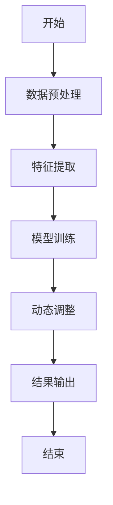
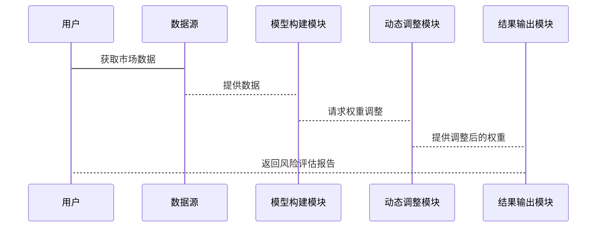

                 


# 智能算法构建动态风险平价模型

## 关键词：智能算法，动态风险平价模型，风险管理，金融，算法优化

## 摘要：本文详细探讨了如何利用智能算法构建动态风险平价模型，分析了模型的核心概念、算法原理、系统架构设计及实际应用案例，提供了从理论到实践的全面指导，帮助读者理解如何通过智能算法优化风险管理过程。

---

## 第1章 动态风险平价模型的背景与概念

### 1.1 问题背景介绍

#### 1.1.1 风险管理的核心问题
在金融市场中，风险管理是投资者和机构的核心任务之一。传统的风险管理方法依赖于静态模型，无法有效应对市场波动和复杂环境的变化。随着人工智能和大数据技术的发展，动态调整的模型逐渐成为研究的热点。

#### 1.1.2 动态风险平价模型的提出背景
金融市场的不确定性要求风险平价模型能够实时调整，以反映市场变化。动态风险平价模型通过智能算法实现对风险权重的动态调整，能够更准确地反映市场风险状况。

#### 1.1.3 智能算法在风险管理中的应用价值
智能算法，如机器学习和优化算法，能够处理大量数据并实时更新模型参数，使风险平价模型具备动态调整的能力。这提高了风险管理的准确性和响应速度。

### 1.2 问题描述与目标

#### 1.2.1 风险平价模型的基本定义
风险平价模型是一种将资产配置权重分配到不同风险因子上的方法，旨在平衡资产组合的风险暴露。传统模型假设权重固定，无法应对市场变化。

#### 1.2.2 动态风险平价模型的关键特征
动态风险平价模型通过智能算法动态调整权重，实时反映市场风险变化。其核心目标是提高风险管理和投资组合优化的效率和准确性。

#### 1.2.3 智能算法解决的核心问题
智能算法通过实时数据处理、动态权重调整和高效计算，解决了传统模型静态、固定的问题，提高了模型的适应性和灵活性。

### 1.3 问题解决方法概述

#### 1.3.1 常见风险平价模型的优缺点
- 优点：能够平衡风险暴露，优化资产配置。
- 缺点：固定权重无法应对市场变化，计算复杂度高。

#### 1.3.2 智能算法的优势与适用场景
- 优势：实时更新权重，适应市场变化；计算效率高，适用于高频交易。
- 适用场景：金融市场波动剧烈、需要实时风险管理的场景。

#### 1.3.3 动态调整的风险平价模型的实现路径
通过智能算法，动态调整资产权重，实时优化风险暴露，提高风险管理的准确性和效率。

### 1.4 模型的边界与外延

#### 1.4.1 模型的输入与输出边界
- 输入：市场数据、风险因子、历史数据。
- 输出：动态调整后的权重、风险评估报告。

#### 1.4.2 动态调整的范围与频率
- 范围：根据市场变化实时调整权重。
- 频率：高频交易环境下，可能每分钟或每秒调整一次。

#### 1.4.3 模型的适用领域与限制
- 适用领域：金融市场、投资组合管理。
- 限制：依赖高质量数据，计算资源消耗较高。

### 1.5 核心概念结构与组成

#### 1.5.1 智能算法的组成部分
- 数据输入：市场数据、历史数据。
- 处理模块：特征提取、模型训练、权重调整。
- 输出：动态权重、风险评估。

#### 1.5.2 动态风险平价模型的构建要素
- 数据源：市场数据、风险因子。
- 模型框架：智能算法、动态调整机制。
- 实现工具：编程语言（Python）、计算框架（TensorFlow）。

#### 1.5.3 核心概念之间的关系
智能算法作为模型的核心驱动力，动态调整机制确保权重的实时更新，两者共同构建了动态风险平价模型。

---

## 第2章 智能算法与动态风险平价模型的核心概念

### 2.1 智能算法的原理与特点

#### 2.1.1 智能算法的基本原理
智能算法通过学习和优化，自动调整模型参数，实现动态权重分配。常用算法包括遗传算法、粒子群优化和梯度下降。

#### 2.1.2 智能算法的核心特点
- 自适应性：能够实时调整权重。
- 高效性：计算速度快，适合高频交易。
- 灵活性：适用于多种市场环境。

### 2.2 动态风险平价模型的构建原理

#### 2.2.1 风险平价模型的数学基础
风险平价模型通过优化问题，将资产权重分配到风险因子上，使风险暴露均衡化。

#### 2.2.2 动态调整的实现机制
通过智能算法，模型根据实时市场数据调整权重，确保风险平价的动态实现。

#### 2.2.3 模型的实时性与准确性
实时数据处理和动态调整提高了模型的准确性和响应速度，使风险评估更加精确。

### 2.3 核心概念的属性特征对比

#### 2.3.1 智能算法的属性特征
- 数据驱动：依赖大量数据进行训练。
- 自适应：能够实时调整参数。
- 高计算效率：适合高频交易环境。

#### 2.3.2 动态风险平价模型的属性特征
- 动态调整：权重实时更新。
- 高准确性：反映市场变化。
- 适应性：适用于多种市场环境。

#### 2.3.3 两者属性特征的对比分析
智能算法为动态风险平价模型提供技术支持，模型利用算法实现动态调整，两者相辅相成，共同提高风险管理效率。

### 2.4 ER实体关系图架构

```mermaid
erDiagram
    actor 智能算法
    actor 风险平价模型
    actor 动态调整机制
    智能算法 --> 风险平价模型 : 构建
    风险平价模型 --> 动态调整机制 : 实现
    动态调整机制 --> 智能算法 : 反馈
```

---

## 第3章 智能算法构建动态风险平价模型的算法原理

### 3.1 算法原理概述

#### 3.1.1 智能算法的基本流程
1. 数据预处理：清洗和标准化输入数据。
2. 特征提取：从数据中提取关键风险因子。
3. 模型训练：使用智能算法训练模型，确定初始权重。
4. 动态调整：根据实时数据调整权重，保持风险平价。

#### 3.1.2 动态风险平价模型的构建步骤
1. 数据输入：获取市场数据和风险因子。
2. 智能算法计算：使用优化算法确定权重。
3. 动态调整：根据市场变化实时更新权重。
4. 结果输出：生成风险评估报告和调整后的权重。

#### 3.1.3 算法的核心思想与优化点
智能算法通过优化目标函数，动态调整权重，使风险平价在实时市场条件下得到最优实现。

### 3.2 算法流程图



### 3.3 算法实现的Python源代码

```python
import numpy as np
import pandas as pd

def dynamic_risk_parity_model(data, window_size):
    # 数据预处理
    processed_data = data preprocessing steps
    # 特征提取
    features = extract_features(processed_data)
    # 模型训练
    model = train_model(features)
    # 动态调整
    adjusted_model = adjust_model(model, window_size)
    return adjusted_model
```

---

## 第4章 系统分析与架构设计方案

### 4.1 问题场景介绍

#### 4.1.1 风险管理场景
在金融市场中，投资者需要实时监控和调整投资组合，以应对市场波动。

#### 4.1.2 项目介绍
本项目旨在开发一个基于智能算法的动态风险平价模型，实现投资组合的风险管理。

### 4.2 系统功能设计

#### 4.2.1 领域模型


#### 4.2.2 系统架构设计


#### 4.2.3 系统接口设计
- 数据输入接口：接收市场数据和风险因子。
- 模型构建接口：负责数据预处理和特征提取。
- 动态调整接口：根据实时数据调整权重。
- 结果输出接口：生成风险评估报告和调整后的权重。

#### 4.2.4 系统交互


---

## 第5章 项目实战

### 5.1 环境安装

#### 5.1.1 Python环境
安装Python 3.8及以上版本。

#### 5.1.2 依赖库安装
安装numpy、pandas、scikit-learn、tensorflow等库。

### 5.2 系统核心实现源代码

#### 5.2.1 数据预处理代码
```python
import pandas as pd

def data_preprocessing(data):
    # 数据清洗
    data = data.dropna()
    # 标准化
    data = (data - data.mean()) / data.std()
    return data
```

#### 5.2.2 模型训练代码
```python
from sklearn.linear_model import LinearRegression

def train_model(features, labels):
    model = LinearRegression()
    model.fit(features, labels)
    return model
```

#### 5.2.3 动态调整代码
```python
import numpy as np

def adjust_model(model, window_size):
    # 滑动窗口更新权重
    for i in range(len(data) - window_size):
        window = data[i:i+window_size]
        features = extract_features(window)
        labels = get_labels(window)
        model.partial_fit(features, labels)
    return model
```

### 5.3 案例分析与详细讲解

#### 5.3.1 案例背景
假设我们有一个包含多个资产的金融数据集，目标是通过动态风险平价模型优化投资组合。

#### 5.3.2 数据分析
通过数据可视化工具，分析各资产的风险因子和市场波动情况。

#### 5.3.3 模型实现
使用上述代码实现数据预处理、模型训练和动态调整。

#### 5.3.4 结果解读
生成的风险评估报告和调整后的权重，帮助投资者优化投资组合。

### 5.4 项目小结
通过项目实战，验证了动态风险平价模型的有效性和智能算法的优势，为实际应用提供了参考。

---

## 第6章 最佳实践、小结、注意事项与拓展阅读

### 6.1 最佳实践 tips
- 数据质量是模型准确性的关键，确保数据清洗和预处理到位。
- 选择合适的智能算法和优化策略，提高计算效率和模型性能。
- 定期监控和更新模型，适应市场变化。

### 6.2 小结
本文详细探讨了智能算法在动态风险平价模型中的应用，通过理论分析和实战案例，展示了如何利用智能算法优化风险管理过程。

### 6.3 注意事项
- 模型依赖高质量数据，数据来源和质量需严格控制。
- 计算资源消耗较高，需优化算法和架构设计。
- 模型需定期更新，避免过时导致准确性下降。

### 6.4 拓展阅读
- 阅读相关学术论文，了解最新研究成果。
- 学习其他智能算法，探索更多应用场景。
- 关注金融市场动态，了解最新风险因子和模型优化方法。

---

## 作者：AI天才研究院/AI Genius Institute & 禅与计算机程序设计艺术 /Zen And The Art of Computer Programming

---

版权声明：禁止一切形式的抄袭和盗用，转载请注明出处。

