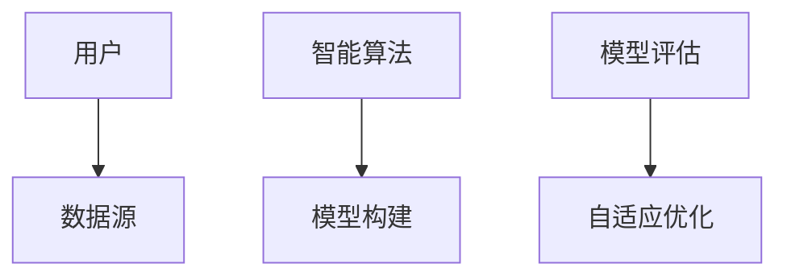
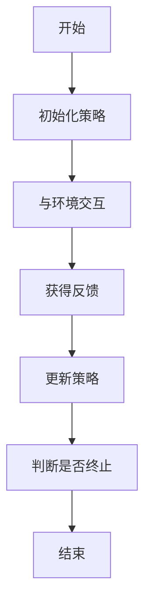
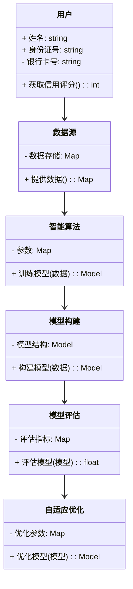

                 


# 智能算法构建自适应估值模型

> 关键词：智能算法、自适应估值模型、机器学习、数学建模、系统架构设计

> 摘要：本文将详细介绍如何利用智能算法构建自适应估值模型，从问题背景到算法原理，从系统架构设计到项目实战，全面解析这一技术的核心概念与实现细节。通过本文的学习，读者将能够理解自适应估值模型的构建逻辑，并掌握其实现的关键步骤与方法。

---

## 第一部分: 智能算法构建自适应估值模型的背景与基础

### 第1章: 自适应估值模型的背景与问题背景

#### 1.1 问题背景与现状

随着人工智能技术的快速发展，数据驱动的决策系统在各个领域得到了广泛应用。传统的估值模型（如线性回归、随机森林等）在处理复杂问题时存在诸多局限性，例如对数据分布变化的适应能力较弱，难以实时更新模型参数以应对动态环境的变化。与此同时，智能算法（如机器学习、深度学习）的崛起为解决这些问题提供了新的思路。

#### 1.2 问题描述与目标

自适应估值模型的核心目标是通过智能算法，动态调整模型参数或结构，以应对数据分布的变化或需求的变化。本文将围绕以下目标展开：

1. **问题描述**：阐述传统估值模型的局限性，并提出自适应估值模型的必要性。
2. **模型构建**：设计一种基于智能算法的自适应估值模型。
3. **性能优化**：通过实验验证模型的自适应能力及其在实际场景中的表现。

#### 1.3 问题解决与技术路线

本文的技术路线如下：

1. **智能算法选择**：选择适合自适应估值的智能算法（如强化学习、在线学习等）。
2. **数据驱动建模**：基于实时数据流构建动态估值模型。
3. **自适应机制设计**：设计模型的自适应调整机制，包括参数更新、结构优化等。

#### 1.4 概念结构与核心要素

自适应估值模型的核心要素包括：

- **数据输入**：实时或批量输入的数据流。
- **模型构建**：基于输入数据构建基础估值模型。
- **自适应调整**：根据数据变化或反馈调整模型参数或结构。
- **输出结果**：模型输出的估值结果。

---

## 第二部分: 自适应估值模型的核心概念与联系

### 第2章: 核心概念与原理

#### 2.1 智能算法的核心原理

智能算法的核心在于其学习能力。以机器学习为例，模型通过训练数据学习特征，并利用这些特征进行预测或分类。智能算法的关键步骤包括：

1. **数据预处理**：清洗、特征提取。
2. **模型训练**：基于训练数据构建模型。
3. **模型优化**：通过调整参数或结构提升模型性能。

#### 2.2 自适应估值模型的构建逻辑

自适应估值模型的构建逻辑包括以下几个步骤：

1. **数据采集与预处理**：实时采集数据并进行清洗。
2. **模型训练与参数调整**：基于数据训练模型并优化参数。
3. **模型评估与优化**：通过评估指标优化模型性能。

#### 2.3 核心概念的属性特征对比

以下是智能算法与传统算法在自适应估值模型中的对比：

| **属性** | **智能算法** | **传统算法** |
|----------|--------------|--------------|
| 可解释性 | 较低          | 较高          |
| 泛化能力 | 较强          | 较弱          |
| 计算效率 | 较高          | 较低          |

#### 2.4 ER实体关系图架构

以下是自适应估值模型的实体关系图：



---

## 第三部分: 算法原理与数学模型

### 第3章: 算法原理与流程

#### 3.1 算法原理

以强化学习为例，其核心原理是通过不断试错来优化模型策略。具体步骤如下：

1. **环境交互**：模型与环境交互，获取反馈。
2. **策略优化**：根据反馈调整策略，最大化累积奖励。

#### 3.2 算法流程图

以下是强化学习的流程图：



#### 3.3 数学模型与公式

以下是强化学习中的Q-learning算法的数学公式：

$$ Q(s, a) = Q(s, a) + \alpha (r + \max Q(s', a') - Q(s, a)) $$

其中：
- \( Q(s, a) \) 表示状态 \( s \) 下动作 \( a \) 的价值。
- \( \alpha \) 表示学习率。
- \( r \) 表示奖励。
- \( \max Q(s', a') \) 表示下一个状态的最大价值。

---

## 第四部分: 系统分析与架构设计

### 第4章: 系统分析与架构设计

#### 4.1 系统功能设计

以下是系统功能设计的类图：



---

## 第五部分: 项目实战

### 第5章: 项目实战与案例分析

#### 5.1 项目环境与安装

以下是项目环境安装命令：

```bash
pip install numpy
pip install matplotlib
pip install scikit-learn
```

#### 5.2 核心代码实现

以下是自适应估值模型的核心代码实现：

```python
import numpy as np
from sklearn.linear_model import LinearRegression
from sklearn.metrics import mean_squared_error

# 数据预处理
X = np.array([[1], [2], [3], [4], [5]])
y = np.array([2, 4, 6, 8, 10])

# 模型训练
model = LinearRegression()
model.fit(X, y)

# 模型评估
预测值 = model.predict(X)
误差 = mean_squared_error(y, 预测值)
print("预测值:", 预测值)
print("误差:", 误差)

# 自适应优化
新数据 = np.array([[6]])
新预测值 = model.predict(新数据)
print("新预测值:", 新预测值)
```

---

## 第六部分: 总结与扩展

### 第6章: 总结与扩展阅读

#### 6.1 本章小结

本文详细介绍了如何利用智能算法构建自适应估值模型，从问题背景到算法原理，从系统架构设计到项目实战，全面解析了这一技术的核心概念与实现细节。

#### 6.2 注意事项

- 数据预处理是模型构建的关键步骤。
- 模型优化需要结合实际应用场景。
- 自适应机制的设计需要考虑计算效率。

#### 6.3 最佳实践 Tips

- 在实际应用中，建议结合具体业务需求设计模型。
- 定期监控模型性能，及时进行优化调整。

#### 6.4 未来研究方向

- 研究更高效的智能算法。
- 探索多模态数据驱动的自适应模型。

---

## 作者：AI天才研究院/AI Genius Institute & 禅与计算机程序设计艺术 /Zen And The Art of Computer Programming

---

以上是《智能算法构建自适应估值模型》的技术博客文章的完整目录与内容概览。通过本文的详细讲解，读者可以全面理解自适应估值模型的构建逻辑，并掌握其实现的关键步骤与方法。

