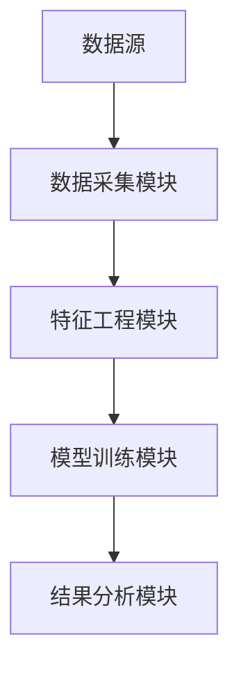

                 


# 智能算法识别市场异常与套利机会

> 关键词：智能算法，市场异常，套利机会，机器学习，深度学习，金融数据分析

> 摘要：本文深入探讨了智能算法在金融市场中识别异常和套利机会的应用。通过分析市场异常和套利的基本概念，结合机器学习和深度学习的算法原理，详细讲解了如何通过智能算法对市场数据进行预处理、特征提取、模型训练和结果分析。文章还介绍了基于机器学习和深度学习的算法实现，并通过实际案例展示了如何利用这些算法识别市场异常和套利机会。最后，本文总结了算法优化与系统架构设计的关键点，为读者提供了全面的理论和技术指导。

---

## 第一章: 市场异常与套利机会的基本概念

### 1.1 什么是市场异常

#### 1.1.1 市场异常的定义与分类
市场异常是指金融市场中价格或交易量的突然变化，与正常市场波动不一致。常见的市场异常包括：

- **价格突变**：短时间内价格剧烈波动。
- **交易量突增**：交易量远超正常水平。
- **闪崩**：价格在极短时间内大幅下跌。
- **操纵行为**：人为操纵价格或交易量。

市场异常可以分为 **结构性异常**（如市场整体波动）和 **个体异常**（如某只股票的价格波动）。

#### 1.1.2 市场异常的特征与表现
- **短期性**：异常通常发生在短时间内。
- **波动性**：异常期间价格波动剧烈。
- **低频性**：市场异常事件相对较少。

#### 1.1.3 市场异常与正常波动的区别
- 正常波动：价格受市场供需影响，符合市场规律。
- 市场异常：价格变化违背市场规律，可能由外部事件或内部操纵引发。

### 1.2 什么是套利机会

#### 1.2.1 套利的定义与类型
套利是指利用市场价差获利的行为。常见的套利类型包括：

- **跨市场套利**：利用不同市场间的价差。
- **跨期套利**：利用不同时间点的价格差异。
- **统计套利**：通过统计分析寻找价差。

#### 1.2.2 套利的基本原理与机制
套利的原理在于发现并利用价格差异，通过同时买入低价资产和卖出高价资产，赚取无风险或低风险的利润。

#### 1.2.3 套利与市场效率的关系
套利活动有助于提高市场效率，减少价格偏差。然而，过度套利可能导致市场波动加剧。

### 1.3 智能算法在识别市场异常与套利中的作用

#### 1.3.1 智能算法的优势与特点
- **高效性**：快速处理海量数据。
- **准确性**：通过机器学习模型提高识别精度。
- **实时性**：能够实时监控市场动态。

#### 1.3.2 智能算法在金融市场中的应用现状
- **高频交易**：利用算法快速决策。
- **风险控制**：通过算法识别市场风险。
- **套利机会识别**：利用算法发现并捕捉套利机会。

#### 1.3.3 智能算法未来的发展趋势
随着人工智能技术的进步，智能算法在金融市场中的应用将更加广泛和深入，特别是在复杂市场环境下的异常检测和套利机会识别方面。

---

## 第二章: 智能算法的基本原理

### 2.1 机器学习与深度学习简介

#### 2.1.1 机器学习的基本概念
机器学习是一种通过数据训练模型，使其能够进行预测或分类的技术。常用的机器学习算法包括线性回归、支持向量机（SVM）和随机森林等。

#### 2.1.2 深度学习的基本概念
深度学习是一种基于人工神经网络的机器学习方法，能够处理复杂的数据模式。常用的深度学习模型包括卷积神经网络（CNN）和长短期记忆网络（LSTM）。

#### 2.1.3 机器学习与深度学习的区别与联系
- **区别**：机器学习依赖特征工程，深度学习自动提取特征。
- **联系**：深度学习是机器学习的一种高级形式。

### 2.2 异常检测算法

#### 2.2.1 异常检测的基本原理
异常检测旨在识别数据中的异常点，常用算法包括：

- **孤立森林（Isolation Forest）**：通过构建随机树来识别异常点。
- **K近邻（K-Nearest Neighbor, KNN）**：通过计算数据点的密度来识别异常点。

#### 2.2.2 常见的异常检测算法
| 算法名称 | 优点 | 缺点 |
|----------|------|------|
| Isolation Forest | 计算速度快 | 对异常点比例敏感 |
| KNN | 对异常点密度敏感 | 计算复杂度高 |

#### 2.2.3 异常检测算法的优缺点对比
- **孤立森林**适合处理大数据集，但对异常点比例敏感。
- **KNN**适合处理小数据集，但计算复杂度高。

### 2.3 套利机会识别算法

#### 2.3.1 套利机会识别的基本原理
套利机会识别通过分析价格差异，利用算法预测未来的价格变动。

#### 2.3.2 常见的套利机会识别算法
- **统计套利**：基于统计模型寻找价格差异。
- **算法套利**：利用算法快速捕捉价格差异。

#### 2.3.3 套利机会识别算法的优缺点对比
| 算法名称 | 优点 | 缺点 |
|----------|------|------|
| 统计套利 | 稳定性高 | 利润空间小 |
| 算法套利 | 利润高 | 风险高 |

---

## 第三章: 市场数据的预处理与特征提取

### 3.1 市场数据的获取与清洗

#### 3.1.1 数据来源与获取方式
- **数据来源**：股票交易所、金融数据提供商。
- **数据获取方式**：API接口、数据库查询。

#### 3.1.2 数据清洗的基本方法
- **缺失值处理**：使用均值、中位数或插值法填充缺失值。
- **异常值处理**：使用Z-score或IQR方法剔除异常值。
- **数据标准化**：将数据归一化，消除量纲影响。

### 3.2 特征提取与选择

#### 3.2.1 常见的特征提取方法
- **技术指标**：如MACD、RSI等。
- **统计特征**：如均值、方差、相关系数等。

#### 3.2.2 特征选择的基本原理
- **特征重要性评估**：使用特征重要性评分（如随机森林的特征重要性）选择关键特征。
- **特征选择方法**：如Lasso回归、递归特征消除（RFE）。

#### 3.2.3 特征工程在智能算法中的重要性
- 特征工程能够提高模型的准确性和泛化能力。
- 通过特征工程可以降低模型的过拟合风险。

---

## 第四章: 基于机器学习的市场异常检测

### 4.1 基于孤立森林的异常检测算法

#### 4.1.1 算法原理
孤立森林通过构建随机树，将数据点划分到不同的子空间，从而识别异常点。

#### 4.1.2 算法实现
```python
from sklearn.ensemble import IsolationForest

# 数据预处理
X = ...  # 特征矩阵
model = IsolationForest(n_estimators=100, random_state=42)
model.fit(X)
```

#### 4.1.3 算法优化与调优
- **超参数优化**：调整n_estimators和max_samples等参数。
- **结果分析**：通过混淆矩阵和ROC曲线评估模型性能。

---

## 第五章: 基于深度学习的套利机会识别

### 5.1 基于LSTM的套利机会识别算法

#### 5.1.1 算法原理
LSTM（长短期记忆网络）通过记忆单元捕获时间序列中的长期依赖关系，适用于预测股票价格波动。

#### 5.1.2 算法实现
```python
from keras.layers import LSTM, Dense
from keras.models import Sequential

# 模型构建
model = Sequential()
model.add(LSTM(64, input_shape=(timesteps, features)))
model.add(Dense(1))
model.compile(loss='mean_squared_error', optimizer='adam')
```

#### 5.1.3 算法优化与调优
- **超参数优化**：调整LSTM单元数量和学习率。
- **结果分析**：通过回测和风险指标评估套利机会的可行性。

---

## 第六章: 算法优化与调优

### 6.1 超参数优化
- **网格搜索（Grid Search）**：系统地遍历参数组合，找到最优参数。
- **随机搜索（Random Search）**：随机选择参数组合，提高优化效率。

### 6.2 模型评估指标
- **准确率（Accuracy）**：正确识别的异常点比例。
- **召回率（Recall）**：实际异常点中被正确识别的比例。
- **F1分数（F1 Score）**：准确率和召回率的调和平均数。

---

## 第七章: 智能算法识别市场异常与套利的系统架构设计

### 7.1 系统功能设计
- **数据采集模块**：实时采集市场数据。
- **特征工程模块**：对数据进行预处理和特征提取。
- **模型训练模块**：训练异常检测和套利识别模型。
- **结果分析模块**：分析模型输出，生成报告。

### 7.2 系统架构设计


### 7.3 系统接口设计
- **数据接口**：与数据源对接，获取实时数据。
- **模型接口**：与其他系统对接，提供异常检测和套利机会识别服务。

---

## 第八章: 项目实战

### 8.1 环境安装
- **Python**：安装Python 3.8及以上版本。
- **库依赖**：安装scikit-learn、Keras、Pandas等库。

### 8.2 核心实现

#### 8.2.1 数据获取与预处理
```python
import pandas as pd
data = pd.read_csv('stock_data.csv')
data = data.dropna().reset_index(drop=True)
```

#### 8.2.2 模型训练与预测
```python
from sklearn.ensemble import IsolationForest
model = IsolationForest(n_estimators=100, random_state=42)
model.fit(X_train)
y_pred = model.predict(X_test)
```

#### 8.2.3 结果分析与可视化
```python
import matplotlib.pyplot as plt
plt.scatter(X_test, y_test, color='blue')
plt.scatter(X_test, y_pred, color='red')
plt.show()
```

### 8.3 实际案例分析

#### 8.3.1 股票市场数据的套利机会识别
- **案例背景**：利用LSTM模型预测股票价格波动，识别套利机会。
- **数据获取**：从Yahoo Finance获取股票数据。
- **模型训练**：使用LSTM模型训练价格预测模型。
- **结果分析**：通过回测分析套利机会的可行性。

---

## 第九章: 总结与展望

### 9.1 总结
智能算法在识别市场异常和套利机会方面具有显著优势，能够帮助投资者在复杂多变的金融市场中捕捉机会，降低风险。

### 9.2 最佳实践 tips
- **数据质量**：确保数据准确性和完整性。
- **模型选择**：根据具体场景选择合适的算法。
- **风险控制**：合理控制投资风险，避免过度杠杆。

### 9.3 注意事项
- **市场风险**：金融市场波动大，套利机会可能难以持续。
- **模型局限性**：算法模型可能受到数据质量和市场环境的限制。

### 9.4 拓展阅读
- 《机器学习实战》
- 《深度学习入门：基于Python》
- 《金融数据分析与建模》

---

## 作者：AI天才研究院/AI Genius Institute & 禅与计算机程序设计艺术/Zen And The Art of Computer Programming

---

通过以上详细的内容，本文全面介绍了智能算法在识别市场异常和套利机会中的应用，从理论到实践，为读者提供了丰富的知识和实用的技术指导。

