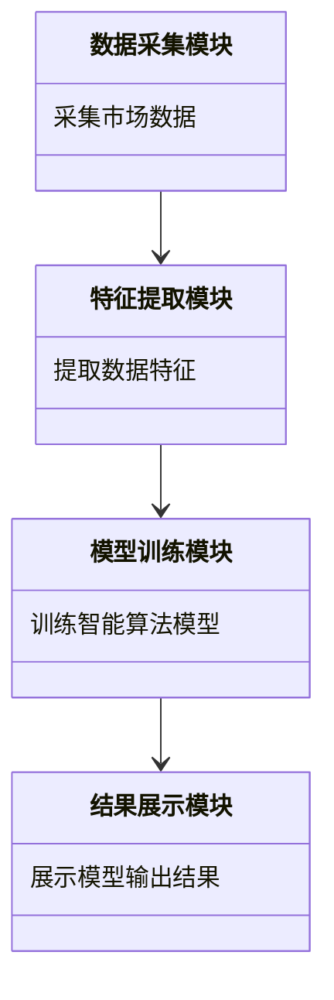

                 


# 智能算法识别市场微观结构变化

> 关键词：智能算法、市场微观结构、时间序列分析、机器学习、异常检测

> 摘要：本文深入探讨了智能算法在识别市场微观结构变化中的应用，从数据特征提取、算法选择到系统设计，系统地分析了智能算法在金融市场中的潜力和挑战。通过实际案例和详细代码实现，本文为读者提供了从理论到实践的全面指导。

---

## 第1章: 智能算法与市场微观结构概述

### 1.1 智能算法的基本概念

智能算法是指一类能够适应环境、自主学习并优化决策的算法，如机器学习、深度学习和强化学习等。这些算法的核心在于通过数据训练，识别模式和规律，从而实现对复杂系统的理解和预测。

#### 1.1.1 算法的基本概念

算法是解决问题的一系列步骤，智能算法则是具有学习和自适应能力的算法。常见的智能算法包括：

- **机器学习**：通过数据训练模型，使其能够识别模式。
- **深度学习**：基于人工神经网络的机器学习方法。
- **强化学习**：通过试错机制优化决策策略。

#### 1.1.2 智能算法的特点

智能算法具有以下特点：

1. **自适应性**：能够根据环境变化调整自身行为。
2. **学习能力**：通过数据训练不断优化性能。
3. **非线性关系处理**：能够处理复杂的非线性问题。

### 1.2 市场微观结构变化的定义与特征

市场微观结构是指市场的组织形式和运行机制，包括交易参与者、订单簿、价格形成机制等。市场微观结构变化指的是这些机制在时间和空间上的动态变化。

#### 1.2.1 市场微观结构变化的定义

市场微观结构变化是指在金融市场中，由于订单流动、参与者行为变化等因素导致的市场微观结构的动态变化。这种变化可能影响市场的流动性和价格形成机制。

#### 1.2.2 市场微观结构变化的特征

1. **高频性**：市场微观结构变化通常发生在高频交易中。
2. **复杂性**：变化涉及多个市场参与者和订单类型。
3. **短期性**：变化通常持续时间较短，但影响显著。

### 1.3 智能算法在市场微观结构分析中的应用

智能算法在市场微观结构分析中的应用主要体现在以下几个方面：

1. **异常检测**：识别市场中的异常交易行为。
2. **流动性预测**：预测市场流动性变化。
3. **订单簿分析**：分析订单簿的变化趋势。

---

## 第2章: 市场微观结构变化的智能算法识别原理

### 2.1 数据特征提取

在识别市场微观结构变化时，数据特征提取是关键步骤。

#### 2.1.1 时间序列数据的特征提取

时间序列数据的特征包括：

- **均值**：数据的平均值。
- **方差**：数据的波动程度。
- **自相关性**：数据点之间的相关性。

#### 2.1.2 市场微观结构数据的特征选择

在选择特征时，需要考虑以下因素：

1. **相关性**：特征与目标变量的相关性。
2. **冗余性**：特征之间的冗余程度。
3. **可解释性**：特征对模型的解释能力。

### 2.2 算法选择与模型构建

选择合适的算法是智能算法应用的关键。

#### 2.2.1 常见智能算法介绍

1. **随机森林**：基于决策树的集成算法。
2. **支持向量机（SVM）**：用于分类和回归的算法。
3. **长短期记忆网络（LSTM）**：用于时间序列预测的深度学习算法。

#### 2.2.2 算法选择的依据

1. **数据类型**：时间序列数据适合使用LSTM。
2. **计算能力**：深度学习算法需要较高的计算能力。
3. **模型复杂度**：根据数据量选择模型复杂度。

### 2.3 市场微观结构变化的识别流程

识别市场微观结构变化的流程如下：

1. **数据采集**：获取市场数据，如订单簿、交易记录等。
2. **特征提取**：提取数据的特征，如均值、方差等。
3. **模型训练**：使用训练数据训练模型。
4. **结果分析**：分析模型输出的结果，识别市场微观结构变化。

---

## 第3章: 智能算法识别市场微观结构变化的系统设计

### 3.1 系统功能需求分析

系统需要实现以下功能：

1. **数据采集**：实时采集市场数据。
2. **特征提取**：提取数据特征。
3. **模型训练**：训练智能算法模型。
4. **结果展示**：展示模型输出结果。

#### 3.1.1 系统功能模块划分

系统功能模块包括：

- 数据采集模块
- 特征提取模块
- 模型训练模块
- 结果展示模块

#### 3.1.2 系统功能设计的领域模型

使用Mermaid绘制领域模型图：



### 3.2 系统架构设计

系统架构采用分层设计：

1. **数据层**：存储原始数据和特征数据。
2. **算法层**：实现智能算法模型。
3. **展示层**：展示模型输出结果。

#### 3.2.1 系统架构的分层设计

使用Mermaid绘制系统架构图：


### 3.3 系统接口设计

系统接口设计包括：

1. **数据接口**：数据采集和特征提取接口。
2. **算法接口**：模型训练和预测接口。
3. **展示接口**：结果展示和用户交互接口。

---

## 第4章: 项目实战与算法实现

### 4.1 环境安装与配置

#### 4.1.1 开发环境的选择

推荐使用Python编程语言，安装以下库：

- **NumPy**：用于数值计算。
- **Pandas**：用于数据处理。
- **TensorFlow**：用于深度学习模型训练。
- **Matplotlib**：用于数据可视化。

#### 4.1.2 必要软件的安装

安装Python和上述库，可以通过以下命令安装：

```bash
pip install numpy pandas tensorflow matplotlib
```

### 4.2 系统核心实现

#### 4.2.1 数据采集模块的实现

使用Kafka实现数据采集：

```python
from kafka import KafkaConsumer

consumer = KafkaConsumer('market_data')
for message in consumer:
    print(message.value)
```

#### 4.2.2 特征提取模块的实现

使用Pandas提取特征：

```python
import pandas as pd

data = pd.DataFrame(...)
features = data[['mean', 'variance', 'autocorrelation']]
```

#### 4.2.3 模型训练模块的实现

使用TensorFlow训练LSTM模型：

```python
import tensorflow as tf
from tensorflow.keras.layers import LSTM, Dense

model = tf.keras.Sequential([
    LSTM(64, input_shape=(timesteps, features)),
    Dense(1, activation='sigmoid')
])
model.compile(optimizer='adam', loss='binary_crossentropy')
model.fit(x_train, y_train, epochs=10)
```

#### 4.2.4 结果展示模块的实现

使用Matplotlib绘制结果：

```python
import matplotlib.pyplot as plt

plt.plot(history.history['loss'], label='train_loss')
plt.plot(history.history['val_loss'], label='val_loss')
plt.legend()
plt.show()
```

### 4.3 代码应用解读与分析

#### 4.3.1 核心代码的功能分析

- 数据采集模块：实时采集市场数据。
- 特征提取模块：提取数据特征。
- 模型训练模块：训练智能算法模型。
- 结果展示模块：展示模型输出结果。

#### 4.3.2 代码实现的优化建议

1. **并行计算**：使用多线程或分布式计算优化性能。
2. **模型调优**：调整模型参数优化性能。
3. **数据预处理**：使用数据增强技术优化数据质量。

### 4.4 实际案例分析

#### 4.4.1 案例背景介绍

假设我们有一个股票交易数据集，需要识别市场微观结构变化。

#### 4.4.2 数据预处理

```python
import pandas as pd

data = pd.read_csv('stock_data.csv')
data['time'] = pd.to_datetime(data['time'])
data.set_index('time', inplace=True)
```

#### 4.4.3 模型训练与预测

```python
model = tf.keras.Sequential([
    LSTM(64, input_shape=(timesteps, features)),
    Dense(1, activation='sigmoid')
])
model.compile(optimizer='adam', loss='binary_crossentropy')
model.fit(x_train, y_train, epochs=10)
```

#### 4.4.4 结果分析

通过分析模型输出结果，识别市场微观结构变化。

---

## 第5章: 总结与展望

### 5.1 本章小结

智能算法在识别市场微观结构变化中具有重要作用，本文通过理论分析和实际案例，详细介绍了智能算法的应用流程和系统设计。

### 5.2 未来展望

未来的研究方向包括：

1. **更复杂的算法**：如图神经网络。
2. **多模态数据融合**：结合文本和图像数据。
3. **实时性优化**：优化算法的计算效率。

---

## 作者信息

作者：AI天才研究院/AI Genius Institute & 禅与计算机程序设计艺术 /Zen And The Art of Computer Programming

